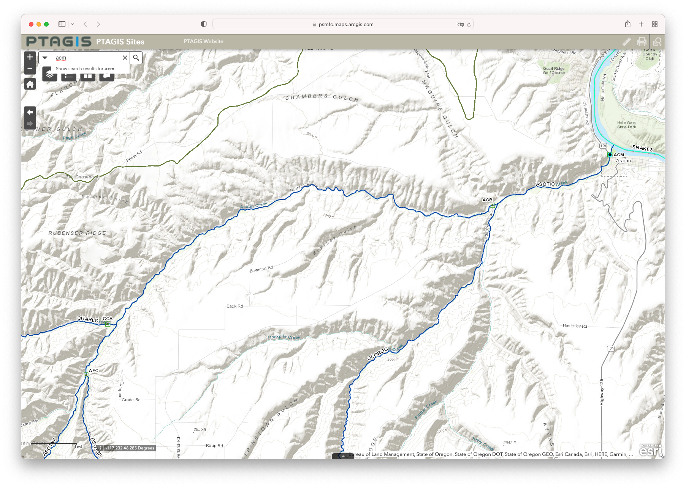

## Description
This Rmd file will go through the various tributaries in our model and model the detection efficiency at the most downstream interrogation site in each. It will also address the changing distribution of active arrays over time, and determine when a) detections in the tributaries are impossible; b) when it is not possible to calculate detection efficiency in the tributary; and c) when the most downstream (closest to the confluence) site had significant changes in detection capability.

Note: Shelby calculated annual detection efficiencies for some years for the following 11 tributaries:

- Hood River
- Fifteenmile Creek
- Deschutes River
- John Day River
- Umatilla River
- Walla Walla River
- Yakima River
- Wenatchee River
- Entiat River
- Tucannon River
- Imnaha River

## Summary
The 17 tributaries in our model can broadly be organized into multiple groups:

### 1) Tributaries where detection efficiencies can be estimated at a site near the mouth for some years
- Asotin Creek (2011-)
- Deschutes River (2013-2019)
- Entiat River (2007-)
- Fifteenmile Creek (2011-2019) - note river mouth array still active, but no upstream arrays active starting July 2019
- Hood River (2015-). NOTE: river mouth site is active since 2012, but we have no detections at upstream sites until 2015
- Tucannon River (2006-)
- Umatilla River (2007-)
- Wenatchee River (2010-)

### 2) Tributaries with a array on the mainstem, but a bit up from the mouth
- Imnaha River (2011-) - at RKM 7 and 10
- John Day River (2012-) - at RKM 32. NOTE: River mouth site active since 2007, but no detections at upstream sites until 2012.
- Methow River - at RKM 3 (2009-2017); at RKM 8 (2017-)
- Okanogan River (2013-) - at RKM 25
- Walla Walla River - at RKM 9 and 10, then at RKM 5 starting in 2019
- Yakima River (2005-) at RKM 76

### 3) Tributaries without anything close to a river mouth site, but plenty of others
- Clearwater River
- Salmon River

### 4) Tributaries that we should likely remove from the model given the paucity of arrays
- Grande Ronde River

*Note*: The difference between those listed under (3) and those listed under (4) is just how many arrays there are. This shows up in the probabilities of movement from the mainstem to the tributaries for fish of that origin. For example: 

- Clearwater River from upstream of LGR: 0.303
- Salmon River from upstream of LGR: 0.279
- Grande Ronde from upstream of LGR: 0.084

## Tributary flow data

Tributary flow data was found using DART: https://www.cbr.washington.edu/dart/query/streamflow_daily.
Tributary data was then queried directly from USGS by finding the site on the interactive USGS dashboard (https://dashboard.waterdata.usgs.gov/app/nwd/lang-en/?aoi=default) and navigating to the data page for the specific site. I then selected daily data for discharge and gage height.

On the USGS data page for each, I then queried 2005-01-01 through 2022-10-17 and saved the page source of the table of tab-separated values.

For each tributary, I selected data from the station closest to the river mouth array.

## Detection efficiency GLM

In this Rmd, we estimate annual detection efficiency as a function of equipment configuration and discharge.

The equation for estimating detection efficiency is as follows:
$$
z_i \sim \text{Binomial}(p_{i}) \\
\text{logit}(p_i) = \alpha_{j, k} + \beta_{j, k} discharge_{j,t}
$$
The indices represent the following:

- $i$ is the individual fish
- $j$ is the tributary
- $k$ is the site configuration (a categorical variable)
- $t$ is the run year

```{r load_libraries_data, echo = FALSE, warning = FALSE, message = FALSE}
library(plyr)
library(tidyverse)
library(here)
library(lubridate)
library(janitor)
library(kableExtra)
library(ggrepel)

# read in the site classifications file
site_classification <- read.csv(here::here("covariate_data", "site_classification.csv"), row.names = 1)
# unique(site_classification$state)

# read in the interrogation sites table
interrogation_sites <- read.csv(here::here("All Interrogation Sites Table.csv"))
interrogation_sites %>% 
  dplyr::rename(event_site_name = Interrogation.Site.Long.Name) -> interrogation_sites

# join the two tables
site_classification %>% 
  left_join(., interrogation_sites, by = "event_site_name") -> site_classification

# Now read in data necessary to calculate detection efficiency
det_hist <- read.csv(here::here("from_hyak_transfer", "2022-07-27_det_hist", "complete_det_hist_postprocessed.csv"), row.names = 1)
```

```{r functions, echo = FALSE, message = FALSE, warning = FALSE}
# 1) Make a function to show relevant information from site_classification df
show_trib_sites <- function(tributary_name){
  subset(site_classification, state == tributary_name) %>% 
    dplyr::select(event_site_name, Int.Site.Start.Date,Int.Site.End.Date,Interrogation.Site.Location.RKM) %>% 
    # sort by RKM to identify most downstream
    arrange(Interrogation.Site.Location.RKM) -> trib_site_info
  
  return(trib_site_info)
}

# 1.5) Make a function to calculate confidence intervals for proportions based on the binomial
alpha = 0.05
     nd = 4
     n = 20

## Define functions for upper and lower limits
## for a 90 % confidence interval.
fl = function(p){pbinom(nd-1,n,p) - (1-alpha/2)}
fu = function(p){pbinom(nd,n,p) - alpha/2}
# all in one line:
lower = uniroot(function(p){pbinom(nd-1,n,p) - (1-alpha/2)}, c(0.01, 0.99))$root
upper = uniroot(function(p){pbinom(nd,n,p) - alpha/2}, c(0.01, 0.99))$root


# 2) Make a function to calculate annual (calendar year) + total detection efficiency for a river mouth site
# you'll need to know the active period for the river mouth array. If the array is still active, put
# "2023-01-01" or some other date in the future
annual_det_eff <- function(tributary_name, river_mouth_site, 
                           river_mouth_site_start_date, river_mouth_site_end_date){
  # get a df of the different sites in the tributary
  show_trib_sites(tributary_name) -> trib_sites
  # identify which sites are upstream of the river mouth
  upstream_sites <- subset(trib_sites, event_site_name != river_mouth_site)$event_site_name
  # subset total df to only detections from that tributary
  trib_det <- subset(det_hist, event_site_name %in% trib_sites$event_site_name)
  
  # Get the detections + times of fish at upstream sites
  trib_det %>% 
    group_by(tag_code) %>% 
    filter(event_site_name %in% c(upstream_sites)) %>% 
    dplyr::select(tag_code, start_time) %>% 
    filter(!(duplicated(tag_code))) %>% 
    dplyr::rename(upstream_time = start_time) -> trib_up
  
  # Get the detections + times of fish at the river mouth site
  trib_det %>% 
    group_by(tag_code) %>% 
    filter(event_site_name %in% c(river_mouth_site)) %>% 
    dplyr::select(tag_code, start_time) %>% 
    filter(!(duplicated(tag_code))) %>% 
    dplyr::rename(river_mouth_time = start_time) -> trib_rm
  
  # Join the upstream and river mouth detections
  trib_rm %>% 
    full_join(trib_up, by = "tag_code") %>% 
    dplyr::mutate(river_mouth_time = ymd_hms(river_mouth_time)) %>% 
    dplyr::mutate(upstream_time = ymd_hms(upstream_time)) %>%
    dplyr::mutate(year = ifelse(is.na(river_mouth_time), year(upstream_time),
                         year(river_mouth_time))) %>% 
    subset(!(is.na(upstream_time))) %>% # we're only looking at fish that we saw at the upstream arrays
    dplyr::mutate(missed_det = ifelse(is.na(river_mouth_time), "yes", "no"))  %>% 
    subset(upstream_time >= ymd(river_mouth_site_start_date) &
             upstream_time <= ymd(river_mouth_site_end_date)) -> trib_det_times
  
  # Calculate the annual detection efficiencies + errors
  trib_det_times %>% 
    group_by(year) %>% 
    dplyr::count(missed_det) %>% 
    ungroup() %>% 
    complete(year, missed_det, fill = list(n = 0)) %>% 
    group_by(year) %>% 
    dplyr::mutate(total = sum(n)) %>% 
    subset(missed_det == "yes") %>%
    adorn_totals("row", ... = c(n, total)) %>% 
    dplyr::mutate(det_eff = (total - n)/total) %>% 
    dplyr::mutate(det_eff_SD = sqrt(det_eff * (1 - det_eff)/total)) %>% 

    dplyr::select(-missed_det, det_eff_SD) %>% 
    dplyr::rename(missed_det = n) -> trib_det_eff
  
  # calculate confidence intervals using mapply because uniroot doesn't play well with mutate
  # figure out which ones we can calculate a lower value for, because they're not 0% efficient:
  nonzero_indices <- which(trib_det_eff$missed_det != trib_det_eff$total)
  # give them all a 0 to start with; those that we can't calculate values for will keep them
  trib_det_eff$det_eff_lower95 <- 0
  # then replace others with the actual value
  trib_det_eff$det_eff_lower95[nonzero_indices] = mapply(function(total, n){uniroot(function(p){pbinom(total-n-1, total,p) - (1-0.05/2)}, c(0.0001, 0.9999))$root}, subset(trib_det_eff, missed_det != total)$total, subset(trib_det_eff, missed_det != total)$missed_det)
  # figure out which ones we can calculate an upper value for, because they're not 100% efficient:
  non1_indices <- which(trib_det_eff$missed_det != 0)
  # assign everything a 1 to begin with; those that we can't calculate values for will keep the 1
  trib_det_eff$det_eff_upper95 <- 1
  # then replace the others with an actual value
  trib_det_eff$det_eff_upper95[non1_indices] = mapply(function(total, n){uniroot(function(p){pbinom(total-n,total,p) - 0.05/2}, c(0.0001, 0.9999))$root}, subset(trib_det_eff, missed_det != 0)$total, subset(trib_det_eff, missed_det != 0)$missed_det)
  
  # return the data frame of detection efficiencies
  
  return(as.data.frame(trib_det_eff))
}

# 3) Make a function to plot detection efficiency over time
plot_annual_det_eff <- function(trib_det_eff_df, site_name){
  subset(trib_det_eff_df, year != "Total") %>% 
  dplyr::mutate(year = as.numeric(year)) -> trib_det_eff_annual

annual_det_eff_gg <- ggplot(trib_det_eff_annual, aes(x = year, y = det_eff,
                                               ymin = det_eff_lower95, ymax = det_eff_upper95)) +
  geom_point() + 
  geom_line() +
  geom_linerange() +
  xlab("Year") + 
  scale_y_continuous(expand = c(0,0), lim = c(-0.2,1.2), breaks = c(0, 0.2, 0.4, 0.6, 0.8, 1)) +
  ylab("Detection Efficiency") +
  ggtitle(site_name) +
  scale_x_continuous(lim = c(min(trib_det_eff_annual$year), max(trib_det_eff_annual$year)),
                     breaks = c(seq(min(trib_det_eff_annual$year), max(trib_det_eff_annual$year), by = 2)))

return(annual_det_eff_gg)
}

# 4) Plot timing at river mouth and upstream sites
plot_arrival_timing <- function(tributary_name, river_mouth_site, 
                           river_mouth_site_start_date, river_mouth_site_end_date){
  show_trib_sites(tributary_name) -> trib_sites
  # identify which sites are upstream of the river mouth
  upstream_sites <- subset(trib_sites, event_site_name != river_mouth_site)$event_site_name
  # subset total df to only detections from that tributary
  trib_det <- subset(det_hist, event_site_name %in% trib_sites$event_site_name)
  
  # Get the detections + times of fish at upstream sites
  trib_det %>% 
    group_by(tag_code) %>% 
    filter(event_site_name %in% c(upstream_sites)) %>% 
    dplyr::select(tag_code, start_time) %>% 
    filter(!(duplicated(tag_code))) %>% 
    dplyr::rename(upstream_time = start_time) -> trib_up
  
  # Get the detections + times of fish at the river mouth site
  trib_det %>% 
    group_by(tag_code) %>% 
    filter(event_site_name %in% c(river_mouth_site)) %>% 
    dplyr::select(tag_code, start_time) %>% 
    filter(!(duplicated(tag_code))) %>% 
    dplyr::rename(river_mouth_time = start_time) -> trib_rm
  
  # Join the upstream and river mouth detections
  trib_rm %>% 
    full_join(trib_up, by = "tag_code") %>% 
    dplyr::mutate(river_mouth_time = ymd_hms(river_mouth_time)) %>% 
    dplyr::mutate(upstream_time = ymd_hms(upstream_time)) %>%
    dplyr::mutate(year = ifelse(is.na(river_mouth_time), year(upstream_time),
                         year(river_mouth_time))) %>% 
    subset(!(is.na(upstream_time))) %>% # we're only looking at fish that we saw at the upstream arrays
    dplyr::mutate(missed_det = ifelse(is.na(river_mouth_time), "yes", "no"))  %>% 
    subset(upstream_time >= ymd(river_mouth_site_start_date) &
             upstream_time <= ymd(river_mouth_site_end_date)) -> trib_det_times
  
trib_det_times %>% 
  dplyr::mutate(river_mouth_month = month(river_mouth_time)) %>% 
  dplyr::mutate(upstream_month = month(upstream_time)) %>% 
  dplyr::select(tag_code, river_mouth_month, upstream_month) %>% 
  pivot_longer(., cols = c("river_mouth_month", "upstream_month")) %>% 
  dplyr::rename(site = name, month = value) %>% 
  dplyr::mutate(site = gsub("_month", "", site)) -> trib_det_month

timing_gg <- ggplot(trib_det_month, aes(x = month, fill = site)) +
  geom_bar(position = position_dodge(preserve = "single")) +
  scale_fill_manual(values = c("#1f78b4", "#ff7f00")) +
  scale_x_continuous(breaks = c(1,2,3,4,5,6,7,8,9,10,11,12)) +
  ggtitle(paste0("Detection timing at ", river_mouth_site))
  
return(timing_gg)
}

##### Tributary functions #####

# first create run year df
run_year <- c("04/05", "05/06", "06/07", "07/08", "08/09", "09/10", "10/11", "11/12", "12/13", "13/14", "14/15", "15/16", "16/17", "17/18", "18/19", "19/20", "20/21","21/22", "22/23")
run_year_start <- seq(ymd_hms("2004-06-01 00:00:00"), ymd_hms("2022-06-01 00:00:00"), by = "years")
run_year_end <- seq(ymd_hms("2005-05-31 23:59:59"), ymd_hms("2023-05-31 23:59:59"), by = "years")

run_year_df <- data.frame(run_year, run_year_start, run_year_end)

# run year mutate: mutate(run_year = subset(run_year_df, run_year_start < start_time & run_year_end > start_time)$run_year)

# variables can either be "discharge only" or "discharge and gage height"
usgs_data_plot <- function(variables, tributary_name, usgs_file_name){
  if(variables == "discharge only") {
    usgs_headers <- read.table(here::here("tributary_data", usgs_file_name), skip = 28, header = F, nrows = 1, as.is = T, sep = "\t")
    usgs <- read.table(here::here("tributary_data", usgs_file_name), skip = 30, header = F, sep = "\t")
    colnames(usgs) <- usgs_headers
    
    if (tributary_name == "Imnaha River"){
    # drop the time zone column
    usgs %>% 
      dplyr::select(-tz_cd) -> usgs
  }

    
  # edit column names and drop irrelevant ones
  colnames(usgs) <- c("agency", "site_no", "date_time", "discharge_cfs", "discharge_cfs_approved")
  
  # If it's the imnaha, it's reported every 15 minutes. We want just the daily; remove the time
  if (tributary_name == "Imnaha River"){
    usgs %>% 
      mutate(date_time =substr(date_time, start = 1, stop = 10)) -> usgs
  }
  
  usgs %>% 
    dplyr::select("date_time", "discharge_cfs") %>% 
    mutate(discharge_cfs = as.numeric(discharge_cfs)) %>% 
    dplyr::mutate(date_time = ymd(date_time)) %>% 
    dplyr::mutate(month = month(date_time)) %>% 
    dplyr::mutate(year = year(date_time))-> usgs
  
  # summarise into monthly averages
  usgs %>% 
    group_by(year,month) %>% 
    dplyr::summarise(mean_discharge_cfs = mean(discharge_cfs, na.rm = TRUE)) %>% 
    dplyr::mutate(year_month = ymd(paste(year, month,"01",sep="-")))-> monthly_discharge
  
  # calculate annual (run year) averages
  usgs %>% 
    rowwise() %>%
    dplyr::mutate(run_year = subset(run_year_df, run_year_start <= date_time & run_year_end >= date_time)$run_year) %>% 
    subset(!(run_year %in% c("04/05", "22/23"))) %>% 
    group_by(run_year) %>% 
    dplyr::summarise(mean_discharge_cfs = mean(discharge_cfs, na.rm = TRUE)) %>% 
    dplyr::mutate(year_month = ymd(paste(substr(run_year, start = 4, stop = 5),"01-01",sep="-")))-> annual_discharge
  
    # Generate one plot
  
  # 1) Monthly discharge + annual mean
discharge_plot <- ggplot(monthly_discharge, aes(x = year_month, y = mean_discharge_cfs)) +
  geom_line(aes(color = "Monthly average")) +
  geom_line(data = annual_discharge, aes(x = year_month, y = mean_discharge_cfs, color = "Run year average")) +
  scale_color_manual(name = "Value", values = c("Monthly average" = "black", "Run year average" = "#1f78b4")) +
  theme(legend.position = c(0.8, 0.8)) +
  geom_point(data = annual_discharge, aes(x = year_month, y = mean_discharge_cfs), 
             color = "#1f78b4", shape = 23, size = 2, fill = "#a6cee3") +
  ggtitle(paste0(tributary_name, " Discharge")) +
  xlab("Month/Year") +
  ylab("Mean discharge (cfs)") +
  scale_y_continuous(lim = c(0, round_any(max(monthly_discharge$mean_discharge_cfs), 1000, f = ceiling)), expand = c(0,0))

# 2) Discharge by month of year
monthly_discharge_plot <- ggplot(monthly_discharge, aes(x = month, y = mean_discharge_cfs, color = as.factor(year))) +
  geom_point() +
  scale_x_continuous(breaks = seq(1, 12, 1)) +
  ggtitle(paste0(tributary_name))

return(list(discharge_plot, monthly_discharge_plot))
    
    
  } else{
    usgs_headers <- read.table(here::here("tributary_data", usgs_file_name), skip = 30, header = F, nrows = 1, as.is = T, sep = "\t")
    usgs <- read.table(here::here("tributary_data", usgs_file_name), skip = 32, header = F, sep = "\t")
    colnames(usgs) <- usgs_headers
    
    
  # edit column names and drop irrelevant ones
  colnames(usgs) <- c("agency", "site_no", "date_time", "discharge_cfs", "discharge_cfs_approved", "gage_height_feet", "gage_height_feet_approved")
  
  usgs %>% 
    dplyr::select("date_time", "discharge_cfs", "gage_height_feet") %>% 
    mutate(discharge_cfs = as.numeric(discharge_cfs)) %>% 
    mutate(gage_height_feet = as.numeric(gage_height_feet)) %>% 
    dplyr::mutate(date_time = ymd(date_time)) %>% 
    dplyr::mutate(month = month(date_time)) %>% 
    dplyr::mutate(year = year(date_time)) -> usgs
  
  # summarise into monthly averages
  usgs %>% 
    group_by(year,month) %>% 
    dplyr::summarise(mean_discharge_cfs = mean(discharge_cfs, na.rm = TRUE)) %>% 
    dplyr::mutate(year_month = ymd(paste(year, month,"01",sep="-")))-> monthly_discharge

  usgs %>% 
    group_by(year,month) %>% 
    dplyr::summarise(mean_gage_height_ft = mean(gage_height_feet, na.rm = TRUE)) %>% 
    dplyr::mutate(year_month = ymd(paste(year, month,"01",sep="-")))-> monthly_gage_height
  
  # calculate annual (run year) averages
  usgs %>% 
    rowwise() %>%
    dplyr::mutate(run_year = subset(run_year_df, run_year_start <= date_time & run_year_end >= date_time)$run_year) %>% 
    subset(!(run_year %in% c("04/05", "22/23"))) %>% 
    group_by(run_year) %>% 
    dplyr::summarise(mean_discharge_cfs = mean(discharge_cfs, na.rm = TRUE)) %>% 
    dplyr::mutate(year_month = ymd(paste(substr(run_year, start = 4, stop = 5),"01-01",sep="-")))-> annual_discharge

  usgs %>% 
    rowwise() %>%
    dplyr::mutate(run_year = subset(run_year_df, run_year_start <= date_time & run_year_end >= date_time)$run_year) %>% 
    subset(!(run_year %in% c("04/05", "22/23"))) %>% 
    group_by(run_year) %>% 
    dplyr::summarise(mean_gage_height_ft = mean(gage_height_feet, na.rm = TRUE)) %>% 
    dplyr::mutate(year_month = ymd(paste(substr(run_year, start = 4, stop = 5),"01-01",sep="-")))-> annual_gage_height
  
  # Generate three plots:
  
  # 1) Monthly discharge + annual (by run year) mean
discharge_plot <- ggplot(monthly_discharge, aes(x = year_month, y = mean_discharge_cfs)) +
  geom_line(aes(color = "Monthly average")) +
  geom_line(data = annual_discharge, aes(x = year_month, y = mean_discharge_cfs, color = "Run year average")) +
  scale_color_manual(name = "Value", values = c("Monthly average" = "black", "Run year average" = "#1f78b4")) +
  theme(legend.position = c(0.8, 0.8)) +
  geom_point(data = annual_discharge, aes(x = year_month, y = mean_discharge_cfs),
             color = "#1f78b4", shape = 23, size = 2, fill = "#a6cee3") +
  ggtitle(paste0(tributary_name, " Discharge")) +
  xlab("Month/Year") +
  ylab("Mean discharge (cfs)") +
  scale_y_continuous(lim = c(0, round_any(max(monthly_discharge$mean_discharge_cfs), 1000, f = ceiling)), expand = c(0,0))

  # 2) Monthly gage height + annual mean
gage_height_plot <- ggplot(monthly_gage_height, aes(x = year_month, y = mean_gage_height_ft)) +
  geom_line(aes(color = "Monthly average")) +
  geom_line(data = annual_gage_height, aes(x = year_month, y = mean_gage_height_ft, color = "Run year average")) +
  scale_color_manual(name = "Value", values = c("Monthly average" = "black", "Run year average" = "#1f78b4")) +
  theme(legend.position = c(0.8, 0.2)) +
  geom_point(data = annual_gage_height, aes(x = year_month, y = mean_gage_height_ft),
             color = "#1f78b4", shape = 23, size = 2, fill = "#a6cee3") +
  ggtitle(paste0(tributary_name, " Stream Gage Height")) +
  xlab("Month/Year") +
  ylab("Mean gage height (feet)") +
  scale_y_continuous(lim = c(0, round_any(max(monthly_gage_height$mean_gage_height_ft), 1, f = ceiling)), expand = c(0,0))

  # 3) Relationship between gage height and discharge, with year as color
gage_height_v_discharge_plot <- ggplot(usgs, aes(x = discharge_cfs, y = gage_height_feet, color = as.factor(year))) +
  geom_point() +
  ggtitle(paste0(tributary_name)) +
  guides(color = guide_legend(title = "Year", ncol = 2)) +
  xlab("Discharge (cfs)") +
  ylab("Gage height (feet)")

# 4) Discharge by month of year
monthly_discharge_plot <- ggplot(monthly_discharge, aes(x = month, y = mean_discharge_cfs, color = as.factor(year))) +
  geom_point() +
  scale_x_continuous(breaks = seq(1, 12, 1)) +
  ggtitle(paste0(tributary_name))

return(list(discharge_plot, monthly_discharge_plot, gage_height_plot, gage_height_v_discharge_plot))
  }

}

# 5) calculate annual (by run year) means for discharge/gage height
usgs_annual_means <- function(variables, tributary_name, usgs_file_name){
  if(variables == "discharge only") {
    usgs_headers <- read.table(here::here("tributary_data", usgs_file_name), skip = 28, header = F, nrows = 1, as.is = T, sep = "\t")
    usgs <- read.table(here::here("tributary_data", usgs_file_name), skip = 30, header = F, sep = "\t")
    colnames(usgs) <- usgs_headers
    
  if (tributary_name == "Imnaha River"){
    # drop the time zone column
    usgs %>% 
      dplyr::select(-tz_cd) -> usgs
  }
  
    
    
  # edit column names and drop irrelevant ones
  colnames(usgs) <- c("agency", "site_no", "date_time", "discharge_cfs", "discharge_cfs_approved")
  
    # If it's the imnaha, it's reported every 15 minutes. We want just the daily; remove the time
  if (tributary_name == "Imnaha River"){
    usgs %>% 
      mutate(date_time =substr(date_time, start = 1, stop = 10)) -> usgs
  }
  
  usgs %>% 
    dplyr::select("date_time", "discharge_cfs") %>% 
    mutate(discharge_cfs = as.numeric(discharge_cfs)) %>% 
    dplyr::mutate(date_time = ymd(date_time)) %>% 
    dplyr::mutate(month = month(date_time)) %>% 
    dplyr::mutate(year = year(date_time))-> usgs
  
  # calculate annual averages
  usgs %>% 
    rowwise() %>%
    dplyr::mutate(run_year = subset(run_year_df, run_year_start <= date_time & run_year_end >= date_time)$run_year) %>% 
    subset(!(run_year %in% c("04/05", "22/23"))) %>% 
    group_by(run_year) %>% 
    dplyr::summarise(mean_discharge_cfs = mean(discharge_cfs, na.rm = TRUE)) %>% 
    dplyr::mutate(year_month = ymd(paste(substr(run_year, start = 4, stop = 5),"01-01",sep="-")))-> annual_discharge

return(annual_discharge)
    
    
  }
  else{
    usgs_headers <- read.table(here::here("tributary_data", usgs_file_name), skip = 30, header = F, nrows = 1, as.is = T, sep = "\t")
    usgs <- read.table(here::here("tributary_data", usgs_file_name), skip = 32, header = F, sep = "\t")
    colnames(usgs) <- usgs_headers
    
  # edit column names and drop irrelevant ones
  colnames(usgs) <- c("agency", "site_no", "date_time", "discharge_cfs", "discharge_cfs_approved", "gage_height_feet", "gage_height_feet_approved")
  
  usgs %>% 
    dplyr::select("date_time", "discharge_cfs", "gage_height_feet") %>% 
    mutate(discharge_cfs = as.numeric(discharge_cfs)) %>% 
    mutate(gage_height_feet = as.numeric(gage_height_feet)) %>% 
    dplyr::mutate(date_time = ymd(date_time)) %>% 
    dplyr::mutate(month = month(date_time)) %>% 
    dplyr::mutate(year = year(date_time)) -> usgs
  
  # calculate annual averages
  usgs %>% 
    rowwise() %>%
    dplyr::mutate(run_year = subset(run_year_df, run_year_start <= date_time & run_year_end >= date_time)$run_year) %>% 
    subset(!(run_year %in% c("04/05", "22/23"))) %>% 
    group_by(run_year) %>% 
    dplyr::summarise(mean_discharge_cfs = mean(discharge_cfs, na.rm = TRUE)) %>% 
    dplyr::mutate(year_month = ymd(paste(substr(run_year, start = 4, stop = 5),"01-01",sep="-")))-> annual_discharge

  usgs %>% 
    rowwise() %>%
    dplyr::mutate(run_year = subset(run_year_df, run_year_start <= date_time & run_year_end >= date_time)$run_year) %>% 
    subset(!(run_year %in% c("04/05", "22/23"))) %>% 
    group_by(run_year) %>% 
    dplyr::summarise(mean_gage_height_ft = mean(gage_height_feet, na.rm = TRUE)) %>% 
    dplyr::mutate(year_month = ymd(paste(substr(run_year, start = 4, stop = 5),"01-01",sep="-")))-> annual_gage_height
  
return(list(annual_discharge, annual_gage_height))
  }

}

# 6) fit glm to detection efficiency as a function of discharge and categorical
det_eff_glm <- function(variables, # we're only calculating as a function of discharge, but we need this to know how to read in the files
                        tributary_name, usgs_file_name, 
                        equipment_categories_start_run_years, # this and next line are vectors of years (round to year because we're doing an annual calculation currently) that we use to input changes in site configuration
                        equipment_categories_end_run_years, 
                        river_mouth_site, 
                        river_mouth_site_start_date, river_mouth_site_end_date){
  
  ##### Part one: Get the discharge data #####
  
  if(variables == "discharge only") {
    usgs_headers <- read.table(here::here("tributary_data", usgs_file_name), skip = 28, header = F, nrows = 1, as.is = T, sep = "\t")
    usgs <- read.table(here::here("tributary_data", usgs_file_name), skip = 30, header = F, sep = "\t")
    colnames(usgs) <- usgs_headers
    
  if (tributary_name == "Imnaha River"){
    # drop the time zone column
    usgs %>% 
      dplyr::select(-tz_cd) -> usgs
  }
    
  # edit column names and drop irrelevant ones
  colnames(usgs) <- c("agency", "site_no", "date_time", "discharge_cfs", "discharge_cfs_approved")
  
  if (tributary_name == "Imnaha River"){
    usgs %>% 
      mutate(date_time =substr(date_time, start = 1, stop = 10)) -> usgs
  }
    

  } else {
    usgs_headers <- read.table(here::here("tributary_data", usgs_file_name), skip = 30, header = F, nrows = 1, as.is = T, sep = "\t")
    usgs <- read.table(here::here("tributary_data", usgs_file_name), skip = 32, header = F, sep = "\t")
    colnames(usgs) <- usgs_headers
    
    
  # edit column names and drop irrelevant ones
  colnames(usgs) <- c("agency", "site_no", "date_time", "discharge_cfs", "discharge_cfs_approved", "gage_height_feet", "gage_height_feet_approved")
  

  }
  
  # select only the discharge data and dates
  usgs %>% 
    dplyr::select("date_time", "discharge_cfs") %>% 
    mutate(discharge_cfs = as.numeric(discharge_cfs)) %>% 
    dplyr::mutate(date_time = ymd(date_time)) %>% 
    dplyr::mutate(month = month(date_time)) %>% 
    dplyr::mutate(year = year(date_time)) -> usgs
  
  # calculate annual averages by run year
  usgs %>% 
    rowwise() %>%
    dplyr::mutate(run_year = subset(run_year_df, run_year_start <= date_time & run_year_end >= date_time)$run_year) %>% 
    subset(!(run_year %in% c("04/05", "22/23"))) %>% 
    group_by(run_year) %>% 
    dplyr::summarise(mean_discharge_cfs = mean(discharge_cfs, na.rm = TRUE)) %>% 
    dplyr::mutate(year_month = ymd(paste(substr(run_year, start = 4, stop = 5),"01-01",sep="-")))-> annual_discharge
  
  ##### Part 2: Get the detection data #####
  show_trib_sites(tributary_name) -> trib_sites
  # identify which sites are upstream of the river mouth
  upstream_sites <- subset(trib_sites, event_site_name != river_mouth_site)$event_site_name
  # subset total df to only detections from that tributary
  trib_det <- subset(det_hist, event_site_name %in% trib_sites$event_site_name)
  
  # Get the detections + times of fish at upstream sites
  trib_det %>% 
    group_by(tag_code) %>% 
    filter(event_site_name %in% c(upstream_sites)) %>% 
    dplyr::select(tag_code, start_time) %>% 
    filter(!(duplicated(tag_code))) %>% 
    dplyr::rename(upstream_time = start_time) -> trib_up
  
  # Get the detections + times of fish at the river mouth site
  trib_det %>% 
    group_by(tag_code) %>% 
    filter(event_site_name %in% c(river_mouth_site)) %>% 
    dplyr::select(tag_code, start_time) %>% 
    filter(!(duplicated(tag_code))) %>% 
    dplyr::rename(river_mouth_time = start_time) -> trib_rm
  
  # Join the upstream and river mouth detections
  trib_rm %>% 
    full_join(trib_up, by = "tag_code") %>% 
    dplyr::mutate(river_mouth_time = ymd_hms(river_mouth_time)) %>% 
    dplyr::mutate(upstream_time = ymd_hms(upstream_time)) %>%
    dplyr::mutate(year = ifelse(is.na(river_mouth_time), year(upstream_time),
                         year(river_mouth_time))) %>% 
    subset(!(is.na(upstream_time))) %>% # we're only looking at fish that we saw at the upstream arrays
    dplyr::mutate(missed_det = ifelse(is.na(river_mouth_time), "yes", "no"))  %>% 
    subset(upstream_time >= ymd(river_mouth_site_start_date) &
             upstream_time <= ymd(river_mouth_site_end_date)) -> trib_det_times
  
  ##### From this point on, we need to allow for 1, 2, or 3 eras of detection #####
  ##### two eras: #####
  if (length(equipment_categories_start_run_years) == 2){
    
      # reformat; add the run year column
  # get indices for start and end run years for eras
  start_indices <- vector(length = length(equipment_categories_start_run_years))
  end_indices <- vector(length = length(equipment_categories_start_run_years))
  for (i in 1:length(equipment_categories_start_run_years)){
     start_indices[i] <- which(run_year_df$run_year == equipment_categories_start_run_years[i])
     end_indices[i] <- which(run_year_df$run_year == equipment_categories_end_run_years[i])
  }
  
  
  trib_det_times %>% 
    rowwise() %>%
    dplyr::mutate(run_year = subset(run_year_df, run_year_start <= upstream_time & run_year_end >= upstream_time)$run_year) %>% 
    subset(!(run_year %in% c("04/05", "22/23"))) %>% 
    # now add categorical variable for era
    # mutate(ifelse(run_year %in% c("05/06", "06/07", "07/08", "08/09", "09/10", "10/11", "11/12", "12/13", "13/14",
    #                               "14/15", "15/16", "16/17", "17/18", "18/19", "19/20", "20/21", "21/22")))
    # mutate(era = ifelse(run_year %in% c("18/19", "19/20", "20/21", "21/22") ,"2018-present", "2011-2018")) %>% 
    # function:
    mutate(era = ifelse(run_year %in% run_year_df$run_year[start_indices[1]:end_indices[1]] ,paste0(equipment_categories_start_run_years[1], "-",
                                                                                                    equipment_categories_end_run_years[1]), 
                        paste0(equipment_categories_start_run_years[2], "-", equipment_categories_end_run_years[2]))) %>% 
    # join with the discharge data based on run year
    left_join(., annual_discharge, by = "run_year") %>% 
    mutate(detected = ifelse(missed_det == "yes", 0, 1))-> trib_det_discharge
  
  ### Fit the GLM
  # The GLM will have this form: logit(p_{t,j}) = alpha_{i,j} + beta_j * discharge_{t,j}
  # where j is the tributary, t is the run year, and i is the era (categorical variable for equipment at a river mouth site)
  det_discharge_glm <- glm(detected ~ era + mean_discharge_cfs, data = trib_det_discharge,
      family = binomial(link = "logit"))
  
  summary(det_discharge_glm)
  
  # Plot the GLM fit
  era1_int <- det_discharge_glm$coefficients[1]
  era2_int <- det_discharge_glm$coefficients[2]
  discharge_slope <- det_discharge_glm$coefficients[3]
  
  # Get a seq of discharge values
  discharge_seq <- seq(min(trib_det_discharge$mean_discharge_cfs), max(trib_det_discharge$mean_discharge_cfs), 1)
  
  newdata <- data.frame(mean_discharge_cfs = rep(discharge_seq, 2), era = c(rep("era1", length(discharge_seq)), rep("era2", length(discharge_seq))))
  
  newdata_era1 <- data.frame(mean_discharge_cfs = discharge_seq, era = paste0(equipment_categories_start_run_years[1], "-",
                                                                                                    equipment_categories_end_run_years[1]))
  era1_predict <- predict(det_discharge_glm, newdata_era1, se.fit = TRUE, type = "response")
  newdata_era2 <- data.frame(mean_discharge_cfs = discharge_seq, era = paste0(equipment_categories_start_run_years[2], "-", equipment_categories_end_run_years[2]))
  era2_predict <- predict(det_discharge_glm, newdata_era2, se.fit = TRUE, type = "response")
  
  era1_df <- data.frame(mean_discharge_cfs = discharge_seq, era = paste0(equipment_categories_start_run_years[1], "-",
                                                                                                    equipment_categories_end_run_years[1]),
                         fit = era1_predict$fit, UL = era1_predict$fit + era1_predict$se.fit * 1.96,
                         LL = era1_predict$fit - era1_predict$se.fit * 1.96)
  
  era2_df <- data.frame(mean_discharge_cfs = discharge_seq, era = paste0(equipment_categories_start_run_years[2], "-", equipment_categories_end_run_years[2]),
                         fit = era2_predict$fit, UL = era2_predict$fit + era2_predict$se.fit * 1.96,
                         LL = era2_predict$fit - era2_predict$se.fit * 1.96)
  
  # join the two
  era1_df %>% 
    bind_rows(era2_df) -> all_eras_df
    # mutate(fit = exp(fit), UL = exp(UL), LL = exp(LL)) -> all_eras_df
  
  # plot it
  # first create a summary of detections
  trib_det_discharge %>% 
    group_by(mean_discharge_cfs) %>% 
    summarise(det_eff = mean(detected), N = n()) %>% 
    left_join(., distinct(dplyr::select(ungroup(trib_det_discharge), mean_discharge_cfs, era, run_year)), by = "mean_discharge_cfs")-> trib_det_summ
  
  predict_fit_plot <- ggplot(all_eras_df, aes(x = mean_discharge_cfs, y = fit, color = era)) +
    geom_ribbon(aes(ymin = LL, ymax = UL), alpha = .25) +
    geom_line(size = 1) +
    scale_y_continuous(lim = c(0,1)) +
    geom_point(data = trib_det_summ, aes(x = mean_discharge_cfs, y = det_eff, color = era, size = N),
               shape = 19) +
    geom_text_repel(data = trib_det_summ, aes(x = mean_discharge_cfs, y = det_eff, label = run_year)) +
    ylab("Detection Efficiency") + 
    ggtitle(river_mouth_site)
  } else if (length(equipment_categories_start_run_years) == 3){
    
    ##### three eras: #####
    
      # reformat; add the run year column
  # get indices for start and end run years for eras
  start_indices <- vector(length = length(equipment_categories_start_run_years))
  end_indices <- vector(length = length(equipment_categories_start_run_years))
  for (i in 1:length(equipment_categories_start_run_years)){
     start_indices[i] <- which(run_year_df$run_year == equipment_categories_start_run_years[i])
     end_indices[i] <- which(run_year_df$run_year == equipment_categories_end_run_years[i])
  }
  
  
  trib_det_times %>% 
    rowwise() %>%
    dplyr::mutate(run_year = subset(run_year_df, run_year_start <= upstream_time & run_year_end >= upstream_time)$run_year) %>% 
    subset(!(run_year %in% c("04/05", "22/23"))) %>% 
    mutate(era = ifelse(run_year %in% run_year_df$run_year[start_indices[1]:end_indices[1]] ,paste0(equipment_categories_start_run_years[1], "-",
                                                                                                    equipment_categories_end_run_years[1]),
                        ifelse(run_year %in% run_year_df$run_year[start_indices[2]:end_indices[2]] ,paste0(equipment_categories_start_run_years[2], "-",
                                                                                                    equipment_categories_end_run_years[2]),
                        paste0(equipment_categories_start_run_years[3], "-", equipment_categories_end_run_years[3])))) %>% 
    # join with the discharge data based on run year
    left_join(., annual_discharge, by = "run_year") %>% 
    mutate(detected = ifelse(missed_det == "yes", 0, 1))-> trib_det_discharge
  
  ### Fit the GLM
  # The GLM will have this form: logit(p_{t,j}) = alpha_{i,j} + beta_j * discharge_{t,j}
  # where j is the tributary, t is the run year, and i is the era (categorical variable for equipment at a river mouth site)
  det_discharge_glm <- glm(detected ~ era + mean_discharge_cfs, data = trib_det_discharge,
      family = binomial(link = "logit"))
  
  summary(det_discharge_glm)
  
  # Plot the GLM fit
  era1_int <- det_discharge_glm$coefficients[1]
  era2_int <- det_discharge_glm$coefficients[2]
  era3_int <- det_discharge_glm$coefficients[3]
  discharge_slope <- det_discharge_glm$coefficients[4]
  
  # Get a seq of discharge values
  discharge_seq <- seq(min(trib_det_discharge$mean_discharge_cfs), max(trib_det_discharge$mean_discharge_cfs), 1)
  
  newdata_era1 <- data.frame(mean_discharge_cfs = discharge_seq, era = paste0(equipment_categories_start_run_years[1], "-",
                                                                                                    equipment_categories_end_run_years[1]))
  era1_predict <- predict(det_discharge_glm, newdata_era1, se.fit = TRUE, type = "response")
  newdata_era2 <- data.frame(mean_discharge_cfs = discharge_seq, era = paste0(equipment_categories_start_run_years[2], "-", equipment_categories_end_run_years[2]))
  era2_predict <- predict(det_discharge_glm, newdata_era2, se.fit = TRUE, type = "response")
  newdata_era3 <- data.frame(mean_discharge_cfs = discharge_seq, era = paste0(equipment_categories_start_run_years[3], "-", equipment_categories_end_run_years[3]))
  era3_predict <- predict(det_discharge_glm, newdata_era3, se.fit = TRUE, type = "response")
  
  era1_df <- data.frame(mean_discharge_cfs = discharge_seq, era = paste0(equipment_categories_start_run_years[1], "-",
                                                                                                    equipment_categories_end_run_years[1]),
                         fit = era1_predict$fit, UL = era1_predict$fit + era1_predict$se.fit * 1.96,
                         LL = era1_predict$fit - era1_predict$se.fit * 1.96)
  
  era2_df <- data.frame(mean_discharge_cfs = discharge_seq, era = paste0(equipment_categories_start_run_years[2], "-", equipment_categories_end_run_years[2]),
                         fit = era2_predict$fit, UL = era2_predict$fit + era2_predict$se.fit * 1.96,
                         LL = era2_predict$fit - era2_predict$se.fit * 1.96)
  
  era3_df <- data.frame(mean_discharge_cfs = discharge_seq, era = paste0(equipment_categories_start_run_years[3], "-", equipment_categories_end_run_years[3]),
                         fit = era3_predict$fit, UL = era3_predict$fit + era3_predict$se.fit * 1.96,
                         LL = era3_predict$fit - era3_predict$se.fit * 1.96)
  
  # join the two
  era1_df %>% 
    bind_rows(era2_df) %>% 
    bind_rows(era3_df)-> all_eras_df
    # mutate(fit = exp(fit), UL = exp(UL), LL = exp(LL)) -> all_eras_df
  
  # plot it
  # first create a summary of detections
  trib_det_discharge %>% 
    group_by(mean_discharge_cfs) %>% 
    summarise(det_eff = mean(detected), N = n()) %>% 
    left_join(., distinct(dplyr::select(ungroup(trib_det_discharge), mean_discharge_cfs, era, run_year)), by = "mean_discharge_cfs")-> trib_det_summ
  
  predict_fit_plot <- ggplot(all_eras_df, aes(x = mean_discharge_cfs, y = fit, color = era)) +
    geom_ribbon(aes(ymin = LL, ymax = UL), alpha = .25) +
    geom_line(size = 1) +
    scale_y_continuous(lim = c(0,1)) +
    geom_point(data = trib_det_summ, aes(x = mean_discharge_cfs, y = det_eff, color = era, size = N),
               shape = 19) +
    geom_text_repel(data = trib_det_summ, aes(x = mean_discharge_cfs, y = det_eff, label = run_year)) +
    ylab("Detection Efficiency") +
    ggtitle(river_mouth_site)
  } else {
        ##### single era: #####
  trib_det_times %>% 
    rowwise() %>%
    dplyr::mutate(run_year = subset(run_year_df, run_year_start <=  upstream_time & run_year_end >= upstream_time)$run_year) %>% 
    subset(!(run_year %in% c("04/05", "22/23"))) %>% 
    # join with the discharge data based on run year
    left_join(., annual_discharge, by = "run_year") %>% 
    mutate(detected = ifelse(missed_det == "yes", 0, 1))-> trib_det_discharge
  
  ### Fit the GLM
  # The GLM will have this form: logit(p_{t,j}) = alpha_{i,j} + beta_j * discharge_{t,j}
  # where j is the tributary, t is the run year, and i is the era (categorical variable for equipment at a river mouth site)
  det_discharge_glm <- glm(detected ~ mean_discharge_cfs, data = trib_det_discharge,
      family = binomial(link = "logit"))
  
  summary(det_discharge_glm)
  
  # Plot the GLM fit
  int <- det_discharge_glm$coefficients[1]
  discharge_slope <- det_discharge_glm$coefficients[2]
  
  # Get a seq of discharge values
  discharge_seq <- seq(min(trib_det_discharge$mean_discharge_cfs, na.rm = TRUE), max(trib_det_discharge$mean_discharge_cfs, na.rm = TRUE), 1)
  
  newdata <- data.frame(mean_discharge_cfs = discharge_seq)
  predict <- predict(det_discharge_glm, newdata, se.fit = TRUE, type = "response")
  
  predict_df <- data.frame(mean_discharge_cfs = discharge_seq, 
                         fit = predict$fit, UL = predict$fit + predict$se.fit * 1.96,
                         LL = predict$fit - predict$se.fit * 1.96)
  
  # plot it
  # first create a summary of detections
  trib_det_discharge %>% 
    group_by(mean_discharge_cfs) %>% 
    summarise(det_eff = mean(detected), N = n()) %>% 
    left_join(., distinct(dplyr::select(ungroup(trib_det_discharge), mean_discharge_cfs, run_year)), by = "mean_discharge_cfs")-> trib_det_summ
  
  predict_fit_plot <- ggplot(predict_df, aes(x = mean_discharge_cfs, y = fit)) +
    geom_ribbon(aes(ymin = LL, ymax = UL), alpha = .25) +
    geom_line(size = 1) +
    scale_y_continuous(lim = c(0,1)) +
    geom_point(data = trib_det_summ, aes(x = mean_discharge_cfs, y = det_eff, size = N),
               shape = 19) +
    geom_text_repel(data = trib_det_summ, aes(x = mean_discharge_cfs, y = det_eff, label = run_year)) +
    ylab("Detection Efficiency") +
    ggtitle(river_mouth_site)
    
    
  }
  
  
  

  
  ##### For any number of eras: return glm fit and plot #####
  return(list(summary(det_discharge_glm), predict_fit_plot))
    
}


```


## Asotin Creek

### Site overview
[ACM PTAGIS](https://www.ptagis.org/Sites/InterrogationSites?code=ACM)


{width=100%}

- ACM - Asotin Creek near mouth is at RKM 1 of Asotin Creek; others are at RKM 5, 22, and 25
- ACM start date 8/1/2011. Run year 11/12 and onwards can be seen in Asotin Creek
- Other sites have start dates within a week in early August 2009. However, these all exist upstream of the Georges Creek confluence, which could be an issue.
```{r asotin_creek, echo = FALSE}
show_trib_sites("Asotin Creek")
```

### Is there reason to believe that the detection efficiency of the antennas at the river mouth site may have changed over time?

Yes - upgrade on 10/12/2018. At least two eras: 

1. 8/1/2011-10/11/2018 (potentially different starting 9/21/12, since two antennas were added to site on this date)
2. 10/12/2018-present

##### ACM description from PTAGIS:
> ACM is a permanent instream PIT tag interrogation site located near the mouth of Asotin Creek, a tributary of the Snake River. As of 10/12/2018 all previous components present at ACM have been replaced and upgraded. The site consists of 3 rows of antennas with each row containing two 20- foot HDPE antennae, installed in flat-plate configuration. Each antenna is powered by a Biomark IS1001 (ACN) and the ACNs are connected to a Biomark IS1001-MTS master controller. The antennas were built and installed by WDFW. The site is connected to grid power to charge the battery bank powering the detection system. A cellular modem is installed on site to provide remote communication and allow for automated data collection, however, only manual data collection from the IS1001-MTS will occur at ACM until further notice. Prior to the upgrade, the site consisted of six antennas powered by an FS1001M.


##### ACM operational history notes from PTAGIS
1. Site down from March 19 - August 26, 2017
2. Site down March 25-September 1, 2014
3. Site down from March 26 - August 30, 2012. Two antennas were added to the site on September 21, 2012.

### Detection efficiency
```{r asotin_creek_detection_efficiency, echo = FALSE, message = FALSE, warning = FALSE}

ACM_det_eff <- annual_det_eff(tributary_name = "Asotin Creek", river_mouth_site = "ACM - Asotin Creek near mouth", 
                           river_mouth_site_start_date = "2011-08-01", river_mouth_site_end_date = "2023-01-01")


as.data.frame(ACM_det_eff) %>% 
  dplyr::mutate(det_eff = round(det_eff, 3)) %>% 
  dplyr::mutate(det_eff_lower95 = round(det_eff_lower95, 3)) %>% 
  dplyr::mutate(det_eff_upper95 = round(det_eff_upper95, 3)) %>% 
  dplyr::select(-det_eff_SD) -> ACM_det_eff_table
  

kable(ACM_det_eff_table, booktabs = T)%>% 
  kable_styling(latex_options = c("striped", "hold_position"))
plot_annual_det_eff(trib_det_eff_df = ACM_det_eff, site_name = "ACM - Asotin Creek near mouth")

##### Plot timing at river mouth and upstream sites #####
plot_arrival_timing(tributary_name = "Asotin Creek", river_mouth_site = "ACM - Asotin Creek near mouth", 
                           river_mouth_site_start_date = "2011-08-01", river_mouth_site_end_date = "2023-01-01")

```

### USGS data
- I don't see any data on CBR dart, but there is data on USGS.

Station: Asotin Creek at Asotin, WA. USGS 13335050
- discharge and gauge height


```{r asotin_creek_usgs_plot, message = FALSE, echo = FALSE}
# Plot discharge and gage height data
usgs_data_plot(variables = "discharge and gage height", tributary_name = "Asotin Creek", usgs_file_name = "asotin_creek_13335050.txt")

# Get annual discharge and gage height means
# asotin_creek_annual_discharge <- usgs_annual_means(variables = "discharge and gage height", tributary_name = "Asotin Creek", usgs_file_name = "asotin_creek_13335050.txt")[[1]]
# asotin_creek_annual_gage_height <- usgs_annual_means(variables = "discharge and gage height", tributary_name = "Asotin Creek", usgs_file_name = "asotin_creek_13335050.txt")[[2]]
# 
# # is there a relationship between discharge and detection efficiency?
# ACM_det_eff %>% 
#   subset(year != "Total") %>% 
#   dplyr::mutate(year = as.numeric(year)) %>% 
#   left_join(., asotin_creek_annual_discharge, by = "year") %>% 
#   dplyr::mutate(time_period = ifelse(year <= 2018, "2011-2018", "2019-present"))-> ACM_deteff_discharge
# 
# ggplot(ACM_deteff_discharge, aes(x = mean_discharge_cfs, y = det_eff, color = time_period)) +
#   geom_point() +
#   scale_color_manual(values = c("#33a02c", "#6a3d9a"))
# 
# # what about gage height and detection efficiency?
# ACM_det_eff %>% 
#   subset(year != "Total") %>% 
#   dplyr::mutate(year = as.numeric(year)) %>% 
#   left_join(., asotin_creek_annual_gage_height, by = "year") %>% 
#   dplyr::mutate(time_period = ifelse(year <= 2018, "2011-2018", "2019-present"))-> ACM_deteff_gageheight
# 
# ggplot(ACM_deteff_gageheight, aes(x = mean_gage_height_ft, y = det_eff, color = time_period)) +
#   geom_point() +
#   scale_color_manual(values = c("#33a02c", "#6a3d9a"))
# 

```

### Detection efficiency vs. discharge
```{r asotin_creek_deteff_discharge}
det_eff_glm(variables = "discharge and gage height",
             tributary_name = "Asotin Creek", 
             usgs_file_name = "asotin_creek_13335050.txt", 
              equipment_categories_start_run_years = c("11/12", "18/19"),
              equipment_categories_end_run_years = c("17/18", "21/22"), 
              river_mouth_site = "ACM - Asotin Creek near mouth", 
              river_mouth_site_start_date = "2011-08-01", 
             river_mouth_site_end_date = "2023-01-01")

```


## Clearwater River
There is no site near the mouth of the Clearwater River; in fact, there is not a single interrogation site on the mainstem Clearwater River.
```{r clearwater_river, echo = FALSE}
show_trib_sites("Clearwater River")
```


### Is there reason to believe that the detection efficiency of the antennas at the river mouth site may have changed over time?
NA - no river mouth site chosen


## Deschutes River
[DRM PTAGIS](https://www.ptagis.org/Sites/InterrogationSites?code=DRM)

The Deschutes River Mouth (DRM) array was active for run years 13/14 through 18/19 (3/13/2013 - 8/9/2019). In all other years, antennas were only found at RKM 69 or greater.
```{r deschutes_river, echo = FALSE}
show_trib_sites("Deschutes River")
```

### Is there reason to believe that the detection efficiency of the antennas at the river mouth site may have changed over time?

No - single era. Note that the detection efficiencies for DRM calculated by Shelby in 13/14 and 14/15 are 47.0% (SE 4.7%) and 41.4% (SE 6.5%), respectively. No notes in operational history.

##### DRM description from PTAGIS:
> In February-March 2013, two antenna arrays, arranged upstream- downstream from one another, were installed just upstream from the mouth of the Deschutes River in the west channel at Moody Island (rkm 0.46). This system is based on Biomark?s new IS1001-MTS Multiplexing Transceiver System. The arrays consist of 12-Biomark 20ft STOUT antennas, each controlled by a submersible IS1001 antenna control nodes. There are seven antennas in the upstream array and 60 feet downstream are five antennas in the downstream array. The IS1001 nodes are connected in series and they in turn are connected to an IS1001-Master Controller located adjacent to the array on the west bank of the Deschutes River. Diagnostic and tag detection data will be retrieved remotely using a Campbell Scientific CR1000 data logger and cell phone connection. The IS1001-MTS is capable of detecting FDX-B and HDX PIT tags. Site is no longer active.

##### DRM operational history notes from PTAGIS
Nothing of note.

### Detection efficiency

```{r deschutes_detection_efficiency, echo = FALSE, message = FALSE, warning = FALSE}

DRM_det_eff <- annual_det_eff(tributary_name = "Deschutes River", river_mouth_site = "DRM - Deschutes River mouth", 
                           river_mouth_site_start_date = "2013-03-13", river_mouth_site_end_date = "2019-08-09")


as.data.frame(DRM_det_eff) %>% 
  dplyr::mutate(det_eff = round(det_eff, 3)) %>% 
  dplyr::mutate(det_eff_lower95 = round(det_eff_lower95, 3)) %>% 
  dplyr::mutate(det_eff_upper95 = round(det_eff_upper95, 3)) %>% 
  dplyr::select(-det_eff_SD) -> DRM_det_eff_table
  

kable(DRM_det_eff_table, booktabs = T)%>% 
  kable_styling(latex_options = c("striped", "hold_position"))
plot_annual_det_eff(trib_det_eff_df = DRM_det_eff, site_name = "DRM - Deschutes River mouth")

plot_arrival_timing(tributary_name = "Deschutes River", river_mouth_site = "DRM - Deschutes River mouth", 
                           river_mouth_site_start_date = "2013-03-13", river_mouth_site_end_date = "2019-08-09")
```

### USGS data
Station: Deschutes River at Moody, Near Biggs, OR
USGS 14103000
- discharge only

```{r deschutes_river_usgs_plot, message = FALSE, echo = FALSE}
# Plot discharge and gage height data
usgs_data_plot(variables = "discharge only", tributary_name = "Deschutes River", usgs_file_name = "deschutes_river_14103000.txt")

```

### Detection efficiency vs. discharge
```{r deschutes_river_deteff_discharge}
det_eff_glm(variables = "discharge only",
             tributary_name = "Deschutes River", 
            usgs_file_name = "deschutes_river_14103000.txt",
              equipment_categories_start_run_years = NA,
              equipment_categories_end_run_years = NA, 
              river_mouth_site = "DRM - Deschutes River mouth", 
              river_mouth_site_start_date = "2013-03-13", 
            river_mouth_site_end_date = "2019-08-09")

```

## Entiat River
[ENL PTAGIS](https://www.ptagis.org/Sites/InterrogationSites?code=ENL)


- Lower Entiat River (ENL) site is at RKM 2; active since 2007
```{r entiat_river, echo = FALSE}
show_trib_sites("Entiat River")
```

### Is there reason to believe that the detection efficiency of the antennas at the river mouth site may have changed over time?

Appears to be a single era, despite 15 years of operation. However, from 2008-2011, there were large periods of time in which the site was not operational, and antennas were frequently replaced as they went down. Shelby calculated detection efficiencies for ENL starting in 09/10 - values are all basically within SE of each other above 90% (no significant year-to-year variation).

##### ENL description from PTAGIS:
> This site is located immediately upstream of Entiat, WA. The site is grid powered with a battery switcher and includes eight HDPE pipe-style antennas and IS1001 readers. The readers are connected to an IS1001-MC and satellite remote communications.

##### ENL operational history notes from PTAGIS
1. 2008: April 16 - 18: data lost due to buffer overrun. May 25 - July 24: all antennae washed out. Sept. 8 - 24: no data due to MUX board failure.
2. 2009: Jan. 7 - Mar. 7: all antennae washed out. May 26 - July 9: site not operational due to elevated flows.
3. 2010: The site operated continually from January 1st until May 2, when elevated river discharge resulted in the operational loss of antenna #23. This was followed by the loss of antenna #22 on May 16, #21 on May 31, #25 on June 5, #24 on June 8, and #26 on June 13. There was no detection capability and ENL from June 13 until July 28, when antennas 21, 22, 23, 24, and 25 were reinstalled.
4. 2011: Antennas 3, 5, 6 lost power Jan. 19, antennas 2 and 4 have high noise, antenna 1 has intermittent high noise. Antennas 1,2, and 4 not reading tags due to high noise on Jan. 27. Antennas 3, 5, and 6 were replaced on Feb. 10, and the noise was reduced on antennas 1, 2, and 4. Periods of high noise occurred during May. Antennas 3 and 6 not operational as of May 23; antenna 5 not operational on June 13. Antennas 3, 5, and 6 replaced on September 1. Site down from October 5-11. Antenna 1 lost power from October 27-December 6.

### Detection efficiency
```{r entiat_river_detection_efficiency, echo = FALSE, message = FALSE, warning = FALSE}

ENL_det_eff <- annual_det_eff(tributary_name = "Entiat River", river_mouth_site = "ENL - Lower Entiat River", 
                           river_mouth_site_start_date = "2007-10-01", river_mouth_site_end_date = "2023-01-01")


as.data.frame(ENL_det_eff) %>% 
  dplyr::mutate(det_eff = round(det_eff, 3)) %>% 
  dplyr::mutate(det_eff_lower95 = round(det_eff_lower95, 3)) %>% 
  dplyr::mutate(det_eff_upper95 = round(det_eff_upper95, 3)) %>% 
  dplyr::select(-det_eff_SD) -> ENL_det_eff_table
  

kable(ENL_det_eff_table, booktabs = T)%>% 
  kable_styling(latex_options = c("striped", "hold_position"))
plot_annual_det_eff(trib_det_eff_df = ENL_det_eff, site_name = "ENL - Lower Entiat River")

plot_arrival_timing(tributary_name = "Entiat River", river_mouth_site = "ENL - Lower Entiat River", 
                           river_mouth_site_start_date = "2007-10-01", river_mouth_site_end_date = "2023-01-01")

```

### USGS data
Station: Entiat River Near Entiat, WA
USGS 12452990
- discharge and gage height


```{r entiat_river_usgs_plot, message = FALSE, echo = FALSE}
# Plot discharge and gage height data
usgs_data_plot(variables = "discharge and gage height", tributary_name = "Entiat River", usgs_file_name = "entiat_river_12452990.txt")

```

### Detection efficiency vs. discharge
```{r entiat_river_deteff_discharge}
det_eff_glm(variables = "discharge and gage height",
             tributary_name = "Entiat River", 
            usgs_file_name = "entiat_river_12452990.txt",
              equipment_categories_start_run_years = NA,
              equipment_categories_end_run_years = NA, 
              river_mouth_site = "ENL - Lower Entiat River", 
              river_mouth_site_start_date = "2007-10-01", 
            river_mouth_site_end_date = "2023-01-01")

```

## Fifteenmile Creek
[158 PTAGIS](https://www.ptagis.org/Sites/InterrogationSites?code=158)


- 158 is ar RKM 4, active since Nov 2011. Only two upstream sites, one of which was only active through 6/30/2019.
```{r fifteenmile_creek, echo = FALSE}
show_trib_sites("Fifteenmile Creek")
```

### Is there reason to believe that the detection efficiency of the antennas at the river mouth site may have changed over time?
Short periods of time in which antennas were active. Shelby calculated efficiencies starting in 12/13: 49.8% (SE 10.1%), 100% (no SE), 100% (no SE). Doesn't appear that antennas being down affected it.

##### 158 description from PTAGIS:
> INSTREAM DETECTION ARRAY AT THE CONFLUENCE OF EIGHTMILE CREEK AND FIFTEENMILE CREEKS, CONSISTING OF A FS1001M MULTIPLEXING TRANCEIVER, CELL MODEM, AND THREE ANTENNAS IN EACH CREEK. ANTENNA ARRAYS FOR EACH CREEK CONSIST OF ONE ANTENNA EACH THAT SPANS THE NORMAL HIGH WATER MARK AND IS SECURED TO THE SUBSTRATE FOR PASS-OVER DETECTION. SITE IS GRID-POWERED AND OPERATES YEAR-ROUND. SITE IS ON PRIVATE LAND.

##### 158 operational history notes from PTAGIS
1. 2012: Antenna 4 down from March 31 - April 5. Antenna 6 down from March 31 - April 18.
2. 2013: Antenna 6 down from October 23 - December 27
3. 2014: Site down intermittently through the year, check event log for details. Converted to IS1001-MTS system in October. MARKUS NOTE: there is no event log for 2014, would have to email contact to get it.

### Detection efficiency
```{r 158_detection_efficiency, echo = FALSE, message = FALSE, warning = FALSE}

fif8_det_eff <- annual_det_eff(tributary_name = "Fifteenmile Creek", river_mouth_site = "158 - Fifteenmile Ck at Eightmile Ck", 
                           river_mouth_site_start_date = "2011-11-29", river_mouth_site_end_date = "2023-01-01")


as.data.frame(fif8_det_eff) %>% 
  dplyr::mutate(det_eff = round(det_eff, 3)) %>% 
  dplyr::mutate(det_eff_lower95 = round(det_eff_lower95, 3)) %>% 
  dplyr::mutate(det_eff_upper95 = round(det_eff_upper95, 3)) %>% 
  dplyr::select(-det_eff_SD) -> fif8_det_eff_table
  

kable(fif8_det_eff_table, booktabs = T)%>% 
  kable_styling(latex_options = c("striped", "hold_position"))
plot_annual_det_eff(trib_det_eff_df = fif8_det_eff, site_name = "158 - Fifteenmile Ck at Eightmile Ck")

plot_arrival_timing(tributary_name = "Fifteenmile Creek", river_mouth_site = "158 - Fifteenmile Ck at Eightmile Ck", 
                           river_mouth_site_start_date = "2011-11-29", river_mouth_site_end_date = "2023-01-01")
```


### USGS data
NO USGS DATA


## Grande Ronde River
The Grande Ronde is basically hopeless - we might consider removing it from our model. The first mainstem site on the Grande Ronde is at RKM 155.
```{r grande_ronde_river, echo = FALSE}
show_trib_sites("Grande Ronde River")
```


## Hood River
[HRM PTAGIS](https://www.ptagis.org/Sites/InterrogationSites?code=HRM)


HRM site is at RKM 1, starting in January 2012.
```{r hood_river, echo = FALSE}
show_trib_sites("Hood River")
```

### Is there reason to believe that the detection efficiency of the antennas at the river mouth site may have changed over time?
The description indicates that this site is highly influenced by river stage. Shelby calculated detection efficiencies in 12/13 and 13/14 of 65% (SE 6.5%) and 41.6% (SE 9.8%), respectively. So yes, I think we should look into annual detection efficiencies, but I also don't think that there is a directional trend/regime shift/multiple eras. According to PTAGIS, there were no upstream sites prior to August 2015. So how did Shelby calculate detection efficiencies in 12/13 and 13/14 for HRM?

##### HRM description from PTAGIS:
> An instream interrogation system consisting of 2 antenna arrays located at the mouth of the Hood River. The antennas are against the west side jetty just inside the bar where the Hood River meets the Columbia River. The upstream array is comprised of five 20 foot antennas covering a total of 100 feet from shore. The downstream array is comprised of two 20 foot antennas that extend 40 feet from shore. The antenna arrays cover approximately 3/4 the stream width at low water conditions and a half of the stream at bank full. The transceiver is a IS1001-MTS and power is provided by solar panels charging a battery bank. Interrogation data is submitted several times a week via cellular modem.

##### HRM operational history notes from PTAGIS
1. 2015: Antenna 1 down April 15 - May 11. Antennas 2 and 3 down April 15 - June 5. All 3 upstream antennas replaced June 5 and new antenna added to downstream array.
2. 2014: Site down September 30-October 27 for installation of new antennas and MTS transceiver.
3. 2012: First year of operations. Site down a few times in November and December.

### Detection Efficiency
```{r hood_river_detection_efficiency, echo = FALSE, message = FALSE, warning = FALSE}

HRM_det_eff <- annual_det_eff(tributary_name = "Hood River", river_mouth_site = "HRM - Hood River Mouth", 
                           river_mouth_site_start_date = "2012-01-09", river_mouth_site_end_date = "2023-01-01")


as.data.frame(HRM_det_eff) %>% 
  dplyr::mutate(det_eff = round(det_eff, 3)) %>% 
  dplyr::mutate(det_eff_lower95 = round(det_eff_lower95, 3)) %>% 
  dplyr::mutate(det_eff_upper95 = round(det_eff_upper95, 3)) %>% 
  dplyr::select(-det_eff_SD) -> HRM_det_eff_table
  

kable(HRM_det_eff_table, booktabs = T)%>% 
  kable_styling(latex_options = c("striped", "hold_position"))
plot_annual_det_eff(trib_det_eff_df = HRM_det_eff, site_name = "HRM - Hood River Mouth")

plot_arrival_timing(tributary_name = "Hood River", river_mouth_site = "HRM - Hood River Mouth", 
                           river_mouth_site_start_date = "2012-01-09", river_mouth_site_end_date = "2023-01-01")
```

### USGS data
Station: Hood River at Tucker Bridge, near Hood River, OR
USGS 1412000
- this is a bit upstream of HRM site and before confluence with Whiskey Creek, but it should be good enough
- discharge only


```{r hood_river_usgs_plot, message = FALSE, echo = FALSE}
# Plot discharge and gage height data
usgs_data_plot(variables = "discharge only", tributary_name = "Hood River", usgs_file_name = "hood_river_14120000.txt")

```

### Detection efficiency vs. discharge
```{r hood_river_deteff_discharge}
det_eff_glm(variables = "discharge only",
             tributary_name = "Hood River", 
            usgs_file_name = "hood_river_14120000.txt",
              equipment_categories_start_run_years = NA,
              equipment_categories_end_run_years = NA, 
              river_mouth_site = "HRM - Hood River Mouth", 
              river_mouth_site_start_date = "2012-01-09", 
            river_mouth_site_end_date = "2023-01-01")

```

## Imnaha River
[IR1 PTAGIS](https://www.ptagis.org/Sites/InterrogationSites?code=IR1)

[IR2 PTAGIS](https://www.ptagis.org/Sites/InterrogationSites?code=IR2)


There are two Imnaha River sites close to the river mouth, at RKM 7 (IR1) and RKM 10 (IR2), both starting in November/December 2010. Would we pool these? There is also a tributary downstream of these on Cow Creek, which flows into the Imnaha at RKM 6.
```{r imnaha_river, echo = FALSE}
show_trib_sites("Imnaha River")
```

### Is there reason to believe that the detection efficiency of the antennas at the river mouth site may have changed over time?
Nothing significant in site operational history. Shelby calculated detection efficiencies at IR1 for 11/12 through 14/15 - some fluctuation, between 84% and 100%, also variation between wild and hatchery populations.

##### IR1 description from PTAGIS:
> In-stream detection system consisting of a single array located in the lower Imnaha River. The array (IR1) located at river km 7 (N 45.761162, W -116.750658) consists of four 20 foot Biomark flat panel antennas that span the entire river at base flow. IR1 is operated by the Integrated Status and Effectiveness Project (ISEMP) cooperators Nez Perce Tribe and Quantitative Consultants, Inc. and was installed for continuous monitoring on December 3, 2010. The array includes ISEMP standard site monitoring equipment including: air and water temperature probes, and a water pressure transducer to monitor stream level. Electrical power is provided by a solar/propane hybrid thermal electric generator and remote communication provided by a satellite modem.

##### IR1 operational history notes from PTAGIS
1. 2011: High noise levels from January 11 - March 10.

##### IR2 description from PTAGIS:
> In-stream detection system consisting of a single array located in the lower Imnaha River. The array (IR2) located at river km 10 (N 45.742839 W -116.764563) consists of one 10 foot and four 20 foot Biomark flat panel antennas that span the entire river at base flow. IR2 is operated by the Integrated Status and Effectiveness Project (ISEMP) cooperators Nez Perce Tribe and Quantitative Consultants, Inc. and was installed for continuous monitoring in November 2010. The array includes ISEMP standard site monitoring equipment including: air and water temperature probes, and a water pressure transducer to monitor stream level. Electrical power is provided by a solar/propane hybrid thermal electric generator and remote communication provided by a satellite modem.


##### IR2 operational history notes from PTAGIS
1. 2011: High noise levels from January 31 - March 10 resulted in sporadic downtime.

### Detection efficiency
```{r imnaha_river_detection_efficiency, echo = FALSE, message = FALSE, warning = FALSE}

IR1_det_eff <- annual_det_eff(tributary_name = "Imnaha River", river_mouth_site = "IR1 - Lower Imnaha River ISA @ km 7", 
                           river_mouth_site_start_date = "2012-12-01", river_mouth_site_end_date = "2023-01-01")


as.data.frame(IR1_det_eff) %>% 
  dplyr::mutate(det_eff = round(det_eff, 3)) %>% 
  dplyr::mutate(det_eff_lower95 = round(det_eff_lower95, 3)) %>% 
  dplyr::mutate(det_eff_upper95 = round(det_eff_upper95, 3)) %>% 
  dplyr::select(-det_eff_SD) -> IR1_det_eff_table
  

kable(IR1_det_eff_table, booktabs = T)%>% 
  kable_styling(latex_options = c("striped", "hold_position"))
plot_annual_det_eff(trib_det_eff_df = IR1_det_eff, site_name = "IR1 - Lower Imnaha River ISA @ km 7")

plot_arrival_timing(tributary_name = "Imnaha River", river_mouth_site = "IR1 - Lower Imnaha River ISA @ km 7", 
                           river_mouth_site_start_date = "2012-12-01", river_mouth_site_end_date = "2023-01-01")
```

What happened in 2016??? There's nothing in the logs, but perhaps it's a river stage issue?

### USGS data
**PLEASE NOTE: The run year 13/14 needs to be removed from this analysis, since it's not a complete year of discharge data**

Station: Imnaha River at Imnaha, OR
USGS 13292000
- Site went offline 2013-10-22
- discharge only

```{r imnaha_river_usgs_plot, message = FALSE, echo = FALSE}
# Plot discharge and gage height data
usgs_data_plot(variables = "discharge only", tributary_name = "Imnaha River", usgs_file_name = "imnaha_river_13292000.txt")

```

### Detection efficiency vs. discharge
```{r imnaha_river_deteff_discharge}
det_eff_glm(variables = "discharge only",
             tributary_name = "Imnaha River", 
            usgs_file_name = "imnaha_river_13292000.txt",
              equipment_categories_start_run_years = NA,
              equipment_categories_end_run_years = NA, 
              river_mouth_site = "IR1 - Lower Imnaha River ISA @ km 7", 
                           river_mouth_site_start_date = "2012-12-01", river_mouth_site_end_date = "2023-01-01")

```


## John Day River
[JD1 PTAGIS](https://www.ptagis.org/Sites/InterrogationSites?code=JD1)


- JD1 is the most downstream array, but it's all the way at RKM 32.
- JD1 has a known change over time in detection efficiency. From Richins 2017: "A suspicious trend was observed for the John Day wild population (Figure A.3). The detection efficiencies at “JD1” from 2008/2009 to 2010/2011 were over 98%. According to the PTAGIS event log, the array was washed out by high flows in 2011. A new array was installed at the same location in 2012. In the following run years, the efficiencies dropped by more than half to 38.8%—48.8%. This shift in detection efficiencies was mirrored by a similar and opposite shift in estimates of return rate to home. Total success rates jumped from 34.7%—43.3% to 58.9%— 63.4%. This trend suggests that detection efficiencies may be overestimated in earlier years or underestimated in later years. However, spawning abundance of John Day River steelhead did increase in the same time period (Northwest Fisheries Science Center 2015)."
- Note: We have no upstream arrays until 2012. How did Shelby get detection efficiencies?
```{r john_day_river, echo = FALSE}
show_trib_sites("John Day River")
```

### Is there reason to believe that the detection efficiency of the antennas at the river mouth site may have changed over time?
Yes, given Shelby's observations and notes from the event log. Shift in 2012.

Two eras: 

1.2007-2011
2. 2012-present

##### JD1 description from PTAGIS:
John Day River in-stream detection, near McDonald Ferry at RM 20.

##### JD1 operational history notes from PTAGIS
Nothing of significance

### Detection efficiency
```{r JDR_detection_efficiency, echo = FALSE, message = FALSE, warning = FALSE}

JD1_det_eff <- annual_det_eff(tributary_name = "John Day River", river_mouth_site = "JD1 - John Day River, McDonald Ferry", 
                           river_mouth_site_start_date = "2007-09-01", river_mouth_site_end_date = "2023-01-01")


as.data.frame(JD1_det_eff) %>% 
  dplyr::mutate(det_eff = round(det_eff, 3)) %>% 
  dplyr::mutate(det_eff_lower95 = round(det_eff_lower95, 3)) %>% 
  dplyr::mutate(det_eff_upper95 = round(det_eff_upper95, 3)) %>% 
  dplyr::select(-det_eff_SD) -> JD1_det_eff_table
  

kable(JD1_det_eff_table, booktabs = T)%>% 
  kable_styling(latex_options = c("striped", "hold_position"))
plot_annual_det_eff(trib_det_eff_df = JD1_det_eff, site_name = "JD1 - John Day River, McDonald Ferry")

plot_arrival_timing(tributary_name = "John Day River", river_mouth_site = "JD1 - John Day River, McDonald Ferry", 
                           river_mouth_site_start_date = "2007-09-01", river_mouth_site_end_date = "2023-01-01")

```

### USGS data
Station: John Day River at Mcdonald Ferry, OR
USGS 14048000
- discharge only

```{r john_day_river_usgs_plot, message = FALSE, echo = FALSE}
# Plot discharge and gage height data
usgs_data_plot(variables = "discharge only", tributary_name = "John Day River", usgs_file_name = "john_day_river_14048000.txt")

```

### Detection efficiency vs. discharge
```{r john_day_river_deteff_discharge}
det_eff_glm(variables = "discharge only",
             tributary_name = "John Day River", 
            usgs_file_name = "john_day_river_14048000.txt",
              equipment_categories_start_run_years = NA,
              equipment_categories_end_run_years = NA, 
              river_mouth_site = "JD1 - John Day River, McDonald Ferry", 
                river_mouth_site_start_date = "2007-09-01", river_mouth_site_end_date = "2023-01-01")

```

## Methow River
[LMR PTAGIS](https://www.ptagis.org/Sites/InterrogationSites?code=LMR)


- I don't know what's going on with MRB site - it seems like potentially an aggregation of all sites prior 2004-2008
- LMR site - moved in 2017
  - Seems like we would definitely need to calculate different detection efficiencies for different time periods
```{r methow_river, echo = FALSE}
show_trib_sites("Methow River")
```

### Is there reason to believe that the detection efficiency of the antennas at the river mouth site may have changed over time?
Yes, when the site moved in 2017. However, there are also lots of outages/issues in 2010-2014.

Two eras:

1. 2009-7/31/2017
2. 8/1/2017-present

##### LMR description from PTAGIS:
> LMR is a permanent instream PIT tag interrogation site on the Methow River. When first installed with a single row of six antennas, it was located near the WDFW Miller Hole access site at about river kilometer 3. In December 2010, a second row of six antennas was added to the site. In August 2017, the site was relocated 5 kilometers upstream and the two FS1001M transceivers were replaced with a single Biomark/QST QuBe controller. The site currently consists of two rows of antennas, with each row nearly spanning the wetted width of the channel during base flows. Each row consists of six 20-foot HDPE antennas, installed in flat-plate configuration. Each antenna is powered by a Biomark IS1001 (ACN) and the ACNs are connected to a Biomark/QST QuBe controller. The antennas were built and installed by WDFW. The site is powered by a thermoelectric generator. LMR has remote communication abilities provided by a cellular modem. A submersible pressure transducer and temperature probe sensor are also installed to provide environmental condition data collection.

##### LMR operational history notes from PTAGIS
1. 2017: Site moved 5 km upstream and both Mux transceivers were replaced with a QuBE/IS1001 setup Start and end dates based on timer tags.
2. 2014: Data lost from B antennas April 23-28. Data lost from A antennas May 6-8. Data lost from B antennas May 17-27. Site down from July 17-September 3 due to wildfire.
3. 2012: Multiple periods when one or more antennas were not functioning or data was lost. Check event log for details.
4. 2011: Array A1-A6, which had been disabled since Dec. 15, 2010, was restored on January 4, 2011. Array C1-C6 was brought back online on March 4. Site down Apr. 8 - Apr. 9. Antenna B3 stopped working on May 15. Antennas B4-B6 stopped working on May 22. Antennas A4-A6 stopped working on May 24. Antenna A3 stopped working on June 4. Antennas A1 and B2 stopped working on June 7. Only antennas A2 and B1 functioning as of June 7. Antennas A1, A3, A4, A5, B2, B3, B4, B5 reinstalled September 27. All antennas, except A6 and B6, installed and operational as of 1400 September 27.
5. 2010: Refer to the LMR event log for details about individual antenna outages between January 1 and June 21. The entire site was out of service between June 21 and August 23. A second array was installed on Dec. 2, immediately below the original array. The original (A0) array failed on Dec. 14 and the new array (B0) failed on Dec. 15.

### Detection efficiency
```{r methow_river_detection_efficiency, echo = FALSE, message = FALSE, warning = FALSE}

LMR_det_eff <- annual_det_eff(tributary_name = "Methow River", river_mouth_site = "LMR - Lower Methow River at Pateros", 
                           river_mouth_site_start_date = "2009-03-01", river_mouth_site_end_date = "2023-01-01")


as.data.frame(LMR_det_eff) %>% 
  dplyr::mutate(det_eff = round(det_eff, 3)) %>% 
  dplyr::mutate(det_eff_lower95 = round(det_eff_lower95, 3)) %>% 
  dplyr::mutate(det_eff_upper95 = round(det_eff_upper95, 3)) %>% 
  dplyr::select(-det_eff_SD) -> LMR_det_eff_table
  

kable(LMR_det_eff_table, booktabs = T)%>% 
  kable_styling(latex_options = c("striped", "hold_position"))
plot_annual_det_eff(trib_det_eff_df = LMR_det_eff, site_name = "LMR - Lower Methow River at Pateros")

plot_arrival_timing(tributary_name = "Methow River", river_mouth_site = "LMR - Lower Methow River at Pateros", 
                           river_mouth_site_start_date = "2009-03-01", river_mouth_site_end_date = "2023-01-01")
```

### USGS data
Station: Methow River near Pateros, WA
USGS 12449950
- discharge and gage height


```{r methow_river_usgs_plot, message = FALSE, echo = FALSE}
# Plot discharge and gage height data
usgs_data_plot(variables = "discharge and gage height", tributary_name = "Methow River", usgs_file_name = "methow_river_12449950.txt")

```

### Detection efficiency vs. discharge
```{r methow_river_deteff_discharge}
det_eff_glm(variables = "discharge and gage height",
             tributary_name = "Methow River", 
            usgs_file_name = "methow_river_12449950.txt",
              equipment_categories_start_run_years = c("09/10", "17/18"),
              equipment_categories_end_run_years = c("16/17", "21/22"), 
              river_mouth_site = "LMR - Lower Methow River at Pateros", 
                           river_mouth_site_start_date = "2009-03-01", river_mouth_site_end_date = "2023-01-01")

```

## Okanogan River
[OKL PTAGIS](https://www.ptagis.org/Sites/InterrogationSites?code=OKL)


- No river mouth site, but one on Lower Okanogan (OKL) at RKM 25. File says it started 3/1/2013, PTAGIS says it started 10/8/2013.
```{r okanogan_river, echo = FALSE}
show_trib_sites("Okanogan River")
```

### Is there reason to believe that the detection efficiency of the antennas at the river mouth site may have changed over time?
There are some odd things in the event log about noise, but no directional/era changes. Should calculate annual detection efficiencies and see if there are significant changes.

##### OKL description from PTAGIS:
> OKL is a permanent instream PIT tag interrogation site at RKM 24.9 on the mainstem Okanogan River, upstream of Chiliwist area in Okanogan County. The site consists of two rows of antennas, with each row spanning the wetted width of the channel during base flows. Each row consists of six 20-foot PVC antennas, installed in flat-plate configuration. The antennas were built and installed by WDFW and CCT. The site is powered by a thermoelectric generator. OKL has remote communication abilities provided by a cellular modem and Campbell Scientific CR1000 datalogger system. A submersible pressure transducer and temperature probe sensors are also installed to provide environmental condition data collection.

##### OKL operational history notes from PTAGIS
1. 2014: Several unexplained gaps in data collection during January and March.

### Detection efficiency
```{r okanogan_river_detection_efficiency, echo = FALSE, message = FALSE, warning = FALSE}

OKL_det_eff <- annual_det_eff(tributary_name = "Okanogan River", river_mouth_site = "OKL - Lower Okanogan Instream Array", 
                           river_mouth_site_start_date = "2013-03-15", river_mouth_site_end_date = "2023-01-01")


as.data.frame(OKL_det_eff) %>% 
  dplyr::mutate(det_eff = round(det_eff, 3)) %>% 
  dplyr::mutate(det_eff_lower95 = round(det_eff_lower95, 3)) %>% 
  dplyr::mutate(det_eff_upper95 = round(det_eff_upper95, 3)) %>% 
  dplyr::select(-det_eff_SD) -> OKL_det_eff_table
  

kable(OKL_det_eff_table, booktabs = T)%>% 
  kable_styling(latex_options = c("striped", "hold_position"))
plot_annual_det_eff(trib_det_eff_df = OKL_det_eff, site_name = "OKL - Lower Okanogan Instream Array")

plot_arrival_timing(tributary_name = "Okanogan River", river_mouth_site = "OKL - Lower Okanogan Instream Array", 
                           river_mouth_site_start_date = "2013-03-15", river_mouth_site_end_date = "2023-01-01")
```

### USGS data
Station: Okanogan River at Malott, WA
USGS 12447200
- discharge and gage height

```{r okanogan_river_usgs_plot, message = FALSE, echo = FALSE}
# Plot discharge and gage height data
usgs_data_plot(variables = "discharge and gage height", tributary_name = "Okanogan River", usgs_file_name = "okanogan_12447200.txt")

```

### Detection efficiency vs. discharge
```{r okanogan_river_deteff_discharge}
det_eff_glm(variables = "discharge and gage height",
             tributary_name = "Okanogan River", 
            usgs_file_name = "okanogan_12447200.txt",
              equipment_categories_start_run_years = NA,
              equipment_categories_end_run_years = NA, 
              river_mouth_site = "OKL - Lower Okanogan Instream Array", 
                river_mouth_site_start_date = "2013-03-15", river_mouth_site_end_date = "2023-01-01")

```

## Salmon River
Tons of sites, but all on tribtuaries/different forks of the Salmon
```{r salmon_river, echo = FALSE}
show_trib_sites("Salmon River")
```

## Tucannon River

[LTR PTAGIS](https://www.ptagis.org/Sites/InterrogationSites?code=LTR)


- LTR at RKM 3, active October 2005
```{r tucannon_river, echo = FALSE}
show_trib_sites("Tucannon River")
```

### Is there reason to believe that the detection efficiency of the antennas at the river mouth site may have changed over time?
There has been a lot of change with this site, and long periods of inactivity as well as multiple shorter periods. Should calculate annual percentages and investigate. Shelby calculated detection efficiencies for 07/07 through 14/15, with gap for 08/09 due to data loss. 06/07 and 07/08 detection efficiencies were above 96%; 09/10 onward there seems to be a drop all the way down to around 60% in 14/15.

Three potential eras:

1. August 2020-present
2. 2005-1/8/2009
3. Inactive: 1/8/2009-9/10/2009

However - we only have data from 2011 onwards. So our eras will be:

1. 10/11 through 19/20
2. 20/21 - present

##### LTR description from PTAGIS:
> LTR is a permanent instream PIT tag interrogation site at RKM 2.5 on the Tucannon River. The current configuration installed August 2020 consists of three rows of antennas. The upstream row consists of 2 20-foot HDPE antennas, the middle row consists of 2 20 foot HDPE antennas and 1 10 foot PVC antenna, the bottom row consists of 2 HDPE antennas, installed in flat-plate configuration. Each antenna is powered by a Biomark Multiplexing Reader IS1001-MC master controller. The antennas were built and installed by WDFW. The electrical power at the site is provided by 6 200 watt solar panels. Data currently will be downloaded by Biomark through a satellite modem. No environmental monitors are installed at this time. This site has variously consisted of one or two groups of arrays, about a kilometer apart, located near the mouth of the Tucannon River. From Oct. 2005 until April 2008 the downstream array group consisted of two tandem "log" antenna arrays that spanned the low-water channel above the boat ramp. The upstream array group was located at an abandoned railroad bridge abutment upstream of Hwy 261 on the Tucannon River downstream from Starbuck. The upstream array (A0) operated from Oct. 2005 until January 2009. Its various configurations included both pass-through and pass-over antennas. A single array (C0) with six PVC pipe antennas powered by a QST Qube was re-deployed above the boat ramp in Sept. 2009. Responsibility for site operations transferred from USFWS to WDFW on Jan. 7, 2010. The C0 in-stream array was relocated below the Hwy 261 bridge on Sept. 29, 2010. The Qube was replaced with a Biomark IS1001-MC November 2018.

##### LTR operational history notes from PTAGIS
1. 2011: Site down from February 24-28 and April 3-12. High flows caused various antennas to lose power or have high noise throughout the season - see event logs for details. Three antennas were replaced August 16, but not fully functional until August 29.
2. 2010: Data collected prior to Jan. 7 were lost due to an equipment failure. No data are available between Jan. 19 and Feb. 4 due to a complete loss of power and failure of the lithium battery. No data are available between Feb. 16-18, Apr. 16-21, or May 10-24 due to loss of buffered records. No data available between Sept. 1-20; propane ran out. Detectors were moved upstream near the Hwy 261 bridge on Sept. 29, 2010. No data between Dec. 1-13 due to a TEG malfunction.
3. 2009: The original A0 MUX array was washed out on Jan. 8, 2009. The downstream antennas in the Tucannon River (identified by transceiver C0) were reinstalled on September 10. These antennae replace the upstream array (transceiver A0) that was blown out. The configuration of the new antenna array is as follows, looking downstream: Beginning on the left hand streambank is C1, C2, and C3 (C3 is approximately mid stream). Slightly downstream (approx. 2 feet) beginning mid stream and going towards the right hand streambank are C4, C5 and C6. There is overlap of C2 and C3 with C4 and C5. Data collected between Nov. 22, 2009 and Jan. 7, 2010 were lost due to an equipment failure.

### Detection efficiency
```{r tucannon_river_detection_efficiency, echo = FALSE, message = FALSE, warning = FALSE}

LTR_det_eff <- annual_det_eff(tributary_name = "Tucannon River", river_mouth_site = "LTR - Lower Tucannon River", 
                           river_mouth_site_start_date = "2005-10-13", river_mouth_site_end_date = "2023-01-01")


as.data.frame(LTR_det_eff) %>% 
  dplyr::mutate(det_eff = round(det_eff, 3)) %>% 
  dplyr::mutate(det_eff_lower95 = round(det_eff_lower95, 3)) %>% 
  dplyr::mutate(det_eff_upper95 = round(det_eff_upper95, 3)) %>% 
  dplyr::select(-det_eff_SD) -> LTR_det_eff_table
  

kable(LTR_det_eff_table, booktabs = T)%>% 
  kable_styling(latex_options = c("striped", "hold_position"))
plot_annual_det_eff(trib_det_eff_df = LTR_det_eff, site_name = "LTR - Lower Tucannon River")

plot_arrival_timing(tributary_name = "Tucannon River", river_mouth_site = "LTR - Lower Tucannon River", 
                           river_mouth_site_start_date = "2005-10-13", river_mouth_site_end_date = "2023-01-01")
```

### USGS data
Station: Tucannon River near Starbuck, WA
USGS 13344500
- discharge and gage height

```{r tucannon_river_usgs_plot, message = FALSE, echo = FALSE}
# Plot discharge and gage height data
usgs_data_plot(variables = "discharge and gage height", tributary_name = "Tucannon River", usgs_file_name = "tucannon_river_13344500.txt")

```

### Detection efficiency vs. discharge
```{r tucannon_river_deteff_discharge}
det_eff_glm(variables = "discharge and gage height",
             tributary_name = "Tucannon River", 
            usgs_file_name = "tucannon_river_13344500.txt",
              equipment_categories_start_run_years = c("10/11", "20/21"),
              equipment_categories_end_run_years = c("19/20", "21/22"), 
              river_mouth_site = "LTR - Lower Tucannon River", 
                           river_mouth_site_start_date = "2005-10-13", river_mouth_site_end_date = "2023-01-01")

```

## Umatilla River
[TMF PTAGIS](https://www.ptagis.org/Sites/InterrogationSites?code=TMF)

**PLEASE NOTE: THIS IS NOT REFLECTED IN THE BELOW ANALYSIS, BUT A RECENT EMAIL FROM ODFW INDICATED A CHANGE IN DETECTION EFFICIENCY AT THREE MILE FALLS DAM IN 2014, WHEN A NEW ANTENNA WAS ADDED AT THE LADDER ENTRANCE**

- TMF combined at RKM 5, active Nov 2006
- TMA adult fishway was separate until Nov 2006
```{r umatilla_river, echo = FALSE}
show_trib_sites("Umatilla River")
```

### Is there reason to believe that the detection efficiency of the antennas at the river mouth site may have changed over time?
There's nothing really concerning at the TMF site. Shelby calculated detection efficiencies in some years, and they varied a lot, from 54% to 100%. But also seems like there wasn't a ton of data.

##### TMF description from PTAGIS:
> Adult Fishway and Juvenile Bypass/subsampling facility at Three Mile Falls Dam

##### TMF operational history notes from PTAGIS
1. 2006: First year for TMF site, which combines and replaces the previous TMJ and TMA sites.

### Detection efficiency
```{r umatilla_river_detection_efficiency, echo = FALSE, message = FALSE, warning = FALSE}

TMF_det_eff <- annual_det_eff(tributary_name = "Umatilla River", river_mouth_site = "TMF - Three Mile Falls Dam Combined", 
                           river_mouth_site_start_date = "2006-11-08", river_mouth_site_end_date = "2023-01-01")


as.data.frame(TMF_det_eff) %>% 
  dplyr::mutate(det_eff = round(det_eff, 3)) %>% 
  dplyr::mutate(det_eff_lower95 = round(det_eff_lower95, 3)) %>% 
  dplyr::mutate(det_eff_upper95 = round(det_eff_upper95, 3)) %>% 
  dplyr::select(-det_eff_SD) -> TMF_det_eff_table
  

kable(TMF_det_eff_table, booktabs = T)%>% 
  kable_styling(latex_options = c("striped", "hold_position"))
plot_annual_det_eff(trib_det_eff_df = TMF_det_eff, site_name = "TMF - Three Mile Falls Dam Combined")

plot_arrival_timing(tributary_name = "Umatilla River", river_mouth_site = "TMF - Three Mile Falls Dam Combined", 
                           river_mouth_site_start_date = "2006-11-08", river_mouth_site_end_date = "2023-01-01")
```

### USGS data
Note - since the tributary site in this case is at a dam, I don't expet river stage/flow to make a big difference in detection probability.

Station: Umatilla River near Umatilla, OR
USGS 14033500
- discharge only

```{r umatilla_river_usgs_plot, message = FALSE, echo = FALSE}
# Plot discharge and gage height data
usgs_data_plot(variables = "discharge only", tributary_name = "Umatilla River", usgs_file_name = "umatilla_river_14033500.txt")

```

### Detection efficiency vs. discharge
```{r umatilla_river_deteff_discharge}
det_eff_glm(variables = "discharge only",
             tributary_name = "Umatilla River", 
            usgs_file_name = "umatilla_river_14033500.txt",
              equipment_categories_start_run_years = NA,
              equipment_categories_end_run_years = NA, 
              river_mouth_site = "TMF - Three Mile Falls Dam Combined", 
              river_mouth_site_start_date = "2006-11-08", river_mouth_site_end_date = "2023-01-01")

```

## Walla Walla River
[ORB PTAGIS](https://www.ptagis.org/Sites/InterrogationSites?code=ORB)

[PRV PTAGIS](https://www.ptagis.org/Sites/InterrogationSites?code=PRV)

[WWB PTAGIS](https://www.ptagis.org/Sites/InterrogationSites?code=WWB)


- ORB at RKM 10, active April 2005 - May 2015
- PRV at RKM 9, active September 2012 - April 2019
- WWB at RKM 5, active April 2019 - present
```{r walla_walla_river, echo = FALSE}
show_trib_sites("Walla Walla River")
```

### Is there reason to believe that the detection efficiency of the antennas at the river mouth site may have changed over time?

There are three different river mouth arrays that are used, depending on the timeframe:

1. ORB: 4/15/2005-5/4/2015
2. PRV: 9/25/2012-4/8/2019
3. WWB: 4/11/2019-present

Shelby calculated detection efficiencies at ORB 07/08-11/12, PRV 12/13-14/15. ORB does seem to have lower, with high SE, detection efficiencies. PRV has generally higher detection efficiencies.

For each of these sites, there are no major shifts in equipment besides a few periods where antennas were down to be aware of.

##### WWB description from PTAGIS:
> The site consists of two 50 ft wide floating barges with twelve 6 ft verticle fins. Each pair of fins act as a single antenna, detection for each antenna is the full length of the fin (6 ft) and 3 ft fore and aft of each fin. Barge will be held in place by single 250lb Danforth anchor. Electronics are powered by battery and solar, cellular modems are used for remote access. Site was initially configured with transceiver and antenna IDs opposite to PTAGIS convention, but was corrected on May 16, 2019.

{width=100%}

##### WWB operational history notes from PTAGIS
Site was down 2/10/2020-2/28/2020 due to flooding.


##### ORB description from PTAGIS:
> In-stream arrays at Oasis Road Bridge, lower Walla Walla River

##### ORB operational history notes from PTAGIS
1. 2011: Antennas 1-5 lost power and or anchoring between Jan. 15 and Jan 18, only antenna 6 still working. As of Feb. 3, antennas 4, 5 and 6 are working. Site down from June 2 - 6 due to power loss from vandalization. Only antennas 5 and 6 working as of May 27. All antennas repaired and fully functioning as of September 1.
2. 2009: 5/18/09 to 5/27/09 - MUX transceiver locked up; no data for this time period. 9/25/09 to 10/05/09 - Site down for maintenance; no data were collected.
3. 2006: All antennas were out of service between January 1 and January 25, due to a high water event. Various antennas were in and out of service after January 25. See the ORB event log for additional details. A new Upstream Flat-Plate Array was installed on October 3, augmenting the existing Downstream Pass-Through Array.

##### PRV description from PTAGIS:
> This interrogation site in the lower Walla Walla River at Pierce Green Valley RV Park is a flat panel, single row of 4 antennas, 3 twenty foot panels and 1 ten foot panel. This passive in-stream interrogation system is located at rkm 15 Site was removed in April 2019.


##### PRV operational history notes from PTAGIS
Nothing of note.

### Detection efficiency - three different sites here
```{r walla_walla_river_detection_efficiency, echo = FALSE, message = FALSE, warning = FALSE}
# WWB
WWB_det_eff <- annual_det_eff(tributary_name = "Walla Walla River", river_mouth_site = "WWB - Walla Walla River Barge Array", 
                           river_mouth_site_start_date = "2019-04-11", river_mouth_site_end_date = "2023-01-01")


as.data.frame(WWB_det_eff) %>% 
  dplyr::mutate(det_eff = round(det_eff, 3)) %>% 
  dplyr::mutate(det_eff_lower95 = round(det_eff_lower95, 3)) %>% 
  dplyr::mutate(det_eff_upper95 = round(det_eff_upper95, 3)) %>% 
  dplyr::select(-det_eff_SD) -> WWB_det_eff_table
  

kable(WWB_det_eff_table, booktabs = T)%>% 
  kable_styling(latex_options = c("striped", "hold_position"))
plot_annual_det_eff(trib_det_eff_df = WWB_det_eff, site_name = "WWB - Walla Walla River Barge Array")

# ORB
ORB_det_eff <- annual_det_eff(tributary_name = "Walla Walla River", river_mouth_site = "ORB - Oasis Road Bridge", 
                           river_mouth_site_start_date = "2005-04-15", river_mouth_site_end_date = "2015-05-04")


as.data.frame(ORB_det_eff) %>% 
  dplyr::mutate(det_eff = round(det_eff, 3)) %>% 
  dplyr::mutate(det_eff_lower95 = round(det_eff_lower95, 3)) %>% 
  dplyr::mutate(det_eff_upper95 = round(det_eff_upper95, 3)) %>% 
  dplyr::select(-det_eff_SD) -> ORB_det_eff_table
  

kable(ORB_det_eff_table, booktabs = T)%>% 
  kable_styling(latex_options = c("striped", "hold_position"))
plot_annual_det_eff(trib_det_eff_df = ORB_det_eff, site_name = "ORB - Oasis Road Bridge")

# PRV
PRV_det_eff <- annual_det_eff(tributary_name = "Walla Walla River", river_mouth_site = "PRV - Walla Walla R at Pierce RV Prk", 
                           river_mouth_site_start_date = "2012-09-25", river_mouth_site_end_date = "2019-04-08")


as.data.frame(PRV_det_eff) %>% 
  dplyr::mutate(det_eff = round(det_eff, 3)) %>% 
  dplyr::mutate(det_eff_lower95 = round(det_eff_lower95, 3)) %>% 
  dplyr::mutate(det_eff_upper95 = round(det_eff_upper95, 3)) %>% 
  dplyr::select(-det_eff_SD) -> PRV_det_eff_table
  

kable(PRV_det_eff_table, booktabs = T)%>% 
  kable_styling(latex_options = c("striped", "hold_position"))
plot_annual_det_eff(trib_det_eff_df = PRV_det_eff, site_name = "PRV - Walla Walla R at Pierce RV Prk")

plot_arrival_timing(tributary_name = "Walla Walla River", river_mouth_site = "WWB - Walla Walla River Barge Array", 
                           river_mouth_site_start_date = "2019-04-11", river_mouth_site_end_date = "2023-01-01")
plot_arrival_timing(tributary_name = "Walla Walla River", river_mouth_site = "ORB - Oasis Road Bridge", 
                           river_mouth_site_start_date = "2005-04-15", river_mouth_site_end_date = "2015-05-04")
plot_arrival_timing(tributary_name = "Walla Walla River", river_mouth_site = "PRV - Walla Walla R at Pierce RV Prk", 
                           river_mouth_site_start_date = "2012-09-25", river_mouth_site_end_date = "2019-04-08")
```

### USGS data
Station: Walla Walla River near Touchet, WA
USGS 14018500
- discharge and gage height

```{r walla_walla_river_usgs_plot, message = FALSE, echo = FALSE}
# Plot discharge and gage height data
usgs_data_plot(variables = "discharge and gage height", tributary_name = "Walla Walla River", usgs_file_name = "walla_walla_14018500.txt")

```

### Detection efficiency vs. discharge
```{r walla_walla_river_deteff_discharge}
# WWB
det_eff_glm(variables = "discharge and gage height",
             tributary_name = "Walla Walla River", 
            usgs_file_name = "walla_walla_14018500.txt",
              equipment_categories_start_run_years = NA,
              equipment_categories_end_run_years = NA, 
              river_mouth_site = "WWB - Walla Walla River Barge Array", 
                           river_mouth_site_start_date = "2019-04-11", river_mouth_site_end_date = "2023-01-01")

# ORB
det_eff_glm(variables = "discharge and gage height",
             tributary_name = "Walla Walla River", 
            usgs_file_name = "walla_walla_14018500.txt",
              equipment_categories_start_run_years = NA,
              equipment_categories_end_run_years = NA, 
              river_mouth_site = "ORB - Oasis Road Bridge", 
                           river_mouth_site_start_date = "2005-04-15", river_mouth_site_end_date = "2015-05-04")


# PRV
det_eff_glm(variables = "discharge and gage height",
             tributary_name = "Walla Walla River", 
            usgs_file_name = "walla_walla_14018500.txt",
              equipment_categories_start_run_years = NA,
              equipment_categories_end_run_years = NA, 
              river_mouth_site = "PRV - Walla Walla R at Pierce RV Prk", 
                           river_mouth_site_start_date = "2012-09-25", river_mouth_site_end_date = "2019-04-08")
```

## Wenatchee River
[LWE PTAGIS](https://www.ptagis.org/Sites/InterrogationSites?code=LWE)


- LWE at RKM 2-3. PTAGIS says start date of 12/7/2010, file says 10/1/2009
```{r wenatchee_river, echo = FALSE}
show_trib_sites("Wenatchee River")
```

### Is there reason to believe that the detection efficiency of the antennas at the river mouth site may have changed over time?

Shelby calculated detection efficiencies for 11/12-14/15. Varied from 53.8% in 11/12 to 85% in 14/15, with single digit SEs in each year. Doesn't seem to be directional changes.

We should start though on 01/05/2011; since that's when site operations were restored and then kept up.

##### LWE description from PTAGIS:
> LWE is a permanent instream PIT tag interrogation site at RKM 2.77 on the Wenatchee River. The site consists of two rows of antennas, with each row nearly spanning the wetted width of the channel during base flows. Each row consists of six 20-foot PVC antennas, installed in flat-plate configuration. Each antenna is powered by a Biomark IS1001 (ACN) and the ACNs are connected to a Biomark IS1001-MC (MTS). The antennas were built and installed by WDFW. The site is powered by a thermoelectric generator. LWE has remote communication abilities provided by a cellular modem and Campbell Scientific CR1000 datalogger. A submersible pressure transducer and temperature probe sensors are also installed to provide environmental condition data collection.

##### LWE operational history notes from PTAGIS
There are a number of short outages, but nothing too long term.

### Detection efficiency
```{r wenatchee_river_detection_efficiency, echo = FALSE, message = FALSE, warning = FALSE}

LWE_det_eff <- annual_det_eff(tributary_name = "Wenatchee River", river_mouth_site = "LWE - Lower Wenatchee River", 
                           river_mouth_site_start_date = "2011-01-05", river_mouth_site_end_date = "2023-01-01")


as.data.frame(LWE_det_eff) %>% 
  dplyr::mutate(det_eff = round(det_eff, 3)) %>% 
  dplyr::mutate(det_eff_lower95 = round(det_eff_lower95, 3)) %>% 
  dplyr::mutate(det_eff_upper95 = round(det_eff_upper95, 3)) %>% 
  dplyr::select(-det_eff_SD) -> LWE_det_eff_table
  

kable(LWE_det_eff_table, booktabs = T)%>% 
  kable_styling(latex_options = c("striped", "hold_position"))

plot_annual_det_eff(trib_det_eff_df = LWE_det_eff, site_name = "LWE - Lower Wenatchee River")

plot_arrival_timing(tributary_name = "Wenatchee River", river_mouth_site = "LWE - Lower Wenatchee River", 
                           river_mouth_site_start_date = "2011-01-05", river_mouth_site_end_date = "2023-01-01")
```

### USGS data
Station: Wenatchee River at Monitor, WA
USGS 12462500
- discharge and gage height

```{r wenatchee_river_usgs_plot, message = FALSE, echo = FALSE}
# Plot discharge and gage height data
usgs_data_plot(variables = "discharge and gage height", tributary_name = "Wenatchee River", usgs_file_name = "wenatchee_river_12462500.txt")

```

### Detection efficiency vs. discharge
```{r wenatchee_river_deteff_discharge}
det_eff_glm(variables = "discharge and gage height",
             tributary_name = "Wenatchee River", 
            usgs_file_name = "wenatchee_river_12462500.txt",
              equipment_categories_start_run_years = NA,
              equipment_categories_end_run_years = NA, 
              river_mouth_site = "LWE - Lower Wenatchee River", 
                           river_mouth_site_start_date = "2011-01-05", river_mouth_site_end_date = "2023-01-01")

```

## Yakima River
[PRO PTAGIS](https://www.ptagis.org/Sites/InterrogationSites?code=PRO)


- PRO at RKM 76, active October 2004
```{r yakima_river, echo = FALSE}
show_trib_sites("Yakima River")
```
### Is there reason to believe that the detection efficiency of the antennas at the river mouth site may have changed over time?
Shelby calculated detection efficiencies for 07/08-14/15. Efficiencies generally very high. The arrays are in the three ladders at Prosser, so we would expect them to have higher detection efficiencies than the in stream arrays.

##### PRO description from PTAGIS:
> This site monitors the (three) fish ladders and juvenile sampling facility at Prosser Dam. Each ladder has two antennas installed at the counting window. The juvenile sampling facility has antennas installed downstream of the separator and at the exit from the sample room.

##### PRO operational history notes from PTAGIS
Short periods where individual antennas were down, but no major changes. 

### Detection efficiency
```{r yakima_river_detection_efficiency, echo = FALSE, message = FALSE, warning = FALSE}

PRO_det_eff <- annual_det_eff(tributary_name = "Yakima River", river_mouth_site = "PRO - Prosser Diversion Dam Combined", 
                           river_mouth_site_start_date = "2004-10-19", river_mouth_site_end_date = "2023-01-01")


as.data.frame(PRO_det_eff) %>% 
  dplyr::mutate(det_eff = round(det_eff, 3)) %>% 
  dplyr::mutate(det_eff_lower95 = round(det_eff_lower95, 3)) %>% 
  dplyr::mutate(det_eff_upper95 = round(det_eff_upper95, 3)) %>% 
  dplyr::select(-det_eff_SD) -> PRO_det_eff_table
  

kable(PRO_det_eff_table, booktabs = T)%>% 
  kable_styling(latex_options = c("striped", "hold_position"))
plot_annual_det_eff(trib_det_eff_df = PRO_det_eff, site_name = "PRO - Prosser Diversion Dam Combined")

plot_arrival_timing(tributary_name = "Yakima River", river_mouth_site = "PRO - Prosser Diversion Dam Combined", 
                           river_mouth_site_start_date = "2004-10-19", river_mouth_site_end_date = "2023-01-01")
```

### USGS data
Note: Tributary site is in fish ladders at Prosser Dam, so we wouldn't expect a big effect of river stage/flow.

Station: Yakima River at Kiona, WA
USGS 12510500
- discharge and gage height
- this station is downstream of PRO

```{r yakima_river_usgs_plot, message = FALSE, echo = FALSE}
# Plot discharge and gage height data
usgs_data_plot(variables = "discharge and gage height", tributary_name = "Yakima River", usgs_file_name = "yakima_river_12510500.txt")

```

### Detection efficiency vs. discharge
```{r yakima_river_deteff_discharge}
det_eff_glm(variables = "discharge and gage height",
             tributary_name = "Yakima River", 
            usgs_file_name = "yakima_river_12510500.txt",
              equipment_categories_start_run_years = NA,
              equipment_categories_end_run_years = NA, 
              river_mouth_site = "PRO - Prosser Diversion Dam Combined", 
                           river_mouth_site_start_date = "2004-10-19", river_mouth_site_end_date = "2023-01-01")

```
