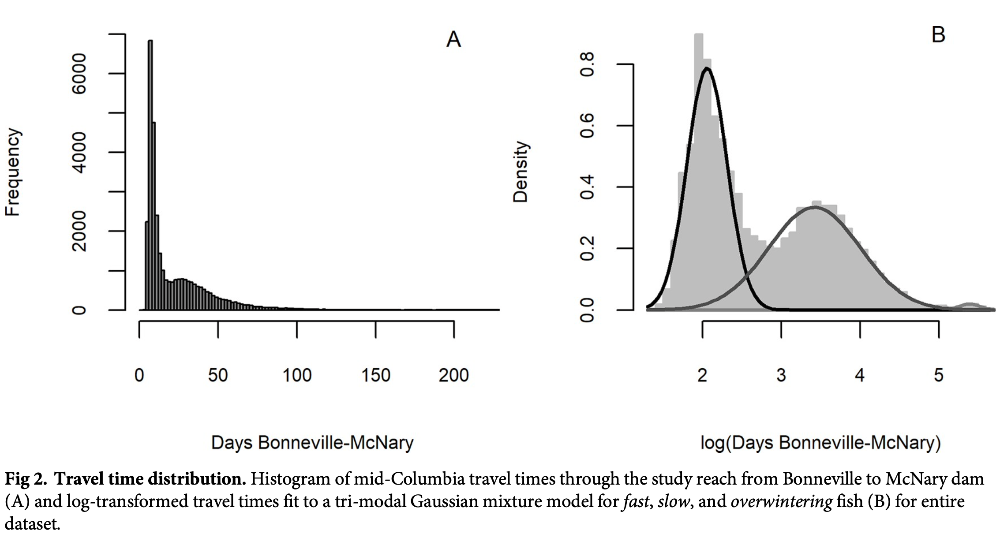

### Description
This Rmd file investigates residence time of individual fish in different reaches. This will help us determine in what time window covariates are most influential to fish movement decisions.

#### Covariate inclusion in Siegel et al. 2021: "Environmentally triggered shifts in steelhead migration behavior and consequences for survival in the mid-Columbia River"
{width=100%}

"For each population group, we fit a 3-component mixture model [32] to log-transformed travel times using the package mixtools [33] to assign a probability of migration behavior to each fish that was detected at both dams (n = 32,740)."

"We considered the following environmental variables in models for the probability of delay: river temperature (T), river flow (F), dam spill volume (S), and the date of first detection at Bonneville Dam (D). The environmental variables (T, F, and S), which were accessed from the Columbia River Data Access in Real Time database [36], were averaged over the median fast fish travel time period (8 days) starting on the day of first detection at Bonneville Dam. These 8 days represent the period of exposure during which a fish makes the “decision” to delay or to continue upstream."


### Proposed covariate structure

##### Continuous
1. Temperature
  + In mainstem sites, use the temperature value at the median residence time of "fast" fish - the fish that move straight through. Or pick a window of time based on residence time, and add that many days to the day that we see them enter the state and then average across those days.
  + Taking values right after fish enter a state would ensure that we are measuring conditions that we know they had to have experienced
  + Use temperature as a covariate for movements upstream and into tributaries, but not downstream.
2. Spill
  + March days of spill; this would be both "useful to fish" and "useful to BPA"
  + Richins and Skalski (2018): no relationship was found between fallback rates to natal tributaries and spill during January or February.
  + One option is to use this as a covariate for overshoot fallback only; might need to do some indexing with origins to make this happen
  + Does this get at the "useful to BPA" level of spill? If we want to do a deep dive on spill, we can slice spill different ways (perhaps at a level finer than by month) and try inclduing it in different forms
3. Flow - DROP. Flow is highly correlated with spill, and spill has been found to be more informative than flow for downstream movements (fallback) and not a good predictor of upstream movements
  + Richins and Skalski (2018) investigated how fallback rates were related to flow, and found no relationship between fallback rates to natal tributaries and late-winter flow
  + Siegel et al. (2021) looked at upstream migration of Steelhead (between Bonneville and McNary) and found that flow was not a good predictor for upstream migratory delays

Inevitably we are going to have fish where we are using covariates where we know they didn't experience those conditions, especially in the case of spill. Temperature shouldn't be as big of a deal, since the window that we average over will probably be quite small and temperature is generally very autocorrelated.

##### Categorical
1. Natal origin - all movements within ESU boundaries
2. Hatchery vs. wild - all movements
3. Barged vs. not barged - all movements, but would not affect most individuals
  + Richins and Skalski (2018) found that barging led to lower migration success (but also lower overshooting)
  + Only had enough data for Tucannon River Hatchery Steelhead
4. Acclimated vs. not acclimated - all movements
  + Strong effect, but again limited to one population (Wenatchee River Hatchery Steelhead)
5. Ocean age - all movements
  + Richins and Skalski (2018): "Compared to barging and rearing practices, ocean residence time was associated with smaller effects on migration success. Using meta-analysis, we found that increased ocean residence time was associated with reduced homing success during early migration, decreased movement directly to the natal tributary, increased overshooting, and decreased over-all success. Spending 2 years rather than 1 year in the ocean had estimated effects on overshooting ranging from a 4-percentage-point decrease (SE = 0.5 percentage point) for Wenatchee River steel- head to a 12-percentage-point increase (SE = 1 percentage point) for Entiat River steelhead."


```{r setup, include=FALSE}
knitr::opts_chunk$set(echo = FALSE, message = FALSE, warning = FALSE)

# load libraries
library(here)
library(janitor)
library(tidyverse)
library(lubridate)
library(car)
library(ggthemes)

# load data


```

```{r load_states_data}
# so, I think that the most up to date files are in the same folders as the model runs
snake_adults_states_complete <- read.csv(here::here("stan_actual", "deteff_ESU_models", "500iter_3chain_runs", "snake", "snake_adults_states_complete.csv"), row.names = 1)
lowcol_adults_states_complete <- read.csv(here::here("stan_actual", "deteff_ESU_models", "lower_columbia", "lower_columbia_adults_states_complete.csv"), row.names = 1)
midcol_adults_states_complete <- read.csv(here::here("stan_actual", "deteff_ESU_models", "500iter_3chain_runs", "middle_columbia", "middle_columbia_adults_states_complete.csv"), row.names = 1)
uppcol_adults_states_complete <- read.csv(here::here("stan_actual", "deteff_ESU_models", "500iter_3chain_runs", "upper_columbia", "upper_columbia_adults_states_complete.csv"), row.names = 1)

# combine them all
snake_adults_states_complete %>% 
  bind_rows(., midcol_adults_states_complete) %>% 
  bind_rows(., uppcol_adults_states_complete) %>% 
  bind_rows(., lowcol_adults_states_complete) -> ASC

# now add tag code metadata, for natal origins
origin_numeric <- data.frame(natal_origin = c("Asotin_Creek", 
                                        "Clearwater_River",
                                        "Deschutes_River", 
                                        "Entiat_River", 
                                        "Fifteenmile_Creek", 
                                        "Grande_Ronde_River", 
                                        "Hood_River",
                                        "Imnaha_River",
                                        "John_Day_River", 
                                        "Methow_River", 
                                        "Okanogan_River", 
                                        "Salmon_River", 
                                        "Tucannon_River", 
                                        "Umatilla_River",
                                        "Walla_Walla_River",
                                        "Wenatchee_River", 
                                        "Yakima_River"),
                             natal_origin_numeric = seq(1,17,1))

origin_rear_actual <- read.csv(here::here("stan_actual", "origin_rear_actual.csv"), row.names = 1)
origin_rear_actual %>% 
  dplyr::rename(natal_origin_numeric = natal_origin) %>% 
  left_join(origin_numeric, by = "natal_origin_numeric") %>% 
  dplyr::select(tag_code_2, natal_origin) -> tag_code_origins

ASC %>% 
  left_join(., tag_code_origins, by = "tag_code_2") -> ASC

# also note which ESU they're from, for plotting
ESU_origins <- data.frame(natal_origin = unique(ASC$natal_origin),
                          ESU = c(rep("Snake", 6),
                                  rep("Middle Columbia", 6),
                                  rep("Upper Columbia", 4),
                                  "Lower Columbia"))

ASC %>% 
  left_join(., ESU_origins, by = "natal_origin") -> ASC
```

```{r functions}
# a function that takes two states, and finds the average amount of time between those states
# notably, if a fish doesn't go straight, it won't keep it in this function
# so, if a fish attempts BON ascent on day 1, gives up, and does it again on day 7, then is seen at MCN on day 17,
# passage time will be 10 days, not 16 days
# also, if a fish ascends BON, then goes to Deschutes, then goes to MCN, it will not be kept in this function

passage_time <- function(pathway_1, pathway_2){
  
  # first, subset only those that have those two states
  # don't keep any with implicit time interpolated
  ASC %>% 
    filter(pathway == pathway_1 & lead(pathway == pathway_2) & tag_code_2 == lead(tag_code_2) & pathway != "implicit" & lead(pathway) != "implicit" |
             pathway == pathway_2 & lag(pathway == pathway_1) & tag_code_2 == lag(tag_code_2) & pathway != "implicit" & lag(pathway) != "implicit") %>% 
    mutate(date_time = ymd_hms(date_time)) -> two_pathway_df
  
  # make a data frame to record all of the transitions
  n_transitions <- nrow(two_pathway_df)/2
  passage_df <- data.frame(tag_code_2 = two_pathway_df$tag_code_2[seq(1,(nrow(two_pathway_df)-1),2)],
                           ESU = two_pathway_df$ESU[seq(1,(nrow(two_pathway_df)-1),2)],
                           passage_time = NA)
  
  
  for (i in 1:nrow(passage_df)){
    passage_df$passage_time[i] <- two_pathway_df$date_time[(i*2)] - two_pathway_df$date_time[(i*2-1)]
    
  }
  
  return(passage_df)
  
}

# a function to plot passage time
passage_time_plot <- function(passage_df, reach){
  passage_plot <- ggplot(passage_df, aes(x = passage_time, fill = ESU)) +
    geom_histogram(binwidth = 1) +
    xlab("Days") +
    ggtitle(reach) +
    scale_fill_tableau(palette = "Tableau 10")
 
  return(passage_plot) 
}

passage_time_plot_quantiles <- function(passage_df, reach, quantiles){
  passage_plot <- ggplot(passage_df, aes(x = passage_time, fill = ESU)) +
    geom_histogram(binwidth = 1) +
    xlab("Days") +
    ggtitle(reach) +
    scale_fill_tableau(palette = "Tableau 10") +
    geom_vline(xintercept = quantiles, lty = 2)
 
  return(passage_plot) 
}

passage_time_plot_logdays <- function(passage_df, reach){
  passage_plot <- ggplot(passage_df, aes(x = log(passage_time), fill = ESU)) +
    geom_histogram(binwidth = 0.1) +
    xlab("log(Days)") +
    ggtitle(reach) +
    scale_fill_tableau(palette = "Tableau 10")
  
  return(passage_plot) 
}

passage_time_plot_logdays_quantiles <- function(passage_df, reach, quantiles){
  passage_plot <- ggplot(passage_df, aes(x = log(passage_time), fill = ESU)) +
    geom_histogram(binwidth = 0.1) +
    xlab("log(Days)") +
    ggtitle(reach) +
    scale_fill_tableau(palette = "Tableau 10") +
    geom_vline(xintercept = quantiles, lty = 2)
  
  return(passage_plot) 
}

passage_time_plot_origin <- function(passage_df, reach){
  passage_plot <- ggplot(passage_df, aes(x = passage_time, fill = natal_origin)) +
    geom_histogram(binwidth = 1) +
    xlab("Days") +
    ggtitle(reach) +
    scale_fill_tableau(palette = "Tableau 20")
 
  return(passage_plot) 
}

passage_time_plot_logdays_origin <- function(passage_df, reach){
  passage_plot <- ggplot(passage_df, aes(x = log(passage_time), fill = natal_origin)) +
    geom_histogram(binwidth = 0.1) +
    xlab("log(Days)") +
    ggtitle(reach) +
    scale_fill_tableau(palette = "Tableau 20")
  
  return(passage_plot) 
}


# a function that takes just one state, and finds the average amount of time to move out of that state

residence_time <- function(residence_state){
  
  # don't keep any with implicit time interpolated
  ASC %>% 
    filter(state == residence_state & tag_code_2 == lead(tag_code_2) & pathway != "implicit" & lead(pathway) != "implicit" |
             lag(state) == residence_state & tag_code_2 == lag(tag_code_2) & pathway != "implicit" & lag(pathway) != "implicit") %>% 
    mutate(date_time = ymd_hms(date_time)) -> one_state_df
  
  # make a data frame to record all of the transitions
  n_transitions <- nrow(one_state_df)/2
  passage_df <- data.frame(tag_code_2 = one_state_df$tag_code_2[seq(1,(nrow(one_state_df)-1),2)],
                           ESU = one_state_df$ESU[seq(1,(nrow(one_state_df)-1),2)],
                           natal_origin = one_state_df$natal_origin[seq(1,(nrow(one_state_df)-1),2)],
                           passage_time = NA)
  
  
  for (i in 1:nrow(passage_df)){
    passage_df$passage_time[i] <- one_state_df$date_time[(i*2)] - one_state_df$date_time[(i*2-1)]
    
  }
  
  return(passage_df)
  
}
```

```{r BON_to_MCN, eval = FALSE}

BON_MCN_passage <- passage_time(pathway_1 = "BON (adult)", pathway_2 = "MCN (adult)")
BON_to_MCN <- passage_time_plot(passage_df = BON_MCN_passage, reach = "Bonneville Adult Ladder to McNary Adult Ladder")
BON_to_MCN

BON_to_MCN_log <- passage_time_plot_logdays(passage_df = BON_MCN_passage, reach = "Bonneville Adult Ladder to McNary Adult Ladder")
BON_to_MCN_log

# give summary of passage time

summary(BON_MCN_passage$passage_time)
```

```{r all_states_residence_time}
unique_states <- unique(ASC$state)
# okay, so some of these are terminal states, where literally no fish that go in come out
# Salmon river
unique_states <- unique_states[!(unique_states == "Salmon River")]
unique_states <- unique_states[!(unique_states == "Clearwater River")]
unique_states <- unique_states[!(unique_states == "loss")]
unique_states <- unique_states[!(unique_states == "Upstream WEL other tributaries")]

# we might be interested in just mainstem sites, but for now we'll keep in tribs
mainstem_states <- c("mainstem, mouth to BON",
  "mainstem, BON to MCN",
  "mainstem, MCN to ICH or PRA",
  "mainstem, PRA to RIS",
  "mainstem, RIS to RRE",
  "mainstem, RRE to WEL",
  "mainstem, upstream of WEL",
  "mainstem, ICH to LGR",
  "mainstem, upstream of LGR")

plots_days <- list()
plots_logdays <- list()
plots_days_origin <- list()
plots_logdays_origin <- list()

for (i in 1:length(mainstem_states)) {
  residence_df <- residence_time(residence_state = mainstem_states[i])
  
  passage_plot <- passage_time_plot(passage_df = residence_df, reach = mainstem_states[i])
  plots_days[[i]] <- passage_plot
  
  passage_plot_origin <- passage_time_plot_origin(passage_df = residence_df, reach = mainstem_states[i])
  plots_days_origin[[i]] <- passage_plot_origin
  
  passage_plot_log <- passage_time_plot_logdays(passage_df = residence_df, reach = mainstem_states[i])
  plots_logdays[[i]] <- passage_plot_log
  
  passage_plot_log_origin <- passage_time_plot_logdays_origin(passage_df = residence_df, reach = mainstem_states[i])
  plots_logdays_origin[[i]] <- passage_plot_log_origin

  # give summary of passage time
  summary(residence_df$passage_time)
  
}

```


```{r all_states_residence_time_window_exploration}
main_mainstem_states <- c(
  "mainstem, BON to MCN",
  "mainstem, MCN to ICH or PRA",
  "mainstem, PRA to RIS",
  "mainstem, RIS to RRE",
  "mainstem, RRE to WEL",
  "mainstem, ICH to LGR")

plots_days_windows <- list()
plots_logdays_windows <- list()
plots_days_origin_windows <- list()
plots_logdays_origin_windows <- list()

for (i in 1:length(main_mainstem_states)) {
  residence_df <- residence_time(residence_state = main_mainstem_states[i])
  
  # Look into windows - show: 1) median of the whole distribution, 
  # and what cutoff you'd need to capture 50%, 80%, and 95% of fish residence time
  quantiles <- quantile(residence_df$passage_time, probs = c(0.5, 0.8, 0.95))
  log(quantiles)
  
  
  passage_plot_quantiles <- passage_time_plot_quantiles(passage_df = residence_df, reach = mainstem_states[i], quantiles = quantiles)
  plots_days_windows[[i]] <- passage_plot_quantiles
  
  passage_plot_log_quantiles <- passage_time_plot_logdays_quantiles(passage_df = residence_df, reach = mainstem_states[i], quantiles = log(quantiles))
  plots_logdays_windows[[i]] <- passage_plot_log_quantiles
  
}

```

## Residence time by main mainstem reaches
```{r}
plots_days_windows[[1]]
plots_logdays_windows[[1]]
plots_days_windows[[2]]
plots_logdays_windows[[2]]
plots_days_windows[[3]]
plots_logdays_windows[[3]]
plots_days_windows[[4]]
plots_logdays_windows[[4]]
plots_days_windows[[5]]
plots_logdays_windows[[5]]
plots_days_windows[[6]]
plots_logdays_windows[[6]]
```


## Residence time by mainstem reach

#### Lower/Middle Columbia
```{r}
plots_days_windows[[1]]
plots_logdays[[1]]
# plots_days_origin[[1]]
# plots_logdays_origin[[1]]
plots_days[[2]]
plots_logdays[[2]]
# plots_days_origin[[2]]
plots_logdays_origin[[2]]
plots_days[[3]]
plots_logdays[[3]]
# plots_days_origin[[3]]
plots_logdays_origin[[3]]
```

#### Upper Columbia
```{r}
plots_days[[4]]
plots_logdays[[4]]
# plots_days_origin[[4]]
plots_logdays_origin[[4]]
plots_days[[5]]
plots_logdays[[5]]
# plots_days_origin[[5]]
plots_logdays_origin[[5]]
plots_days[[6]]
plots_logdays[[6]]
# plots_days_origin[[6]]
plots_logdays_origin[[6]]
plots_days[[7]]
plots_logdays[[7]]
# plots_days_origin[[7]]
plots_logdays_origin[[7]]
```

#### Snake
```{r}
plots_days[[8]]
plots_logdays[[8]]
# plots_days_origin[[8]]
plots_logdays_origin[[8]]
plots_days[[9]]
plots_logdays[[9]]
# plots_days_origin[[9]]
plots_logdays_origin[[9]]
```

### Passage time only for overshooting


```{r}
# reduce only to fish that we know have overshot
overshoot_states <- data.frame(natal_origin = c("Asotin_Creek", 
                                        "Clearwater_River",
                                        "Deschutes_River", 
                                        "Entiat_River", 
                                        "Fifteenmile_Creek", 
                                        "Grande_Ronde_River", 
                                        "Hood_River",
                                        "Imnaha_River",
                                        "John_Day_River", 
                                        "Methow_River", 
                                        "Okanogan_River", 
                                        "Salmon_River", 
                                        "Tucannon_River", 
                                        "Umatilla_River",
                                        "Walla_Walla_River",
                                        "Wenatchee_River", 
                                        "Yakima_River"),
overshoot_state = c(NA, # Asotin Creek
                                                           NA, # Clearwater
                                                           "mainstem, MCN to ICH or PRA", # Deschutes River
                                                           "mainstem, upstream of WEL", #Entiat
                                                           "mainstem, MCN to ICH or PRA", # Fifteenmile Creek
                                                           NA, # Grande Ronde River
                                                           "mainstem, MCN to ICH or PRA", # Hood River
                                                           NA, # Imnaha River
                                                           "mainstem, MCN to ICH or PRA", # John Day River
                                                           NA, # Methow River
                                                           NA,  # Okanogan River
                                                           NA, # Salmon River
                                                           "mainstem, upstream of LGR", # Tucannon River
                                                           "mainstem, MCN to ICH or PRA", # Umatilla River
                                                           "mainstem, PRA to RIS", # Walla Walla River
                                                           "mainstem, RRE to WEL", # Wenatchee River
                                                           "mainstem, PRA to RIS" # Yakima River
                                       ),
mainstem_state = c(NA, # Asotin Creek
                                                           NA, # Clearwater
                                                           "mainstem, BON to MCN", # Deschutes River
                                                           "mainstem, RRE to WEL", #Entiat
                                                           "mainstem, BON to MCN", # Fifteenmile Creek
                                                           NA, # Grande Ronde River
                                                           "mainstem, BON to MCN", # Hood River
                                                           NA, # Imnaha River
                                                           "mainstem, BON to MCN", # John Day River
                                                           NA, # Methow River
                                                           NA,  # Okanogan River
                                                           NA, # Salmon River
                                                           "mainstem, ICH to LGR", # Tucannon River
                                                           "mainstem, BON to MCN", # Umatilla River
                                                           "mainstem, MCN to ICH or PRA", # Walla Walla River
                                                           "mainstem, RRE to WEL", # Wenatchee River
                                                           "mainstem, MCN to ICH or PRA" # Yakima River
                   ))


ASC %>% 
  left_join(., overshoot_states, by = "natal_origin") %>% 
  filter(state == overshoot_state | lead(state) == overshoot_state & tag_code_2 == lead(tag_code_2)) %>% 
  mutate(date_time = ymd_hms(date_time)) -> overshoot_ASC
  
  # make a data frame to record all of the transitions
  n_transitions <- nrow(overshoot_ASC)/2
  overshoot_passage_df <- data.frame(tag_code_2 = overshoot_ASC$tag_code_2[seq(1,(nrow(overshoot_ASC)-1),2)],
                           ESU = overshoot_ASC$ESU[seq(1,(nrow(overshoot_ASC)-1),2)],
                           natal_origin = overshoot_ASC$natal_origin[seq(1,(nrow(overshoot_ASC)-1),2)],
                           passage_time = NA)
  
  
  for (i in 1:nrow(overshoot_passage_df)){
    overshoot_passage_df$passage_time[i] <- overshoot_ASC$date_time[(i*2)] - overshoot_ASC$date_time[(i*2-1)]
    
  }

## plot time to overshoot, by origin
overshoot_time_plot <- ggplot(overshoot_passage_df, aes(x = passage_time, fill = natal_origin)) +
    geom_histogram(binwidth = 1) +
    xlab("Days") +
    ggtitle("Time before overshoot at first upstream dam") +
    scale_fill_tableau(palette = "Tableau 10")


  overshoot_time_plot_logdays <- ggplot(overshoot_passage_df, aes(x = log(passage_time), fill = natal_origin)) +
    geom_histogram(binwidth = 0.1) +
    xlab("log(Days)") +
    ggtitle("Time before overshoot at first upstream dam") +
    scale_fill_tableau(palette = "Tableau 10")

  overshoot_time_plot  
overshoot_time_plot_logdays


# Day of fallback
data.frame(day = yday(overshoot_ASC[seq(2, nrow(overshoot_ASC), 2),]$date_time),
           tag_code = overshoot_ASC[seq(2, nrow(overshoot_ASC), 2),]$tag_code_2,
           natal_origin = overshoot_ASC[seq(2, nrow(overshoot_ASC), 2),]$natal_origin) -> overshoot_dates

# gonna remove hood fish because there's so few of them and they're messing up my color consistency
ggplot(subset(overshoot_dates, natal_origin != "Hood_River"), aes(x = day, fill = natal_origin)) +
  geom_histogram() +
  ggtitle("Estimated day of overshoot") +
  scale_fill_tableau(palette = "Tableau 10")
# subset(overshoot_ASC, natal_origin == "Tucannon_River")
```

### Passage time only for fallback (if known)

```{r}
ASC %>% 
  left_join(., overshoot_states, by = "natal_origin") %>% 
  filter(lag(state) == overshoot_state & state == mainstem_state & tag_code_2 == lag(tag_code_2) |
  state == overshoot_state & lead(state) == mainstem_state  & tag_code_2 == lead(tag_code_2)) %>% 
  mutate(date_time = ymd_hms(date_time)) -> fallback_ASC
  
  # make a data frame to record all of the transitions
  n_transitions <- nrow(fallback_ASC)/2
  fallback_passage_df <- data.frame(tag_code_2 = fallback_ASC$tag_code_2[seq(1,(nrow(fallback_ASC)-1),2)],
                           ESU = fallback_ASC$ESU[seq(1,(nrow(fallback_ASC)-1),2)],
                           natal_origin = fallback_ASC$natal_origin[seq(1,(nrow(fallback_ASC)-1),2)],
                           passage_time = NA)
  
  
  for (i in 1:nrow(fallback_passage_df)){
    fallback_passage_df$passage_time[i] <- fallback_ASC$date_time[(i*2)] - fallback_ASC$date_time[(i*2-1)]
    
  }

## plot time to fallback, by origin
fallback_time_plot <- ggplot(fallback_passage_df, aes(x = passage_time, fill = natal_origin)) +
    geom_histogram(binwidth = 1) +
    xlab("Days") +
    ggtitle("Time before fallback at first upstream dam") +
    scale_fill_tableau(palette = "Tableau 10")


  fallback_time_plot_logdays <- ggplot(fallback_passage_df, aes(x = log(passage_time), fill = natal_origin)) +
    geom_histogram(binwidth = 0.1) +
    xlab("log(Days)") +
    ggtitle("Time before fallback at first upstream dam") +
    scale_fill_tableau(palette = "Tableau 10")

  fallback_time_plot  
fallback_time_plot_logdays

# what about time of any fallback?

data.frame(day = yday(fallback_ASC[seq(2, nrow(fallback_ASC), 2),]$date_time),
           tag_code = fallback_ASC[seq(2, nrow(fallback_ASC), 2),]$tag_code_2,
           natal_origin = fallback_ASC[seq(2, nrow(fallback_ASC), 2),]$natal_origin) -> fallback_dates

# gonna remove hood fish because there's so few of them and they're messing up my color consistency
ggplot(subset(fallback_dates, natal_origin != "Hood_River"), aes(x = day, fill = natal_origin)) +
  geom_histogram() +
  ggtitle("Estimated day of fallback") +
  scale_fill_tableau(palette = "Tableau 10")


subset(fallback_passage_df, passage_time <= 10)$tag_code_2 -> fast_fallback_tag_codes

# time of year when fast fallback is happening

subset(fallback_ASC, tag_code_2 %in% fast_fallback_tag_codes) -> fast_fallback

data.frame(day = yday(fast_fallback[seq(2, nrow(fast_fallback), 2),]$date_time),
           tag_code = fast_fallback[seq(2, nrow(fast_fallback), 2),]$tag_code_2,
           natal_origin = fast_fallback[seq(2, nrow(fast_fallback), 2),]$natal_origin) -> fast_fallback_dates

ggplot(fast_fallback_dates, aes(x = day, fill = natal_origin)) +
  geom_histogram() +
  ggtitle("Day of fallback, when fallback occurs within 10 days of ascent") +
  scale_fill_tableau(palette = "Tableau 10")
```

## Covariate data exploratory analysis

What is the relationship between water temperature at Ice Harbor and the probability of overshooting (and other movements) for Walla Walla River Steelhead?

From Richins and Skalski (2018): for natural-origin Walla Walla River steelhead, the probability of moving directly to home decreased from over 90% to less than 25% as water temperatures increased from 10°C to 20°C.

```{r WAWA_temp_analysis}
ICH_temp <- read.csv(here::here("covariate_data", "for_model", "ICH_temp.csv"))

subset(ASC, natal_origin == "Walla_Walla_River") -> WAWA_ASC

# Keep only those fish in MCN to ICH or PRA state
WAWA_ASC %>% 
  filter(state == "mainstem, MCN to ICH or PRA" & tag_code_2 == lead(tag_code_2)  |
             lag(state) == "mainstem, MCN to ICH or PRA" & tag_code_2 == lag(tag_code_2)) -> WAWA_ASC_subset


# combine both WAWA states into one
WAWA_ASC_subset %>% 
  mutate(state = ifelse(state %in% c("Walla Walla River Mouth", "Walla Walla River Upstream"), "Walla Walla River",
                        ifelse(state == "Yakima River Mouth", "Yakima River", state))) %>% 
  mutate(date_time = ymd_hms(date_time)) %>% 
  # create an empty field for temp
  mutate(temp = NA)-> WAWA_ASC_subset

# match temperature
for (i in seq(1, nrow(WAWA_ASC_subset)-1, by = 2)){
  # get the average temperature over eight days from detection at McNary
  # extract the date range
  date_range <- as.character(seq(date(WAWA_ASC_subset$date_time[i]), date(WAWA_ASC_subset$date_time[i]) + days(7), by = "days"))
  
  # match those dates to the temp data
  temp_range <- subset(ICH_temp, date %in% date_range)
  
  # get the average temperature
  mean_temp <- mean(temp_range$temp, na.rm = TRUE)
  
  WAWA_ASC_subset$temp[i:(i+1)] <- mean_temp
}

# make these into two vectors: state numeric and temp numeric
states <- as.numeric(factor(WAWA_ASC_subset[seq(2,nrow(WAWA_ASC_subset),2),]$state, levels = 
                                 c("Walla Walla River", "mainstem, ICH to LGR", 
                                   "mainstem, PRA to RIS","mainstem, BON to MCN","Yakima River")))

temps <- WAWA_ASC_subset[seq(2,nrow(WAWA_ASC_subset),2),]$temp
data <- list(states, temps)

# 5 options: "Walla Walla River"           "mainstem, ICH to LGR"        "mainstem, PRA to RIS"        "mainstem, BON to MCN"        "Yakima River"
# p vector of length 5 - intercept + temperature
negLL <- function(params, data){
  # start negLL at zero
  negLL <- 0
  
  alpha <- params[1:5]
  beta <- params[6:10]
  
  p_vec <- vector(length = 5)
    
  states <- data[[1]]
  
  # turn this into a series of vectors
  states_matrix <- matrix(data = 0, nrow = length(states), ncol = 5)
  
  temps <- data[[2]]
  
  for (i in 1:length(states)){
    states_matrix[i,states[i]] <- 1
    
    p_vec <- exp(alpha + beta*temps[i])/(1 + sum(exp(alpha + beta * temps[i])))
    negLL <- negLL + -1* dmultinom(x = states_matrix[i,], prob = p_vec, log = TRUE)
  }
  
  return(negLL)
}


# run multinomial logit optim
optim_inits <- c(rep(0, 5), rep(0, 5))
# optim_inits <- c(rep(0, 5), rep(-1,5))
set.seed(123)
optim_results <- optim(par = optim_inits, data = data, fn = negLL, method = 'L-BFGS-B', hessian = FALSE, control = list(maxit = 2000))

# probability of overshooting by temperature
temp_predict <- seq(min(temps), max(temps), by = 0.1)

movement_probs <- data.frame(temp = temp_predict,
                             PRA_to_RIS = NA,
                             ICH_to_LGR = NA,
                             Yakima_River = NA,
                             Walla_Walla_River = NA,
                             BON_to_MCN = NA)

for (i in 1:length(temp_predict)){
  movement_probs$PRA_to_RIS[i] <- exp(optim_results$par[3] + optim_results$par[8]*temp_predict[i])/(1 + sum(exp(optim_results$par[1:5] + optim_results$par[6:10] * temp_predict[i])))
  movement_probs$ICH_to_LGR[i] <- exp(optim_results$par[2] + optim_results$par[7]*temp_predict[i])/(1 + sum(exp(optim_results$par[1:5] + optim_results$par[6:10] * temp_predict[i])))
  movement_probs$Yakima_River[i] <- exp(optim_results$par[5] + optim_results$par[10]*temp_predict[i])/(1 + sum(exp(optim_results$par[1:5] + optim_results$par[6:10] * temp_predict[i])))
  movement_probs$Walla_Walla_River[i] <- exp(optim_results$par[1] + optim_results$par[6]*temp_predict[i])/(1 + sum(exp(optim_results$par[1:5] + optim_results$par[6:10] * temp_predict[i])))
  movement_probs$BON_to_MCN[i] <- exp(optim_results$par[4] + optim_results$par[9]*temp_predict[i])/(1 + sum(exp(optim_results$par[1:5] + optim_results$par[6:10] * temp_predict[i])))
}

movement_probs %>% 
  pivot_longer(., cols = colnames(movement_probs)[2:6]) %>% 
  dplyr::rename(next_state = name) -> movement_probs_long

next_movement = data.frame(next_movement = c("Overshoot PRA", "Overshoot ICH", 
                                             "Yakima River (Stray)",
                                             "Walla Walla River (Home)",
                                             "Fallback MCN"),
                           next_state = unique(movement_probs_long$next_state))
  

movement_probs_long %>% 
  left_join(., next_movement, by = "next_state") -> movement_probs_long

ggplot(movement_probs_long, aes(x = temp, y = value, color = next_movement)) +
  geom_line() +
  scale_color_tableau(palette = "Tableau 10") + 
  scale_y_continuous(limits = c(0,1))
```


##### Okay, but how is temperature correlated with direction of movement?
```{r temp_v_movement_direction}
subset(WAWA_ASC_subset, state == "mainstem, MCN to ICH or PRA") -> mainstem_fish
```

The temperatures for fish going *upstream* are as follows:
```{r}
summary(subset(mainstem_fish, pathway == "MCN (adult)")$temp)
```

The temperatures for fish going *downstream* are as follows:
```{r}
summary(subset(mainstem_fish, pathway != "MCN (adult)")$temp)
```

#### run the multinomial logit again with fish, but now only those going upstream
```{r}
states <- as.numeric(factor(subset(WAWA_ASC_subset, lag(pathway) == "MCN (adult)")[seq(2,nrow(subset(WAWA_ASC_subset, lag(pathway) == "MCN (adult)")),2),]$state, levels = 
                                 c("Walla Walla River", "mainstem, ICH to LGR", 
                                   "mainstem, PRA to RIS","mainstem, BON to MCN","Yakima River")))

temps <- subset(WAWA_ASC_subset, lag(pathway) == "MCN (adult)")[seq(2,nrow(subset(WAWA_ASC_subset, lag(pathway) == "MCN (adult)")),2),]$temp
data <- list(states, temps)

# run multinomial logit optim
optim_inits <- c(rep(0, 5), rep(0, 5))
# optim_inits <- c(rep(0, 5), rep(-1,5))
set.seed(123)
optim_results <- optim(par = optim_inits, data = data, fn = negLL, method = 'L-BFGS-B', hessian = FALSE, control = list(maxit = 2000))

# optim_results

# probability of overshooting by temperature
temp_predict <- seq(min(temps), max(temps), by = 0.1)

movement_probs <- data.frame(temp = temp_predict,
                             PRA_to_RIS = NA,
                             ICH_to_LGR = NA,
                             Yakima_River = NA,
                             Walla_Walla_River = NA,
                             BON_to_MCN = NA)

for (i in 1:length(temp_predict)){
  movement_probs$PRA_to_RIS[i] <- exp(optim_results$par[3] + optim_results$par[8]*temp_predict[i])/(1 + sum(exp(optim_results$par[1:5] + optim_results$par[6:10] * temp_predict[i])))
  movement_probs$ICH_to_LGR[i] <- exp(optim_results$par[2] + optim_results$par[7]*temp_predict[i])/(1 + sum(exp(optim_results$par[1:5] + optim_results$par[6:10] * temp_predict[i])))
  movement_probs$Yakima_River[i] <- exp(optim_results$par[5] + optim_results$par[10]*temp_predict[i])/(1 + sum(exp(optim_results$par[1:5] + optim_results$par[6:10] * temp_predict[i])))
  movement_probs$Walla_Walla_River[i] <- exp(optim_results$par[1] + optim_results$par[6]*temp_predict[i])/(1 + sum(exp(optim_results$par[1:5] + optim_results$par[6:10] * temp_predict[i])))
  movement_probs$BON_to_MCN[i] <- exp(optim_results$par[4] + optim_results$par[9]*temp_predict[i])/(1 + sum(exp(optim_results$par[1:5] + optim_results$par[6:10] * temp_predict[i])))
}

movement_probs %>% 
  pivot_longer(., cols = colnames(movement_probs)[2:6]) %>% 
  dplyr::rename(next_state = name) -> movement_probs_long

next_movement = data.frame(next_movement = c("Overshoot PRA", "Overshoot ICH", 
                                             "Yakima River (Stray)",
                                             "Walla Walla River (Home)",
                                             "Fallback MCN"),
                           next_state = unique(movement_probs_long$next_state))
  

movement_probs_long %>% 
  left_join(., next_movement, by = "next_state") -> movement_probs_long

ggplot(movement_probs_long, aes(x = temp, y = value, color = next_movement)) +
  geom_line() +
  scale_color_tableau(palette = "Tableau 10") + 
  scale_y_continuous(limits = c(0,1))
```


#### run the multinomial logit again with fish, but now only those going downstream
```{r}
states <- as.numeric(factor(subset(WAWA_ASC_subset, lag(pathway) != "MCN (adult)")[seq(2,nrow(subset(WAWA_ASC_subset, lag(pathway) != "MCN (adult)")),2),]$state, levels = 
                                 c("Walla Walla River", "mainstem, ICH to LGR", 
                                   "mainstem, PRA to RIS","mainstem, BON to MCN","Yakima River")))

temps <- subset(WAWA_ASC_subset, lag(pathway) != "MCN (adult)")[seq(2,nrow(subset(WAWA_ASC_subset, lag(pathway) != "MCN (adult)")),2),]$temp
data <- list(states, temps)

# run multinomial logit optim
optim_inits <- c(rep(0, 5), rep(0, 5))
# optim_inits <- c(rep(0, 5), rep(-1,5))
set.seed(123)
optim_results <- optim(par = optim_inits, data = data, fn = negLL, method = 'L-BFGS-B', hessian = FALSE, control = list(maxit = 2000))

# optim_results

# probability of overshooting by temperature
temp_predict <- seq(min(temps), max(temps), by = 0.1)

movement_probs <- data.frame(temp = temp_predict,
                             PRA_to_RIS = NA,
                             ICH_to_LGR = NA,
                             Yakima_River = NA,
                             Walla_Walla_River = NA,
                             BON_to_MCN = NA)

for (i in 1:length(temp_predict)){
  movement_probs$PRA_to_RIS[i] <- exp(optim_results$par[3] + optim_results$par[8]*temp_predict[i])/(1 + sum(exp(optim_results$par[1:5] + optim_results$par[6:10] * temp_predict[i])))
  movement_probs$ICH_to_LGR[i] <- exp(optim_results$par[2] + optim_results$par[7]*temp_predict[i])/(1 + sum(exp(optim_results$par[1:5] + optim_results$par[6:10] * temp_predict[i])))
  movement_probs$Yakima_River[i] <- exp(optim_results$par[5] + optim_results$par[10]*temp_predict[i])/(1 + sum(exp(optim_results$par[1:5] + optim_results$par[6:10] * temp_predict[i])))
  movement_probs$Walla_Walla_River[i] <- exp(optim_results$par[1] + optim_results$par[6]*temp_predict[i])/(1 + sum(exp(optim_results$par[1:5] + optim_results$par[6:10] * temp_predict[i])))
  movement_probs$BON_to_MCN[i] <- exp(optim_results$par[4] + optim_results$par[9]*temp_predict[i])/(1 + sum(exp(optim_results$par[1:5] + optim_results$par[6:10] * temp_predict[i])))
}

movement_probs %>% 
  pivot_longer(., cols = colnames(movement_probs)[2:6]) %>% 
  dplyr::rename(next_state = name) -> movement_probs_long

next_movement = data.frame(next_movement = c("Overshoot PRA", "Overshoot ICH", 
                                             "Yakima River (Stray)",
                                             "Walla Walla River (Home)",
                                             "Fallback MCN"),
                           next_state = unique(movement_probs_long$next_state))
  

movement_probs_long %>% 
  left_join(., next_movement, by = "next_state") -> movement_probs_long

ggplot(movement_probs_long, aes(x = temp, y = value, color = next_movement)) +
  geom_line() +
  scale_color_tableau(palette = "Tableau 10") + 
  scale_y_continuous(limits = c(0,1))
```