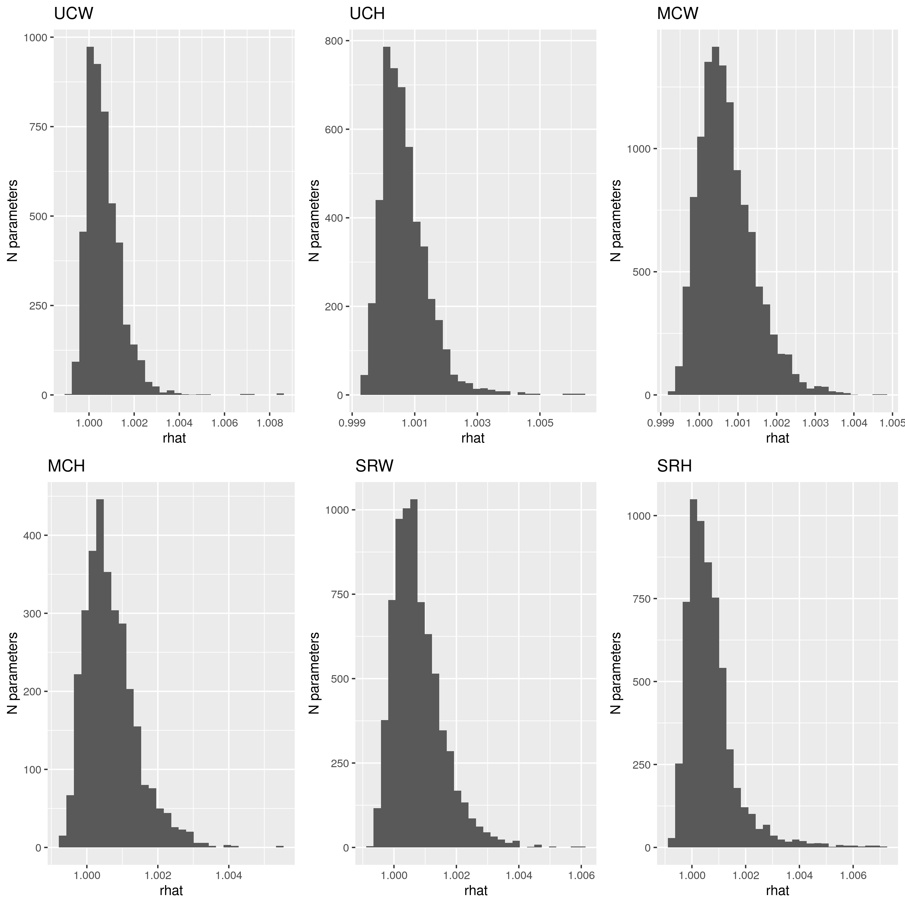
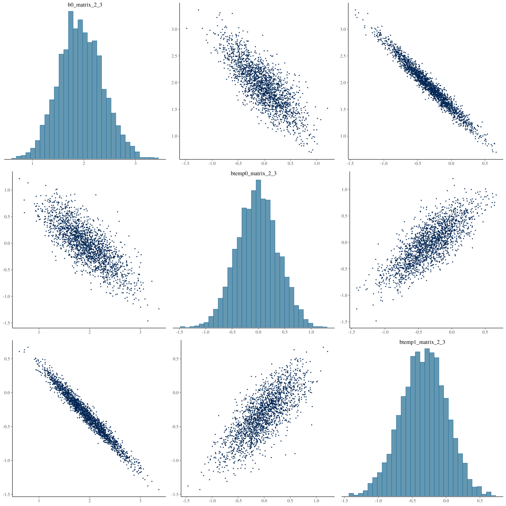
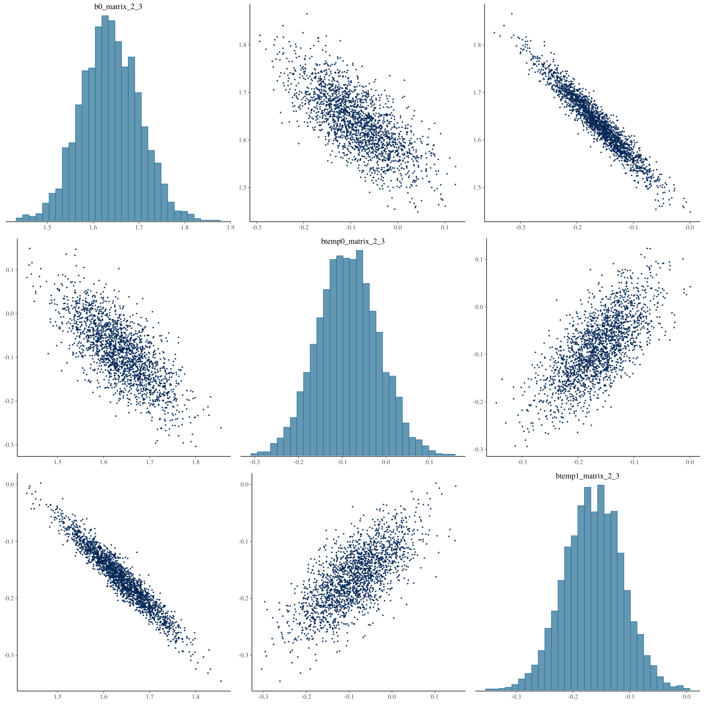
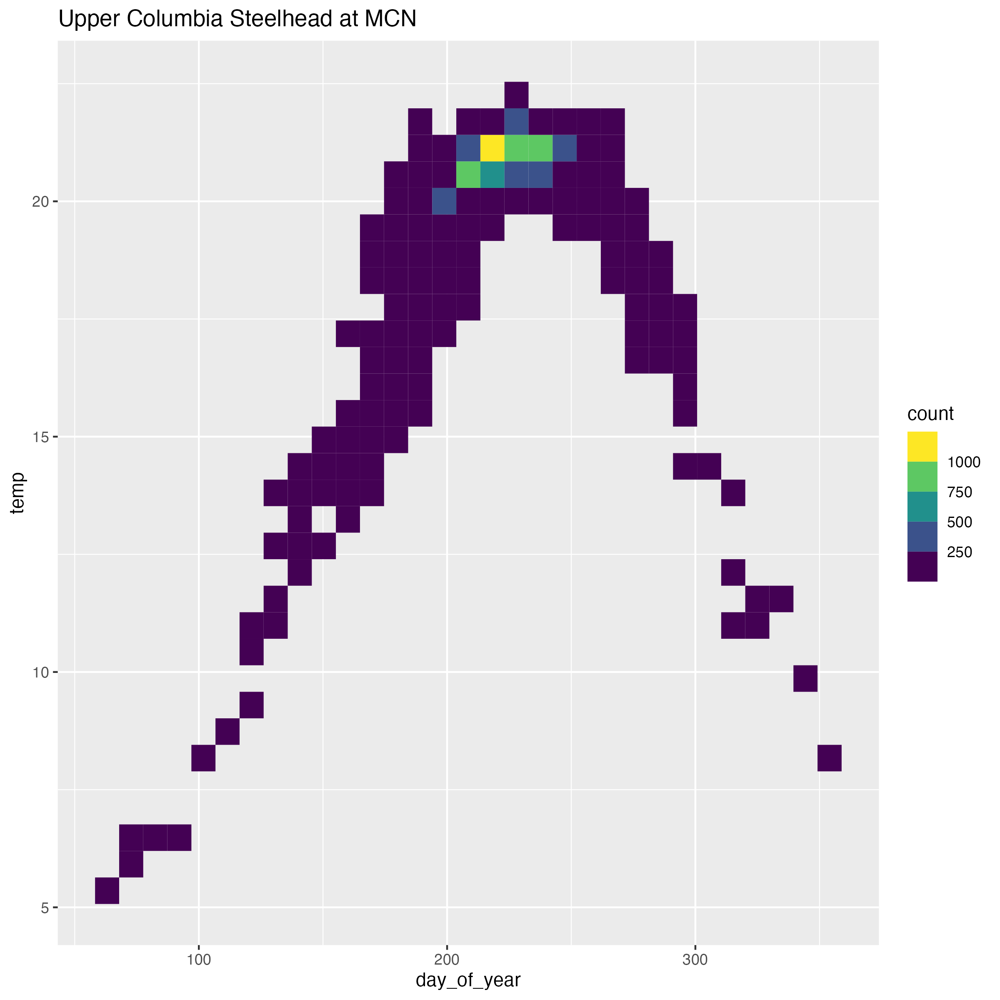
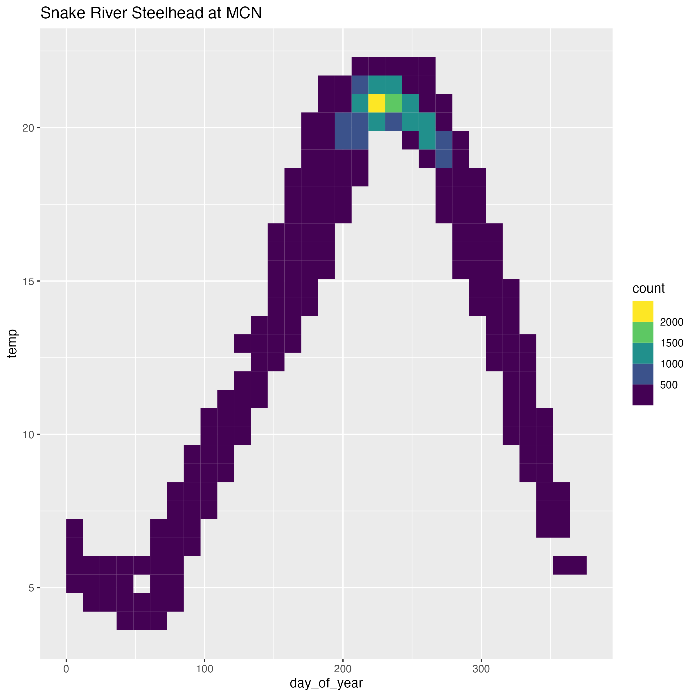
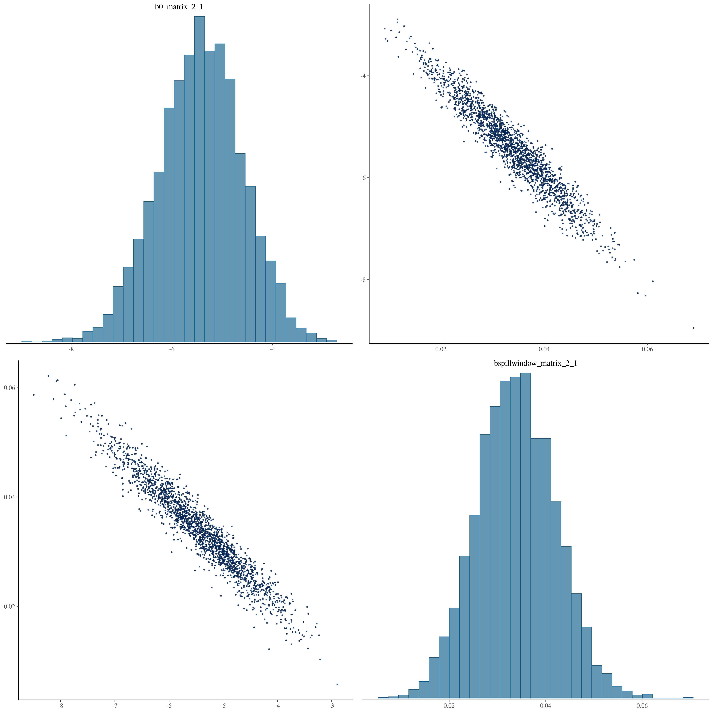
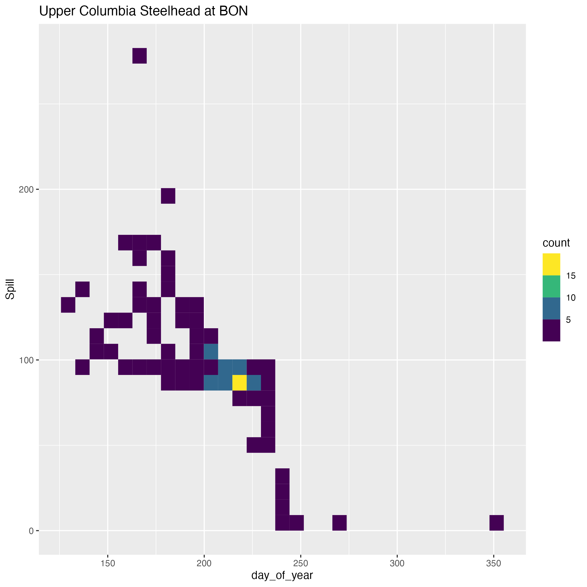

Here I show three diagnostics: [Convergence and efficiency], [Traceplots],
and [Pairs plots].

## Convergence and efficiency

From the [Stan documentation on convergence and efficiency diagnostics
for Markov Chains](https://mc-stan.org/rstan/reference/Rhat.html):

> The **Rhat** function produces R-hat convergence diagnostic, which
> compares the between- and within-chain estimates for model parameters
> and other univariate quantities of interest. If chains have not mixed
> well (ie, the between- and within-chain estimates don't agree), R-hat
> is larger than 1. We recommend running at least four chains by default
> and only using the sample if R-hat is less than 1.05. Stan reports
> R-hat which is the maximum of rank normalized split-R-hat and rank
> normalized folded-split-R-hat, which works for thick tailed
> distributions and is sensitive also to differences in scale.

> The **ess_bulk** function produces an estimated Bulk Effective Sample
> Size (bulk-ESS) using rank normalized draws. Bulk-ESS is useful
> measure for sampling efficiency in the bulk of the distribution
> (related e.g. to efficiency of mean and median estimates), and is well
> defined even if the chains do not have finite mean or variance.

> The **ess_tail** function produces an estimated Tail Effective Sample
> Size (tail-ESS) by computing the minimum of effective sample sizes for
> 5% and 95% quantiles. Tail-ESS is useful measure for sampling
> efficiency in the tails of the distribution (related e.g. to
> efficiency of variance and tail quantile estimates).

> Both bulk-ESS and tail-ESS should be at least 100 (approximately) per
> Markov Chain in order to be reliable and indicate that estimates of
> respective posterior quantiles are reliable.

In the plots below, I will show these three diagnostics for the models
run for each of our six populations.

 

 

 

 

## Traceplots

Given that each model is estimating hundreds of parameters, traceplots
for all parameters will not be shown here. Instead, traceplots for a few
parameters from each model will be shown here.

 

 

 

 

 

 

## Pairs plots

Pairs plots show univariate histograms and bivariate scatter plots for
selected parameters, and are especially useful for identifying
collinearity between variables (which manifests as narrow bivariate
plots) as well as the presence of multiplicative non-identifiabilities
(banana-like shapes).

For these pairs plots, I am showing all of the different parameters that
exist for a single movement (e.g., the intercept, origin, and
temperature parameters that govern the probability of a single movement,
such as ascending a specific dam). Again, there are too many movements
across the six models to show all of these plots, but I will show
examples of potential issues related to collinearity in our predictors.
A description of collinearity of predictors in regressions can be found
in the [Stan User
Guide](https://mc-stan.org/docs/stan-users-guide/collinearity.html).

The three potential issues that I observe related to collinearity are
the following: 

1. Collinearity between temperature and intercept parameters, for ascending mainstem dams: [Temperature and intercept collinearity]
2. Collinearity between intercept and origin parameters: [Intercept and origin collinearity]
3. Collinearity between intercept and spill parameters, for en-route fallback:[Intercept and spill collinearity]

 

### Temperature and intercept collinearity

 
 

  
 

For ascents of dams, particularly those that are downstream of natal
tributaries, the intercept parameter (*b0*) and the temperature
parameter (*btemp1*) that estimates the effect of river temperature
during summer/fall (Jun 1 - Dec 31) are highly negatively correlated.
Shown above are two pairs plots for the parameters that govern the
probability of ascending McNary Dam for Upper Columbia Wild Steelhead
and Snake River Hatchery Steelhead. As seen in the plots, *b0* and
*btemp1* are strongly negatively correlated, while *b0* and *btemp0*
(the effect of river temperature during winter/spring, Jan 1 - May 1)
are also negatively correlated.

My understanding of why this is happening is that this upstream movement
is the dominant movement out of this state (as reaching natal
tributaries for all fish from these DPSs requires ascending McNary Dam), and
this upstream movement is also happening when temperatures are highest
(in alignment with migration in the late summer/early fall). The
negative collinearity arises from the pattern that when the intercept
(*b0*) draw is low, the temperature (*btemp1*) draw must be high to
explain the high probability of that movement, and vice versa.

Interestingly, the parameter estimates for the effect of temperature on
ascending McNary Dam (a necessary movement for these fish to reach their
natal tributaries) indicate that warmer temperatures actually decrease
the probability of making this ascent, therefore making other movements
(such as movements into tribuatries like the Deschutes, or into the loss
state) more likely in warmer conditions.

Of course, temperature and day of year are strongly linked, as
seen by these plots showing counts of ascents of McNary Dam by day of year and
temperature, for Upper Columbia and Snake River Steelhead:

{width=50%}

 

{width=50%}

 
 

### Intercept and origin collinearity

For some movements there is a strong correlation between draws for the
intercept term and draws for the origin term. This collinearity actually
makes me want to restructure how we incorporate origin effects. To
explain, let's look at this pairs plot for Upper Columbia Wild Steelhead
(UCW), with the probability of descending Rocky Reach Dam (this is
moving from state 6, which is RRE to WEL, to state 5, which is RIS to
RRE).

 

 

For UCW, we have three origins: Wenatchee, Entiat, and Methow. For
Wenatchee Steelhead, this movement (falling back over Rocky Reach Dam) is beneficial (it represents
post-overshoot fallback); for Entiat and Methow, which have origins
above RRE, this movement is not desirable. To interpret these origin
parameters, a reminder of how these are included in the model: 

- Every fish gets an intercept term (this is *b0_matrix_6_5*) 
- Wenatchee fish are origin 1, which means they get *borigin1_matrix_6_5* in
addition to the intercept 
- Entiat fish are origin 2, which means they get *borigin2_matrix_6_5* in addition to the intercept 
- Methow fish receive -1 \* (*borigin1_matrix_6_5* + *borigin2_matrix_6_5*)

According to where their natal tributaries are, *borigin2_matrix_6_5*
should be **negative** for Entiat fish (they don't want to fall back),
but should be **positive** for Methow fish (because they also don't want
to fall back, but are affected by -1 \* *borigin2_matrix_6_5*). This
leads to the biologically nonsensical positive estimate for
*borigin2_matrix_6_5* that would imply that Entiat fish want to fall back over Rocky Reach (they dont't) seen in the pairs plot as well as the negative
correlation between this parameter and *b0_matrix_6_5*, as higher
positive values of *borigin2_matrix_6_5* require a more negative value
of *b0_matrix_6_5* in order to fit the observed pattern of Entiat River
fish not falling back.

I propose that we get rid of the intercept term, and instead have only
origin term when within DPS
boundaries. This would help fix those strange patterns. The new
structure would be as such: 

- No intercept term (*b0_matrix_6_5* is eliminated) 
- Wenatchee fish are origin 1, which means they get *borigin1_matrix_6_5* 
- Entiat fish are origin 2, which means they get *borigin2_matrix_6_5* 
- Methow fish are origin 3, which means they get *borigin3_matrix_6_5* (a new parameter)

### Intercept and spill collinearity

 

For fallback movements, especially for fallback over BON, the intercept
(*b0_matrix_2_1*) and spill window (*bspillwindow_matrix_2_1*)
parameters are negatively correlated, with a similar pattern as that
seen for the relationship between the *btemp* and *b0* parameters shown
above. Note that the estimate of the spill parameter is small, but this
is due to the fact that spill is not z-scored like temperature is,
because zero values for spill are meaningful - so the covariate
values that are being multiplied by the *bspill* parameters are about 100 times larger than the z-scored temperature value.

The same pattern is observed for spill as is observed for temperature:
fallback events occur primarily at high spill levels, but also with
distinct seasonality (these en-route fallback events are happening
primarily when fish have just ascended Bonneville Dam in late summer).
The negative collinearity arises from the pattern that when the
intercept (*b0*) draw is low, the spill (*bspillwindow*) draw must be
high to explain the observed movements, and vice versa.

{width=50%}

 
 

##### Pairs plots conclusions

The correlation between temperature + intercept and spill + intercept don't really concern me too much - the posteriors seem to be properly behaved. They just need to be interpreted as representing seasonality as much as they are representing the covariates themselves. The origin vs. intercept correlation and the estimates of some origin parameters indicates that the origin effects in the model should be restructured, as the parameter estimates don't make sense according to the biology of the populations.

Big picture: The correlation between parameters emphasizes that parameter estimates
cannot be interpreted in isolation. Instead, posterior predictive
estimates of movements are necessary to interpret the meaning of
parameters.
