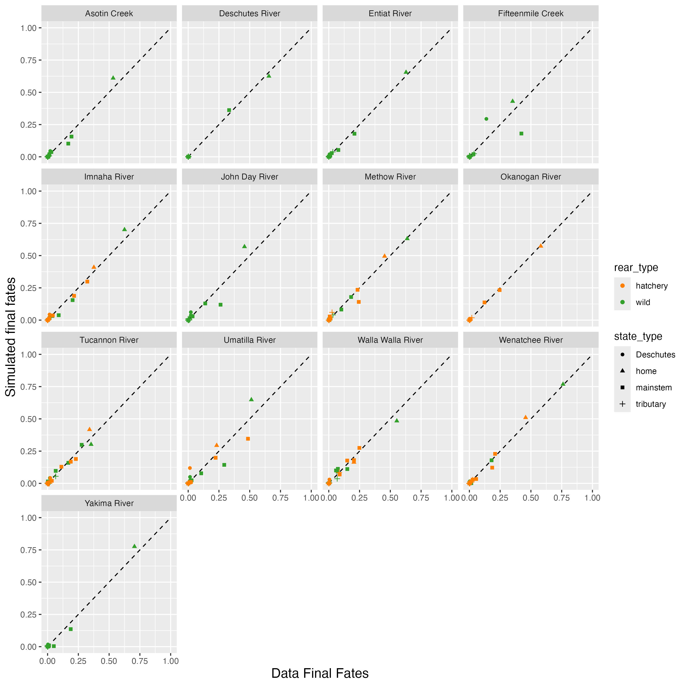
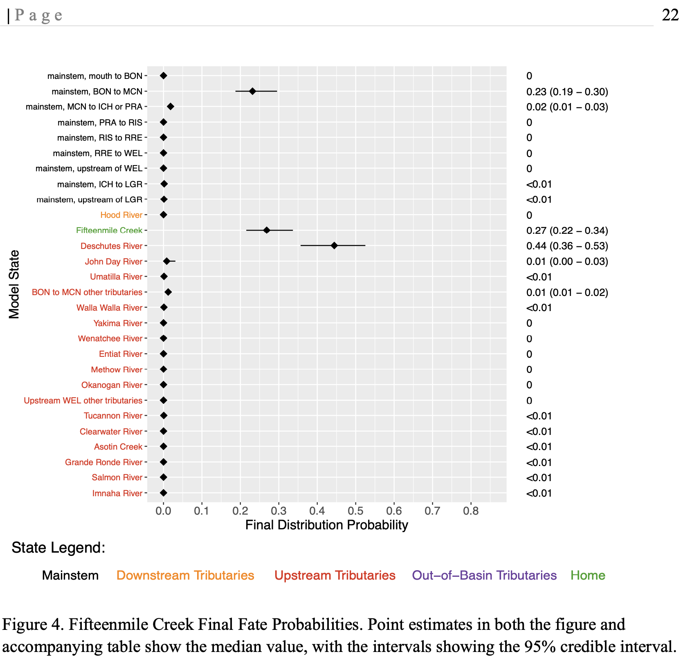
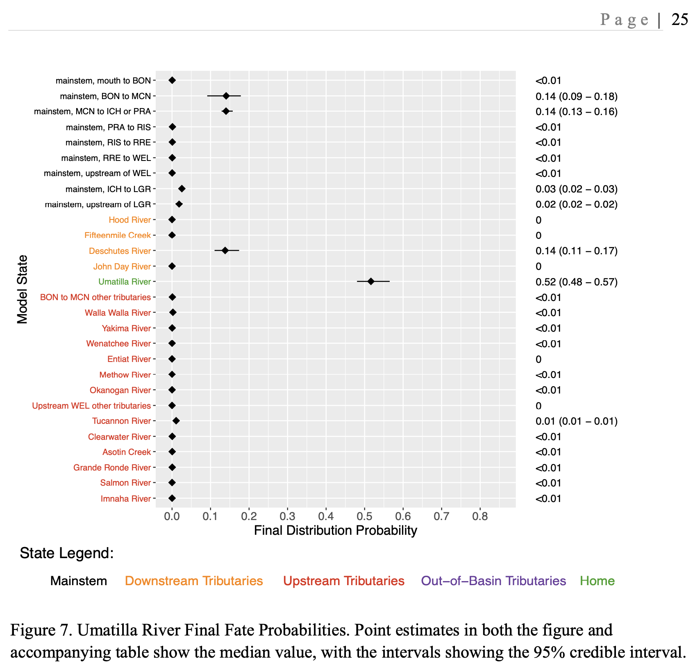
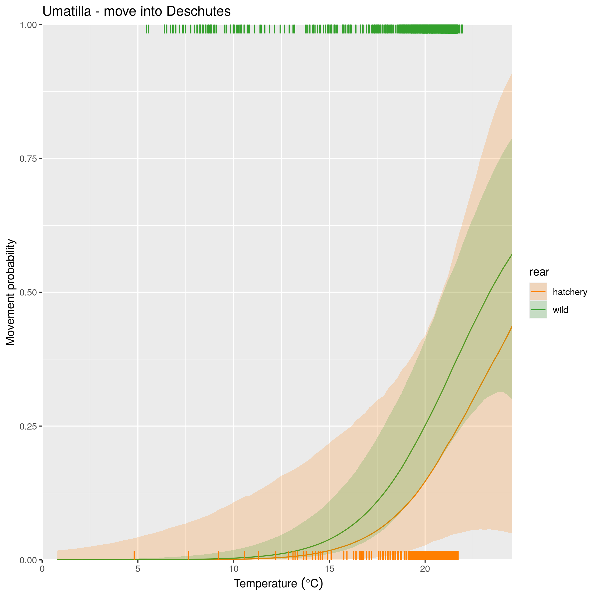
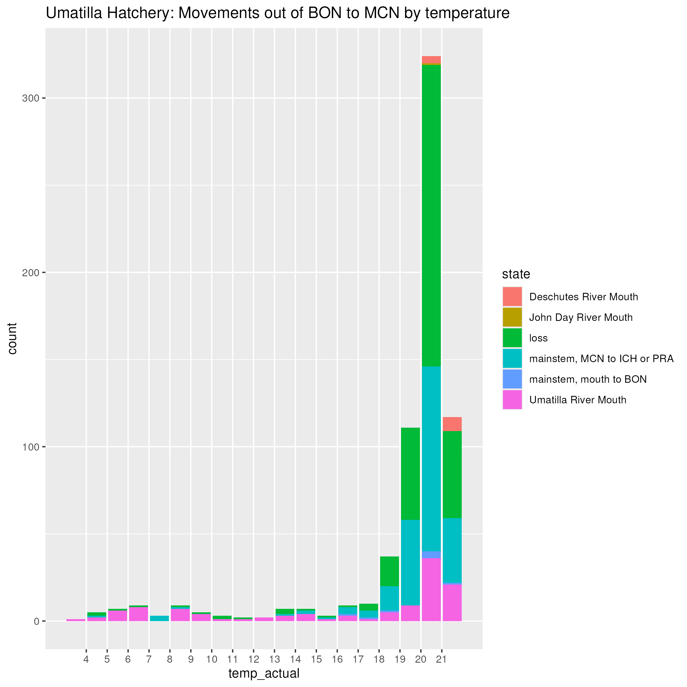

## Description

This page is where I document outstanding issues with either the model itself, or the code used to generate derived quantities. Currently, the primary issue that I see is that movement probabilities into the Deschutes River appear to be too high, particularly at high temperature values. This manifests itself in final fates in the Deschutes River that appear to be too high for many Middle Columbia populations.

### Deschutes River movement probabilities

To sanity check the final fates results, I have been comparing the simulated final fates of fish using our model estimated parameters to what is seen in the data. When visualizing final fates directly from the data, I have been looking at the final fates from years where the home tributary had the ability to estimate detection efficiency, as this is more representative of the data that the model is fitting than the years without the ability to estimate detection efficiency.

Below are the final fates from data compared to our simulation-generated values (this is the same plot as on the Final Fates tab). If you compare these figures to the final fates estimated by the model, the overestimation of straying into the Deschutes River is apparent for Middle Columbia populations, especially for Fifteenmile Creek and Umatilla River (hatchery) Steelhead.

{width=100%}

 
 

I went back to some of the old results from previous (and much simpler) versions of the model and discovered that this issue doesn't appear to only be related to including covariates in the model. Here are plots of the final fates from back when the model was an intercept-only model, and Fifteenmile Creek and the Umatilla River still have final fates in the Deschutes River overestimated:

{width=100%}

 

{width=100%}

 
 

Comparing our current final fates results to those derived from the intercept-only model, it appears that we've actually closer to fitting the data with a more complicated model. There's something weird going on that still requires investigation. Below are some fairly disjointed thoughts and things I've looked into but none of them have revealed a root cause...

## Investigations

A note on detection efficiency: Detection efficiency in the Deschutes River was one of the first things I thought of that might explain this pattern - but I don't think it is. Detection probability is shared across all populations within a DPS/rear type combination (that's how the model is set up), so if it was just a detection efficiency issue, it should affect all populations within the same DPS/rear type. But it's not - some origins look just fine, whereas others look severely overestimated.

 

I decided to plot all of the parameter values for all movements out of the BON to MCN state across all Middle Columbia populations. This plot is quite busy, but there are a few interesting patterns that emerge.

{width=100%}

- Fifteenmile Creek fish have the highest intercept for movements into the Deschutes River (see the left panel, orange dots for Fifteenmile Creek). This is a bit odd, but it's also worth remembering that movement probabilities are always governed by the relative values of the parameters. For example, Deschutes River fish have a negative intercept for movements into the Deschutes (their home state!), but of all of the intercept parameters, it's the highest - and the final fates for the Deschutes look fine.

 
 

If we then examine movement probabilities into the Deschutes River and compare them with the data, we observe that the estimated probability of movement into the Deschutes is not reflective of the data. For example, here is the plot of movement probability into the Deschutes for Umatilla Hatchery Steelhead, by temperature:

{width=70%}

 

And here is the plot of the data for that same movement, showing movement choices by temperature:

{width=70%}

 

As seen in the figure, movements into the Deschutes are not common at any of the observed temperatures, yet the model is estimating that the movement is quite likely at the upper range of temperatures. I haven't yet gotten to the bottom of why the model is not fitting this particular movement well.

