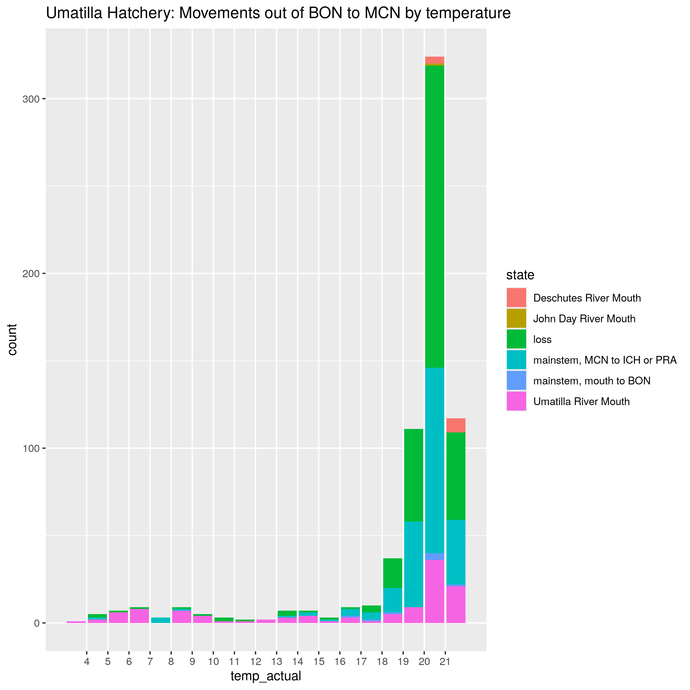
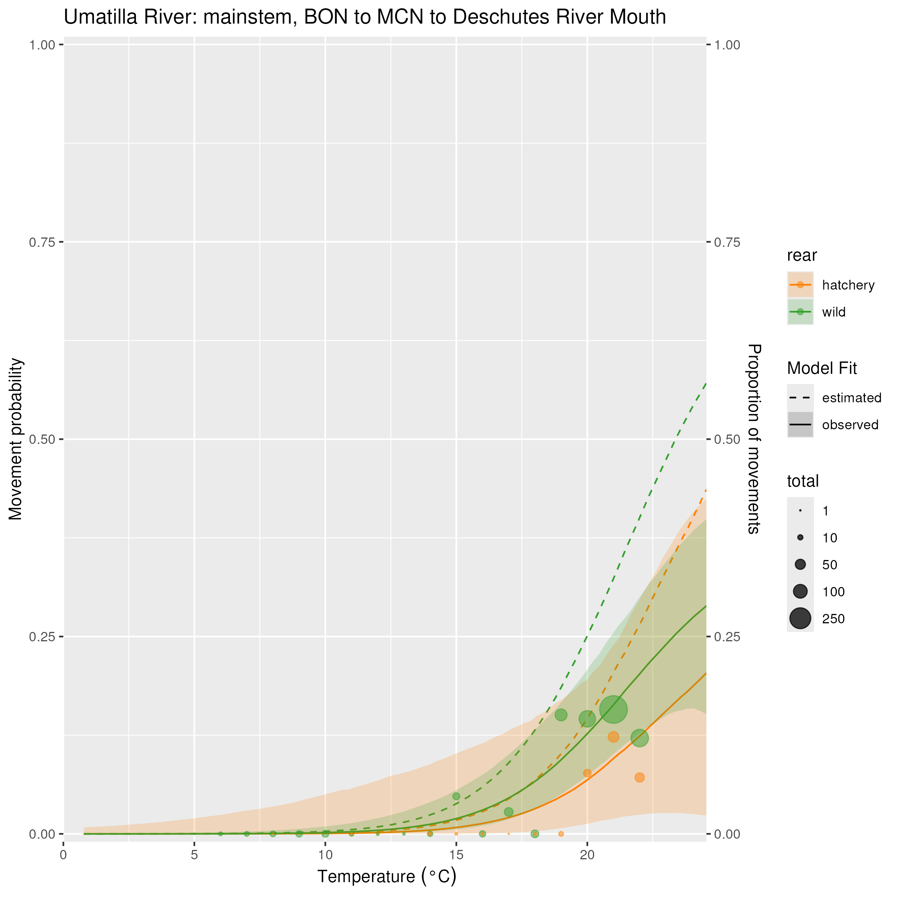

### Description

This page contains an update on my investigations into the disagreements between the final fates as simulated from the model-estimated parameters and the data on final fates. I also discuss fits to some individual movements (you can find fits to data for many other individual movements under the other results tabs). You can see my older thoughts on the other tab under this heading.

First, a reminder of the plot we examined that indicated disagreements between model and data:

{width=100%}

<br>

### 1) Comparing absolute differences between model and data doesn't really suggest where the model is not performing well. A better way to compare final fates performance is to look at the relative differences between data and model.

At a previous meeting, I said that I didn't think that detection efficiency was a factor driving the discrepancy between the model and data - which I now realize I was wrong about (more on that later). As evidence for this point, I noted that in the plot above we appear to only see issues with movements into the Deschutes for certain tributaries, namely Fifteenmile Creek, and detection efficiency should affect every movement into a tributary, regardless of natal origin. When examined at an absolute level (as in the plot at the top of the page), it is true that only certain origins appear to be problematic. However, looking at relative differences tells a different story:

{width=100%}

<br>


Here, we are showing sample size (counts) on the x-axis, and the ratio of final fates for the model-based simulation vs. the data on the y-axis. The majority of points across tributaries are clustered near the left end of the x-axis, which indicates the sample size of counts from the data. For many of the points that do have counts close to zero, I am not overly concerned about the degree of difference from the horizontal line at 1, since we would expect that with such small counts, we would naturally have a lot of variation due to the random nature of the simulation (law of small numbers etc.). 

<br>

If we look at the Deschutes final fates, you'll note that while final fates in the Deschutes are elevated relative to the data, the amount of this difference ranges from 2x (e.g., Fifteenmile Creek) to over 8x (Umatilla River Hatchery fish). However, you can see that for most origins, most of the relative differences are of a similar magnitude, indicating that origins like Fifteenmile Creek aren't singular outliers. So now that we have a more balanced view of the lay of the land, let's dive into the reasons for disagreements between the data and the model...

<br>

### 2) The difficulty of choosing "data" to evaluate the model and dealing with detection efficiency

Our statistical model can be thought of as an individual-based model, where each individual fish has unique characteristics (rear, origin), experiences a unique set of conditions (spill, temperature, year) based on when it is in different parts of the Columbia River Basin, and also encounters a changing set of arrays (i.e., can detection efficiency be estimated in this tributary in this year or not, and if so what does the model estimate detection efficiency to be?). As such, trying to compare model fits to data in the aggregate becomes tricky. Up to this point, I had been using a different set of data for each natal origin to compare to the final fates simulation, where I selected only run years in which the natal tributary was capable of estimating detection efficiency. This was a relatively good representation of the data, as we only selected years where we knew that movements into the natal tributary could be estimated with some reliability (and indeed, in the plots above you can see that homing typically shows a high degree of agreement between model and data). However, there were still some notable spots where the model and the data appeared to disagree, primarily with movements into the Deschutes River (above).

<br>

In the above plots, it is important to note that the data includes all of the state visits, including detections at both river mouth and at upstream sites in each tributary. In contrast, the data that the model is fit to (and therefore is used to generate the simulated final fates) does not include detections at upstream sites in tributaries, because these are removed after correcting for detection efficiency at the river mouth site. 

<br>

I had thought that comparing the data with both upstream and river mouth detections to the simulated final fates would be the most accurate, because I thought that I would be in effect addressing the detection efficiency correction. It turns out that this is only really true when assessing movements that go deep into tributaries (i.e., homing), not dip-in visits to non-natal tributaries. This is because for fish for moving into natal tributaries, far more fish continue past the river mouth state and are seen at upstream states than for fish for whom it is a non-natal tributary. In the following plot, I show the proportion of total detections in the Deschutes River at the mouth site, by natal origin:

{width=100%}

<br>

What you can clearly see is that for Deschutes River fish entering the Deschutes, there are far more detections at upstream sites (leading to a lower proportion of detections at the mouth site) than there are for other tributaries. The consequence of this is that when you use the total detections (upstream and downstream) in the Deschutes as the truth to compare the model to, it's basically only a good metric for evaluating model performance for Deschutes River fish. Below, I show how using all detections vs. only detections at the river mouth state changes what the truth looks like much more for homing fish than for other fish.

<br>

```{r, echo=FALSE,out.width="50%", out.height="50%",fig.cap="Final fates from data for Deschutes River fish, when all detections are considered (left) vs. only detections at the mouth site (right). Note the big difference in final fates in the mainstem vs. the Deschutes River due to imperfect detections at the river mouth site.",fig.show='hold',fig.align='left'}
knitr::include_graphics(c("site_figures/final_fates_from_data/Deschutes_River_final_fates_from_data.png",
                          "site_figures/final_fates_from_data/Deschutes_River_final_fates_from_data_no_upstream_trib.png"))
``` 

<br>

```{r, echo=FALSE,out.width="50%", out.height="50%",fig.cap="Final fates from data for Fifteenmile Creek fish, when all detections are considered (left) vs. only detections at the mouth site (right). Note that these figures don't look much different.",fig.show='hold',fig.align='left'}
knitr::include_graphics(c("site_figures/final_fates_from_data/Fifteenmile_Creek_final_fates_from_data.png",
                          "site_figures/final_fates_from_data/Fifteenmile_Creek_final_fates_from_data_no_upstream_trib.png"))
``` 

<br>

*One quick note on what this means for interpretation: When interpreting final fates in tributaries, the fact that detections in the Deschutes by non-Deschutes fish are almost all at the mouth site indicates that these non-natal fish are probably not actually spawning there (and therefore may not contribute to straying).*

<br> 

What you can see here is that when you drop detections at upstream sites, it drastically changes the final fates from data for Deschutes River fish, but makes almost no difference to Fifteenmile Creek fish. So clearly, looking at all detections in a tributary is not a consistent way to gauge "the truth" across fish from different origins. That leads us to our next point:

<br>

#### 2.1) A better way of looking at the truth incorporates detection efficiency, but this is non-trivial...

Let's return to the Deschutes River detection efficiency plot, seen below:

{width=50%}

<br>

The Deschutes River mouth site has quite a poor detection efficiency (one of the worst across all the tributaries). Given that detection efficiency is about 50%, and detections in the Deschutes River for Fifteenmile Creek fish are almost all at the mouth site, we would expect that the model would estimate final fates that are about twice as high as the data indicates... which is exactly what we see in the relative differences plot (second on this page). Note that when looking at that plot, we see that our hypothesis that model estimated final fates in the Deschutes River should be approximately twice that of the data for all origins except the Deschutes River is supported across tributaries.

<br>

This does point to using some combination of data + detection efficiency to estimate the "truth" against which to compare the model outputs. The best way that I have figured out how to do this is to take the estimated detection efficiency and use that to back-calculate what the model would estimate in the absence of a detection efficiency correction - in essence, factoring out the detection efficiency from the overall likelihood. What we have been showing in our various plots, and what we are using to estimate final fates, is our best estimate of the truth (I typically refer to this as the "actual" movement probability, or "actual" final fates). However, in our likelihood statement in the model, the way we fit to the data is to say that P(data) = P(actual) * P(detection). So, if we take the actual values and multiply by the probability of detection, we arrive at what our model would estimate in the absence of a detection efficiency correction, i.e, what our model thinks that the data should look like.

<br>

The difficulty with implementing this approach is that we have a different detection efficiency estimated for each year. The solution I have implemented is to look at fits to data across years is to get a weighted average of detection efficiency in a tributary across all years; that is, I take the counts of fish moving into a tributary for each year as the weight for the estimated detection efficiency for that year. At the scale of individual movements, this is relatively simple to implement. However, at the scale of the final fates simulation, this becomes much more complicated (which is why I have not yet tried to implement it, but I could probably figure out how, if we think it is worth the effort).

<br> 

Here is an example where we can examine the fit to data, in this case, the probability of Fifteenmile Creek fish entering the Deschutes under different temperature values. As you can see, the model estimated fit (this is the model's best guess at what the truth is) is far higher than the model prediction for the observed data (note that this fits the points much better):

<br>

{width=75%}

<br>

Given this, I feel confident that the model is actually doing a good job estimating movements into the Deschutes, once we account for the poor detection efficiency in this tributary. Based on the detection efficiency being around 50%, we would expect the model to estimate about twice the final fates in the Deschutes as the data, which is more or less what we see. However, as noted above, not all origins have twice as many final fates in the Deschutes from the model compared to the data - some have much more (for example, the Umatilla showing 8.5 times as many final fates from the model compared to the data). That has a different explanation (that thankfully again points to the cause for the discrepancy being the data plotted, rather than the model being misspecified):

<br>

### 3) Deciding what data to subset to fit to movements

<br>

For Umatilla hatchery fish, there are 8.5 times more fish ending up in the Deschutes in our simulation than from the data that we plotted. In terms of proportions of final fates, we're seeing 12% of Umatilla hatchery fish in the simulation ending in the Deschutes, whereas in the data it's 1.4%. From the above section, we know that once we account for detection efficiency, we should expect about twice as many final fates in the Deschutes from the model than from the data. For the rest of the discrepancy, I realized that this was priamrily due to how we were subsetting the data. By selecting only years where the natal tributary had a detection efficiency correction, we were ignoring which years in the Deschutes had the ability to estimate detection efficiency. For the Umatilla River, that's 2007-2022. For the Deschutes, that's only 2013-2019. This big discrepancy meant that we were using lots of years where the Deschutes had no river mouth site (2007-2012, and 2020-2022) as the truth against which to evaluate movements into the Deschutes.

<br>

Let's compare two plots - this first plot is from the older tab under Outstanding issues that shows movements out of the mainstem for Umatilla Hatchery fish:

<br>

{width=70%}

<br>

Yeah, that looks pretty bad! There are essentially no movements into the Deschutes across all years. But check out this second plot, where we subset only the years 2013-2019 (the years where we have a river mouth site in the Deschutes):

{width=70%}

<br>

If you look at this point, and then consider that we estimate that about half of the detections in the Deschutes are missed, suddenly our final fates estimate of 12.5% of Umatilla hatchery fish ending up in the Deschutes sounds pretty reasonable. And now, if we plot our model estimated movements by Umatilla fish into the Deschutes vs. temperature, where again we only plot the data that comes from 2013-2019, our model fit looks pretty good:

<br>

{width=75%}

<br>

#### Conclusion: The model is fitting the data well!

