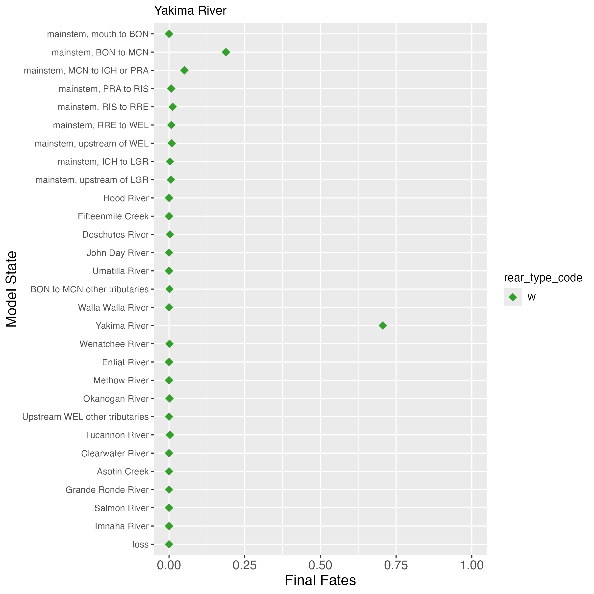

## Description

This page is where I document outstanding issues with either the model itself, or the code used to generate derived quantities. Currently, the primary issue that I see is that movement probabilities into the Deschutes River appear to be too high, particularly at high temperature values. This manifests itself in final fates in the Deschutes River that appear to be too high for many Middle Columbia populations.

### Deschutes River movement probabilities

To sanity check the final fates results, I have been comparing the simulated final fates of fish using our model estimated parameters to what is seen in the data. When visualizing final fates directly from the data, I have been looking at the final fates from years where the home tributary had the ability to estimate detection efficiency, as this is more representative of the data that the model is fitting than the years without the ability to estimate detection efficiency.

Below are the final fates from data, for the six Middle Columbia populations. If you compare these figures to the final fates estimated by the model, the overestimation of straying into the Deschutes River is apparent, especially for Fifteenmile Creek and Umatilla River (hatchery) Steelhead.

{width=70%}

 
 

{width=70%}

 
 

{width=70%}

 
 

{width=70%}

 
 

{width=70%}

 
 

{width=70%}

 
 

If we then examine movement probabilities into the Deschutes River and compare them with the data, we observe that the estimated probability of movement into the Deschutes is not reflective of the data. For example, here is the plot of movement probability into the Deschutes for Umatilla Hatchery Steelhead, by temperature:

{width=70%}

 

And here is the plot of the data for that same movement, showing movement choices by temperature:

{width=70%}

 

As seen in the figure, movements into the Deschutes are not common at any of the observed temperatures, yet the model is estimating that the movement is quite likely at the upper range of temperatures. I haven't yet gotten to the bottom of why the model is not fitting this particular movement well.

