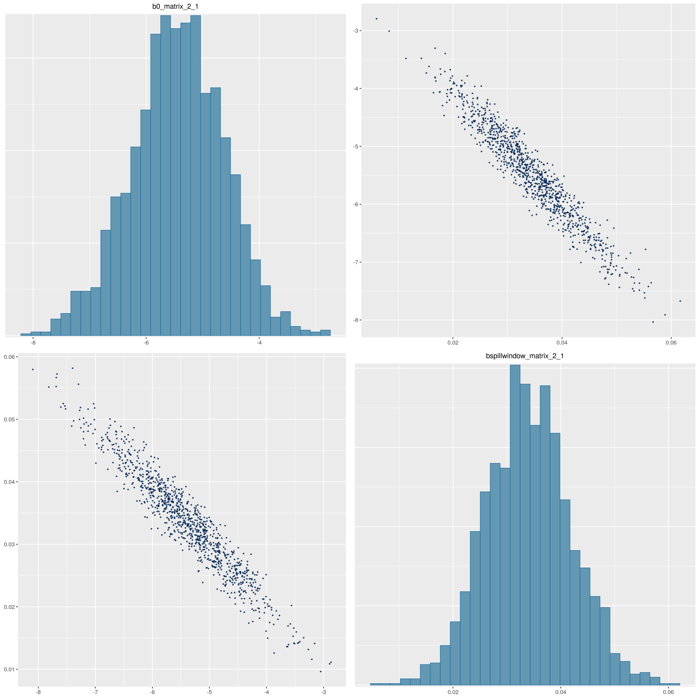
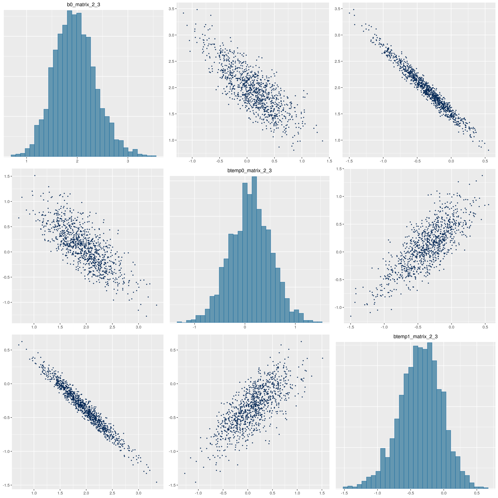
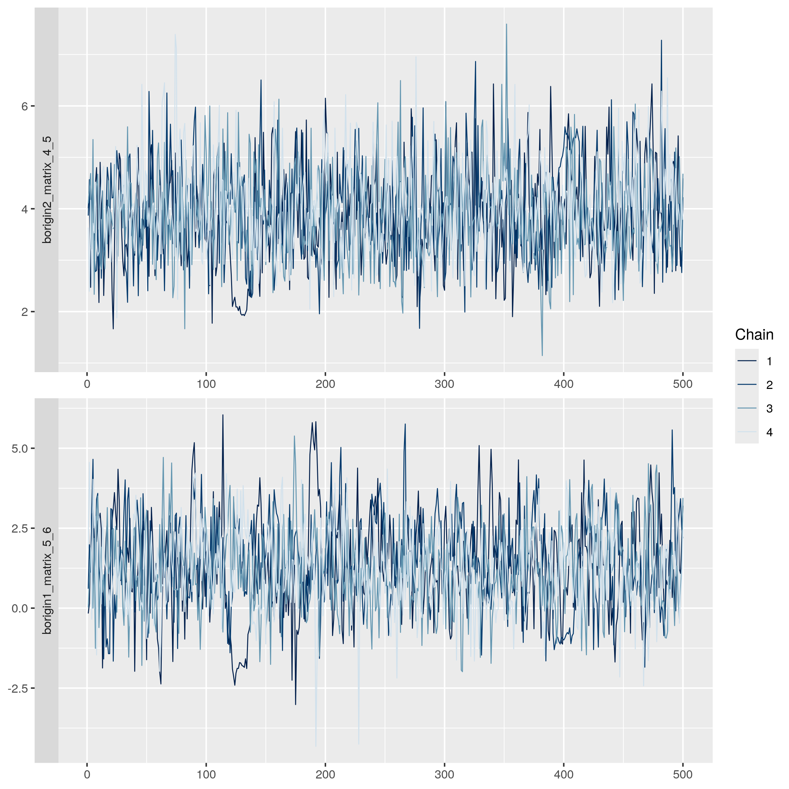
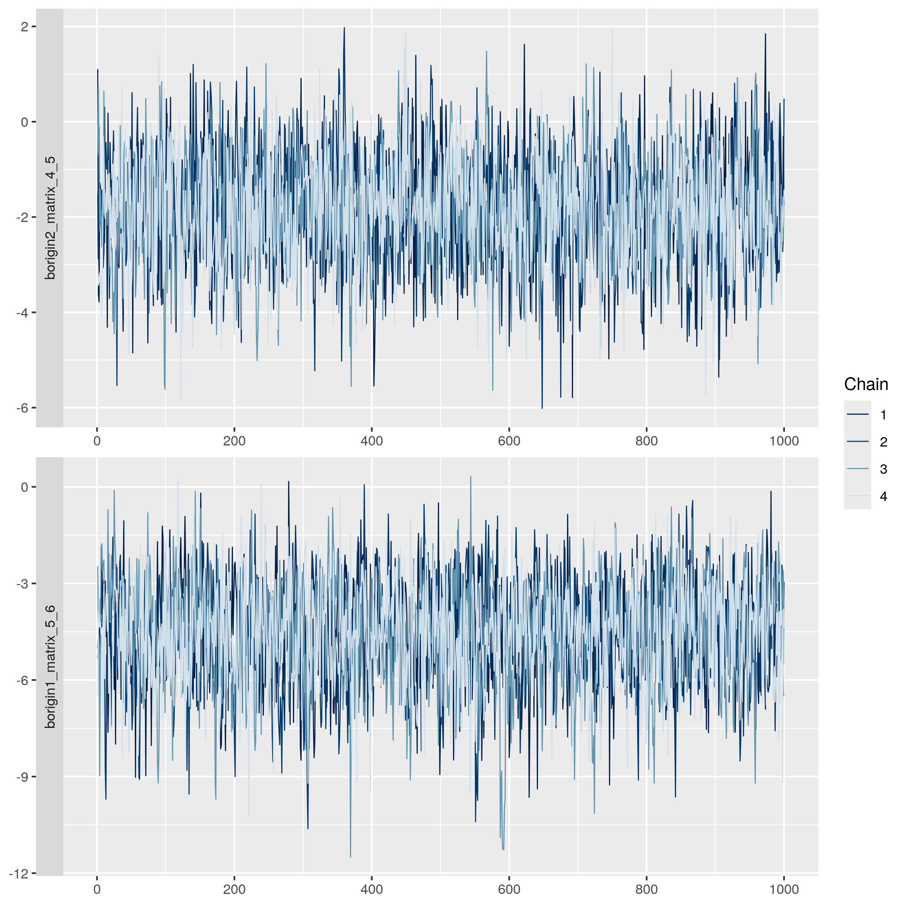

## Description
This page describes the version of the model that is currently in development. Because of limited available computing power (Hyak has been undergoing a lot of maintenance this month), I have thus far only been able to run the model for one population (Upper Columbia Wild Steelhead), with shorter chains (1000 warmup + 1000 sampling, rather than the 2000 warmup + 2000 sampling I ran with the last version of the model). However, the model code has been written for all populations, with jobs waiting in the queue on Hyak that will run once maintenance is completed sometime mid-April.

As explained in the Diagnostics tab, I am currently restructuring how origin and intercept terms are handled in the model to try to resolve some of the nonsensical origin estimates, and code the model so that it more directly tests our hypothesis that fish of different natal origins have different movement probabilities as they near their natal origins. The changes that are being made in this model are the following:

1. When a fish enters the boundaries of its DPS, the intercept term is eliminated. This makes it so that fish of one population (DPS x rear type) share movement probabilities when outside the boundaries of their DPS, but do not share common movement probabilities within their DPS.
2. Within DPS boundaries, fish of each natal origin receive an origin effect that functions as an intercept term.

## Upper Columbia Wild Diagnostic Statistics
To facilitate comparisons between this version of the model and the last version, thinning is the same (thin = 2). Note that because of the shorter chains run for this version of the model, niter = 2000 (500 post-thin sampling iterations x 4 chains).

#### R-hat

 
 

#### Effective Sample Size

![Bulk Effective Sample Size (bulk-ESS). bulk-ESS should be at least 100 in order for posteriors to be reliable, but a bulk-ESS greater than the number of draws (which in this case is 4 chains x 500 iter) indicates anticorrelation between draws, which reduces the reliability of the variance estimate. bulk-ESS indicates that all parameters have a sufficient sample size, but a handful of parameters exhibit a slight degree of anticorrelation (bulk-ESS \> 2,000). This distribution is very similar to the old model. ](site_figures/restructured_origin_effects/conv_eff/UCW_restructured_ess_bulk_plot.png)

 
 

![Tail Effective Sample Size (tail-ESS). tail-ESS should be at least 100 in order for posteriors to be reliable, but a tail-ESS greater than the number of draws (which in this case is 4 chains x 500 iter) indicates anticorrelation between draws, which reduces the reliability of the variance estimate. tail-ESS indicates that all parameters have a sufficient sample size, and no parameters exhibit anticorrelation (tail-ESS \< 2,000 for all parameters). This distribution is again quite similar to the old model.](site_figures/restructured_origin_effects/conv_eff/UCW_restructured_ess_tail_plot.png)

 
 

#### Pairs plots: Intercept and origin collinearity

As this was the issue we sought to resolve with the restructured origin effects,
I will present the same pairs plots as were shown for the last model.

 

 

The changes that were made to how the origin effects were structured are as follows:

- No intercept term (*b0_matrix_6_5* is eliminated) 
- Wenatchee fish are origin 1, which means they get *borigin1_matrix_6_5* 
- Entiat fish are origin 2, which means they get *borigin2_matrix_6_5* 
- Methow fish are origin 3, which means they get *borigin3_matrix_6_5* (a new parameter)

As we can see in the pairs plot, there is no longer strong collinearity between parameters, and there are no biologically nonsensical estimates. The *borigin1_matrix_6_5* parameter is positive, which makes sense, as Wenatchee River fish would want to fall back over RRE. The *borigin2_matrix_6_5* parameter is more or less zero, which is also plausible, as this is not a desirable movement for Entiat River fish. Finally, the *borigin3_matrix_6_5* parameter is strongly negative, as Methow River fish need to ascend another dam, and therefore have a very low probability of falling back over RRE.

#### Pairs plots: Intercept + spill / Intercept + temperature collinearity

For the sake of consistency, below are the two pairs plots that I show on the Diagnostics tab (which has the old model results). These look basically exactly the same, which is to be expected given that these movements are occuring downstream of the DPS and therefore aren't affected by the restructuring of origin effects.

 
 

#### Traceplots

Here I plotted traceplots for the two origin effects in the restructured model that had the worst ESS.

 
 

And here, the traceplots for those same two origin effects in the old model:

 
 

The new traceplots are a bit worse, with some autocorrelated runs, especially in chain 1. However, the longer chains in the old model are also making those traceplots look a bit better because they're more squished.

 

### Other thoughts

As seen in the pairs plots above, we are now getting more biologically sensible (and easier to interpret) estimates of origin effects. 

One consequence of the new structure for for the performance/diagnostics of the model is that there are now less data points for each of the origin effects. Previously, each origin parameter was influenced by fish of two origins: origin1 was influenced by Wenatchee (+) and Methow (-), and origin2 was influenced by Entiat (+) and Methow (-). Now, origin1 is influenced by Wenatchee fish only, origin2 is influenced by Entiat fish only, and origin3 is influenced by Methow fish only. This has the consequence of basically cutting in half the number of data points for each of these terms. As a reminder, these are the sample sizes we have for these three populations:

- Wenatchee (Wild): 406
- Entiat (Wild): 499
- Methow (Wild): 358

This may be one reason for the slightly worse diagnostics.

Conclusions:

- More plausible origin effects
- Slightly worse diagnostic statistics, but nothing that compromises the reliability of model estimates
- Plan to move ahead with this version of the model, and run for all populations

