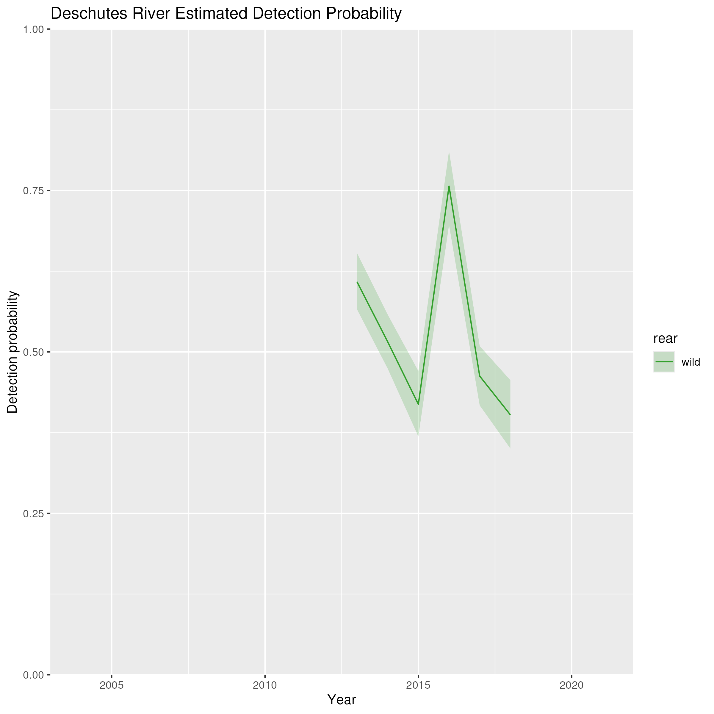
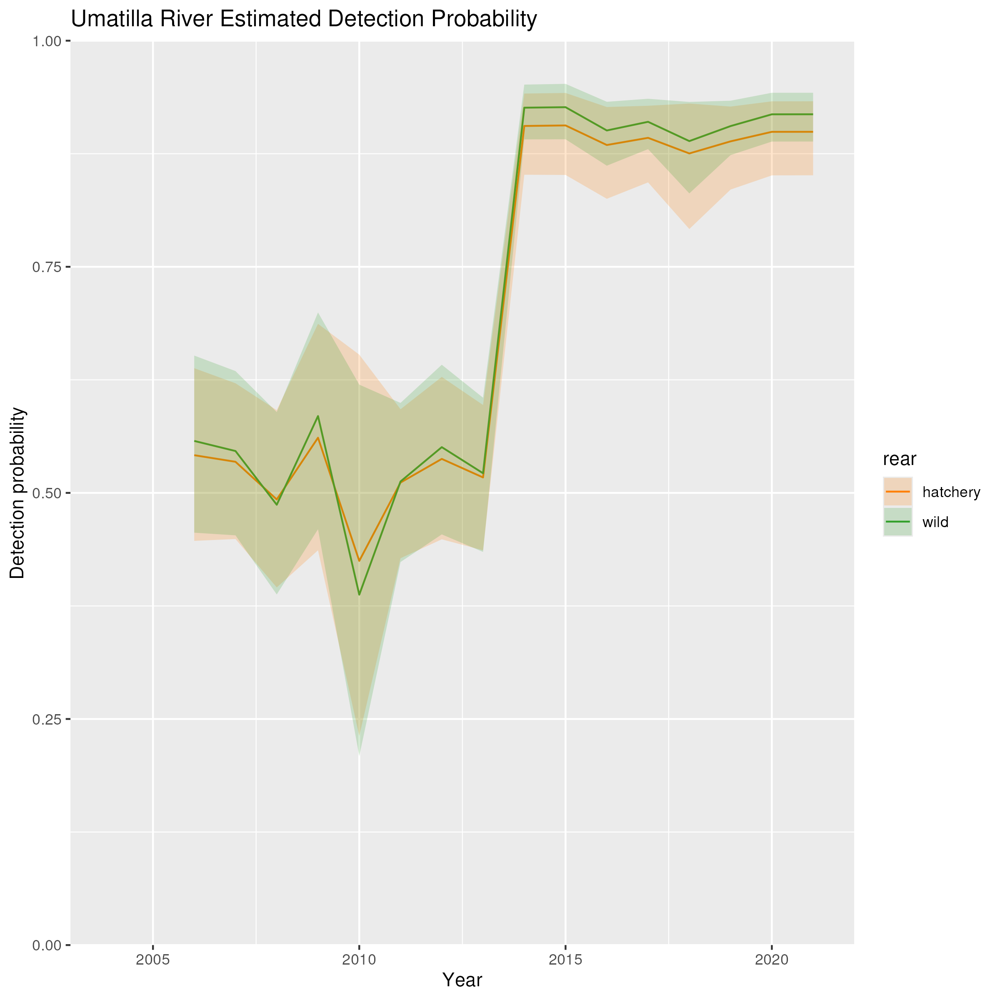
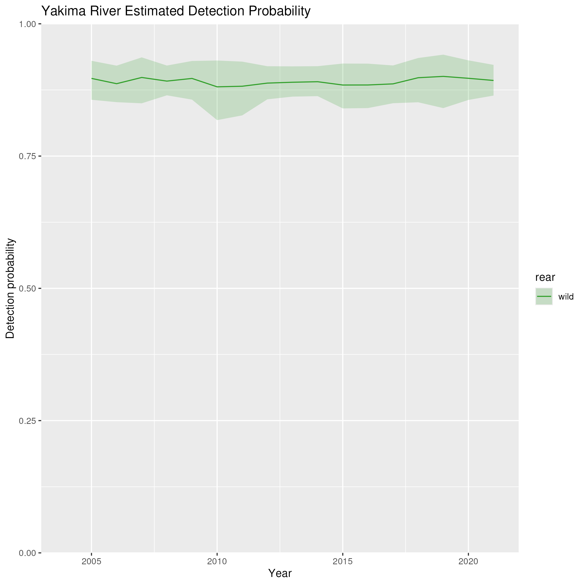
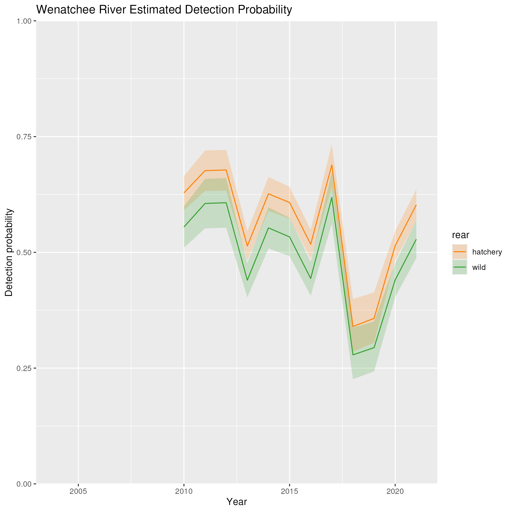
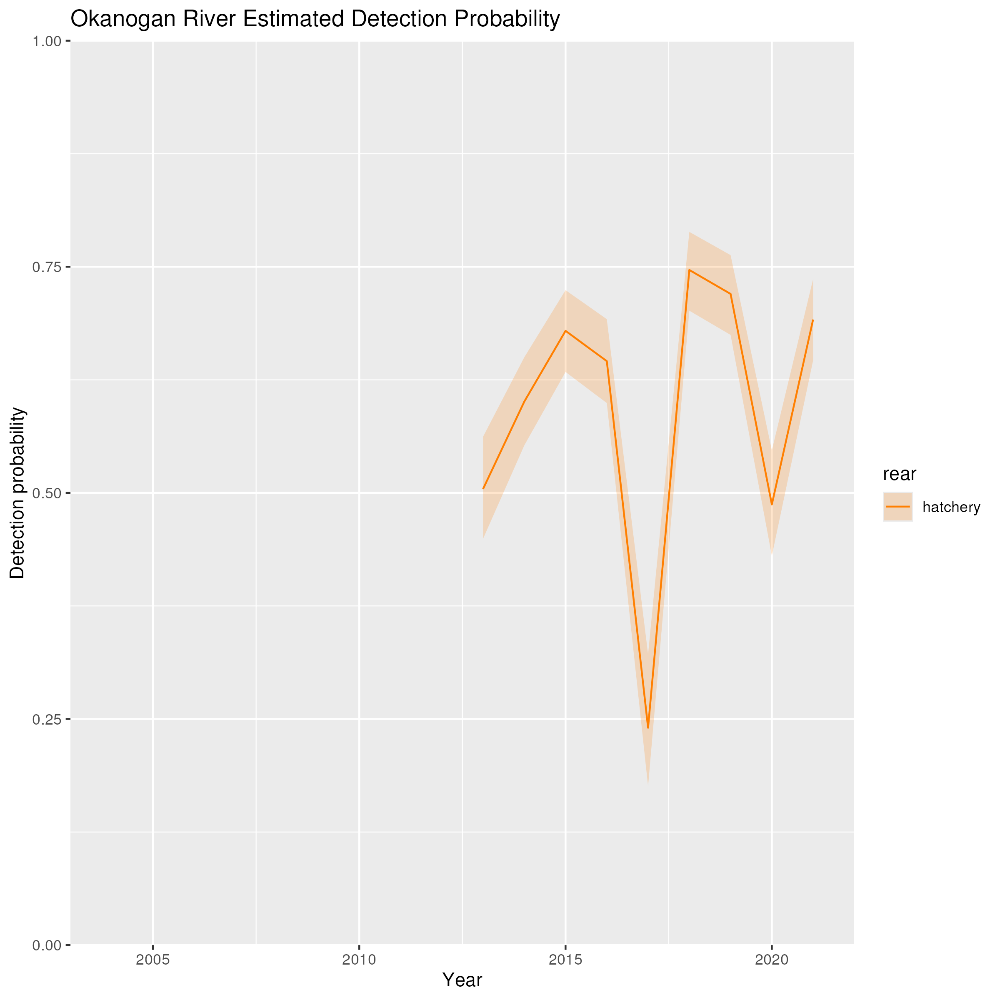
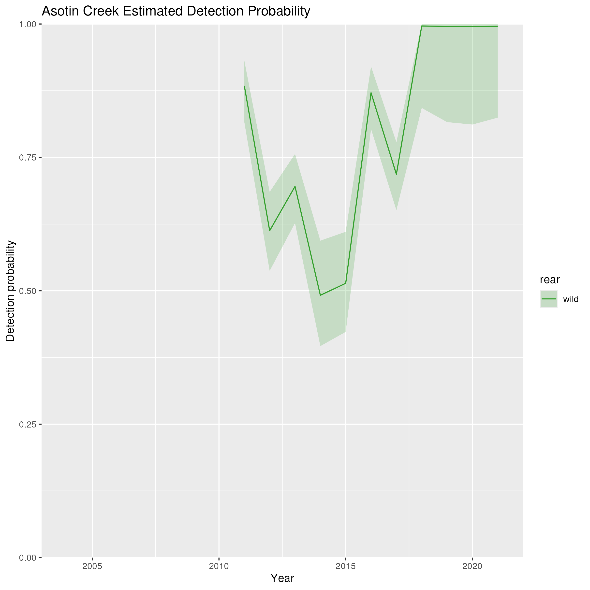
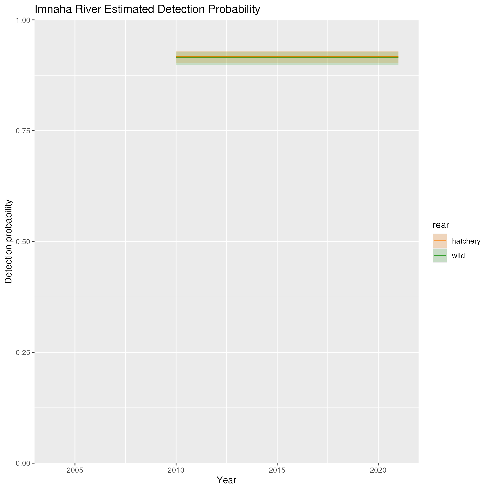

## Description

This page shows the estimated detection efficiency for each tributary by year. As a reminder, detection efficiency is modeled in a two step process:

1. A model is fit to estimate the detection efficiency of the river mouth array for each tributary for a which a river mouth array and some upstream arrays are available. Detection efficiency is modeled as a function of an intercept term (where some tributaries have different intercept terms depending on the year, to account for changing array configurations) and discharge. Note that because Fifteenmile Creek and the Imnaha River did not have discharge data available, they were modeled with only an intercept term (and therefore, detection efficiency does not vary over time)
2. The posteriors from the previous model are then used as priors for the same terms in the full model, where movements throughout the basin are modeled. Note that because hatchery and wild populations were fit in separate models, the posteriors for the detection efficiency from each model are slightly different. 

#### Middle Columbia

 
 

{width=50%}

 
 

{width=50%}

 
 

{width=50%}

 
 

{width=50%}

 
 

{width=50%}

 
 

{width=50%}

#### Upper Columbia

{width=50%}

 
 

{width=50%}

 
 

{width=50%}

 
 

{width=50%}

#### Snake River

{width=50%}

 
 

**Detection efficiency cannot be estimated for the Clearwater River.**

 
 

{width=50%}

 
 

**Detection efficiency cannot be estimated for the Grande Ronde River.**

 
 

**Detection efficiency cannot be estimated for the Salmon River.**

 
 

{width=50%}

 
 