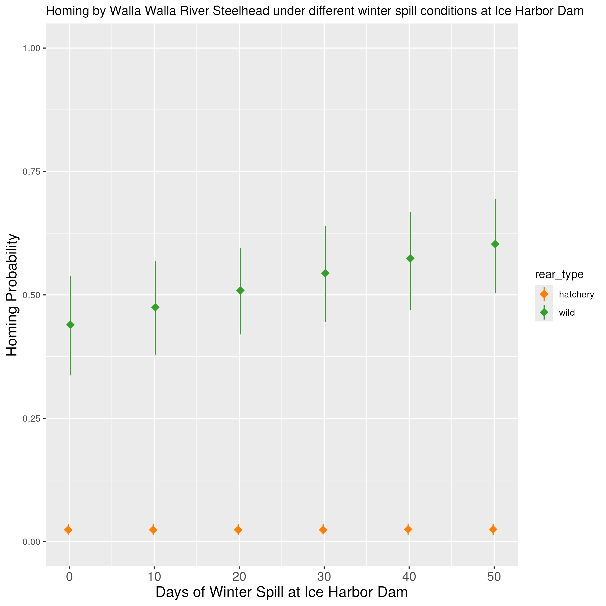

## Description

This page will contain how final fates are affected by different covariate values (in particular, spill and temperature). This allows us to understand the overall impact of these changes, when the whole migration is taken into account.

### Winter spill

NOTE: The following plot is accurate for wild, but not hatchery Steelhead. There was a typo in the simulation code for hatchery fish where the incorrect origin effects were assigned (leading to a very low overall probability of homing for hatchery fish).

{width=70%}

 
 

As a reminder, here is the plot showing the effect of winter spill on fallback at Ice Harbor Dam for this population:

{width=70%}