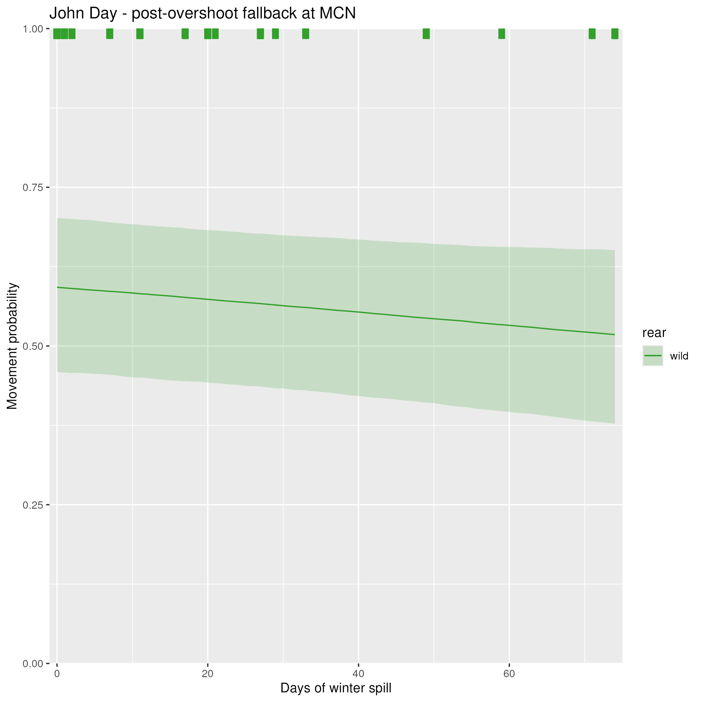
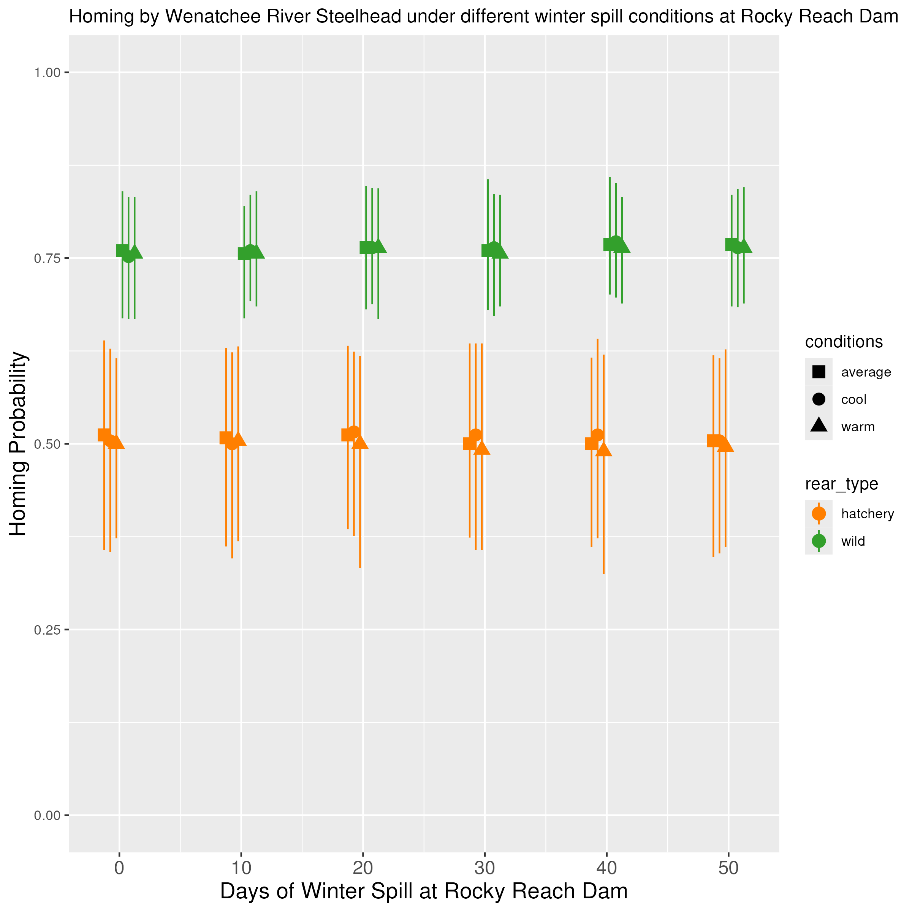
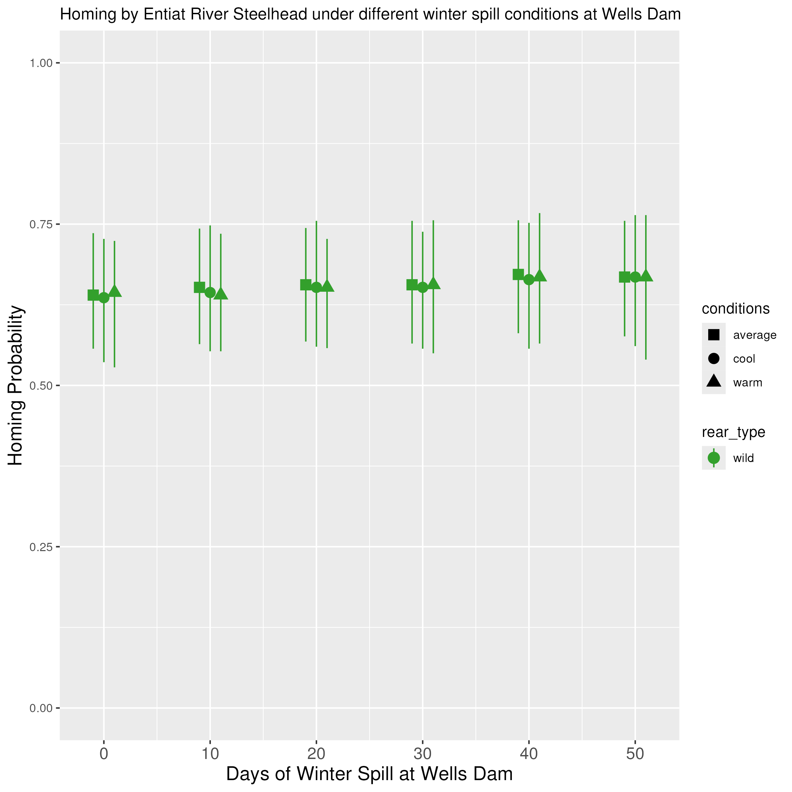
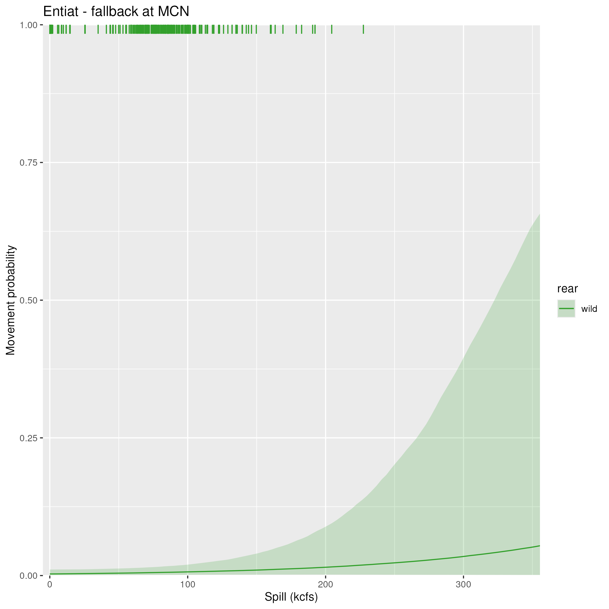

## Description

This page contains how final fates are affected by different covariate values (in particular, spill and temperature). This allows us to understand the overall impact of these changes, when the whole migration is taken into account.

### Simulation steps

The code used to estimate the effect of covariate conditions on the final fates of fish is very similar to the code used to estimate the final fates of fish under different conditions. The only addition to the final fates code are additional arguments that allow conditions to be fixed. Conditions were fixed using the following methods:

*Temperature conditions*

To examine the effect of temperature, simulations were conducted using different run years as representative of cool (25th percentile), average (50th percentile), and warm (75th percentile) conditions. Based on this criteria, the run years that were chosen as representative were 08/09 (cool), 19/20 (average), and 17/18 (warm). The coldest year in our dataset is 07/08, and the hottest year in our dataset is 15/16. Here are the median temperatures across run years:

{width=70%}

 
 

*Winter spill conditions*

The number of winter spill days at the first overshoot dam were fixed to a sequence of values ranging from 0 to 50 days, with the simulation re-run at each of those values.

*Spill volume*

To test the effects of spill volume on homing probability, the simulation is set up to allow the spill volume over specific date ranges at specific projects to be fixed. While the model is not time-explicit, the simulation is set up to use the distribution of movement timing in different states to estimate the proportion of fish that would encounter these spill conditions.

## Winter spill

For the effects of winter spill, we are focusing on the following origins, which each have high overshoot probabilities:

	- John Day River (55% MCN, 14% ICH)
	- Umatilla River (40% MCN, 8% ICH)
	- Walla Walla River (52% ICH, 21% LGR)
	- Wenatchee River (47% RRE, 31% WEL)
	- Tucannon River (44% LGR)
	- Entiat River (35% WEL)
	- Yakima river (13% PRA)

These are also the populations that Shelby looked at, using the following criteria:

> Because steelhead located further than 120 rkm from the nearest upstream dam with adult detectors overshot at negligible rates (i.e., <5%), we only used regression analyses to evaluate within-stock effects for steelhead from tributaries less than 120 rkm downstream of a dam where overshooting could be measured. These included steelhead from the John Day, Umatilla, Walla Walla, Yakima, Wenatchee, Entiat, and Tucannon rivers. (Richins and Skalski 2018)

#### John Day River ####

{width=70%}

 
 

As a reminder, here is the plot showing the effect of winter spill on fallback at McNary Dam for this population:

{width=70%}

 
 

#### Umatilla River ####

{width=70%}

 
 

As a reminder, here is the plot showing the effect of winter spill on fallback at McNary Dam for this population:

{width=70%}

 
 

#### Walla Walla River ####

{width=70%}

 
 

As a reminder, here is the plot showing the effect of winter spill on fallback at Ice Harbor Dam for this population:

{width=70%}

 
 

#### Wenatchee River ####

{width=70%}

 
 

As a reminder, here is the plot showing the effect of winter spill on fallback at Rocky Reach Dam for this population:

{width=70%}

 
 

#### Tucannon River ####

{width=70%}

 
 

As a reminder, here is the plot showing the effect of winter spill on fallback at Lower Granite Dam for this population:

{width=70%}

 
 

#### Entiat River ####

{width=70%}

 
 

As a reminder, here is the plot showing the effect of winter spill on fallback at Wells Dam for this population:

{width=70%}

 
 

#### Yakima River ####

 
 

{width=70%}

 
 

As a reminder, here is the plot showing the effect of winter spill on fallback at Priest Rapids Dam for this population:

{width=70%}

 
 

## Spill volume

{width=70%}

 
 

As a reminder, here is the plot of spill volume vs. fallback probability at Bonneville Dam for John Day River Steelhead (and remember that the effect of spill volume on fallback is shared across origins within the same DPS).

{width=50%}

 
 

{width=70%}

 
 

Here are the plots of spill volume vs. fallback at Bonneville and McNary Dam for Entiat River Steelhead.

{width=50%}

 
 

{width=50%}
