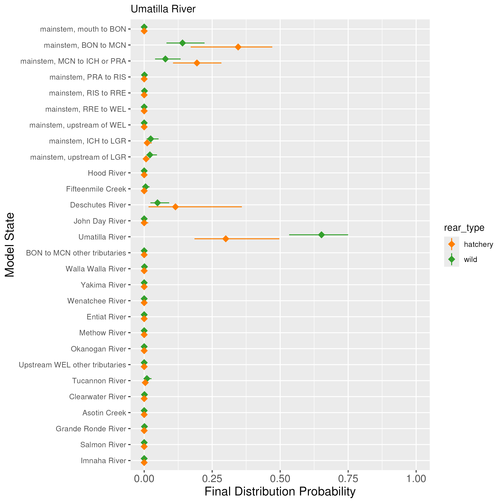
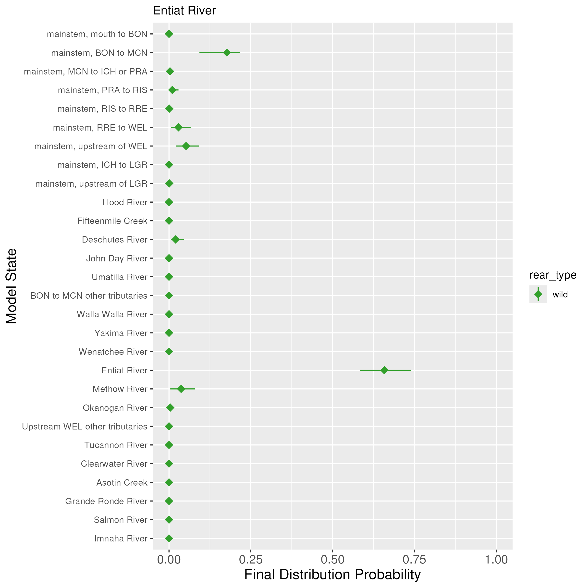
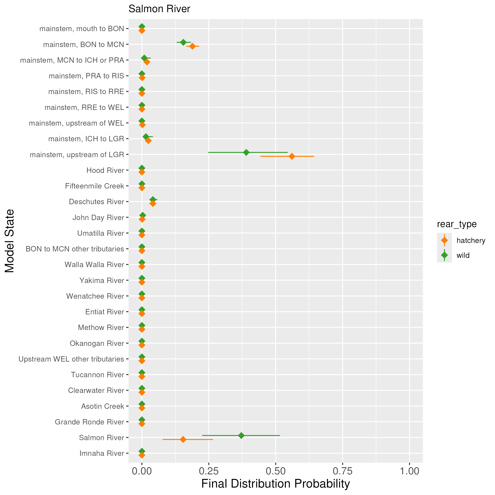

### Description

This page contains the results for the final fates simulation, using the fitted model object. 


### Simulation steps

For each combination of origin and rear type, the following steps were run:

1. Extract the median covariate values experienced by all fish in the dataset (for spill window, winter spill days, and temperature). For spill window and temperature, these median values are separately estimated for fish moving upstream (previous state a downstream mainstem state) and for fish moving downstream (previous state an upstream mainstem state or a tributary). These values are then used in the simulation.
2. Randomly select one iteration from the model (one set of draws for all parameters). When given the choice, parameters corrected for detection efficiency were chosen (no parameters were used that were only estimated for years where detection efficiency was not estimated).
3. Simulate 1,000 fish that start at Bonneville Dam and move through the basin, with movements governed by the median covariate values and the values of the parameters from that iteration of the model.
4. Repeat steps 2 and 3 1,000 times, for a total of 1,000,000 simulated fish.

For each tributary, the final fates are plotted. If a tributary has both a hatchery and natural origin population, the final fates are compared.

### Notes

1. A consistent issue across many populations is an overestimation of straying rates, particularly into the Deschutes River. See the "Outstanding issues" tab for more information on this issue, which I am still trying to resolve.
2. The Grande Ronde, Salmon, and Clearwater Rivers all do not have arrays set up to estimate detection efficiency, which is why their mainstem final fates are much higher.


```{r message = FALSE, echo = FALSE, warning = FALSE}
library(here)
library(kableExtra)
library(knitr)
load(here::here("docs", "site_figures", "final_fates", "origin_rear_updown_spillwindows.rda"))
load(here::here("docs", "site_figures", "final_fates", "DPS_rear_updown_spillwindows.rda"))
load(here::here("docs", "site_figures", "final_fates", "origin_rear_updown_temps.rda"))
load(here::here("docs", "site_figures", "final_fates", "DPS_rear_updown_temps.rda"))

```


### Middle Columbia

#### Median upstream/downstream conditions across the DPS

```{r message = FALSE, echo = FALSE, warning = FALSE, out.width="50%", out.height="50%"}
DPS_rear_updown_temps$MCW_updown_temps %>% 
  kbl(caption = "Median upstream and downstream temperature conditions (degrees Celsius) for Middle Columbia Wild Steelhead, with sample sizes shown in parentheses.") %>% 
      kable_styling(full_width = F, position = "float_left", font_size = 10)
```

```{r message = FALSE, echo = FALSE, warning = FALSE, out.width="50%", out.height="50%"}
DPS_rear_updown_spillwindows$MCW_updown_spillwindows %>% 
  kbl(caption = "Median upstream and downstream spill conditions (kcfs) for Middle Columbia Wild Steelhead, with sample sizes shown in parentheses.") %>% 
      kable_styling(full_width = F, position = "left", font_size = 10)
```

```{r message = FALSE, echo = FALSE, warning = FALSE, out.width="50%", out.height="50%"}
DPS_rear_updown_temps$MCH_updown_temps %>% 
  kbl(caption = "Median upstream and downstream temperature conditions (degrees Celsius) for Middle Columbia Hatchery Steelhead, with sample sizes shown in parentheses.") %>% 
      kable_styling(full_width = F, position = "float_left", font_size = 10)
```

```{r message = FALSE, echo = FALSE, warning = FALSE, out.width="50%", out.height="50%"}
DPS_rear_updown_spillwindows$MCH_updown_spillwindows %>% 
  kbl(caption = "Median upstream and downstream spill conditions (kcfs) for Middle Columbia Hatchery Steelhead, with sample sizes shown in parentheses.") %>% 
      kable_styling(full_width = F, position = "left", font_size = 10)
```


{width=70%}

```{r message = FALSE, echo = FALSE, warning = FALSE, out.width="50%", out.height="50%"}
origin_rear_updown_temps$DES_wild_updown_temps %>% 
  kbl(caption = "Median upstream and downstream temperature conditions (degrees Celsius) for Deschutes River Wild Steelhead, with sample sizes shown in parentheses.") %>% 
      kable_styling(full_width = F, position = "float_left", font_size = 10)
```

```{r message = FALSE, echo = FALSE, warning = FALSE, out.width="50%", out.height="50%"}
origin_rear_updown_spillwindows$DES_wild_updown_spillwindows %>% 
  kbl(caption = "Median upstream and downstream spill conditions (kcfs) for Deschutes River Wild Steelhead, with sample sizes shown in parentheses.") %>% 
      kable_styling(full_width = F, position = "left", font_size = 10)
```


<br>
<br>

{width=70%}

```{r message = FALSE, echo = FALSE, warning = FALSE, out.width="50%", out.height="50%"}
origin_rear_updown_temps$JDR_wild_updown_temps %>% 
  kbl(caption = "Median upstream and downstream temperature conditions (degrees Celsius) for John Day River Wild Steelhead, with sample sizes shown in parentheses.") %>% 
      kable_styling(full_width = F, position = "float_left", font_size = 10)
```

```{r message = FALSE, echo = FALSE, warning = FALSE, out.width="50%", out.height="50%"}
origin_rear_updown_spillwindows$JDR_wild_updown_spillwindows %>% 
  kbl(caption = "Median upstream and downstream spill conditions (kcfs) for John Day River Wild Steelhead, with sample sizes shown in parentheses.") %>% 
      kable_styling(full_width = F, position = "left", font_size = 10)
```

<br>
<br>

{width=70%}

```{r message = FALSE, echo = FALSE, warning = FALSE, out.width="50%", out.height="50%"}
origin_rear_updown_temps$FIF_wild_updown_temps %>% 
  kbl(caption = "Median upstream and downstream temperature conditions (degrees Celsius) for Fifteenmile Creek Wild Steelhead, with sample sizes shown in parentheses.") %>% 
      kable_styling(full_width = F, position = "float_left", font_size = 10)
```

```{r message = FALSE, echo = FALSE, warning = FALSE, out.width="50%", out.height="50%"}
origin_rear_updown_spillwindows$FIF_wild_updown_spillwindows %>% 
  kbl(caption = "Median upstream and downstream spill conditions (kcfs) for Fifteenmile Creek Wild Steelhead, with sample sizes shown in parentheses.") %>% 
      kable_styling(full_width = F, position = "left", font_size = 10)
```

<br>
<br>

{width=70%}


```{r message = FALSE, echo = FALSE, warning = FALSE, out.width="50%", out.height="50%"}
origin_rear_updown_temps$UMA_wild_updown_temps %>% 
  kbl(caption = "Median upstream and downstream temperature conditions (degrees Celsius) for Umatilla River Wild Steelhead, with sample sizes shown in parentheses.") %>% 
      kable_styling(full_width = F, position = "float_left", font_size = 10)
```

```{r message = FALSE, echo = FALSE, warning = FALSE, out.width="50%", out.height="50%"}
origin_rear_updown_spillwindows$UMA_wild_updown_spillwindows %>% 
  kbl(caption = "Median upstream and downstream spill conditions (kcfs) for Umatilla River Wild Steelhead, with sample sizes shown in parentheses.") %>% 
      kable_styling(full_width = F, position = "left", font_size = 10)
```

```{r message = FALSE, echo = FALSE, warning = FALSE, out.width="50%", out.height="50%"}
origin_rear_updown_temps$UMA_hatchery_updown_temps %>% 
  kbl(caption = "Median upstream and downstream temperature conditions (degrees Celsius) for Umatilla River Hatchery Steelhead, with sample sizes shown in parentheses.") %>% 
      kable_styling(full_width = F, position = "float_left", font_size = 10)
```

```{r message = FALSE, echo = FALSE, warning = FALSE, out.width="50%", out.height="50%"}
origin_rear_updown_spillwindows$UMA_hatchery_updown_spillwindows %>% 
  kbl(caption = "Median upstream and downstream spill conditions (kcfs) for Umatilla River Hatchery Steelhead, with sample sizes shown in parentheses.") %>% 
      kable_styling(full_width = F, position = "left", font_size = 10)
```

<br>
<br>

{width=70%}

```{r message = FALSE, echo = FALSE, warning = FALSE, out.width="50%", out.height="50%"}
origin_rear_updown_temps$YAK_wild_updown_temps %>% 
  kbl(caption = "Median upstream and downstream temperature conditions (degrees Celsius) for Yakima River Wild Steelhead, with sample sizes shown in parentheses.") %>% 
      kable_styling(full_width = F, position = "float_left", font_size = 10)
```

```{r message = FALSE, echo = FALSE, warning = FALSE, out.width="50%", out.height="50%"}
origin_rear_updown_spillwindows$YAK_wild_updown_spillwindows %>% 
  kbl(caption = "Median upstream and downstream spill conditions (kcfs) for Yakima River Wild Steelhead, with sample sizes shown in parentheses.") %>% 
      kable_styling(full_width = F, position = "left", font_size = 10)
```

<br>
<br>

{width=70%}

```{r message = FALSE, echo = FALSE, warning = FALSE, out.width="50%", out.height="50%"}
origin_rear_updown_temps$WAWA_wild_updown_temps %>% 
  kbl(caption = "Median upstream and downstream temperature conditions (degrees Celsius) for Walla Walla River Wild Steelhead, with sample sizes shown in parentheses.") %>% 
      kable_styling(full_width = F, position = "float_left", font_size = 10)
```

```{r message = FALSE, echo = FALSE, warning = FALSE, out.width="50%", out.height="50%"}
origin_rear_updown_spillwindows$WAWA_wild_updown_spillwindows %>% 
  kbl(caption = "Median upstream and downstream spill conditions (kcfs) for Walla Walla River Wild Steelhead, with sample sizes shown in parentheses.") %>% 
      kable_styling(full_width = F, position = "left", font_size = 10)
```

```{r message = FALSE, echo = FALSE, warning = FALSE, out.width="50%", out.height="50%"}
origin_rear_updown_temps$WAWA_hatchery_updown_temps %>% 
  kbl(caption = "Median upstream and downstream temperature conditions (degrees Celsius) for Walla Walla River Hatchery Steelhead, with sample sizes shown in parentheses.") %>% 
      kable_styling(full_width = F, position = "float_left", font_size = 10)
```

```{r message = FALSE, echo = FALSE, warning = FALSE, out.width="50%", out.height="50%"}
origin_rear_updown_spillwindows$WAWA_hatchery_updown_spillwindows %>% 
  kbl(caption = "Median upstream and downstream spill conditions (kcfs) for Walla Walla River Hatchery Steelhead, with sample sizes shown in parentheses.") %>% 
      kable_styling(full_width = F, position = "left", font_size = 10)
```

### Upper Columbia

```{r message = FALSE, echo = FALSE, warning = FALSE, out.width="50%", out.height="50%"}
DPS_rear_updown_temps$UCW_updown_temps %>% 
  kbl(caption = "Median upstream and downstream temperature conditions (degrees Celsius) for Upper Columbia Wild Steelhead, with sample sizes shown in parentheses.") %>% 
      kable_styling(full_width = F, position = "float_left", font_size = 10)
```

```{r message = FALSE, echo = FALSE, warning = FALSE, out.width="50%", out.height="50%"}
DPS_rear_updown_temps$UCH_updown_temps %>% 
  kbl(caption = "Median upstream and downstream temperature conditions (degrees Celsius) for Upper Columbia Hatchery Steelhead, with sample sizes shown in parentheses.") %>% 
      kable_styling(full_width = F, position = "left", font_size = 10)
```

```{r message = FALSE, echo = FALSE, warning = FALSE, out.width="50%", out.height="50%"}
DPS_rear_updown_spillwindows$UCW_updown_spillwindows %>% 
  kbl(caption = "Median upstream and downstream spill conditions (kcfs) for Upper Columbia Wild Steelhead, with sample sizes shown in parentheses.") %>% 
      kable_styling(full_width = F, position = "float_left", font_size = 10)
```

```{r message = FALSE, echo = FALSE, warning = FALSE, out.width="50%", out.height="50%"}
DPS_rear_updown_spillwindows$UCH_updown_spillwindows %>% 
  kbl(caption = "Median upstream and downstream spill conditions (kcfs) for Upper Columbia Hatchery Steelhead, with sample sizes shown in parentheses.") %>% 
      kable_styling(full_width = F, position = "left", font_size = 10)
```

{width=70%}

```{r message = FALSE, echo = FALSE, warning = FALSE, out.width="50%", out.height="50%"}
origin_rear_updown_temps$WEN_wild_updown_temps %>% 
  kbl(caption = "Median upstream and downstream temperature conditions (degrees Celsius) for Wenatchee River Wild Steelhead, with sample sizes shown in parentheses.") %>% 
      kable_styling(full_width = F, position = "float_left", font_size = 10)
```

```{r message = FALSE, echo = FALSE, warning = FALSE, out.width="50%", out.height="50%"}
origin_rear_updown_spillwindows$WEN_wild_updown_spillwindows %>% 
  kbl(caption = "Median upstream and downstream spill conditions (kcfs) for Wenatchee River Wild Steelhead, with sample sizes shown in parentheses.") %>% 
      kable_styling(full_width = F, position = "left", font_size = 10)
```

```{r message = FALSE, echo = FALSE, warning = FALSE, out.width="50%", out.height="50%"}
origin_rear_updown_temps$WEN_hatchery_updown_temps %>% 
  kbl(caption = "Median upstream and downstream temperature conditions (degrees Celsius) for Wenatchee River Hatchery Steelhead, with sample sizes shown in parentheses.") %>% 
      kable_styling(full_width = F, position = "float_left", font_size = 10)
```

```{r message = FALSE, echo = FALSE, warning = FALSE, out.width="50%", out.height="50%"}
origin_rear_updown_spillwindows$WEN_hatchery_updown_spillwindows %>% 
  kbl(caption = "Median upstream and downstream spill conditions (kcfs) for Wenatchee River Hatchery Steelhead, with sample sizes shown in parentheses.") %>% 
      kable_styling(full_width = F, position = "left", font_size = 10)
```

<br>
<br>

{width=70%}

```{r message = FALSE, echo = FALSE, warning = FALSE, out.width="50%", out.height="50%"}
origin_rear_updown_temps$ENT_wild_updown_temps %>% 
  kbl(caption = "Median upstream and downstream temperature conditions (degrees Celsius) for Entiat River Wild Steelhead, with sample sizes shown in parentheses.") %>% 
      kable_styling(full_width = F, position = "float_left", font_size = 10)
```

```{r message = FALSE, echo = FALSE, warning = FALSE, out.width="50%", out.height="50%"}
origin_rear_updown_spillwindows$ENT_wild_updown_spillwindows %>% 
  kbl(caption = "Median upstream and downstream spill conditions (kcfs) for Entiat River Wild Steelhead, with sample sizes shown in parentheses.") %>% 
      kable_styling(full_width = F, position = "left", font_size = 10)
```

<br>
<br>

{width=70%}


```{r message = FALSE, echo = FALSE, warning = FALSE, out.width="50%", out.height="50%"}
origin_rear_updown_temps$OKA_hatchery_updown_temps %>% 
  kbl(caption = "Median upstream and downstream temperature conditions (degrees Celsius) for Okanogan River Hatchery Steelhead, with sample sizes shown in parentheses.") %>% 
      kable_styling(full_width = F, position = "float_left", font_size = 10)
```

```{r message = FALSE, echo = FALSE, warning = FALSE, out.width="50%", out.height="50%"}
origin_rear_updown_spillwindows$OKA_hatchery_updown_spillwindows %>% 
  kbl(caption = "Median upstream and downstream spill conditions (kcfs) for Okanogan River Hatchery Steelhead, with sample sizes shown in parentheses.") %>% 
      kable_styling(full_width = F, position = "left", font_size = 10)
```

<br>
<br>

{width=70%}

```{r message = FALSE, echo = FALSE, warning = FALSE, out.width="50%", out.height="50%"}
origin_rear_updown_temps$MET_wild_updown_temps %>% 
  kbl(caption = "Median upstream and downstream temperature conditions (degrees Celsius) for Methow River Wild Steelhead, with sample sizes shown in parentheses.") %>% 
      kable_styling(full_width = F, position = "float_left", font_size = 10)
```

```{r message = FALSE, echo = FALSE, warning = FALSE, out.width="50%", out.height="50%"}
origin_rear_updown_spillwindows$MET_wild_updown_spillwindows %>% 
  kbl(caption = "Median upstream and downstream spill conditions (kcfs) for Methow River Wild Steelhead, with sample sizes shown in parentheses.") %>% 
      kable_styling(full_width = F, position = "left", font_size = 10)
```

```{r message = FALSE, echo = FALSE, warning = FALSE, out.width="50%", out.height="50%"}
origin_rear_updown_temps$MET_hatchery_updown_temps %>% 
  kbl(caption = "Median upstream and downstream temperature conditions (degrees Celsius) for Methow River Hatchery Steelhead, with sample sizes shown in parentheses.") %>% 
      kable_styling(full_width = F, position = "float_left", font_size = 10)
```

```{r message = FALSE, echo = FALSE, warning = FALSE, out.width="50%", out.height="50%"}
origin_rear_updown_spillwindows$MET_hatchery_updown_spillwindows %>% 
  kbl(caption = "Median upstream and downstream spill conditions (kcfs) for Methow River Hatchery Steelhead, with sample sizes shown in parentheses.") %>% 
      kable_styling(full_width = F, position = "left", font_size = 10)
```

### Snake River

```{r message = FALSE, echo = FALSE, warning = FALSE, out.width="50%", out.height="50%"}
DPS_rear_updown_temps$SRW_updown_temps %>% 
  kbl(caption = "Median upstream and downstream temperature conditions (degrees Celsius) for Snake River Wild Steelhead, with sample sizes shown in parentheses.") %>% 
      kable_styling(full_width = F, position = "float_left", font_size = 10)
```

```{r message = FALSE, echo = FALSE, warning = FALSE, out.width="50%", out.height="50%"}
DPS_rear_updown_temps$SRH_updown_temps %>% 
  kbl(caption = "Median upstream and downstream temperature conditions (degrees Celsius) for Snake River Hatchery Steelhead, with sample sizes shown in parentheses.") %>% 
      kable_styling(full_width = F, position = "left", font_size = 10)
```

```{r message = FALSE, echo = FALSE, warning = FALSE, out.width="50%", out.height="50%"}
DPS_rear_updown_spillwindows$SRW_updown_spillwindows %>% 
  kbl(caption = "Median upstream and downstream spill conditions (kcfs) for Snake River Wild Steelhead, with sample sizes shown in parentheses.") %>% 
      kable_styling(full_width = F, position = "float_left", font_size = 10)
```

```{r message = FALSE, echo = FALSE, warning = FALSE, out.width="50%", out.height="50%"}
DPS_rear_updown_spillwindows$SRH_updown_spillwindows %>% 
  kbl(caption = "Median upstream and downstream spill conditions (kcfs) for Snake River Hatchery Steelhead, with sample sizes shown in parentheses.") %>% 
      kable_styling(full_width = F, position = "left", font_size = 10)
```

{width=70%}

```{r message = FALSE, echo = FALSE, warning = FALSE, out.width="50%", out.height="50%"}
origin_rear_updown_temps$ASO_wild_updown_temps %>% 
  kbl(caption = "Median upstream and downstream temperature conditions (degrees Celsius) for Asotin Creek Wild Steelhead, with sample sizes shown in parentheses.") %>% 
      kable_styling(full_width = F, position = "float_left", font_size = 10)
```

```{r message = FALSE, echo = FALSE, warning = FALSE, out.width="50%", out.height="50%"}
origin_rear_updown_spillwindows$ASO_wild_updown_spillwindows %>% 
  kbl(caption = "Median upstream and downstream spill conditions (kcfs) for Asotin Creek Wild Steelhead, with sample sizes shown in parentheses.") %>% 
      kable_styling(full_width = F, position = "left", font_size = 10)
```

<br>
<br>

{width=70%}

```{r message = FALSE, echo = FALSE, warning = FALSE, out.width="50%", out.height="50%"}
origin_rear_updown_temps$CLE_wild_updown_temps %>% 
  kbl(caption = "Median upstream and downstream temperature conditions (degrees Celsius) for Clearwater River Wild Steelhead, with sample sizes shown in parentheses.") %>% 
      kable_styling(full_width = F, position = "float_left", font_size = 10)
```

```{r message = FALSE, echo = FALSE, warning = FALSE, out.width="50%", out.height="50%"}
origin_rear_updown_spillwindows$CLE_wild_updown_spillwindows %>% 
  kbl(caption = "Median upstream and downstream spill conditions (kcfs) for Clearwater River Wild Steelhead, with sample sizes shown in parentheses.") %>% 
      kable_styling(full_width = F, position = "left", font_size = 10)
```

```{r message = FALSE, echo = FALSE, warning = FALSE, out.width="50%", out.height="50%"}
origin_rear_updown_temps$CLE_hatchery_updown_temps %>% 
  kbl(caption = "Median upstream and downstream temperature conditions (degrees Celsius) for Clearwater River Hatchery Steelhead, with sample sizes shown in parentheses.") %>% 
      kable_styling(full_width = F, position = "float_left", font_size = 10)
```

```{r message = FALSE, echo = FALSE, warning = FALSE, out.width="50%", out.height="50%"}
origin_rear_updown_spillwindows$CLE_hatchery_updown_spillwindows %>% 
  kbl(caption = "Median upstream and downstream spill conditions (kcfs) for Clearwater River Hatchery Steelhead, with sample sizes shown in parentheses.") %>% 
      kable_styling(full_width = F, position = "left", font_size = 10)
```

<br>
<br>

{width=70%}

```{r message = FALSE, echo = FALSE, warning = FALSE, out.width="50%", out.height="50%"}
origin_rear_updown_temps$IMN_wild_updown_temps %>% 
  kbl(caption = "Median upstream and downstream temperature conditions (degrees Celsius) for Imnaha River Wild Steelhead, with sample sizes shown in parentheses.") %>% 
      kable_styling(full_width = F, position = "float_left", font_size = 10)
```

```{r message = FALSE, echo = FALSE, warning = FALSE, out.width="50%", out.height="50%"}
origin_rear_updown_spillwindows$IMN_wild_updown_spillwindows %>% 
  kbl(caption = "Median upstream and downstream spill conditions (kcfs) for Imnaha River Wild Steelhead, with sample sizes shown in parentheses.") %>% 
      kable_styling(full_width = F, position = "left", font_size = 10)
```

```{r message = FALSE, echo = FALSE, warning = FALSE, out.width="50%", out.height="50%"}
origin_rear_updown_temps$IMN_hatchery_updown_temps %>% 
  kbl(caption = "Median upstream and downstream temperature conditions (degrees Celsius) for Imnaha River Hatchery Steelhead, with sample sizes shown in parentheses.") %>% 
      kable_styling(full_width = F, position = "float_left", font_size = 10)
```

```{r message = FALSE, echo = FALSE, warning = FALSE, out.width="50%", out.height="50%"}
origin_rear_updown_spillwindows$IMN_hatchery_updown_spillwindows %>% 
  kbl(caption = "Median upstream and downstream spill conditions (kcfs) for Imnaha River Hatchery Steelhead, with sample sizes shown in parentheses.") %>% 
      kable_styling(full_width = F, position = "left", font_size = 10)
```

<br>
<br>

{width=70%}

```{r message = FALSE, echo = FALSE, warning = FALSE, out.width="50%", out.height="50%"}
origin_rear_updown_temps$GR_wild_updown_temps %>% 
  kbl(caption = "Median upstream and downstream temperature conditions (degrees Celsius) for Grande Ronde River Wild Steelhead, with sample sizes shown in parentheses.") %>% 
      kable_styling(full_width = F, position = "float_left", font_size = 10)
```

```{r message = FALSE, echo = FALSE, warning = FALSE, out.width="50%", out.height="50%"}
origin_rear_updown_spillwindows$GR_wild_updown_spillwindows %>% 
  kbl(caption = "Median upstream and downstream spill conditions (kcfs) for Grande Ronde River Wild Steelhead, with sample sizes shown in parentheses.") %>% 
      kable_styling(full_width = F, position = "left", font_size = 10)
```

```{r message = FALSE, echo = FALSE, warning = FALSE, out.width="50%", out.height="50%"}
origin_rear_updown_temps$GR_hatchery_updown_temps %>% 
  kbl(caption = "Median upstream and downstream temperature conditions (degrees Celsius) for Grande Ronde River Hatchery Steelhead, with sample sizes shown in parentheses.") %>% 
      kable_styling(full_width = F, position = "float_left", font_size = 10)
```

```{r message = FALSE, echo = FALSE, warning = FALSE, out.width="50%", out.height="50%"}
origin_rear_updown_spillwindows$GR_hatchery_updown_spillwindows %>% 
  kbl(caption = "Median upstream and downstream spill conditions (kcfs) for Grande Ronde River Hatchery Steelhead, with sample sizes shown in parentheses.") %>% 
      kable_styling(full_width = F, position = "left", font_size = 10)
```

<br>
<br>

{width=70%}

```{r message = FALSE, echo = FALSE, warning = FALSE, out.width="50%", out.height="50%"}
origin_rear_updown_temps$SAL_wild_updown_temps %>% 
  kbl(caption = "Median upstream and downstream temperature conditions (degrees Celsius) for Salmon River Wild Steelhead, with sample sizes shown in parentheses.") %>% 
      kable_styling(full_width = F, position = "float_left", font_size = 10)
```

```{r message = FALSE, echo = FALSE, warning = FALSE, out.width="50%", out.height="50%"}
origin_rear_updown_spillwindows$SAL_wild_updown_spillwindows %>% 
  kbl(caption = "Median upstream and downstream spill conditions (kcfs) for Salmon River Wild Steelhead, with sample sizes shown in parentheses.") %>% 
      kable_styling(full_width = F, position = "left", font_size = 10)
```

```{r message = FALSE, echo = FALSE, warning = FALSE, out.width="50%", out.height="50%"}
origin_rear_updown_temps$SAL_hatchery_updown_temps %>% 
  kbl(caption = "Median upstream and downstream temperature conditions (degrees Celsius) for Salmon River Hatchery Steelhead, with sample sizes shown in parentheses.") %>% 
      kable_styling(full_width = F, position = "float_left", font_size = 10)
```

```{r message = FALSE, echo = FALSE, warning = FALSE, out.width="50%", out.height="50%"}
origin_rear_updown_spillwindows$SAL_hatchery_updown_spillwindows %>% 
  kbl(caption = "Median upstream and downstream spill conditions (kcfs) for Salmon River Hatchery Steelhead, with sample sizes shown in parentheses.") %>% 
      kable_styling(full_width = F, position = "left", font_size = 10)
```

<br>
<br>

{width=70%}

```{r message = FALSE, echo = FALSE, warning = FALSE, out.width="50%", out.height="50%"}
origin_rear_updown_temps$TUC_wild_updown_temps %>% 
  kbl(caption = "Median upstream and downstream temperature conditions (degrees Celsius) for Tucannon River Wild Steelhead, with sample sizes shown in parentheses.") %>% 
      kable_styling(full_width = F, position = "float_left", font_size = 10)
```

```{r message = FALSE, echo = FALSE, warning = FALSE, out.width="50%", out.height="50%"}
origin_rear_updown_spillwindows$TUC_wild_updown_spillwindows %>% 
  kbl(caption = "Median upstream and downstream spill conditions (kcfs) for Tucannon River Wild Steelhead, with sample sizes shown in parentheses.") %>% 
      kable_styling(full_width = F, position = "left", font_size = 10)
```

```{r message = FALSE, echo = FALSE, warning = FALSE, out.width="50%", out.height="50%"}
origin_rear_updown_temps$TUC_hatchery_updown_temps %>% 
  kbl(caption = "Median upstream and downstream temperature conditions (degrees Celsius) for Tucannon River Hatchery Steelhead, with sample sizes shown in parentheses.") %>% 
      kable_styling(full_width = F, position = "float_left", font_size = 10)
```

```{r message = FALSE, echo = FALSE, warning = FALSE, out.width="50%", out.height="50%"}
origin_rear_updown_spillwindows$TUC_hatchery_updown_spillwindows %>% 
  kbl(caption = "Median upstream and downstream spill conditions (kcfs) for Tucannon River Hatchery Steelhead, with sample sizes shown in parentheses.") %>% 
      kable_styling(full_width = F, position = "left", font_size = 10)
```
