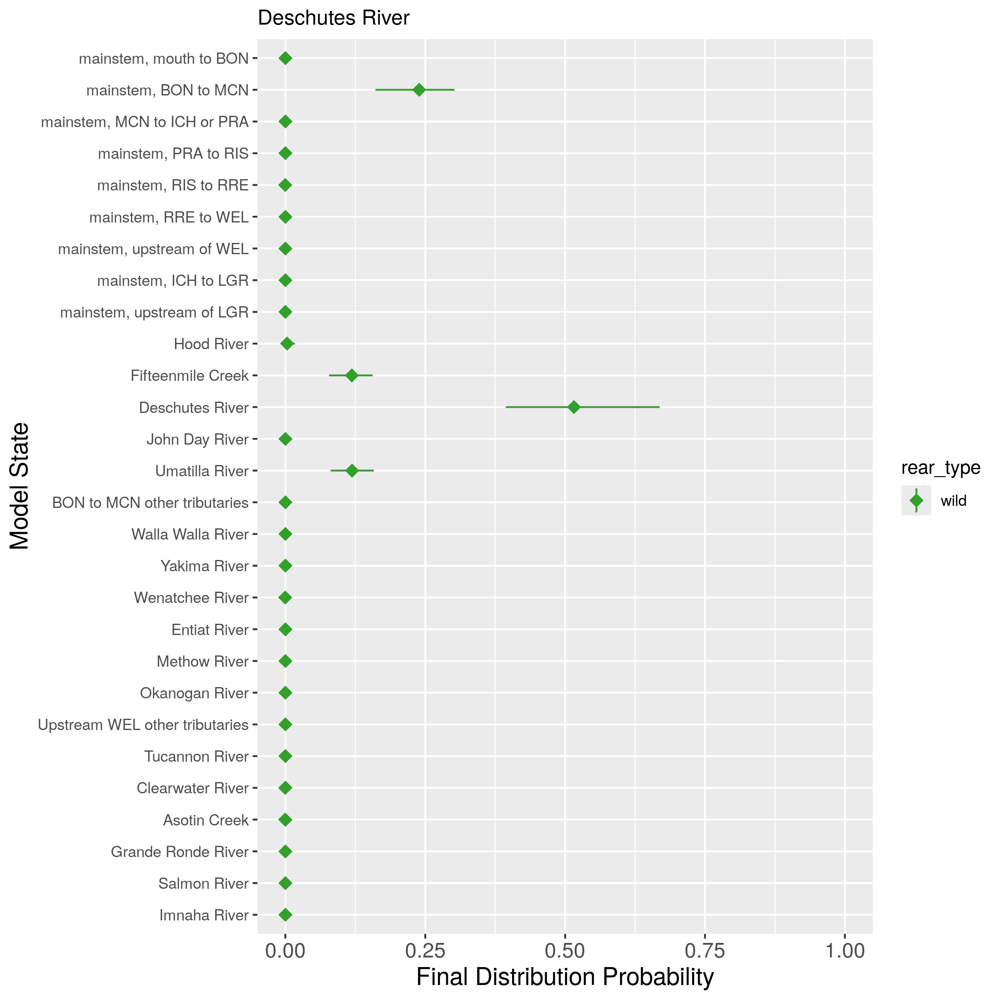
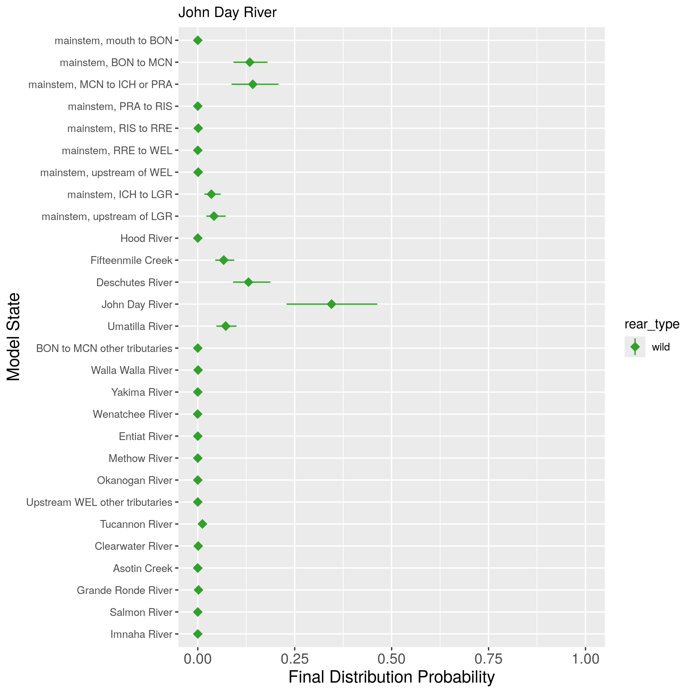
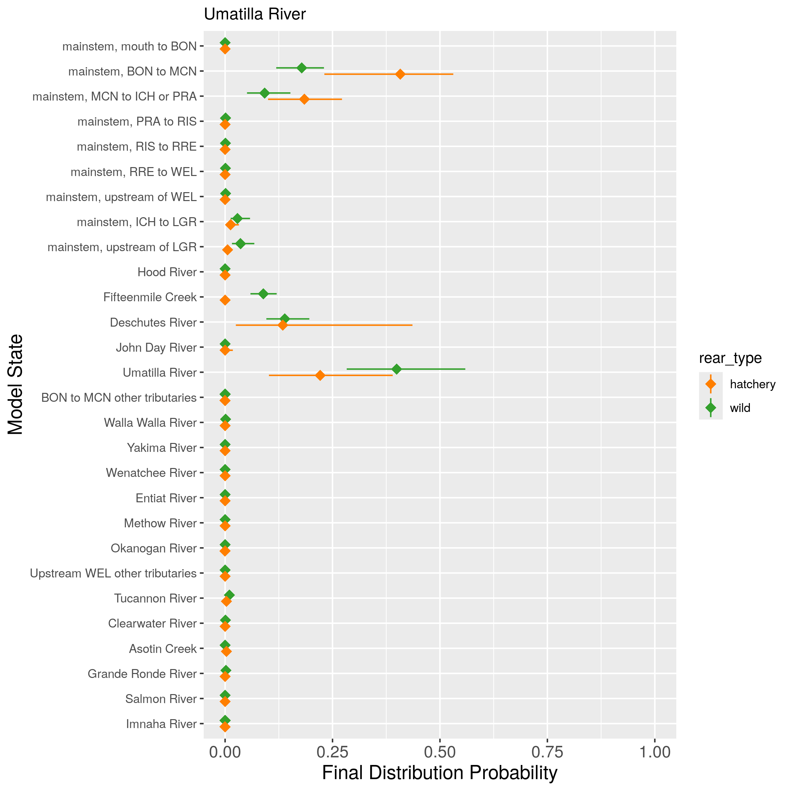
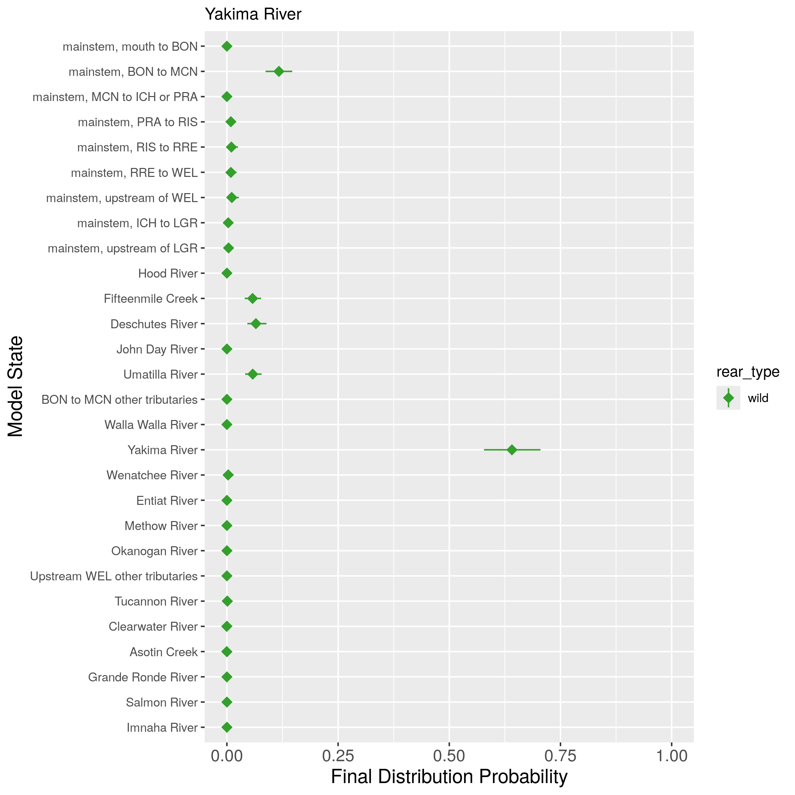
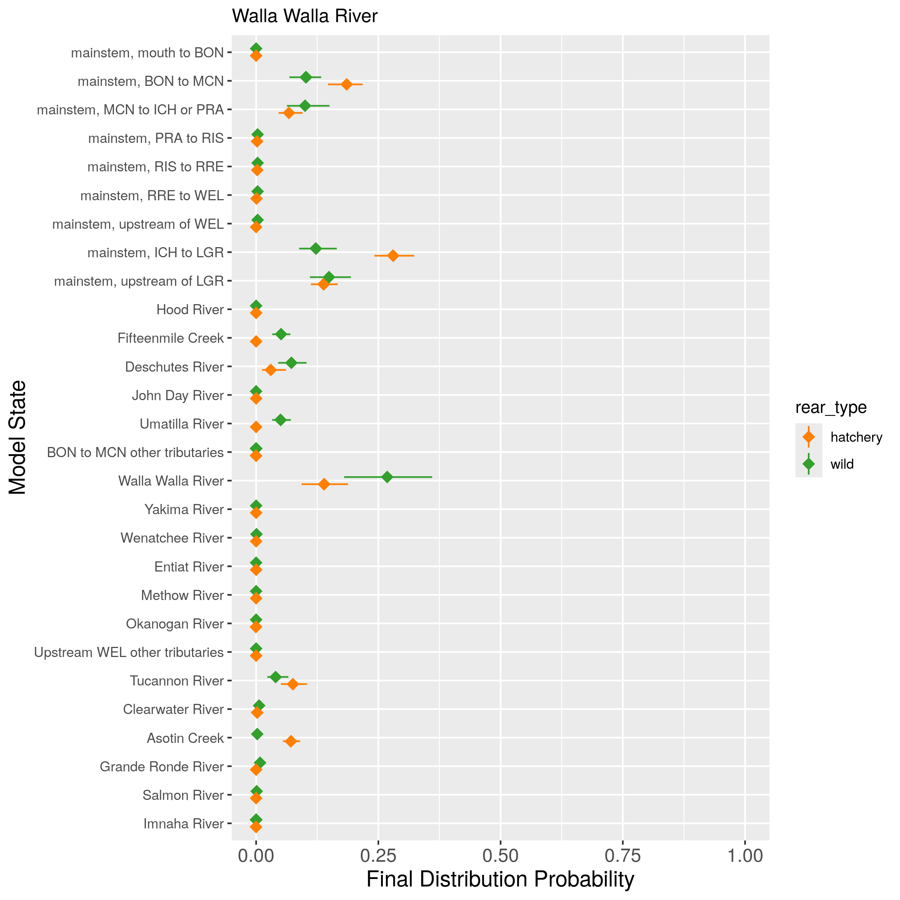

## Description

This page contains the results for the final fates simulation, using the fitted model object. 

### Simulation steps

For each dataset (combination of DPS and rear type), the following steps were run:

1. Extract the median covariate values experienced by all fish in the dataset (for spill window, winter spill days, and temperature). These median values are used for the simulation.
2. Randomly select one iteration from the model (one set of draws for all parameters)
3. Simulate 1000 fish that start at Bonneville Dam and move through the basin, with movements governed by the median covariate values and the values of the parameters from that iteration of the model.
4. Repeat steps 2 and 3 1000 times, for a total of 1,000 fish.

For each tributary, the final fates are plotted. If a tributary has both a hatchery and natural origin population, the final fates are compared.

#### Middle Columbia

 
 

 
 

 
 

 
 

 
 

#### Upper Columbia

 
 

 
 

 
 

#### Snake River

 
 

 
 

 
 

 
 

 
 

