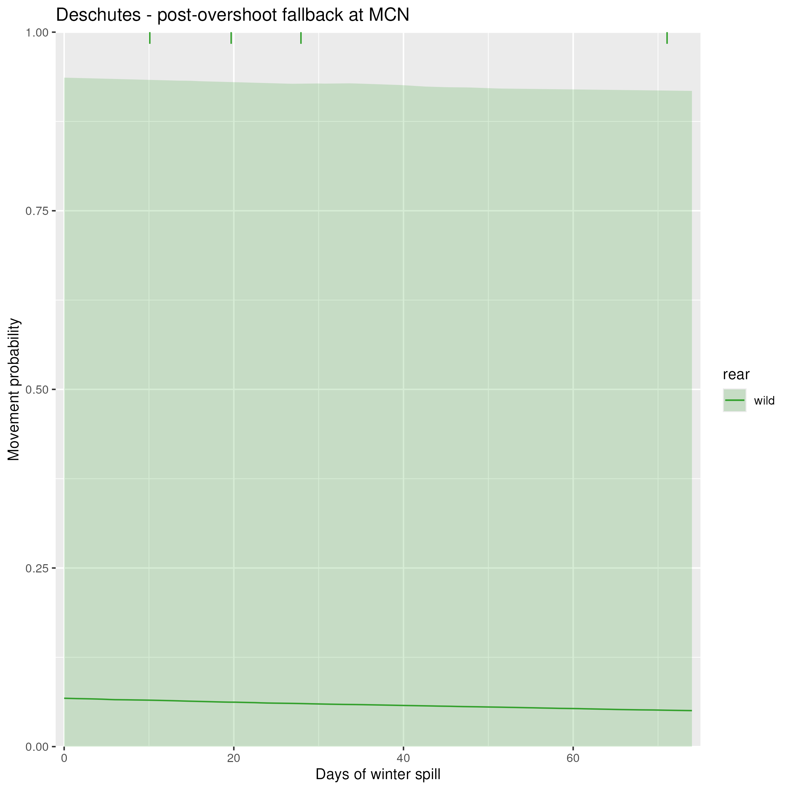
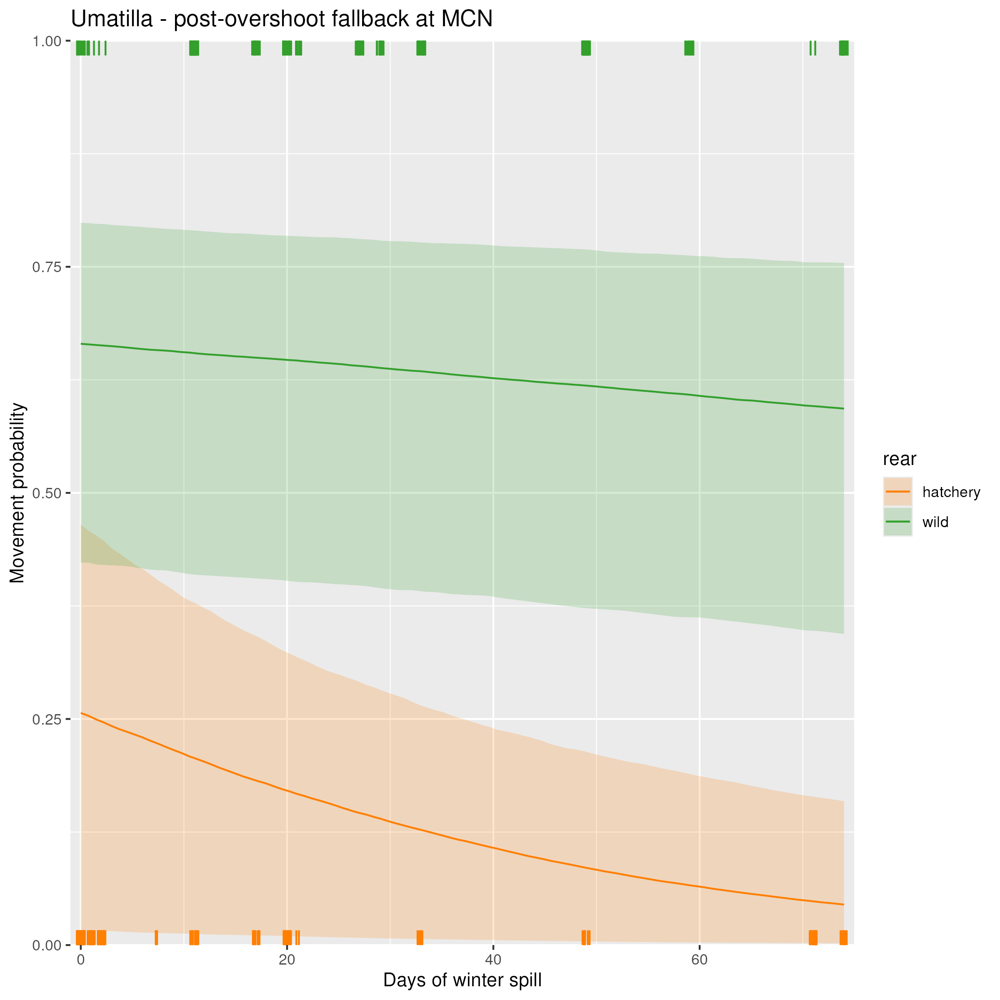
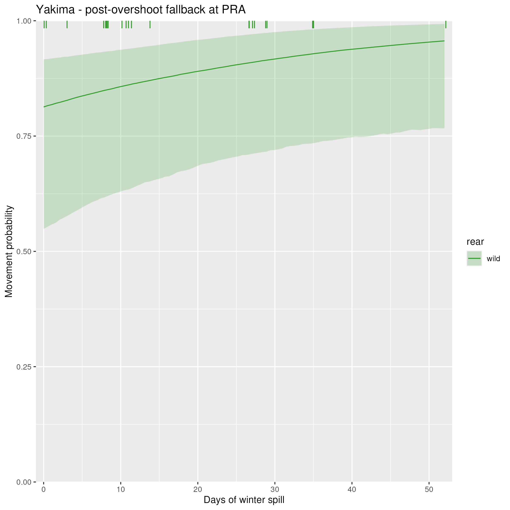
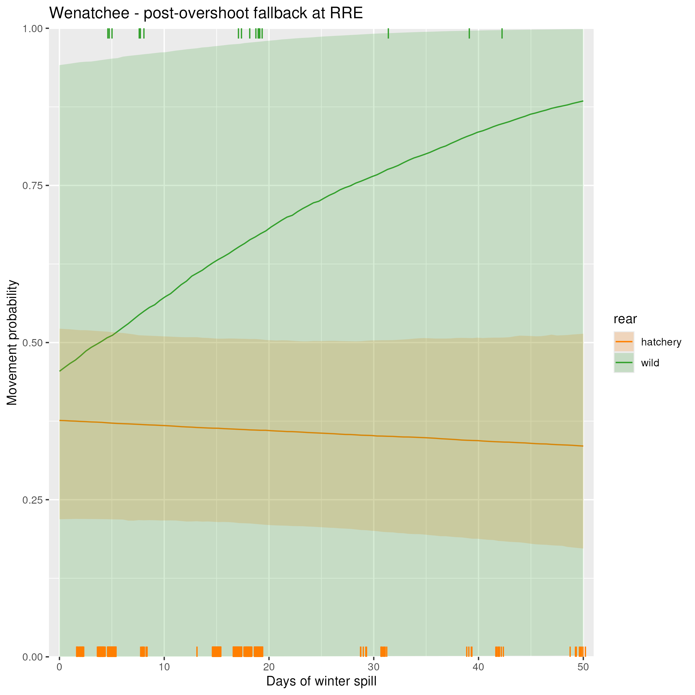
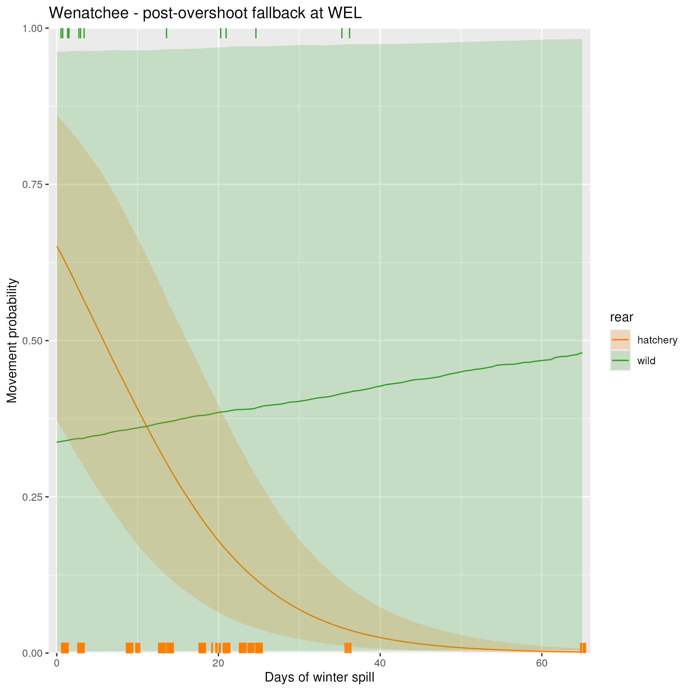
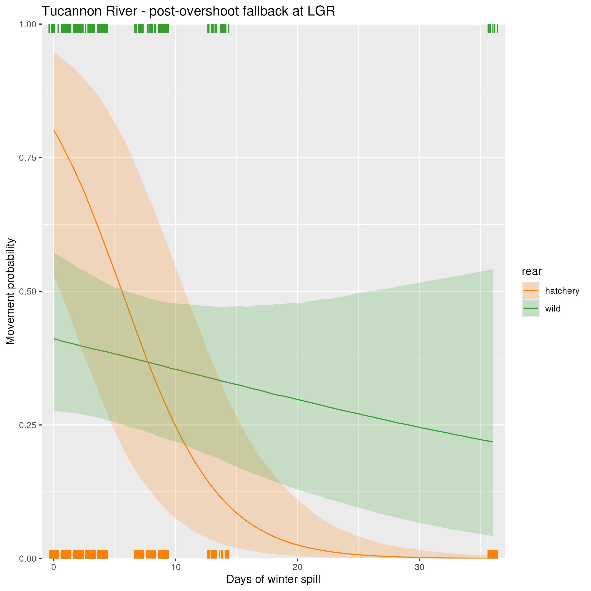

## Description

This page contains the results for the effects of spill (as the days of spill in winter) on key movements. Days of winter spill are calculated as the total number of days in January, February, and March that had any amount of spill. As a reminder for how spill (days of winter spill) is included in the model, spill (as the number of days of winter spill) affects only post-overshoot fallback movements. The same parameter is shared by all fish of the same DPS/rear type combination for which the movement represents post-overshoot fallback. On this page, I will focus only on how spill (days of winter spill) affects post-overshoot fallback.

### Calculation

For each dataset (combination of DPS and rear type), the following steps were run:

1. Extract the median covariate values experienced by all fish in the dataset (for volume of spill and temperature). These median values are used to estimate the probability of movement.
2. Create a sequence of days of spill from 0 to the maximimum value experience by fish in the dataset.
3. Evaluate the probability of movement at each of those spill values.

If a tributary has both a hatchery and natural origin population, they are shown on the same plot.

#### Middle Columbia

 
 

 
 

 
 

 
 

 
 

 
 

 
 

 
 

 
 

 
 

 
 

 
 

 
 

#### Upper Columbia

 
 

 
 

 
 

#### Snake River

 
 
