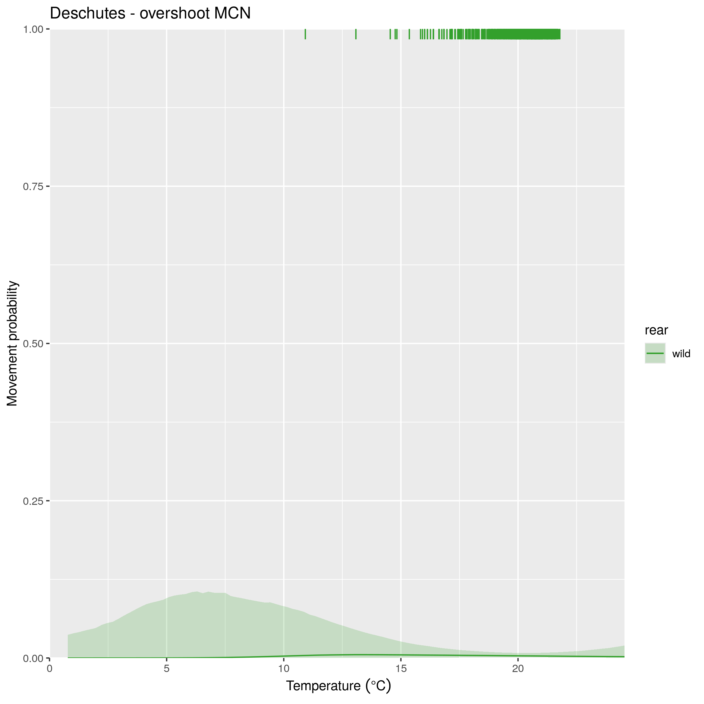
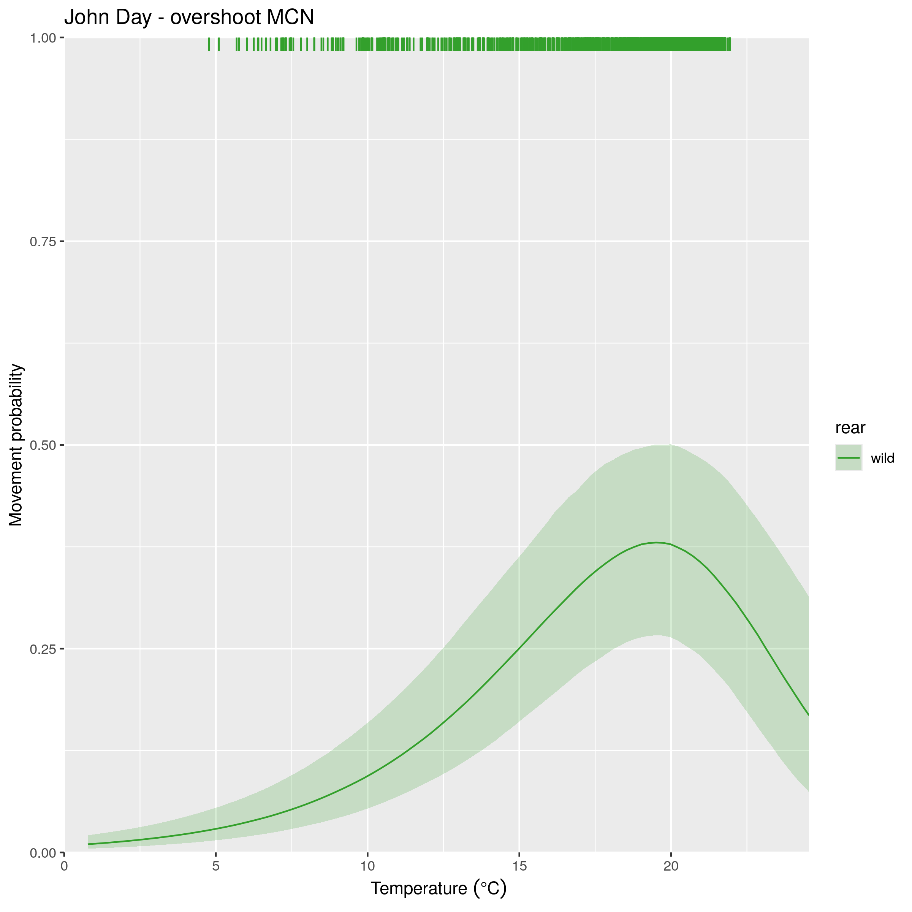
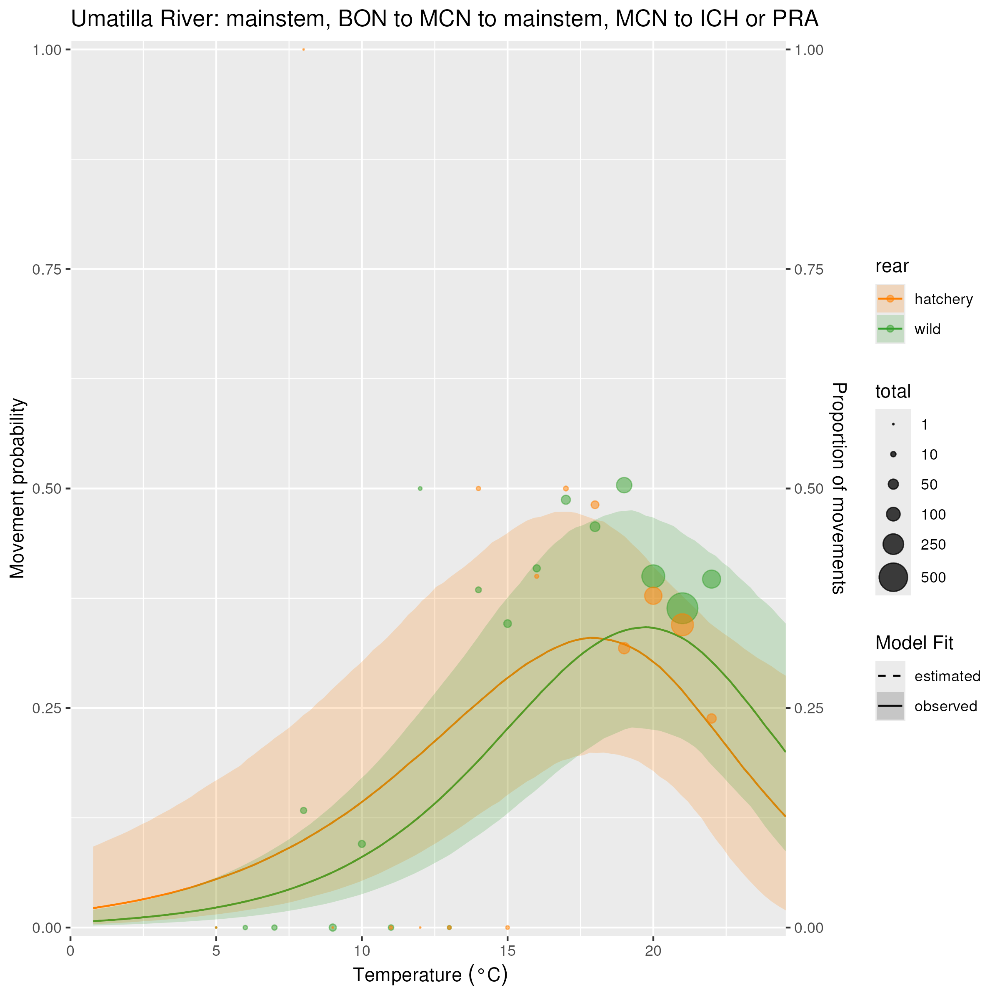
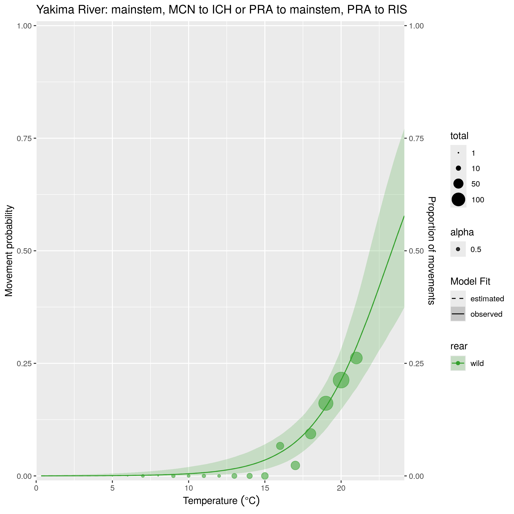
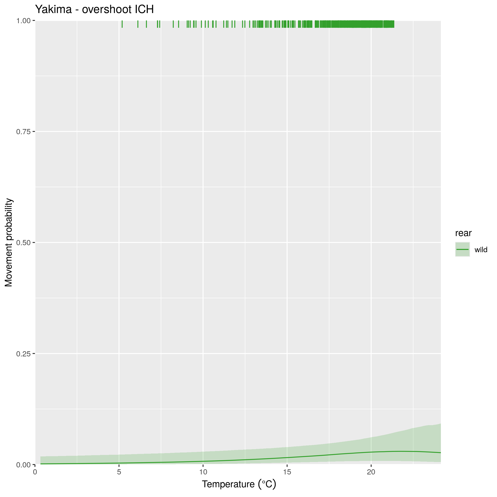
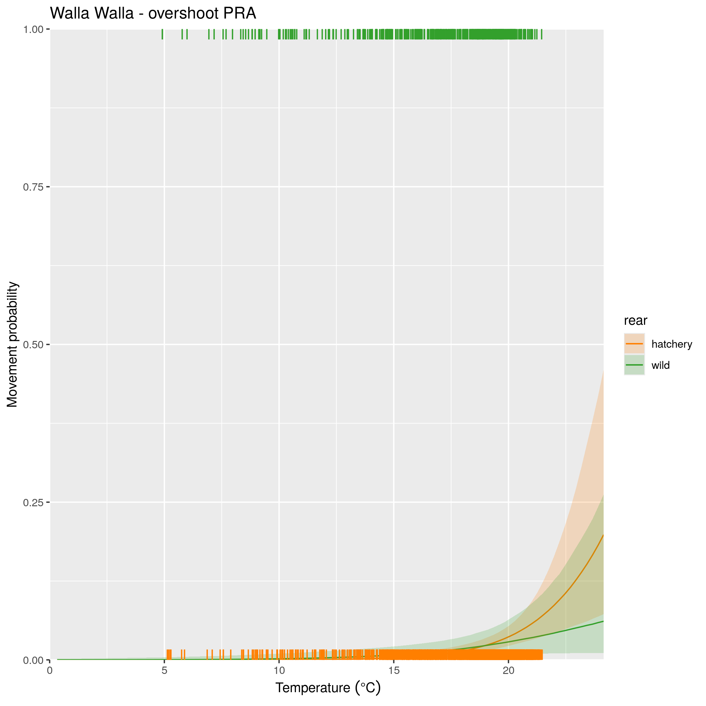
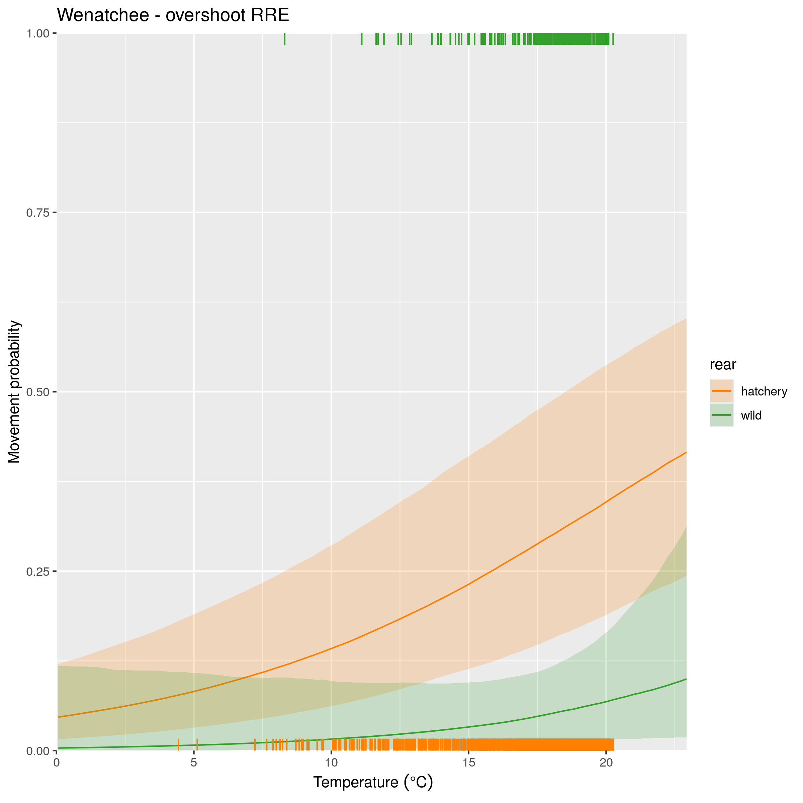

## Description

This page contains the results for the effects of temperature on key movements. As a reminder for how temperature is included in the model, temperature has an influence on every upstream movement and every movement into tributaries. The effect of temperature is modeled separately for winter/spring (January-May) and for summer/fall (June-December). Temperature parameters are origin-specific within DPS boundaries, and are shared between origins of the same DPS outside of DPS boundaries. On this page, I will focus only on how temperature affects overshoot and movements into tributaries, and focus only on the summer/fall temperature effect, as this is when upstream transitions are primarily occuring (and therefore, when the risk of overshoot is highest).

### Simulation steps

For each dataset (combination of DPS and rear type), the following steps were run:

1. Extract the median covariate values experienced by all fish in the dataset (for spill window, winter spill days, and temperature). These median values are used to estimate the probability of movement, except for the one that is being plotted.
2. Create a sequence of temperature values from -2 SD to +2 SD around the mean
3. Evaluate the probability of movement at each of those temperature values.

If a tributary has both a hatchery and natural origin population, they are shown on the same plot. The bubble plots show the observed proportion of that movement at each temperature.

**NOTE: You'll note that for overshoot movements, the data consistently seems to underestimate the proportion of fish that are overshooting for origins that are between Bonneville and McNary Dam. This is once again related to the issue of detection efficiency in the Deschutes. Many of the fish that appear to overshoot from the data are actually estimated to have dipped into the Deschutes River first by the model, which assumes that these detections were missed.**

### Temperature vs. all movements

I am experimenting with plots that show not only overshoot, but also other important movements (homing, straying, and loss). Here is an example for the John Day River:

{width=100%}

### Temperature vs. Overshoot

#### Middle Columbia

 
 

<!-- {width=50%} -->
{width=50%}

 
 

<!-- {width=50%} -->
{width=50%}

 
 

<!-- {width=50%} -->
{width=50%}

 
 

<!-- {width=50%} -->
{width=50%}

 
 

<!-- {width=50%} -->
{width=50%}

 
 

<!-- {width=50%} -->
{width=50%}

 
 

<!-- {width=50%} -->

{width=50%}

 
 

<!-- {width=50%} -->
{width=50%}

 
 

#### Upper Columbia

<!-- {width=50%} -->
{width=50%}

 
 

<!-- {width=50%} -->
{width=50%}

 
 

#### Snake River

<!-- {width=50%} -->
{width=50%}

 
 

### Temperature vs. moving into the Deschutes

 

For all of these plots, I am showing the data only for years where the Deschutes River had a detection efficiency correction (run years 13/14 through 18/19). Remember that temperature responses are shared amongst fish from the same DPS when they are outside DPS boundaries, but are origin-specific within DPS boundaries - hence, why I show this movement for Snake River and Upper Columbia fish in the aggregate, and then for individual Middle Columbia origins. 

 

{width=50%}

 
 

{width=50%}

 
 

{width=50%}

 
 

{width=50%}

 
 

{width=50%}

 
 

{width=50%}

 
 

{width=50%}

 
 

{width=50%}

