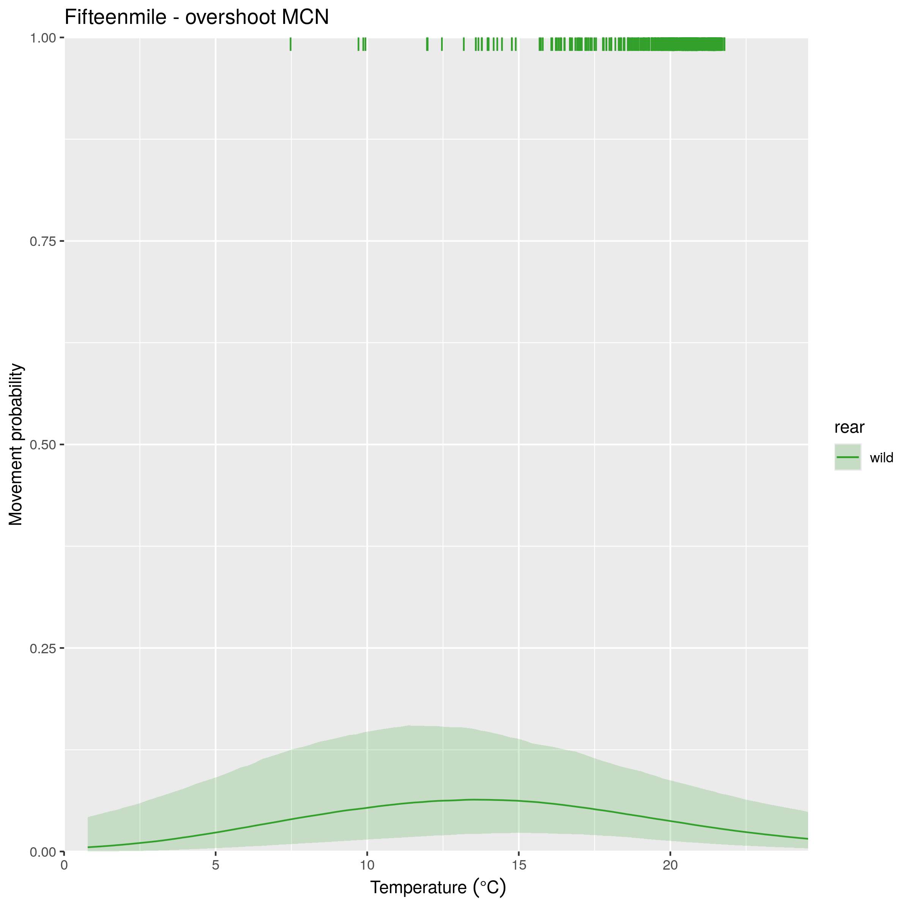
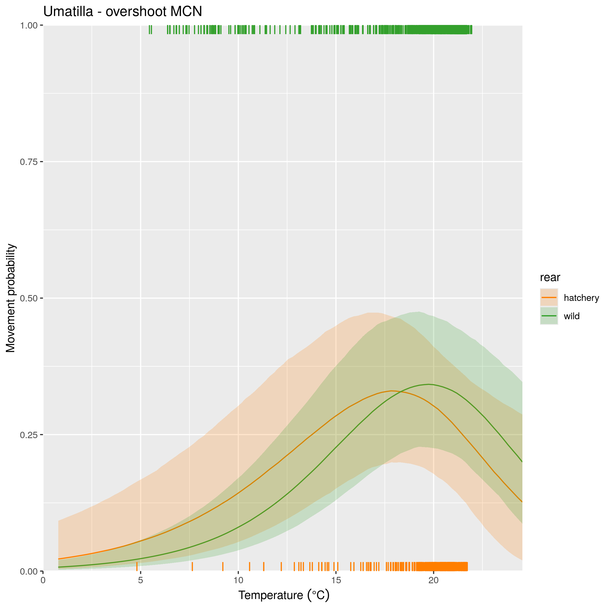
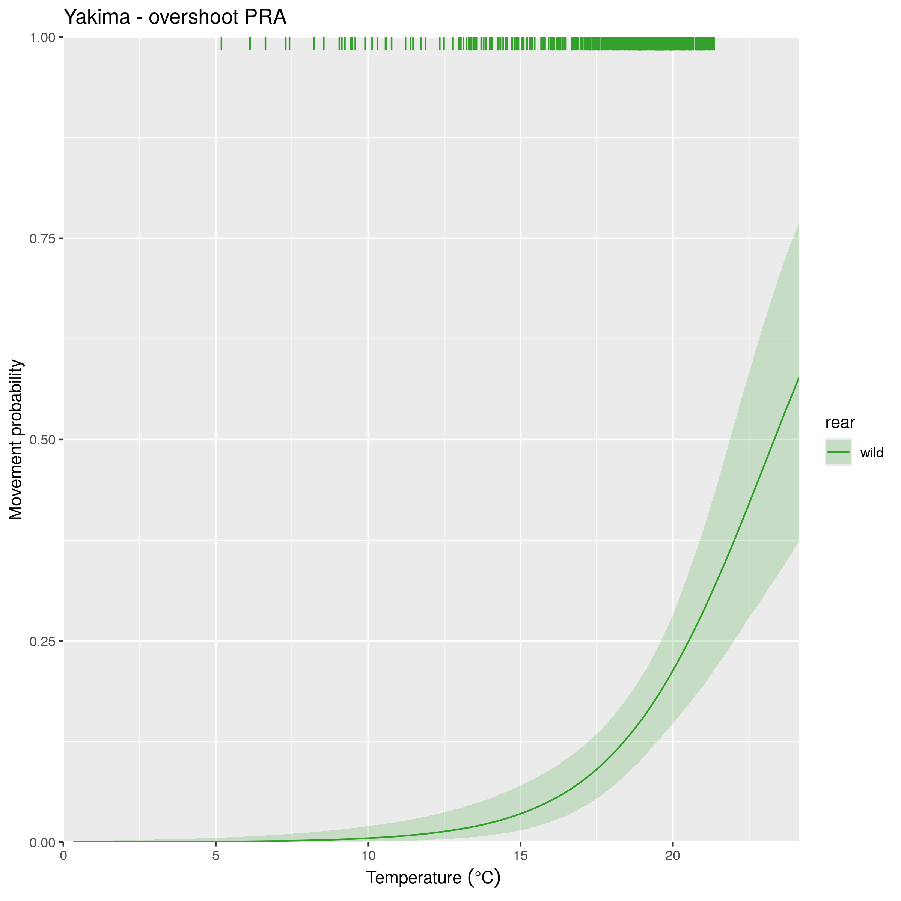
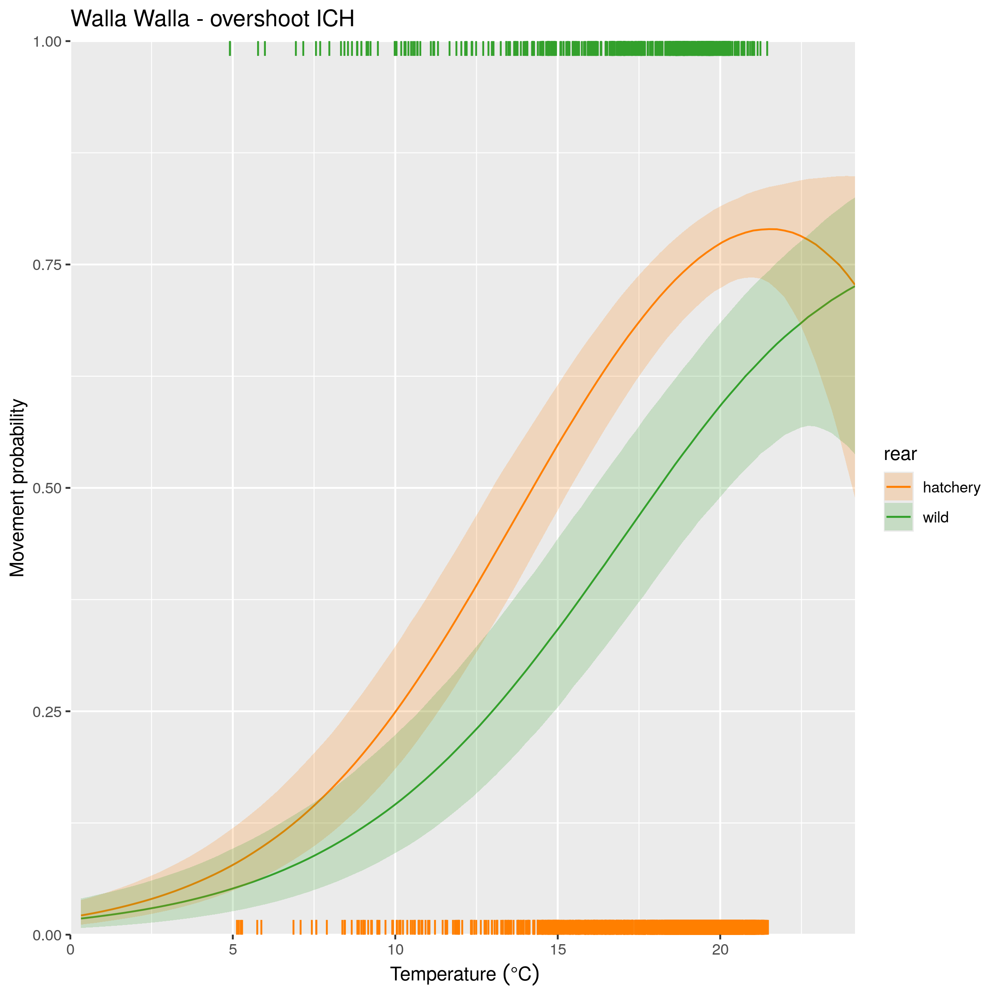

## Description

This page contains the results for the effects of temperature on key movements. As a reminder for how temperature is included in the model, temperature has an influence on every upstream movement and every movement into tributaries. The effect of temperature is modeled separately for winter/spring (January-May) and for summer/fall (June-December). Temperature parameters are origin-specific within DPS boundaries, and are shared between origins of the same DPS outside of DPS boundaries. On this page, I will focus only on how temperature affects overshoot and movements into tributaries, and focus only on the summer/fall temperature effect, as this is when upstream transitions are primarily occuring (and therefore, when the risk of overshoot is highest).

### Simulation steps

For each dataset (combination of DPS and rear type), the following steps were run:

1. Extract the median covariate values experienced by all fish in the dataset (for spill window, winter spill days, and temperature). These median values are used to estimate the probability of movement, except for the one that is being plotted.
2. Create a sequence of temperature values from -2 SD to +2 SD around the mean
3. Evaluate the probability of movement at each of those temperature values.

If a tributary has both a hatchery and natural origin population, they are shown on the same plot. The rug plot (lines in the margins) indicate the number of observations at each temperature.

#### Middle Columbia

 
 

{width=50%}

 
 

{width=50%}

 
 

{width=50%}

 
 

{width=50%}

 
 

{width=50%}

 
 

{width=50%}

 
 

{width=50%}

 
 

{width=50%}

 
 

#### Upper Columbia

{width=50%}

 
 

{width=50%}

 
 

#### Snake River

{width=50%}

 
 
