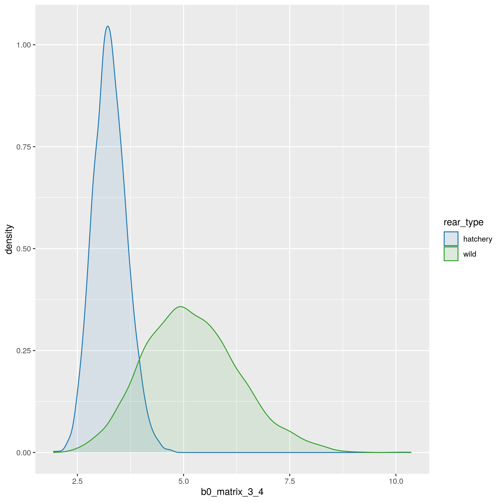

## Description

This page will contain information on the model results for the version of the model described in the model structure section.

As of right now, all figures shown below are preliminary versions (or only descriptions) of possible figures for the paper.

# Figures

### Figure 1: Hatchery vs. wild (natural) origin movement probabilities for key movements, such as overshoot (intercept + origin)

Comparing estimates for key parameters is one way to visualize this, as seen in the figure below. However, comparing parameter estimates on their own is not the full picture, as seen by the collinearity between parameters that can be seen on the diagnostics tab.

{width=50%}

 

### Figure 2: The effect of temperature (summer and winter)
This might be a bit more tricky than spill because there are two temperature covariates, and there are origin-specific effects

 

### Figure 3: The effect of spill (volume)
Note that spill is conveniently shared between DPSs

 

### Figure 4: The effect of spill (window)

 

### Figure 5: Final fates of fish, from different tributaries

 

# Supplementary materials

 

### Table S1: Tributary PIT tag antenna configurations

 

### Figure S1: Estimated PIT tag detection efficiency

 

### Table S2: Overshoot frequency

 

### Table S3: Fallback frequency

 

### Table S4: Combination of intercept + origin parameters for movement probabilities per origin; note that this table was 50 pages long in the CBR report
