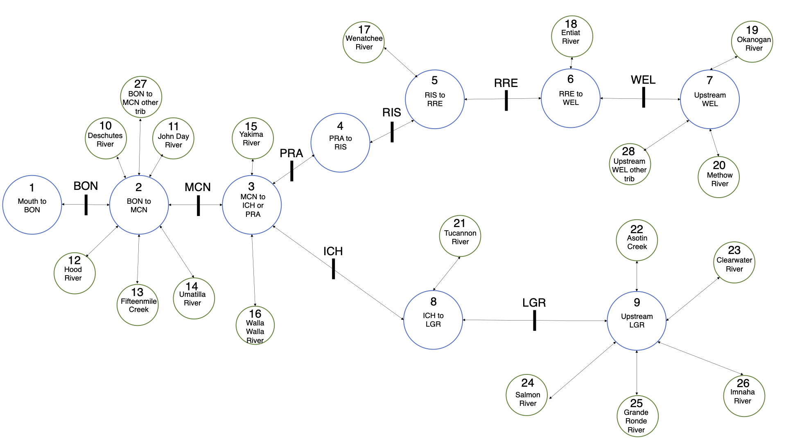

 

# Overview of covariate inclusion

The covariate effects were structured in the model to test specific hypotheses about the effects of these factors on movements of interest:

1.	Hatchery and wild origin fish have different movement patterns.
2.	The natal origin of a fish influences its movement decisions after it has entered the boundaries of its DPS.
3.	The temperature experienced by a fish while in a reach of the mainstem Columbia or Snake River influences its decision to seek cooler refuge (either in an upstream mainstem reach or in a tributary). Fish of different natal origins respond differently to temperature while inside the boundaries of their DPS.
4.	En-route fallback is an involuntary action that is caused by river conditions or individual condition. Higher volumes of spill lead to higher risk of en-route fallback.
5.	Post-overshoot fallback is a voluntary action. Post-overshoot fallback is facilitated by the presence of spill, which provides fish a safer, surface passage route.
6.	In addition to the river condition variables explicitly modeled (temperature and spill), internanual variation in other river conditions influences movement choices.

To test these hypotheses in the modeling framework, fish from different DPSs and of different rear types were modeled separately, facilitating the comparison of movement probabilities along these axes. Within a DPS/rear type combination, covariates were added for the effect of natal origin for any movements within DPS boundaries, ensuring that fish of different natal origins had different movement probabilities as they neared their natal tributaries. Temperature effects were included only for movements that were either upstream or into tributaries, as previous studies have indicated that Steelhead respond to temperature by seeking out colder refugia, either in tributaries (High et al. 2006) or in upstream mainstem reaches (Richins and Skalski 2018). In contrast, spill effects were only included for downstream (fallback) movements, but with different structures based on whether a movement was post-overshoot fallback or en-route fallback. Post-overshoot fallback modeled as a function of days of winter (January, February, and March) spill, as the presence of a spillway passage route has previously been shown to be more important than the volume of spill for facilitating downstream passage of adults at dams (Wertheimer and Evans 2005). In contrast, en-route fallback was modeled as a function of the volume of spill, as this type of fallback is assumed to be an involuntary movement caused by hydrosystem conditions. Finally, a random effect of year was included for movements within a fish’s DPS to account for interannual variation that was not explicitly accounted for by the other covariates. A random effect of year was not included for movements outside of a fish’s DPS, as outside of the DPS, we expected individuals to behave similarly regardless of the year.

 

## How covariates are coded in the model

In addition to the effects of DPS and rear type that are estimated via the separate estimation of model parameters for hatchery and wild fish from each DPS, four covariates were explicitly included via parameters in the model: origin, temperature, spill, and year.

#### Natal Origin
To reduce the number of parameters in the model, a fixed effect of natal origin was included only for state transitions into or out of states within the DPS boundaries, whereas for states outside of the DPS, all origins shared a common movement probability. This model structure allowed the effect of unique natal origins to differentiate as they neared natal tributaries. Natal origin was modeled as a fixed effect. Note that when a fish enters the boundaries of its DPS, the intercept term is eliminated and the origin effect functions as an intercept term.

#### Temperature
Two separate temperature effects were estimated in our modeling framework, to account for the temporal aspect of temperature. Because temperature is strongly correlated with day of year, which has been previously noted to influence Steelhead migration patterns (Siegel et al. 2021), we divided the effect of temperature into a winter/spring effect (January 1 - May 31) and a summer/fall effect (June 1 - December 31). Depending on the day of year of each movement, the temperature in the window was either multiplied by the winter/spring temperature parameter or the summer/fall temperature parameter. Approximately 96% of all movements occurred in the summer/fall period.

The temperature effects were structured to allow a temperature effect only for movements from a mainstem state to the mainstem state upstream of that state, or from a mainstem state into a tributary. Furthermore, temperature effects were structured to allow different natal origins to have a different response to temperature within the DPS boundaries. As such, the same origin structure was used as was used for the origin effects - temperature effects were shared outside of a DPS, but within a DPS each natal origin had a separately estimated parameter for the effect of temperature on each movement. Temperature was modeled as a fixed effect.

#### Spill
For the effect of the volume of spill within a window of time, only en-route fallback movements included an effect for the volume of spill. This parameter was shared between all origins. For the effect of the number of days in the winter with some volume of spill, only post-overshoot fallback movements included an effect for the number of days of spill during the winter months. This parameter was shared between all origins for which the movement was a post-overshoot fallback movement. Therefore, for any fallback movement, either the effect of the volume of spill or the number of days of winter spill was included, depending on the relation of that dam to the fish’s natal origin. Spill was modeled as a fixed effect.

#### Year
Within the datasets for each of the six populations (3 DPSs x 2 rear types), all individuals were pooled across years when fitting the model, but a random effect of year for certain movements was included to allow the movement probabilities to vary interannually and account for year specific differences that weren’t captured by the covariates included in the model. The setup for the inclusion of year effects was the same as that for origin effects - a random effect for each year was included only for state transitions into or out of states within the DPS boundaries, and random effects for year were all origin specific (no DPS-wide year effects). One reason for this modeling choice was the computational necessity of restricting the number of movements that receive a random effect for each of the 17 years in our dataset, as well as needing enough data for each movement to estimate a separate effect for each origin for each year. A second, ecological reason for this choice was based on our a priori hypothesis that interannual differences would mostly emerge when fish were nearing natal tributaries. Downstream of the DPS, individuals are expected to behave similarly regardless of the year, as all fish have natal tributaries that are upstream. Year was modeled as a random effect.

 

# Model equation

For each transition of a fish out of a state, there are $n$ possible non-loss transitions out of the current state, which correspond to the number of arrows out of the state as seen in the model structure diagram seen above. The true probability ($p_{actual}$) of moving to state $m$ ($m$ = 1, ..., n) from the current state is given as follows:

  

$$
\begin{aligned}
p_{actual, m} = \frac{exp(b_{0,m} + [covariate\:effects]_{m})}{1 + exp(b_{0,1} + [covariate\:effects]_{1}) + 
... exp(b_{0,n} + [covariate\:effects]_{n})}
\end{aligned}
$$

 

In this equation, the parameter $b_0$ is the intercept, and the term $[covariate\:effects]$ is a placeholder for the different covariates that are included in this model. Specifically, the covariates are estimated as follows:

 

* $b_0$ is an intercept term (a fixed effect). When outside DPS boundaries this term represents the grand mean of all fish in the model (i.e., the grand mean for all fish of one rear type from one DPS). When inside DPS boundaries, each natal origin receives a different intercept term, which is referred to as $b_{origin}$ rather than $b_0$
* $b_{spill-window}$ is a fixed effect for the volume of spill
* $b_{spill-days}$ is a fixed effect for the days of winter spill
* $b_{temp-early}$ is a fixed effect for temperature when a movement occurs during the winter and spring months (1 Jan - 31 May) for movements outside of a fish's DPS
* $b_{temp-late}$ is a fixed effect for temperature when a movement occurs during the summer and fall months (1 June - 31 December) for movements outside of a fish's DPS
* $b_{origin,temp-early}$ is a fixed effect for temperature for that specific origin when a movement occurs during the winter and spring months (1 Jan - 31 May) for movements inside a fish's DPS
* $b_{origin,temp-late}$ is a fixed effect for temperature for that specific origin when a movement occurs during the summer and fall months (1 June - 31 December) for movements inside a fish's DPS
* $b_{origin,year}$ is a random effect of year for that specific origin. Random effects were assumed to be distributed normally, with a mean of zero and a standard deviation estimated in the model

All fixed effects were estimated using a diffuse normal prior with a mean of 0 and a standard deviation of 5, and random effects were estimated using a diffuse Cauchy prior (location of 0 and scale of 1) on the standard deviation.

As stated earlier, the covariate effects included vary depending on the type of movement and its relation to the fish's natal origin. To provide an example of the variable nature of which covariates to include, for the probability of a Wenatchee River fish falling back over Rocky Reach Dam, the numerator would be as follows:

  

$$
b_{origin,1} + b_{spill-window,1} * spillvolume +  b_{spill-days,1} * spilldays + b_{origin,year,1}
$$

  

This is because the movement is:

* inside the Upper Columbia DPS boundaries, so the intercept term is origin-specific ($b_origin$ rather than $b_0$)
* a fallback movement over a dam, so there is an effect of the volume of spill
* a post-overshoot fallback movement over a dam (because Rocky Reach Dam is upstream of the Wenatchee River), so there is an effect of the days of spill during the winter months
* inside the Upper Columbia DPS boundaries, so there is an effect of year
* not an upstream movement, so there is no effect of temperature

 

Once the probabilities of entering any non-loss states have been estimated, the loss term is given by the following equation:
$$
p_{actual,loss} = 1 - \sum_{m=1}^{n} p_{actual,m}
$$

  

This generates a vector of probabilities, corresponding to the true movement probability from the current state to each of the connecting states. However, because perceived movement is a product of both the true movement and the detection probability of various PIT tag arrays, we must correct for this detection probability to separate our process of interest (the true movement probabilities, $p_{actual}$) from the observation process (the detection probability, $p_{detection}$). The product of $p_{actual}$ and $p_{detection}$ is $p_{observed}$, which is used to evaluate the likelihood of the observed PIT tag data. We only estimate $p_{detection}$ for tributaries in our model; $p_{detection}$ in adult fish ladders is assumed to be one, with any known missed detections interpolated (see section 3.3.3), and there is no way to estimate $p_{detection}$ in downstream mainstem passage routes. The consequence of an inability to estimate $p_{detection}$ in downstream mainstem passage routes is that this is assumed to be 100%. The consequence of this is that if there is a missed detection and that fish is not later seen (therefore, the missed detection cannot be interpolated), the downstream movement probability will be biased low, and the loss probability will be biased high.

  

Once we have estimated $p_{actual}$, the detection efficiency correction is implemented for all transitions for which we can calculate a detection efficiency, to generate $p_{observed}$. Given that for almost every tributary, detection efficiency could not be calculated for every year, the first step was to identify which tributaries that connect to a mainstem state had the ability to estimate detection efficiency in the year in which the transition occurred. For each of the transitions for which a detection efficiency could then be estimated, the following correction was made: 

 

First, the detection efficiency of that tributary in that year ($t$) with that year's mean discharge was modeled, using the parameter values that were estimated in the model described in 3.5.1 as priors for the same parameters in this model:

 

$$
p_{detection,j,t} = exp(\alpha_{j, k}  +  \beta_{j}  discharge_{j,t})/(1 + exp(\alpha_{j, k}  +  \beta_{j}  discharge_{j,t}))
$$

 

Next, the probability of the corresponding transition in the vector of observed transitions was adjusted:
$$
p_{observed,j,t} = p_{actual,j} * p_{detection,j,t}
$$

 

Since any transitions that were unobserved but occurred would appear as fish moving to the absorbing loss state, this movement probability was also adjusted accordingly for each of the $n$ tributaries that connect to that mainstem state:
$$
p_{observed,loss} = p_{actual, loss} + \sum_{j=1}^{n} p_{actual,j} * (1 - p_{detection,j,t})
$$

 

With the vector of observed transition probabilities generated, the likelihood of observing the next movement ($x$) of fish $z_i$ was defined as follows:

 

$$
z_{i,x} \sim \text{categorical}(p_{observed,i,1}, p_{observed,i,2}, p_{observed,i,3} ... p_{observed,i,n}, p_{observed,i,loss})
$$

 

Formally, the likelihood is evaluated as follows:
$$
f(x | \mathbf{p}) = \prod_{m=1}^{n} p_{m}^{x_m}
$$
In this likelihood, $\mathbf{p}$ is the vector of observed probabilities and $n$ is the possible movements out of that state.

 

In these equations, $p_{detection}$ is the conditional probability of detection, $p_{actual}$ is the vector which contains the true movement probabilities, $p_{observed}$ is the vector which contains the observed movement probabilities, $\alpha$ is the categorical covariate for site configuration, $\beta$ is the slope for the effect of discharge on the probability of detection efficiency, and $z_{i,x}$ is the next observation of the fish. The indices represent the following:

- $i$ is the fish
- $x$ is the observation of fish $i$
- $m$ is the state
- $j$ is the tributary
- $k$ is the site configuration (a categorical variable)
- $t$ is the run year

# Stan

Each of the six populations (Upper Columbia Wild, Upper Columbia Hatchery, Middle Columbia Wild, Middle Columbia Hatchery, Snake River Wild, and Snake River Hatchery) were run on KLONE, UW's HYAK supercomputer. The models were run with the following specifications:

- 4 chains
- 2000 warmup iterations
- 2000 sampling iterations
- thin = 2 (every other sample was selected, as this improved model efficiency when exploring the posterior)

