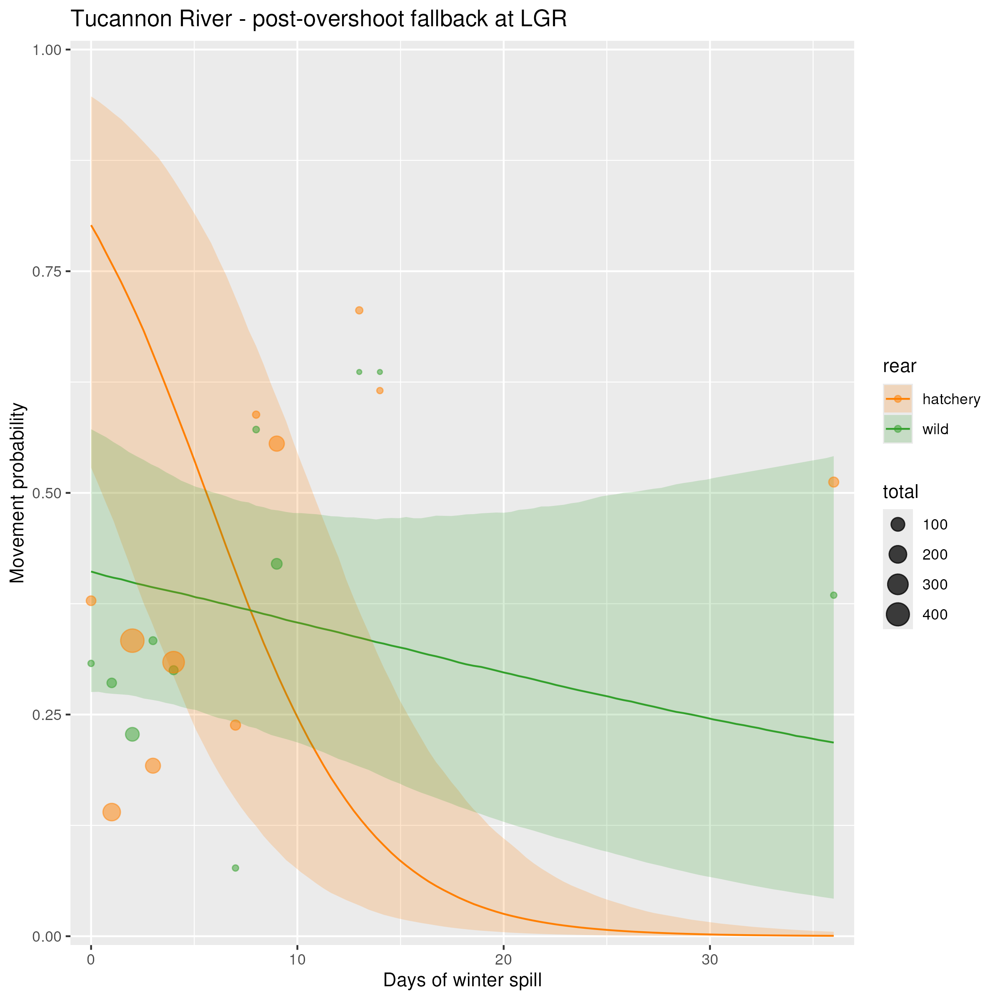
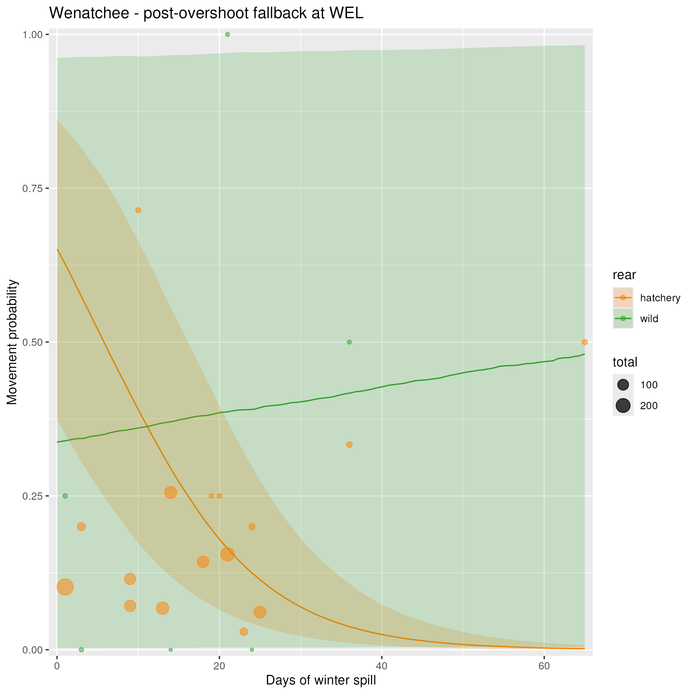

## Description

On this page, I describe how the effect of winter spill is confounded with the random effect of year, and how this is causing poor fits of the model to the winter spill data.

 

### Model setup

As a reminder, winter spill is modeled as an effect on post-overshoot fallback movements that may have occurred during the winter months (January, February, March). It is an effect that is shared between all natal origins within a DPS for which that movement is a post-overshoot fallback movement. The random effect of year is an origin-specific random effect, where only movements that are within a fish's DPS boundaries receive a random effect of year. The random effect of year is modeled using the matt trick, wherein the effect of year for each individual year is drawn from a standard normal, and all year effects for a particular movement are scaled by a scale parameter that is estimated separately for each movement.

This model setup means that sometimes, the effect of winter spill days and the random effect of year affect the same post-overshoot fallback movement. The issue is that these two effects are tightly connected, as each year has both a unique number of spill days and a unique year effect. This creates a situation where these two effects are confounded, and allows the model to explain year-to-year variation in post-overshoot fallback rates as some combination of these two effects.

 

### Poor fits to data

The clearest example of poor fits to the winter spill data caused by year effects is the fallback movement for Tucannon River fish over Lower Granite Dam. The fit to the winter spill days data for hatchery fish is especially poor:

{width=100%}

 

Another example is post-overshoot fallabck at Wells Dam for Wenatchee River hatchery fish:

{width=100%}

 

### Year effects

If we then examine the year effects for the Snake River hatchery model, it is revealed that some of the largest year effect estimates are for this specific movement. Other movements with strong year effects are primarily for movements into the Salmon, Grande Ronde, and Clearwater Rivers, which do not have detection efficiency corrections (and thus year effects are primarily reflecting changes in detection efficiency).

 

{width=100%}

 

{width=100%}

 

If we look at the year effects for individual years vs. the winter spill values in that year, it is very clear that these two are confounded.

{width=100%}

 

A very similar story can be seen for Wenatchee River hatchery fish at Wells Dam:

 

{width=100%}

 

{width=100%}

 

{width=100%}

 

### Potential solutions

Given that one of our primary interests is in the effects of winter spill, this model behavior is not desirable. Here are some potential solutions:

1) If we tightened the priors on the scaling parameter for the year effect, it would in effect force the model to explain more of the year-to-year variation in fallback rates as a function of year-to-year variability in spill. Currently, we are using the matt trick approach, wherein we the random effect of year is modeled as the product of a standard normal (normal(0,1)) and a half Cauchy (Cauchy(0,1) with a lower bound of zero). We could reduce the scale parameter of the Cauchy prior.
2) Remove the random effect of year entirely for any movements for which there is an effect of winter spill
3) Index the model so that if a fish receives the effect of winter spill, it does not also receive a random year effect
