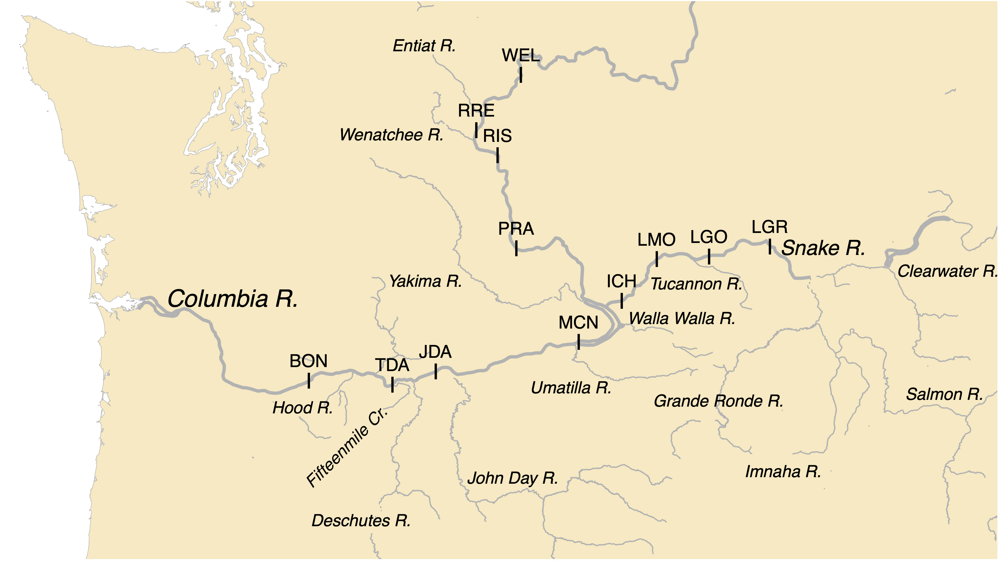

```{r echo = FALSE, message = FALSE, warning = FALSE}
library(here)
library(tidyverse)
```


#### Description
This Rmd contains first drafts/mockups of figures and tables for the Steelhead paper. These figures do not contain any final results!

# Main figures

## Figure 1: Map

Here's the map I've been using so far for presentations - it could use some beautification.

{width=100%}

## Table 1: Sample sizes of fish by origin and rear type

## Figure 2: Model schematic
{width=100%}

## Figure 3: Hatchery vs. wild (natural) origin movement probabilities for key movements, such as overshoot (intercept + origin)


## Figure 4: The effect of temperature (summer and winter)
This might be a bit more tricky than spill because there are two temperature covariates, and there are origin-specific effects


## Figure 5: The effect of spill (volume)
Note that spill is conveniently shared between DPSs

## Figure 6: The effect of spill (window)


# Supplementary materials

## Table S1: Tributary PIT tag antenna configurations

## Figure S1: Estimated PIT tag detection efficiency

## Table S2: Overshoot frequency

## Table S3: Fallback frequency

## Table S4: Combination of intercept + origin parameters for movement probabilities per origin; note that this table was 50 pages long in the CBR report
