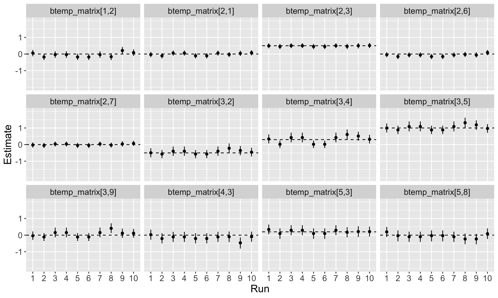
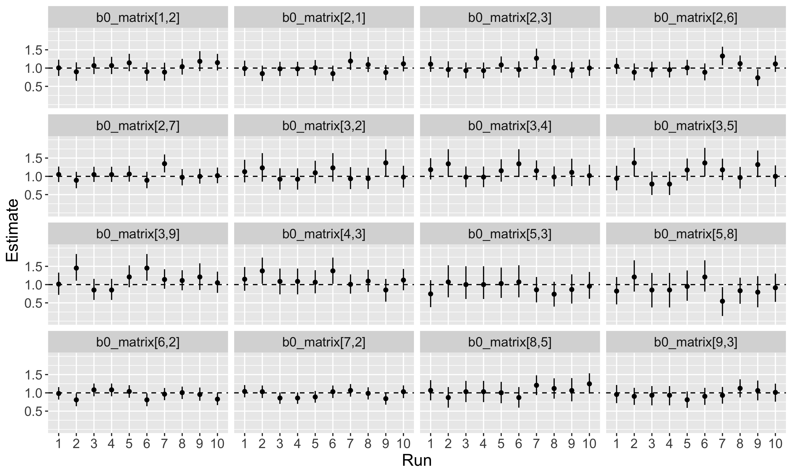

```{r load_libraries, echo = FALSE, message = FALSE}
library(kableExtra)
library(tidyverse)
library(janitor)
library(here)
library(lubridate)
library(ggpubr)
```

## Mox/Hyak is up and running!
{width=100%}


## Setup for categorical covariates (i.e., natal origin)

For our simulation, with three natal origins (JDR, YAK, and TUC)

Parameters:

1) Grand mean =  $\beta_0$
2) Origin effect, JDR relative to TUC = $\beta_{origin,1}$
3) Origin effect, YAK relative to TUC = $\beta_{origin,2}$
 
Effect of origin:

$$
JDR: \beta_0 + \beta_{origin,1} \\
YAK: \beta_0 + \beta_{origin,2} \\
TUC: \beta_0 - \beta_{origin,1} - \beta_{origin,2}
$$


## Interpretation is a bit funky

For example, in order for JDR origin fish to have a different movement probability than YAK and TUC origin fish, the following relationship must be followed:

$$
YAK = TUC \\
\beta_0 + \beta_{origin,2} = \beta_0 - \beta_{origin,1} - \beta_{origin,2} \\
2 * \beta_{origin,2} = - \beta_{origin,1}
$$

For example, $\beta_0$ = 1, $\beta_{origin,1}$ = -0.5 and $\beta_{origin,2}$ = 0.25 would lead to these observed effects:

$$
JDR = 0.5 \\
YAK = 1.25 \\
TUC = 1.25
$$

# Simulation model results

## Origin only: b0
{width=100%}


## Origin only: borigin1
{width=100%}

## Origin only: borigin2
{width=100%}

## Run 4 - simulated dataset {.smaller}
```{r echo = FALSE}
run4 <- structure(list(origin = c(1L, 1L, 2L, 2L, 3L, 3L, 1L, 1L, 3L, 
3L), rear = c(1L, 2L, 1L, 2L, 1L, 2L, 1L, 2L, 1L, 2L), state2 = c("loss", 
"loss", "loss", "loss", "loss", "loss", "mainstem, ICH to LGR", 
"mainstem, ICH to LGR", "mainstem, ICH to LGR", "mainstem, ICH to LGR"
), n = c(5L, 5L, 3L, 1L, 34L, 43L, 15L, 20L, 45L, 74L), indices = c("[8,10]", 
"[8,10]", "[8,10]", "[8,10]", "[8,10]", "[8,10]", "[8,5]", "[8,5]", 
"[8,5]", "[8,5]")), class = "data.frame", row.names = c(NA, -10L
))

run1 <- structure(list(origin = c(1L, 1L, 2L, 2L, 3L, 3L, 1L, 1L, 2L, 
2L, 3L, 3L), rear = c(1L, 2L, 1L, 2L, 1L, 2L, 1L, 2L, 1L, 2L, 
1L, 2L), state2 = c("loss", "loss", "loss", "loss", "loss", "loss", 
"mainstem, ICH to LGR", "mainstem, ICH to LGR", "mainstem, ICH to LGR", 
"mainstem, ICH to LGR", "mainstem, ICH to LGR", "mainstem, ICH to LGR"
), n = c(3L, 3L, 2L, 2L, 24L, 40L, 16L, 24L, 3L, 4L, 46L, 41L
), indices = c("[8,10]", "[8,10]", "[8,10]", "[8,10]", "[8,10]", 
"[8,10]", "[8,5]", "[8,5]", "[8,5]", "[8,5]", "[8,5]", "[8,5]"
)), class = "data.frame", row.names = c(NA, -12L))

run4
run1
```


## Origin + rear: beta_0
{width=100%}

## Origin + rear: rear
{width=100%}

## Origin + rear: beta_origin1
{width=100%}

## Origin + rear: beta_origin2
{width=100%}

## Temperature only: beta_0
{width=100%}


## Temperature only: beta_temp
{width=100%}

## Temperature + flow - correlation issues?

```{r echo = FALSE, message = FALSE, warning = FALSE}
flow_data <- read.csv(here::here("covariate_data", "flow_by_state.csv"), row.names = 1)
temp_data <- read.csv(here::here("covariate_data", "temperature_by_state.csv"), row.names = 1)

flow_data %>% 
  dplyr::rename(BON = mouth.to.BON,
                ICH = MCN.to.ICH.or.PRA..ICH.,
                MCN = BON.to.MCN,
                PRA = MCN.to.ICH.or.PRA..PRA.) %>% 
  dplyr::select(date, BON, ICH, MCN, PRA) %>% 
  mutate(date = ymd(date)) %>% 
  subset(date >= ymd("2017-01-01") & date <= ymd("2019-12-31")) -> flow_data

# First, fill NAs using linear interpolation (TEMPORARY)

# Also, remove strange all NA rows
flow_data %>% 
  subset(., !(is.na(BON) & is.na(MCN) & is.na(ICH) & is.na(PRA))) -> flow_data
library(zoo)
flow_data$BON <- na.approx(flow_data$BON)
flow_data$MCN <- na.approx(flow_data$MCN)
flow_data$PRA <- na.approx(flow_data$PRA)
flow_data$ICH <- na.approx(flow_data$ICH)


temp_data %>% 
  dplyr::rename(BON = mouth.to.BON,
                ICH = MCN.to.ICH.or.PRA..ICH.,
                MCN = BON.to.MCN,
                PRA = MCN.to.ICH.or.PRA..PRA.) %>% 
  dplyr::select(date, BON, ICH, MCN, PRA) %>% 
  mutate(date = ymd(date)) %>% 
  subset(date >= ymd("2017-01-01") & date <= ymd("2019-12-31")) -> temp_data

# First, fill NAs using linear interpolation (TEMPORARY)

# Also, remove strange all NA rows
temp_data %>% 
  subset(., !(is.na(BON) & is.na(MCN) & is.na(ICH) & is.na(PRA))) -> temp_data
library(zoo)
# temp_data$BON <- na.approx(temp_data$BON)
temp_data$MCN <- na.approx(temp_data$MCN)
# temp_data$PRA <- na.approx(temp_data$PRA)
temp_data$ICH <- na.approx(temp_data$ICH)


bon_tempflow <- data.frame(temp = temp_data$BON, flow = flow_data$BON)
mcn_tempflow <- data.frame(temp = temp_data$MCN, flow = flow_data$MCN)
ich_tempflow <- data.frame(temp = temp_data$ICH, flow = flow_data$ICH)
pra_tempflow <- data.frame(temp = temp_data$PRA, flow = flow_data$PRA)

# cor(bon_tempflow$temp, bon_tempflow$flow)
# cor(mcn_tempflow$temp, mcn_tempflow$flow)
# cor(ich_tempflow$temp, ich_tempflow$flow)
# cor(pra_tempflow$temp, pra_tempflow$flow)

bon_corplot <- ggplot(bon_tempflow, aes(x = temp, y = flow)) +
  geom_point() +
  ggtitle("Bonneville")

mcn_corplot <- ggplot(mcn_tempflow, aes(x = temp, y = flow)) +
  geom_point() +
  ggtitle("McNary")

ich_corplot <- ggplot(ich_tempflow, aes(x = temp, y = flow)) +
  geom_point() +
  ggtitle("Ice Harbor")

pra_corplot <- ggplot(pra_tempflow, aes(x = temp, y = flow)) +
  geom_point() +
  ggtitle("Priest Rapids")

ggarrange(bon_corplot, mcn_corplot, ich_corplot, pra_corplot, nrow = 2, ncol = 2)


```


## Temperature + flow: b0
{width=100%}


## Temperature + flow: btemp
{width=100%}


## Temperature + flow: bflow
{width=100%}


## Temperature, flow, origin, and rear
{width=100%}


## Spill covariate
{width=90%}

- Binary variable (was there any spill around a window of time of the estimated transition date), or count of days of spill within window?