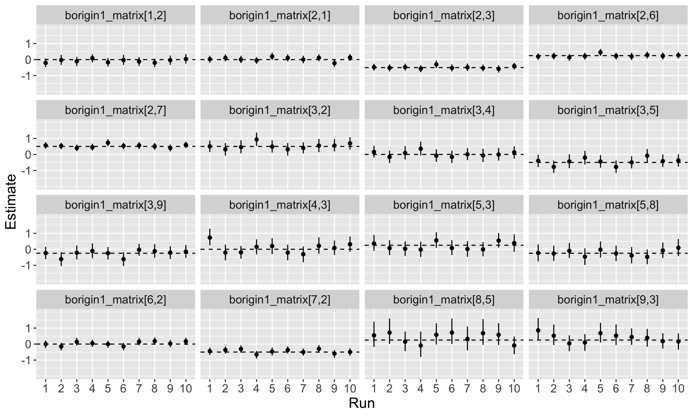

```{r load_libraries, echo = FALSE, message = FALSE}
library(kableExtra)
library(tidyverse)
library(janitor)
library(here)
library(lubridate)
library(ggpubr)
```


# Simulation results with all 4 covariates
### Temperature, flow, origin, and rear - 1200 fish

## beta_0
{width=100%}

## beta_temp
{width=100%}


## beta_flow
{width=100%}


## beta_rear
{width=100%}


## beta_origin1
{width=100%}


## beta_origin2
{width=100%}

