### Description
This R markdown file will go through the different dams and the configuration of antennas at each through time.

All information contained within this document comes from the Interrogation Site Metadata on PTAGIS (https://www.ptagis.org/Sites/InterrogationSites) and the CBR site configuration file (https://www.cbr.washington.edu/paramest/docs/pitpro/updates/sites_config.txt). It is partially based on Susannah Iltis' work on identifying fallback (https://www.cbr.washington.edu/dart/query/pitadult_fallback).

# Bonneville Dam

### Overview
Bonneville Dam has four separate interrogation sites:

1. BO1: Bonneville Bradford Island Ladder
2. BO2: Bonneville Cascades Island Fish Ladder
3. BO3: Bonneville Washington Shore Ladder and AFF
4. BO4: Bonneville Washington Shore Vertical slots

Together, they represent two primary routes of passage:

1. The BO1 route
2. The BO2-BO3-BO4 route

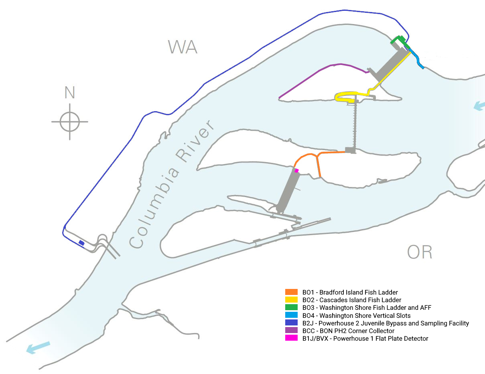{width=100%}


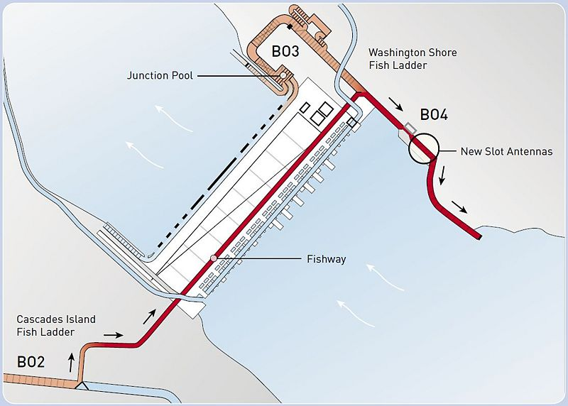{width=100%}

## BO1: Bonneville Bradford Island Ladder

Starting with configuration 110, BO1 has upper and lower coils

### Antenna group configuration 100
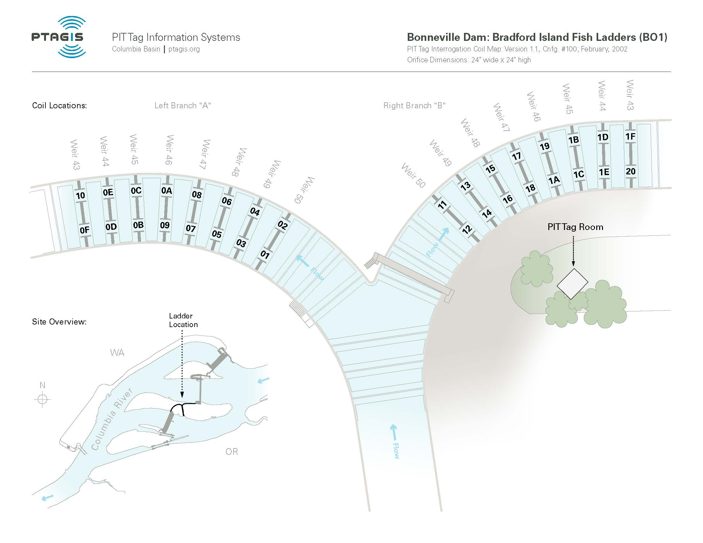{width=100%}

Given that BO1_100 coils are all in the lower weirs, we're not going to distinguish them based on specific antennas, and instead will rely just on the antenna_group_configuration variable.


```{r eval = FALSE}
  range: 7-Mar-02 24-Feb-06
  {
    R: U : 8 : LEFT BRANCH WEIR 50 : 01 02
    R: U : 7 : LEFT BRANCH WEIR 49 : 03 04
    R: U : 6 : LEFT BRANCH WEIR 48 : 05 06
    R: U : 5 : LEFT BRANCH WEIR 47 : 07 08
    R: U : 4 : LEFT BRANCH WEIR 46 : 09 0A
    R: U : 3 : LEFT BRANCH WEIR 45 : 0B 0C
    R: U : 2 : LEFT BRANCH WEIR 44 : 0D 0E
    R: U : 1 : LEFT BRANCH WEIR 43 : 0F 10
    R: U : 8 : RIGHT BRANCH WEIR 50 : 11 12
    R: U : 7 : RIGHT BRANCH WEIR 49 : 13 14
    R: U : 6 : RIGHT BRANCH WEIR 48 : 15 16
    R: U : 5 : RIGHT BRANCH WEIR 47 : 17 18
    R: U : 4 : RIGHT BRANCH WEIR 46 : 19 1A
    R: U : 3 : RIGHT BRANCH WEIR 45 : 1B 1C
    R: U : 2 : RIGHT BRANCH WEIR 44 : 1D 1E
    R: U : 1 : RIGHT BRANCH WEIR 43 : 1F 20
  }
```


### Antenna group configuration 110
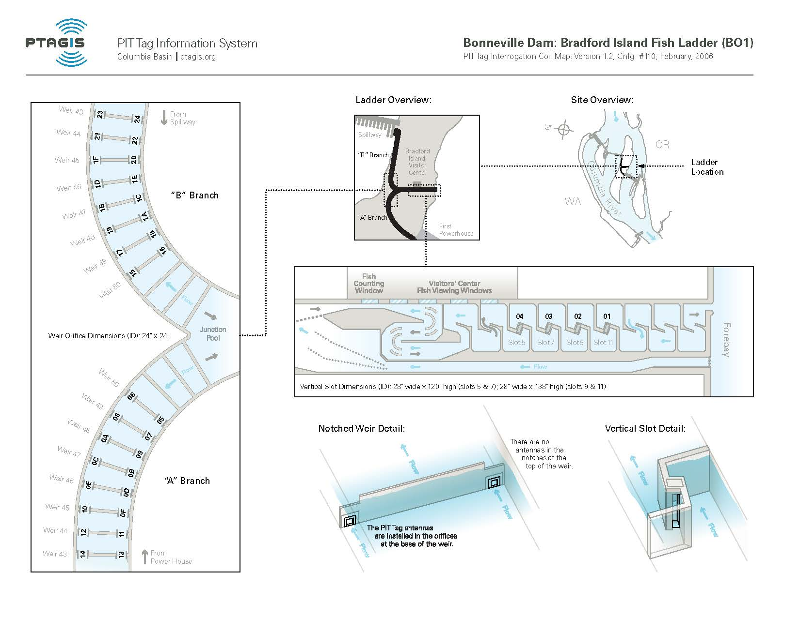{width=100%}
```{r BO1_110}
BO1_110_upper <- c("01", "02", "03", "04")

BO1_110_lower <- c("05", "06", "07", "08", "09", "0A",
                   "0B", "0C", "0D", "0E", "0F", "10",
                   "11", "12", "13", "14",
                   "15", "16", "17", "18", "19", 
                   "1A","1B", "1C", "1D", "1E", "1F",
                   "20", "21", "22", "23", "24")
```

```{r eval = FALSE}
  range: 24-Feb-06 30-Apr-18
  {
    R: U : 9 : VERTICAL SLOT DETECTORS : 01 02 03 04
    R: U : 8 : A-BRANCH WEIR 50 : 05 06
    R: U : 7 : A-BRANCH WEIR 49 : 07 08
    R: U : 6 : A-BRANCH WEIR 48 : 09 0A
    R: U : 5 : A-BRANCH WEIR 47 : 0B 0C
    R: U : 4 : A-BRANCH WEIR 46 : 0D 0E
    R: U : 3 : A-BRANCH WEIR 45 : 0F 10
    R: U : 2 : A-BRANCH WEIR 44 : 11 12
    R: U : 1 : A-BRANCH WEIR 43 : 13 14
    R: U : 8 : B-BRANCH WEIR 50 : 15 16
    R: U : 7 : B-BRANCH WEIR 49 : 17 18
    R: U : 6 : B-BRANCH WEIR 48 : 19 1A
    R: U : 5 : B-BRANCH WEIR 47 : 1B 1C
    R: U : 4 : B-BRANCH WEIR 46 : 1D 1E
    R: U : 3 : B-BRANCH WEIR 45 : 1F 20
    R: U : 2 : B-BRANCH WEIR 44 : 21 22
    R: U : 1 : B-BRANCH WEIR 43 : 23 24
  }
```


### Antenna group configuration 120

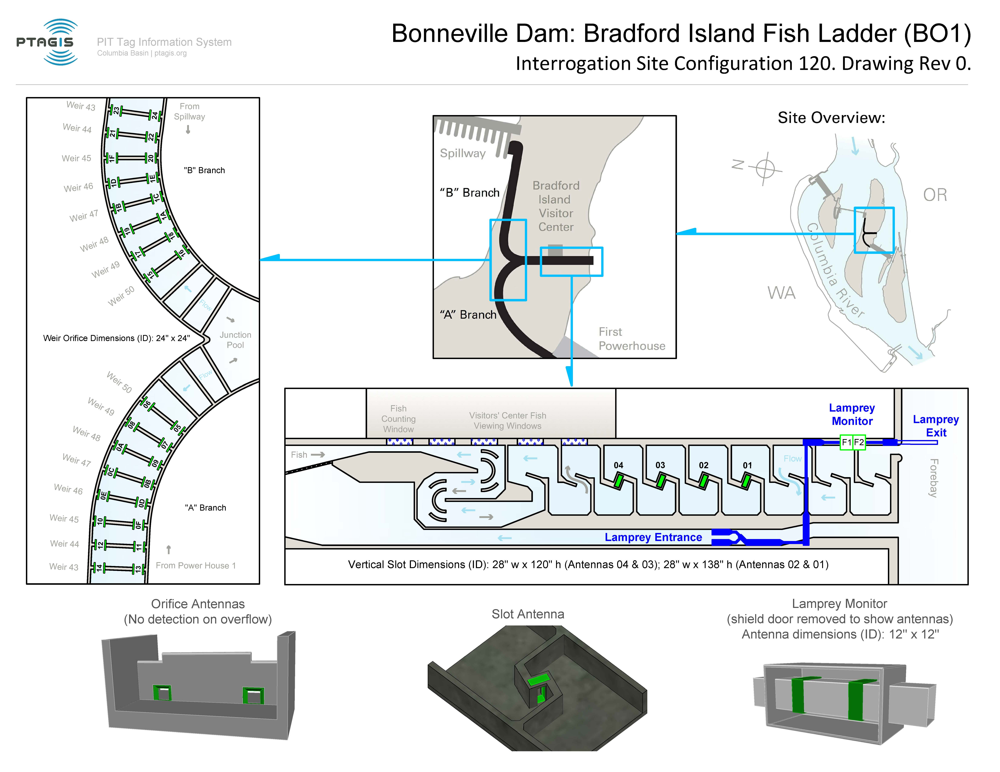{width=100%}

```{r BO1_120}
BO1_120_upper <- c("01", "02", "03", "04")

BO1_120_lower <- c("05", "06", "07", "08", "09", "0A",
                   "0B", "0C", "0D", "0E", "0F", "10",
                   "11", "12", "13", "14",
                   "15", "16", "17", "18", "19", 
                   "1A","1B", "1C", "1D", "1E", "1F",
                   "20", "21", "22", "23", "24")
```

For our purposes, BO1 120 is the same as B01 110, since the only difference is the installation of lamprey monitors.

```{r eval = FALSE}
range: 30-Apr-18 Present
  {
    R: U : 9 : VERTICAL SLOT DETECTORS : 01 02 03 04
    R: U : 8 : A-BRANCH WEIR 50 : 05 06
    R: U : 7 : A-BRANCH WEIR 49 : 07 08
    R: U : 6 : A-BRANCH WEIR 48 : 09 0A
    R: U : 5 : A-BRANCH WEIR 47 : 0B 0C
    R: U : 4 : A-BRANCH WEIR 46 : 0D 0E
    R: U : 3 : A-BRANCH WEIR 45 : 0F 10
    R: U : 2 : A-BRANCH WEIR 44 : 11 12
    R: U : 1 : A-BRANCH WEIR 43 : 13 14
    R: U : 8 : B-BRANCH WEIR 50 : 15 16
    R: U : 7 : B-BRANCH WEIR 49 : 17 18
    R: U : 6 : B-BRANCH WEIR 48 : 19 1A
    R: U : 5 : B-BRANCH WEIR 47 : 1B 1C
    R: U : 4 : B-BRANCH WEIR 46 : 1D 1E
    R: U : 3 : B-BRANCH WEIR 45 : 1F 20
    R: U : 2 : B-BRANCH WEIR 44 : 21 22
    R: U : 1 : B-BRANCH WEIR 43 : 23 24
    U: U : 0 : Lamprey Passage : F1 F2
  }
```


## B02: Bonneville Dam: Cascades Island Fish Ladder

BO2 has 14 coils, all near the exit of the fish ladder. In 2022, four new coils were installed in the upstream migration transportation (UMT) channel and the counting window, with fish being routed through either of these two routes using picketed leads. However, for our purposes, we will treat all of these coils the same.

### Antenna group configuration 100

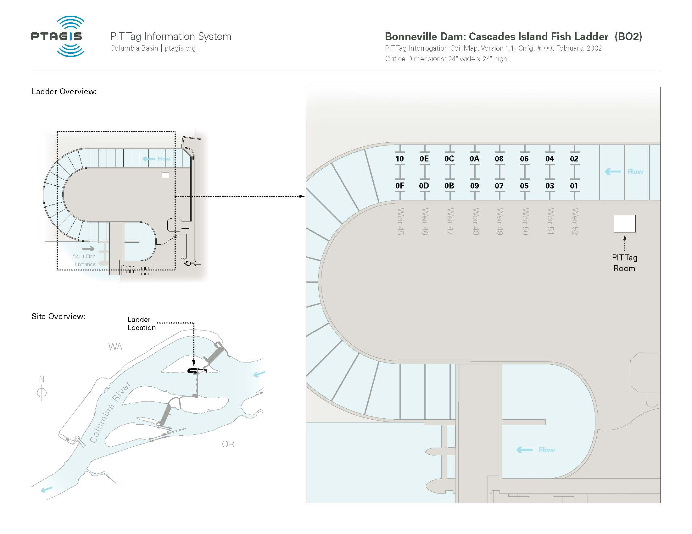{width=100%}

```{r eval = FALSE}
  range: 13-Mar-02 1-May-18
  {
    R: U : 8 : WEIR 52 : 01 02
    R: U : 7 : WEIR 51 : 03 04
    R: U : 6 : WEIR 50 : 05 06
    R: U : 5 : WEIR 49 : 07 08
    R: U : 4 : WEIR 48 : 09 0A
    R: U : 3 : WEIR 47 : 0B 0C
    R: U : 2 : WEIR 46 : 0D 0E
    R: U : 1 : WEIR 45 : 0F 10
  }
```


### Antenna group configuration 110

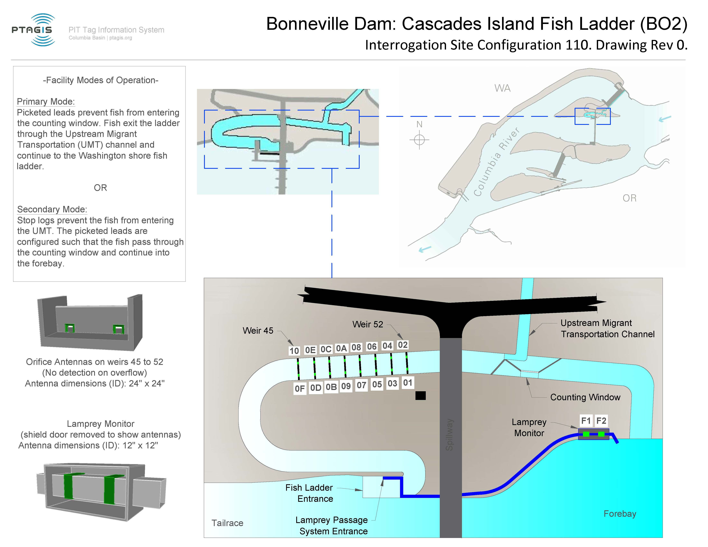{width=100%}

```{r eval = FALSE}
  range: 1-May-18 9-Feb-22
  {
    R: U : 8 : WEIR 52 : 01 02
    R: U : 7 : WEIR 51 : 03 04
    R: U : 6 : WEIR 50 : 05 06
    R: U : 5 : WEIR 49 : 07 08
    R: U : 4 : WEIR 48 : 09 0A
    R: U : 3 : WEIR 47 : 0B 0C
    R: U : 2 : WEIR 46 : 0D 0E
    R: U : 1 : WEIR 45 : 0F 10
    U: U : 0 : Lamprey Passage : F1 F2
  }
```


### Antenna group configuration 120

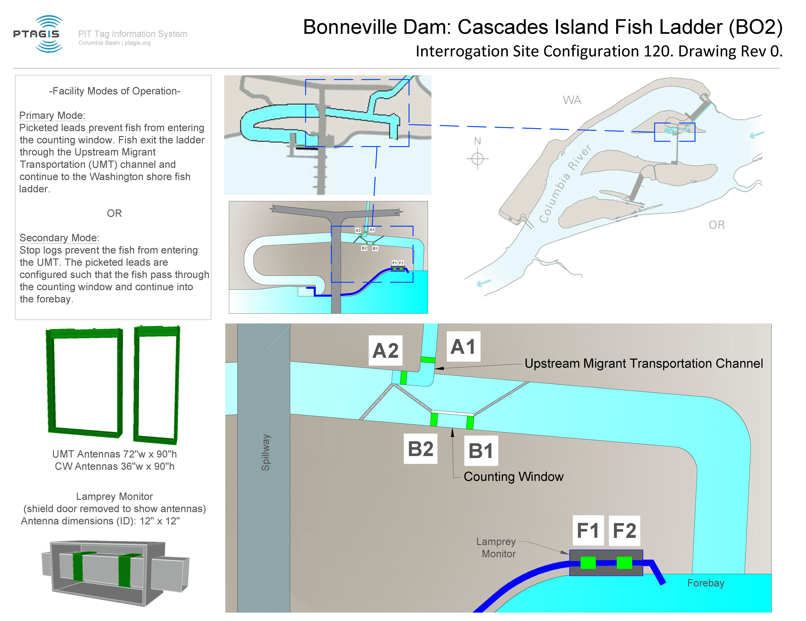{width=100%}
```{r eval = FALSE}
  range: 9-Feb-22 Present
  {
    U: U : 0 : UMT Entrance : A1 A2
    U: U : 0 : Counting Window : B1 B2
    U: U : 0 : Lamprey Passage : F1 F2
  }
```

## BO3: Bonneville Dam Washington Shore Fish Ladder and AFF

Over the course of our study, the site configuration of BO3 has not changed.

BO3 has three groups of coils:
1) The lower weirs
2) The upper weirs
3) the fish trap

### Antenna configuration 110

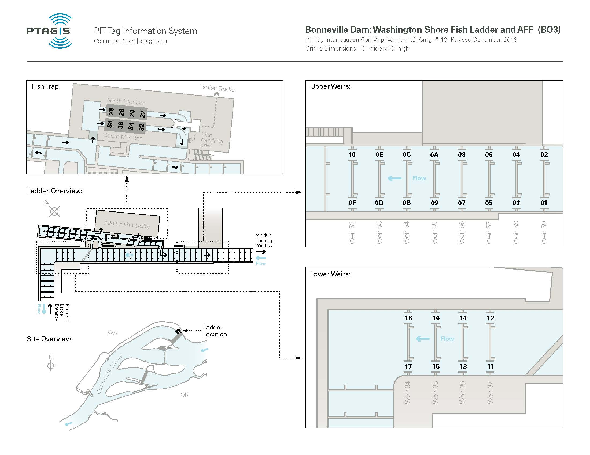{width=100%}


```{r BO3_110}
BO3_lower <- as.character(c(11, 12, 13, 14, 15, 16, 17, 18))

BO3_upper <- c("01", "02", "03", "04", "05", "06", "07", "08" , "09", "0A",
               "0B", "0C", "0D", "0E", "0F", 10)

BO3_AFF <- as.character(c(22, 24, 26, 28, 32, 34, 36, 38))
```

```{r eval = FALSE}
  range: 15-Dec-03 Present
  {
    R: U : 13 : WEIR 59 : 01 02
    R: U : 12 : WEIR 58 : 03 04
    R: U : 11 : WEIR 57 : 05 06
    R: U : 10 : WEIR 56 : 07 08
    R: U : 9 : WEIR 55 : 09 0A
    R: U : 8 : WEIR 54 : 0B 0C
    R: U : 7 : WEIR 53 : 0D 0E
    R: U : 6 : WEIR 52 : 0F 10
    R: U : 4 : WEIR 37 : 11 12
    R: U : 3 : WEIR 36 : 13 14
    R: U : 2 : WEIR 35 : 15 16
    R: U : 1 : WEIR 34 : 17 18
    R: U : 5 : AFF NORTH FLUME [ISO 134KHZ] : 22 24 26 28
    R: U : 5 : AFF SOUTH FLUME [ISO 134KHZ] : 32 34 36 38
  }
```

## BO4: 

For our purposes, the antenna configuration at BO4 has not changed over time, since the only change from 100 to 110 was the installation of lamprey passage detectors.
```{r eval = FALSE}
  range: 15-Jun-17 Present
  {
    R: U : 0 : VERTICAL SLOT DETECTORS : 01 02 03 04
    R: U : 0 : Lamprey Passage : F1 F2
  }
```

```{r eval = FALSE}
  range: 28-Feb-05 15-Jun-17
  {
    R: U : 0 : VERTICAL SLOT DETECTORS : 01 02 03 04
  }
```


### Antenna configuration 100
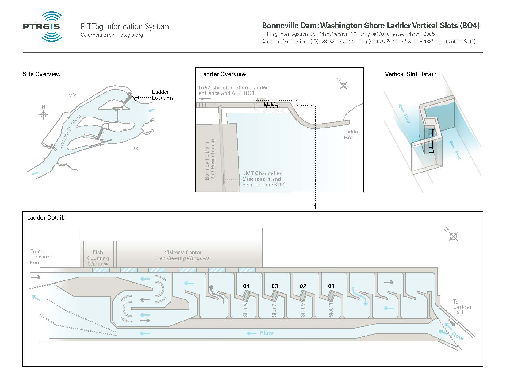{width=100%}

### Antenna configuration 110
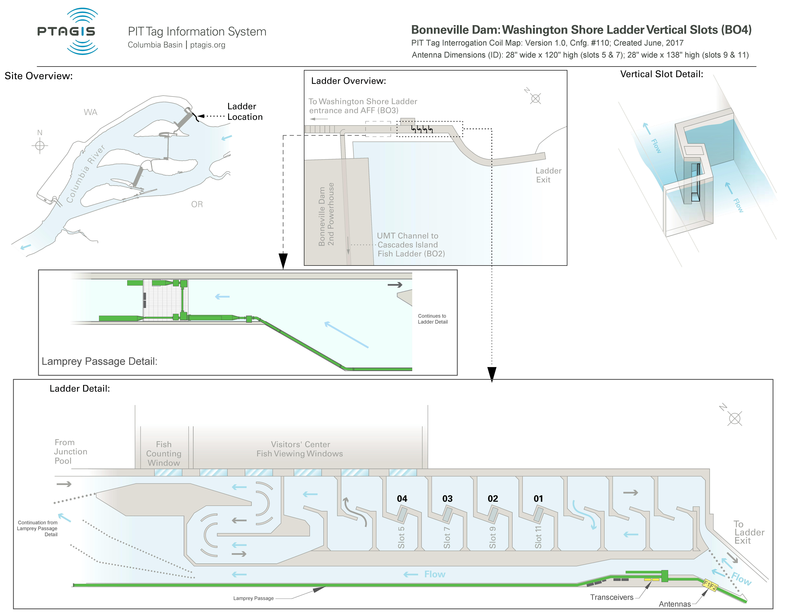{width=100%}


# McNary Dam

### Overview
McNary Dam has two ladders which are separate event sites in PTAGIS - MC1 (Oregon Ladder) and MC2 (Washington Ladder)

## MC1: McNary Lock & Dam, Oregon Ladder

The antenna configuration at MC1 has not changed. MC1 has two sets of coils, one at the counting window and one in the lower weirs.

### Antenna configuration 100
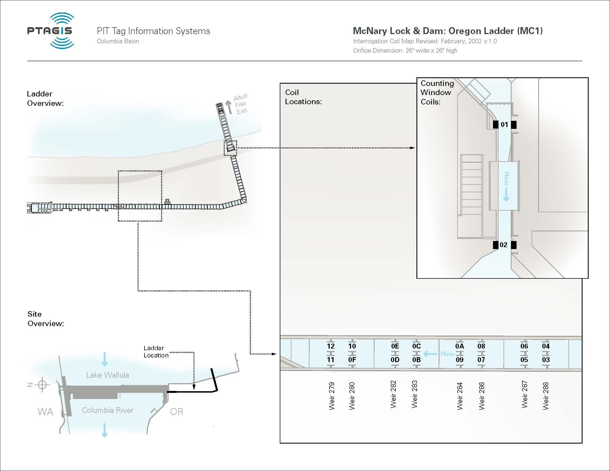{width=100%}

```{r MC1_100}
MC1_upper <- c("01", "02")
MC1_lower <- c("03", "04", "05", "06", "07", "08", "09",
               "0A", "0B", "0C", "0D", "0E", "0F", 10, 11, 12)
```

```{r eval = FALSE}
  range: 7-Mar-02 Present
  {
    R: U : 9 : COUNTING WINDOW : 01 02
    R: U : 8 : WEIR 288 : 03 04
    R: U : 7 : WEIR 287 : 05 06
    R: U : 6 : WEIR 286 : 07 08
    R: U : 5 : WEIR 284 : 09 0A
    R: U : 4 : WEIR 283 : 0B 0C
    R: U : 3 : WEIR 282 : 0D 0E
    R: U : 2 : WEIR 280 : 0F 10
    R: U : 1 : WEIR 279 : 11 12
  }
```


## MC2: McNary Lock & Dam, Washington Ladder

### Antenna configuration 110
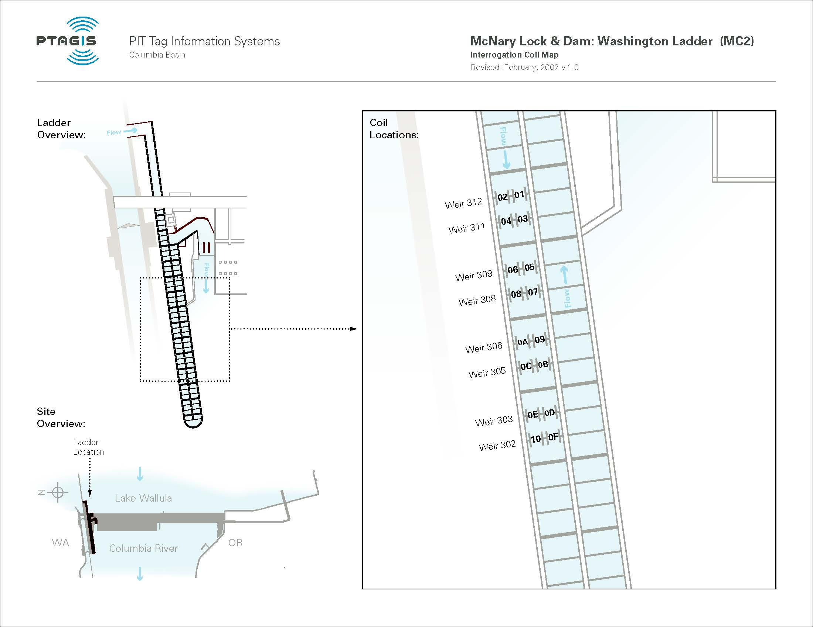{width=100%}
MC2 110 only has antennas in the lower weirs.

```{r eval = FALSE}
  range: 7-Mar-02 1-Mar-06
  {
    R: U : 8 : WEIR 312 : 01 02
    R: U : 7 : WEIR 311 : 03 04
    R: U : 6 : WEIR 309 : 05 06
    R: U : 5 : WEIR 308 : 07 08
    R: U : 4 : WEIR 306 : 09 0A
    R: U : 3 : WEIR 305 : 0B 0C
    R: U : 2 : WEIR 303 : 0D 0E
    R: U : 1 : WEIR 302 : 0F 10
  }
```


### Antenna configuration 120

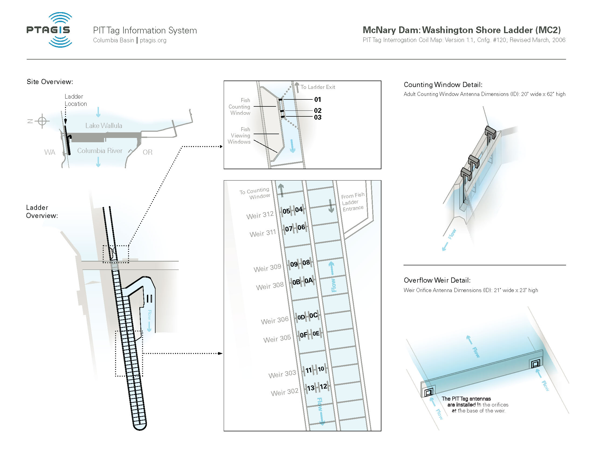{width=100%}

MC2 120 has antennas in the lower weirs, and then at the top at the counting window.

```{r MC2_120}
MC2_120_upper <- c("01", "02", "03")
MC2_120_lower <- c("04", "05", "06", "07", "08", "09",
               "0A", "0B", "0C", "0D", "0E", "0F", 10, 11, 12, 13)
```

```{r eval = FALSE}
  range: 1-Mar-06 Present
  {
    R: U : 9 : COUNTING WINDOW : 01 02 03
    R: U : 8 : WEIR 312 : 04 05
    R: U : 7 : WEIR 311 : 06 07
    R: U : 6 : WEIR 309 : 08 09
    R: U : 5 : WEIR 308 : 0A 0B
    R: U : 4 : WEIR 306 : 0C 0D
    R: U : 3 : WEIR 305 : 0E 0F
    R: U : 2 : WEIR 303 : 10 11
    R: U : 1 : WEIR 302 : 12 13
  }
```


## Priest Rapids

### Overview
There are two ladders at PRA, a west and an east shore ladder. Each of these ladders only has one set of coils by the exit of the fish ladder. In 2007, a set of coils was also installed in the fish trap in the east ladder.


### Antenna configuration 100
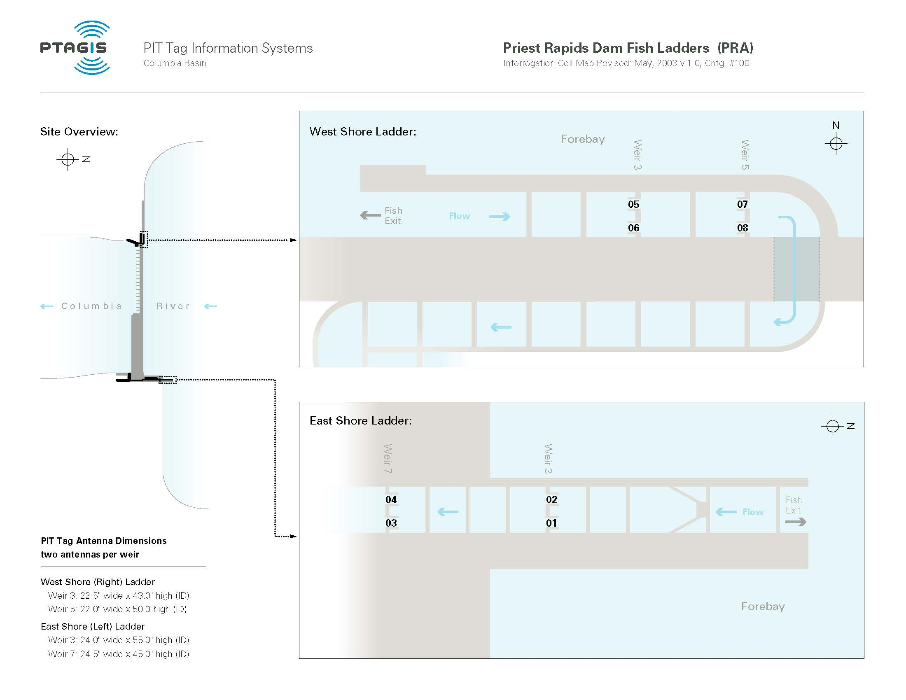{width=100%}

```{r PRA_100}
PRA_100_east <- c("01", "02", "03", "04")
PRA_100_west <- c("05", "06", "07", "08")
```

```{r eval = FALSE}
  range: 6-Dec-02 5-Jun-07
  {
    R: U : 3 : LEFT LADDER WEIR 3 : 01 02
    R: U : 2 : LEFT LADDER WEIR 7 : 03 04
    R: U : 2 : RIGHT LADDER WEIR 3 : 05 06
    R: U : 1 : RIGHT LADDER WEIR 5 : 07 08
  }
```

### Antenna configuration 110
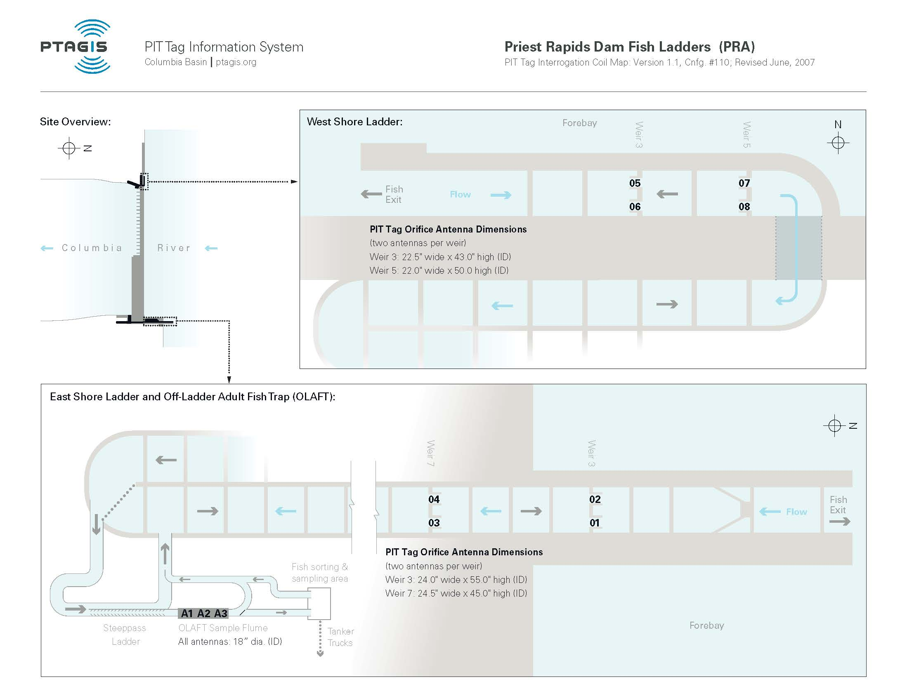{width=100%}

```{r PRA_110}
PRA_110_east <- c("01", "02", "03", "04")
PRA_110_west <- c("05", "06", "07", "08")
PRA_110_AFF <- c("A1", "A2", "A3")
```

```{r eval = FALSE}
  range: 5-Jun-07 Present
  {
    R: U : 3 : LEFT [EAST] LADDER WEIR 3 : 01 02
    R: U : 2 : LEFT [EAST] LADDER WEIR 7 : 03 04
    R: U : 2 : RIGHT [WEST] LADDER WEIR 3 : 05 06
    R: U : 1 : RIGHT [WEST] LADDER WEIR 5 : 07 08
    R: U : 1 : LEFT [EAST] LADDER ADULT TRAP : A1 A2 A3
  }
```


## Rock Island Dam

### Overview
The RIA (Rock Island Adult) event site has three separate ladders:
1) Left Ladder
2) Middle Ladder
3) Right Ladder

In each ladder, there is a set of four antennas near the exit.

### Antenna configuration 100
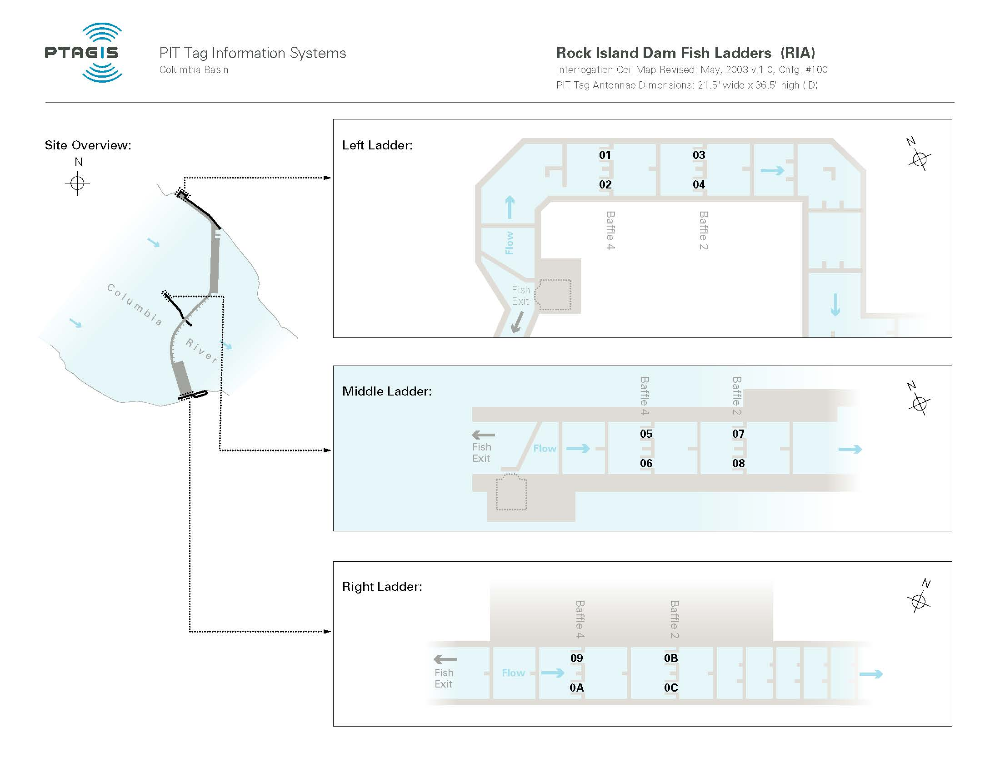{width=100%}

```{r RIA_100}
RIA_100_left <- c("01", "02", "03", "04")
RIA_100_middle <- c("05", "06", "07", "08")
RIA_100_right <- c("09", "0A", "0B", "0C")
```

```{r eval = FALSE}
  range: 1-Feb-03 5-Aug-14
  {
    R: U : 2 : LEFT LADDER BAFFLE 4 : 01 02
    R: U : 1 : LEFT LADDER BAFFLE 2 : 03 04
    R: U : 2 : MIDDLE LADDER BAFFLE 4 : 05 06
    R: U : 1 : MIDDLE LADDER BAFFLE 2 : 07 08
    R: U : 2 : RIGHT LADDER BAFFLE 4 : 09 0A
    R: U : 1 : RIGHT LADDER BAFFLE 2 : 0B 0C
  }
```


### Antenna configuration 110
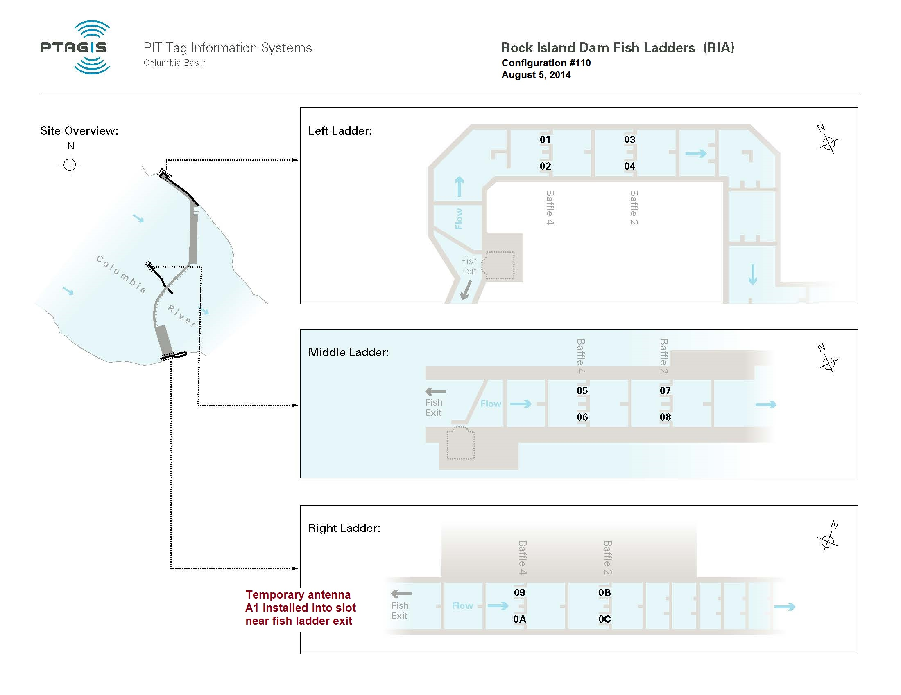{width=100%}

```{r RIA_110}
RIA_110_left <- c("01", "02", "03", "04")
RIA_110_middle <- c("05", "06", "07", "08")
RIA_110_right <- c("09", "0A", "0B", "0C", "A1")
```

```{r eval = FALSE}
  range: 5-Aug-14 7-Feb-15
  {
    R: U : 2 : LEFT LADDER BAFFLE 4 : 01 02
    R: U : 1 : LEFT LADDER BAFFLE 2 : 03 04
    R: U : 2 : MIDDLE LADDER BAFFLE 4 : 05 06
    R: U : 1 : MIDDLE LADDER BAFFLE 2 : 07 08
    R: U : 2 : RIGHT LADDER BAFFLE 4 : 09 0A
    R: U : 1 : RIGHT LADDER BAFFLE 2 : 0B 0C
    R: U : 3 : Temporary Antenna : A1
  }
```


### Antenna configuration 120

{width=100%}
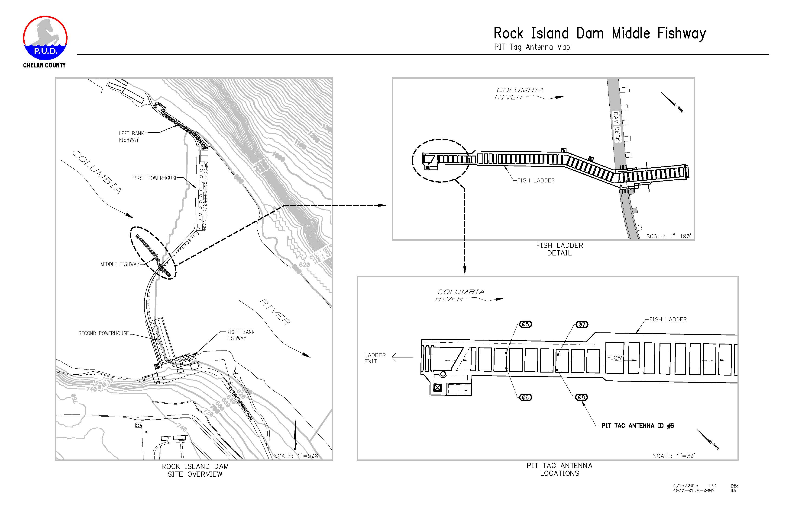{width=100%}

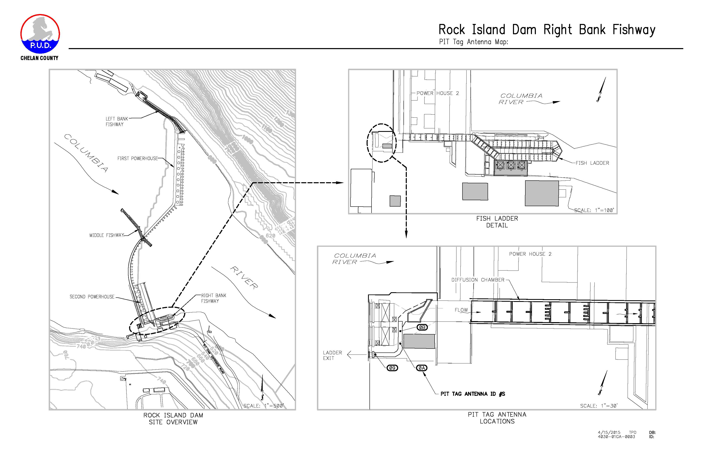{width=100%}

```{r RIA_120}
RIA_120_left <- c("01", "02", "03", "04")
RIA_120_middle <- c("05", "06", "07", "08")
RIA_120_right <- c("09", "0A", "0B")
```

```{r eval = FALSE}
  range: 7-Feb-15 12-Aug-15
  {
    R: U : 2 : LEFT LADDER BAFFLE 4 : 01 02
    R: U : 1 : LEFT LADDER BAFFLE 2 : 03 04
    R: U : 2 : MIDDLE LADDER BAFFLE 4 : 05 06
    R: U : 1 : MIDDLE LADDER BAFFLE 2 : 07 08
    R: U : 0 : Right Ladder Exit Channel : 09 0A 0B
  }
```


### Antenna configuration 130

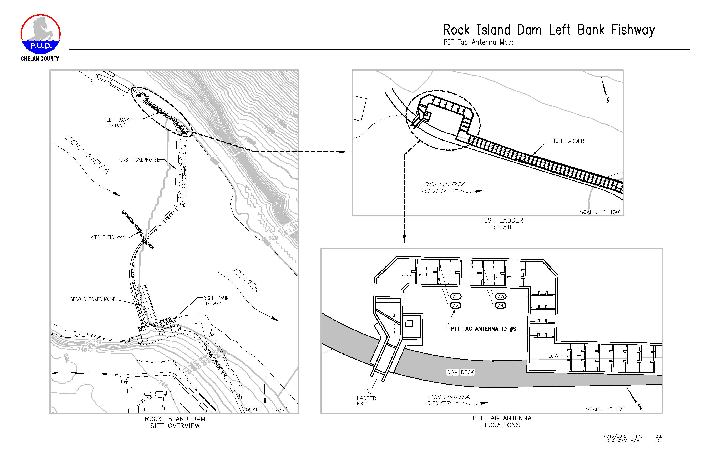{width=100%}

{width=100%}

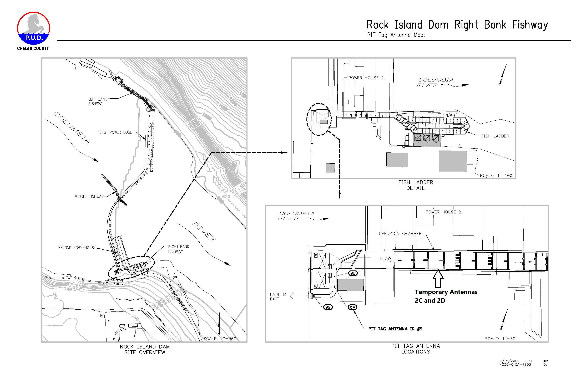{width=100%}

```{r RIA_130}
RIA_130_left <- c("01", "02", "03", "04")
RIA_130_middle <- c("05", "06", "07", "08")
RIA_130_right <- c("09", "0A", "0B", "2C", "2D")
```

```{r eval = FALSE}
  range: 12-Aug-15 21-Feb-19
  {
    R: U : 2 : LEFT LADDER BAFFLE 4 : 01 02
    R: U : 1 : LEFT LADDER BAFFLE 2 : 03 04
    R: U : 2 : MIDDLE LADDER BAFFLE 4 : 05 06
    R: U : 1 : MIDDLE LADDER BAFFLE 2 : 07 08
    R: U : 3 : Right Ladder Exit Channel : 09 0A 0B
    R: U : 2 : Right Ladder Baffle 4 : 2C 2D
  }
```


  
### Antenna configuration 140

In configuration 140, there are some additional antennas installed in the weirs close to the exit in the right ladder. I don't think these are far apart enough from the exit antennas though to be considered in the lower part of the ladder.

{width=100%}

{width=100%}

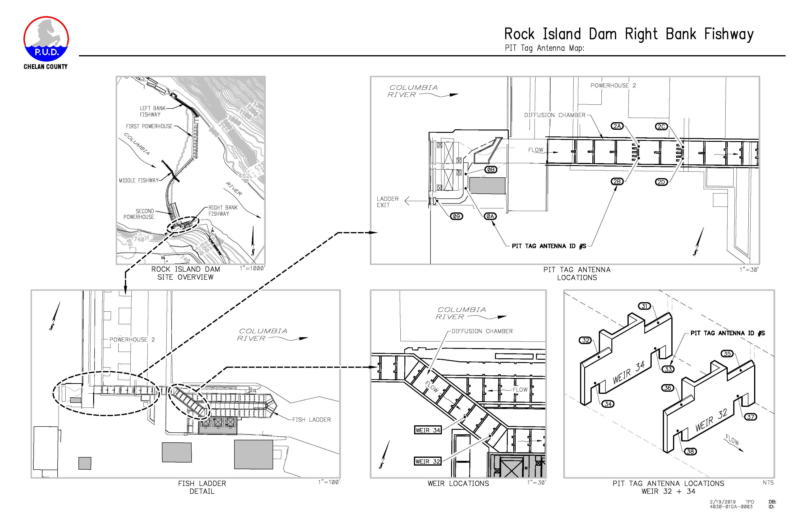{width=100%}

```{r RIA_140}
RIA_140_left <- c("01", "02", "03", "04")
RIA_140_middle <- c("05", "06", "07", "08")
RIA_140_right <- c("09", "0A", "0B", "2A", "2B", "2C", "2D",
                   31, 32, 33, 34, 35, 36, 37, 38)
```


```{r eval = FALSE}
  range: 21-Feb-19 Present
  {
    R: U : 0 : LEFT LADDER BAFFLE 4 : 01 02
    R: U : 0 : LEFT LADDER BAFFLE 2 : 03 04
    R: U : 0 : MIDDLE LADDER BAFFLE 4 : 05 06
    R: U : 0 : MIDDLE LADDER BAFFLE 2 : 07 08
    R: U : 0 : Right Ladder Exit Channel : 09 0A 0B
    R: U : 0 : Right Ladder Baffle 2 : 2A 2B
    R: U : 0 : Right Ladder Baffle 4 : 2C 2D
    R: U : 0 : Right Ladder Weir 34 : 31 32 33 34
    R: U : 0 : Right Ladder Weir 32 : 35 36 37 38
  }
```

## Rocky Reach Dam

### Overview
Rocky Reach Dam is a relatively simple site, with only a set of antennas at the exit of the adult fish ladder. The only odd thing is that an antenna was added in April 2014 in the trap.

### Antenna configuration 100
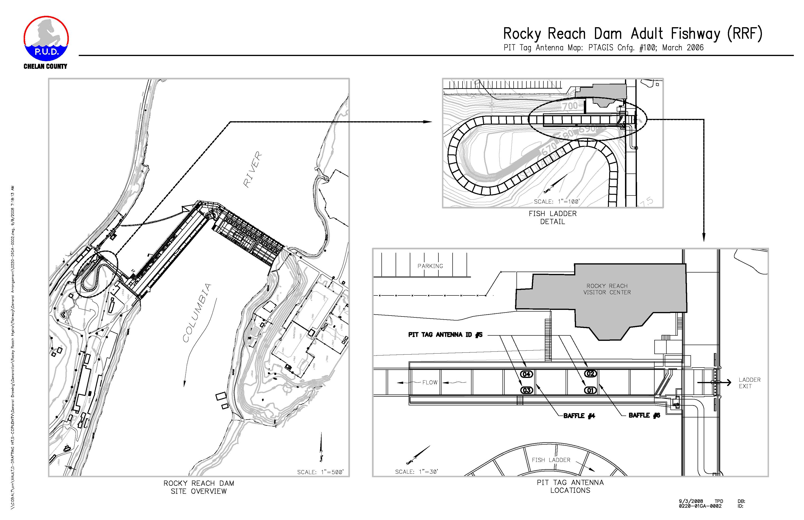{width=100%}

```{r eval = FALSE}
  range: 1-Mar-06 22-Apr-14
  {
    R: U : 2 : WEIR 6 : 01 02
    R: U : 1 : WEIR 4 : 03 04
  }
```

  
```{r RRF_100}
RRF_100 <- c("01", "02", "03", "04")
```


### Antenna configuration 110
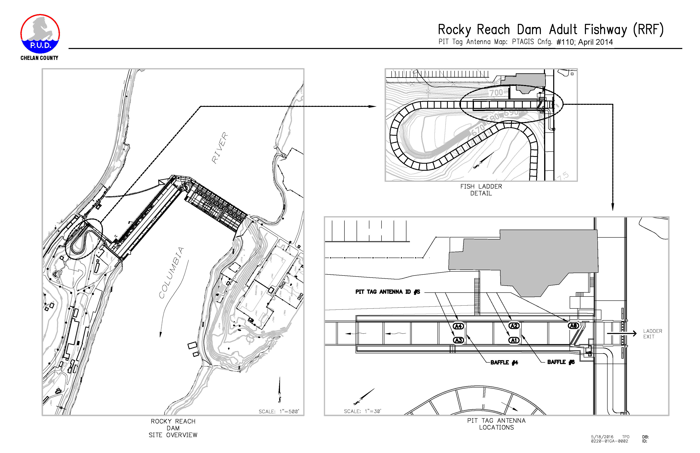{width=100%}
```{r eval = FALSE}
  range: 22-Apr-14 Present
  {
    U: U : 3 : Trap : A0
    R: U : 2 : Upper Weir : A1 A2
    R: U : 1 : Lower Weir : A3 A4
  }
```


```{r RRF_110}
RRF_110 <- c("A1", "A2", "A3", "A4")
RRF_110_trap <- c("A0")
```


## Wells Dam

### Overview
Wells Dam has seven different configurations for our study duration. No site configuration diagrams exist for configurations 130 and 140.

There are two ladders at Wells Dam (left and right ladders), each with a trap.

### Antenna configuration 110

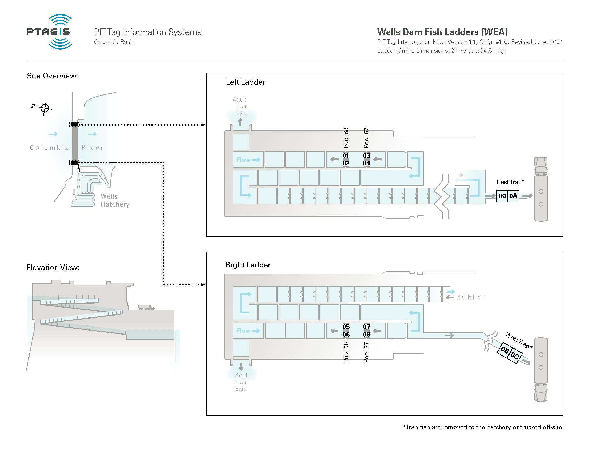{width=100%}

```{r WEA_110}
WEA_110_left <- c("01", "02", "03", "04")
WEA_110_right <- c("05", "06", "07", "08")
WEA_110_left_trap <- c("09", "0A")
WEA_110_right_trap <- c("0B", "0C")
```

```{r eval = FALSE}
  range: 28-Jun-04 12-May-08
  {
    R: U : 3 : LEFT LADDER POOL 68 : 01 02
    R: U : 2 : LEFT LADDER POOL 67 : 03 04
    R: U : 3 : RIGHT LADDER POOL 68 : 05 06
    R: U : 2 : RIGHT LADDER POOL 67 : 07 08
    R: U : 1 : EAST TRAP : 09 0A
    U: U : 1 : WEST TRAP : 0B 0C
  }
```

### Antenna configuration 120
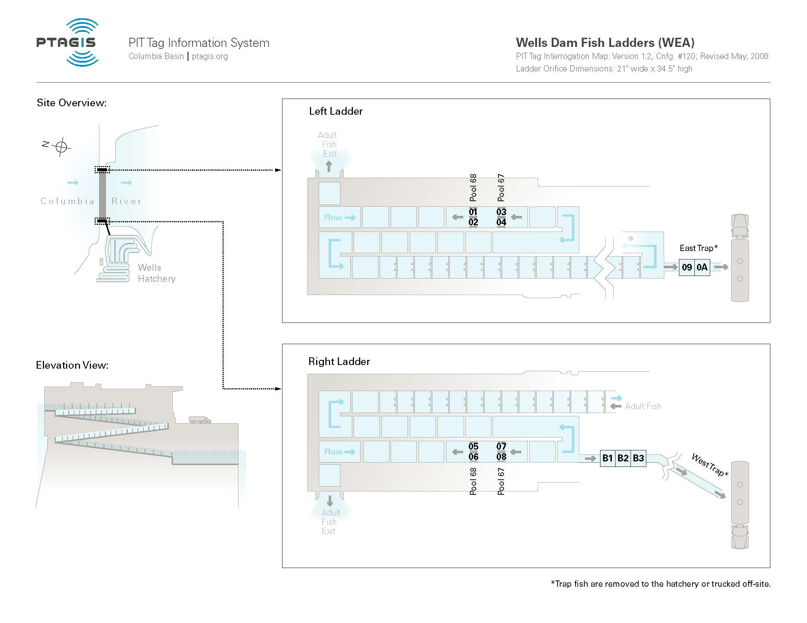{width=100%}

```{r WEA_120}
WEA_120_left <- c("01", "02", "03", "04")
WEA_120_right <- c("05", "06", "07", "08")
WEA_120_left_trap <- c("09", "0A")
WEA_120_right_trap <- c("B1", "B2", "B3")
```

```{r eval = FALSE}
  range: 12-May-08 2-Mar-12
  {
    R: U : 3 : LEFT LADDER POOL 68 : 01 02
    R: U : 2 : LEFT LADDER POOL 67 : 03 04
    R: U : 3 : RIGHT LADDER POOL 68 : 05 06
    R: U : 2 : RIGHT LADDER POOL 67 : 07 08
    R: U : 1 : EAST TRAP : 09 0A
    U: U : 1 : WEST TRAP : B1 B2 B3
  }
```


### Antenna configuration 130
F3 and F4 are in a lower pool in the right ladder.
```{r WEA_130}
WEA_130_left_upper <- c("01", "02", "03", "04")
WEA_130_right_upper <- c("05", "06", "07", "08")
WEA_130_right_lower <- c("F3", "F4")
WEA_130_left_trap <- c("09", "0A")
WEA_130_right_trap <- c("B1", "B2", "B3")
```

```{r eval = FALSE}
  range: 2-Mar-12 19-Dec-12
  {
    R: U : 3 : LEFT LADDER POOL 68 : 01 02
    R: U : 2 : LEFT LADDER POOL 67 : 03 04
    R: U : 3 : RIGHT LADDER POOL 68 : 05 06
    R: U : 2 : RIGHT LADDER POOL 67 : 07 08
    R: U : 1 : EAST TRAP : 09 0A
    U: U : 1 : WEST TRAP : B1 B2 B3
    R: U : 0 : RIGHT LADDER POOL 19 : F3 F4
  }
```
  
### Antenna configuration 140
F1 and F2 are in a lower pool in the left ladder; F3 and F4 are in a lower pool in the right ladder.
```{r WEA_140}
WEA_140_left_upper <- c("01", "02", "03", "04")
WEA_140_left_lower <- c("F1", "F2")
WEA_140_right_upper <- c("05", "06", "07", "08")
WEA_140_right_lower <- c("F3", "F4")
WEA_140_left_trap <- c("09", "0A")
WEA_140_right_trap <- c("B1", "B2", "B3")
```

```{r eval = FALSE}
  range: 19-Dec-12 16-Feb-16
  {
    R: U : 3 : Left Ladder Pool 68 : 01 02
    R: U : 2 : Left Ladder Pool 67 : 03 04
    R: U : 3 : RIGHT LADDER POOL 68 : 05 06
    R: U : 2 : RIGHT LADDER POOL 67 : 07 08
    R: U : 1 : East Trap : 09 0A
    R: U : 1 : West Trap : B1 B2 B3
    R: U : 0 : Left Ladder Pool 19 : F1 F2
    R: U : 0 : RIGHT LADDER POOL 19 : F3 F4
  }
```  
  
### Antenna configuration 150
F1, F2, F3, and F4 have been renamed to A1, A2, A3, and A4.

We will ignore FA and Fb because those are lamprey entrances.
```{r WEA_150}
WEA_150_left_upper <- c("01", "02", "03", "04")
WEA_150_left_lower <- c("A1", "A2")
WEA_150_right_upper <- c("05", "06", "07", "08")
WEA_150_right_lower <- c("A3", "A4")
WEA_150_left_trap <- c("09", "0A")
WEA_150_right_trap <- c("B1", "B2", "B3")
```


```{r eval = FALSE}
  range: 16-Feb-16 8-Jun-16
  {
    R: U : 3 : Left Ladder Pool 68 : 01 02
    R: U : 2 : Left Ladder Pool 67 : 03 04
    R: U : 3 : Right Ladder Pool 68 : 05 06
    R: U : 2 : Right Ladder Pool 67 : 07 08
    R: U : 1 : East Trap : 09 0A
    R: U : 0 : Left Ladder Pool 19 : A1 A2
    R: U : 0 : Right Ladder Pool 19 : A3 A4
    R: U : 1 : West Trap : B1 B2 B3
    R: U : 0 : Left Ladder Lamprey Entrance : FA
    R: U : 0 : Right Ladder Lamprey Entrance : FB
  }
```  
  
### Antenna configuration 160

Configuration 160 has added antennas in the AFF, which is in the right ladder

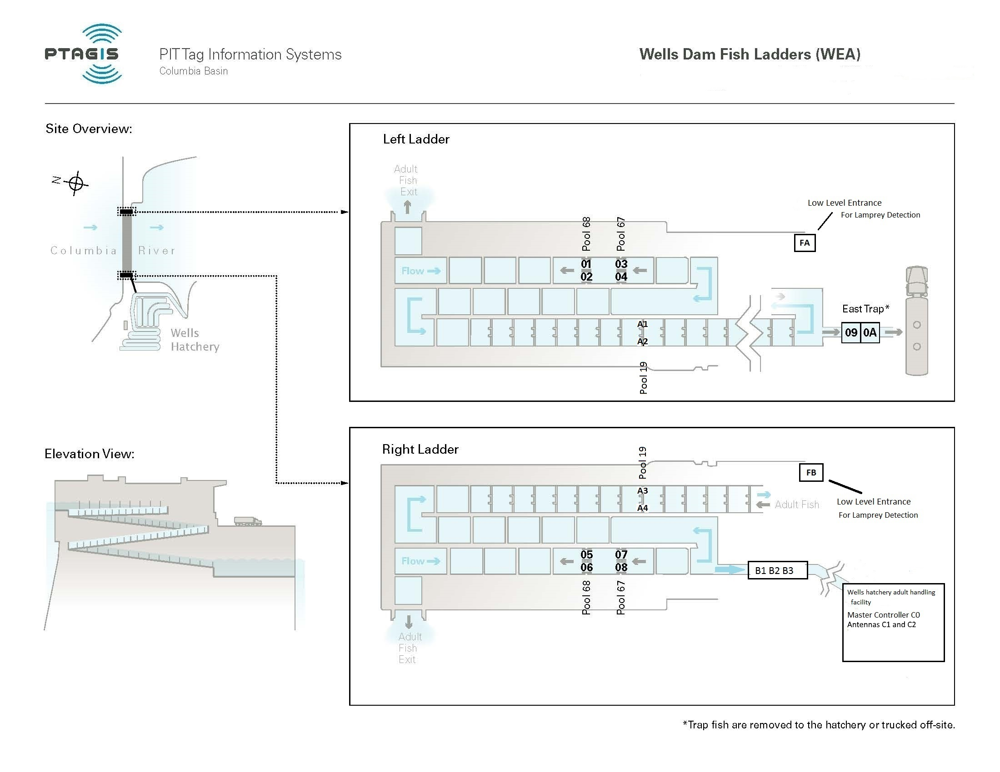{width=100%}

```{r WEA_160}
WEA_160_left_upper <- c("01", "02", "03", "04")
WEA_160_left_lower <- c("A1", "A2")
WEA_160_right_upper <- c("05", "06", "07", "08")
WEA_160_right_lower <- c("A3", "A4")
WEA_160_left_trap <- c("09", "0A")
WEA_160_right_trap <- c("B1", "B2", "B3")
WEA_160_right_AFF <- c("C1", "C2")
```

```{r eval = FALSE}
  range: 8-Jun-16 31-May-18
  {
    R: U : 3 : Left Ladder Pool 68 : 01 02
    R: U : 2 : Left Ladder Pool 67 : 03 04
    R: U : 3 : Right Ladder Pool 68 : 05 06
    R: U : 2 : Right Ladder Pool 67 : 07 08
    R: U : 1 : East Trap : 09 0A
    R: U : 0 : Left Ladder Pool 19 : A1 A2
    R: U : 0 : Right Ladder Pool 19 : A3 A4
    R: U : 1 : West Trap : B1 B2 B3
    R: U : 0 : Adult Handling Facility Volunteer-channel Entrance : C1 C2
    R: U : 0 : Left Ladder Lamprey Entrance : FA
    R: U : 0 : Right Ladder Lamprey Entrance : FB
  }
```

### Antenna configuration 170
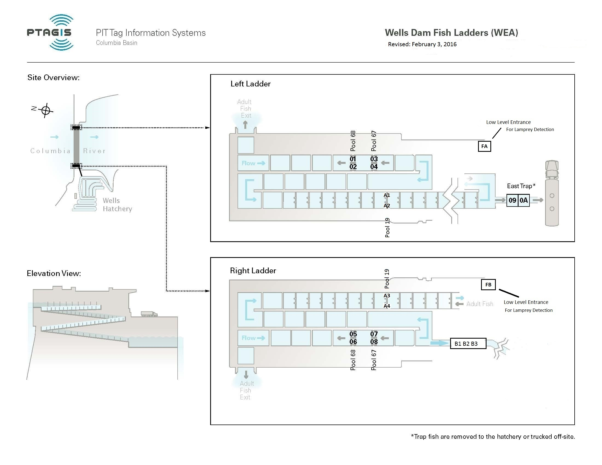{width=100%}
Configuration 170 has removed antennas C1 and C2 in the AFF.
```{r WEA_170}
WEA_170_left_upper <- c("01", "02", "03", "04")
WEA_170_left_lower <- c("A1", "A2")
WEA_170_right_upper <- c("05", "06", "07", "08")
WEA_170_right_lower <- c("A3", "A4")
WEA_170_left_trap <- c("09", "0A")
WEA_170_right_trap <- c("B1", "B2", "B3")
```

```{r eval = FALSE}
  range: 31-May-18 Present
  {
    R: U : 0 : Left Ladder Pool 68 : 01 02
    R: U : 0 : Left Ladder Pool 67 : 03 04
    R: U : 0 : Right Ladder Pool 68 : 05 06
    R: U : 0 : Right Ladder Pool 67 : 07 08
    U: U : 0 : East Trap : 09 0A
    R: U : 0 : Left Ladder Pool 19 : A1 A2
    R: U : 0 : Right Ladder Pool 19 : A3 A4
    U: U : 0 : West Trap : B1 B2 B3
    R: U : 0 : Left Ladder Lamprey Entrance : FA
    R: U : 0 : Right Ladder Lamprey Entrance : FB
  }
```

## Ice Harbor Dam

### Overview
The PTAGIS event site name "ICH - Ice Harbor Dam (Combined)" includes both the adult fishways and juvenile bypass system.

There are two ladders (north and south shore), which each have a set of eight antennas near the exit of the ladder. The bypass has four antennas.

### Antenna configuration 100
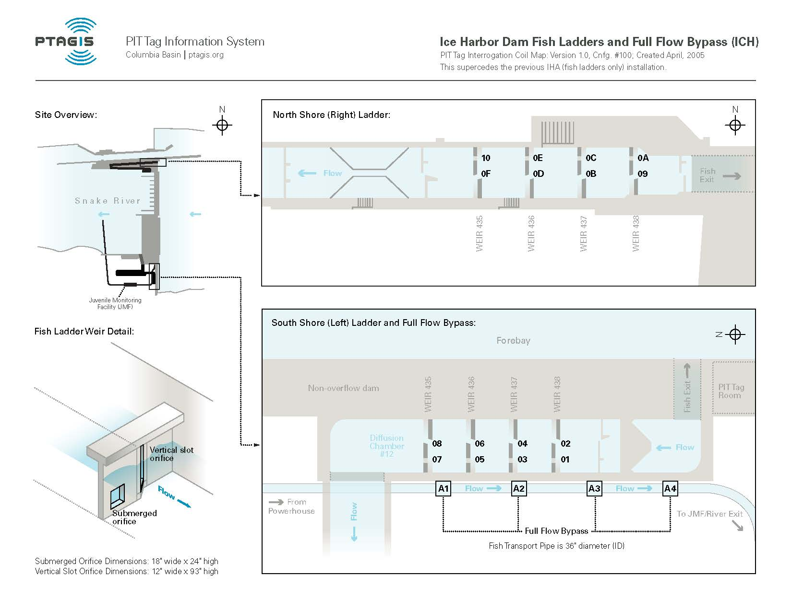{width=100%}

```{r ICH_100}
ICH_100_north_ladder <- c("09", "0A", "0B", "0C", "0D", "0E", "0F", "10")
ICH_100_south_ladder <- c("01", "02", "03", "04", "05", "06", "07", "08")
ICH_100_bypass <- c("A1", "A2", "A3", "A4")
```

```{r eval = FALSE}
  range: 8-Apr-05 9-Dec-15
  {
    R: U : 4 : LEFT LADDER WEIR 438 [O/S] : 01 02
    R: U : 3 : LEFT LADDER WEIR 437 [O/S] : 03 04
    R: U : 2 : LEFT LADDER WEIR 436 [O/S] : 05 06
    R: U : 1 : LEFT LADDER WEIR 435 [O/S] : 07 08
    R: U : 4 : RIGHT LADDER WEIR 438 [S/O] : 09 0A
    R: U : 3 : RIGHT LADDER WEIR 437 [S/O] : 0B 0C
    R: U : 2 : RIGHT LADDER WEIR 436 [S/O] : 0D 0E
    R: U : 1 : RIGHT LADDER WEIR 435 [S/O] : 0F 10
    B: U : 0 : FULL FLOW BYPASS : A1 A2 A3 A4
  }
```

### Antenna configuration 110
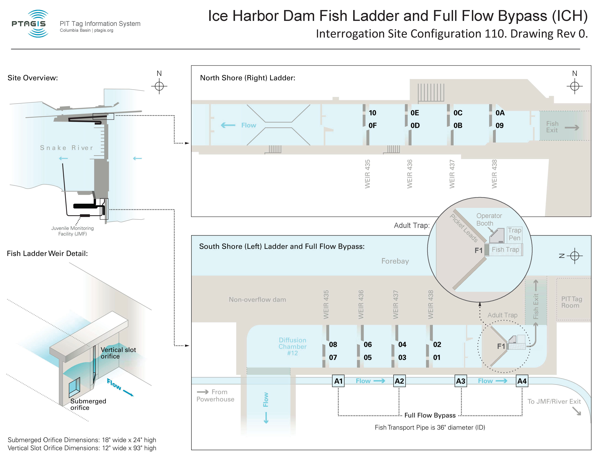{width=100%}

In configuration 110, an antenna (F1) was added in the adult trap entrance in the south ladder.
```{r ICH_110}
ICH_110_north_ladder <- c("09", "0A", "0B", "0C", "0D", "0E", "0F", "10")
ICH_110_south_ladder <- c("01", "02", "03", "04", "05", "06", "07", "08")
ICH_110_bypass <- c("A1", "A2", "A3", "A4")

ICH_110_south_trap <- c("F1")
```

```{r eval = FALSE}
  range: 9-Dec-15 Present
  {
    R: U : 4 : LEFT LADDER WEIR 438 [O/S] : 01 02
    R: U : 3 : LEFT LADDER WEIR 437 [O/S] : 03 04
    R: U : 2 : LEFT LADDER WEIR 436 [O/S] : 05 06
    R: U : 1 : LEFT LADDER WEIR 435 [O/S] : 07 08
    R: U : 4 : RIGHT LADDER WEIR 438 [S/O] : 09 0A
    R: U : 3 : RIGHT LADDER WEIR 437 [S/O] : 0B 0C
    R: U : 2 : RIGHT LADDER WEIR 436 [S/O] : 0D 0E
    R: U : 1 : RIGHT LADDER WEIR 435 [S/O] : 0F 10
    B: U : 0 : FULL FLOW BYPASS : A1 A2 A3 A4
    U: U : 5 : Trap Entrance : F1
  }
```


## Lower Granite Dam

### Overview
There have only been two configurations during the study duration: 140 and 150.

There is one ladder at lower granite dam, with two sets of arrays, one before the AFF near the bottom of the ladder, and one near the ladder exit.

### Antenna configuration 140
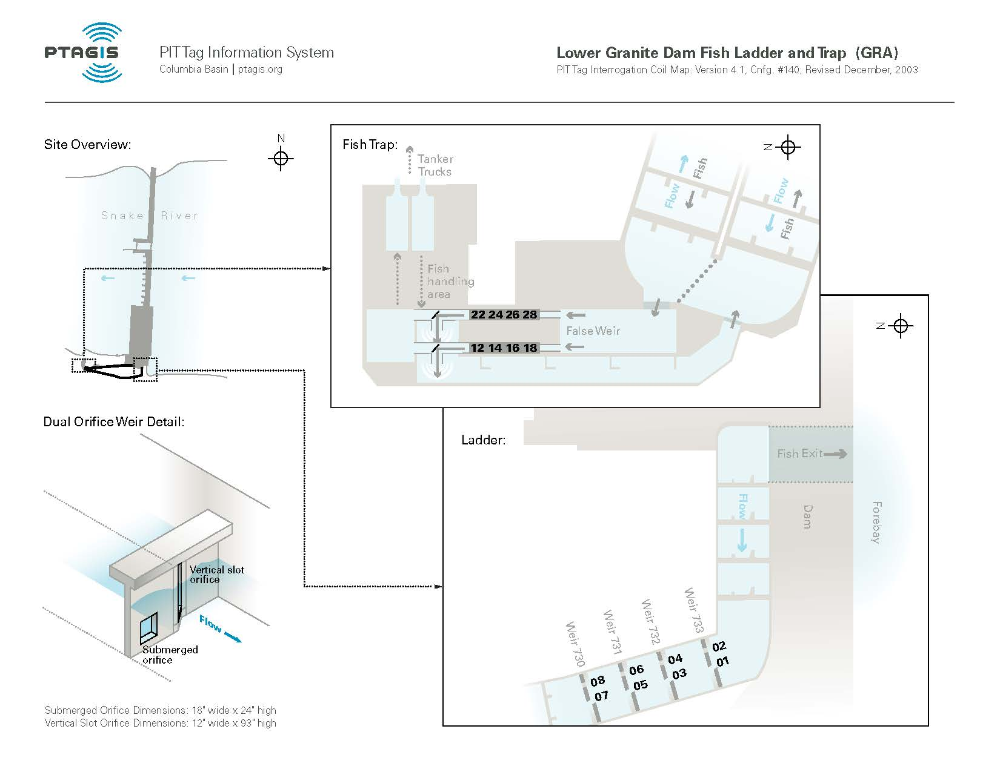{width=100%}
```{r GRA_140}
GRA_140_lower <- as.character(c(12, 14, 16, 18, 22, 24, 26, 28))
GRA_140_upper <- c("01", "02", "03", "04", "05", "06", "07", "08")
```

```{r eval = FALSE}
  range: 5-Dec-03 17-Feb-16
  {
    R: U : 4 : WEIR 733 : 01 02
    R: U : 3 : WEIR 732 : 03 04
    R: U : 2 : WEIR 731 : 05 06
    R: U : 1 : WEIR 730 : 07 08
    R: U : 0 : ISO WEST : 12 14 16 18
    R: U : 0 : ISO EAST : 22 24 26 28
  }
```

### Antenna configuration 150
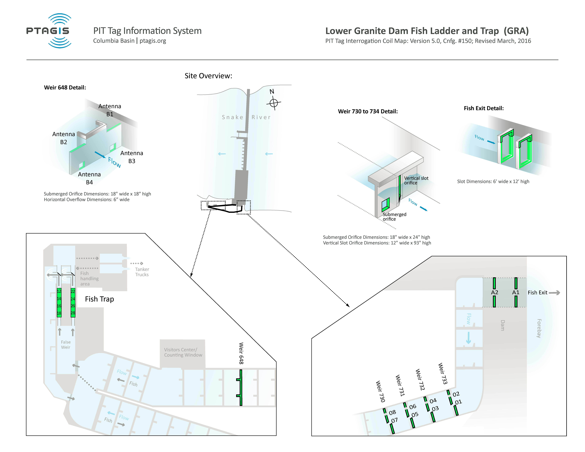{width=100%}

In configuration 150, four more antennas were installed in a weir in the lower part of the ladder (the entrance), as well as two antennas in the exit.
```{r GRA_150}
GRA_150_entrance <- c("B1", "B2", "B3", "B4")
GRA_150_lower <- as.character(c(12, 14, 16, 18, 22, 24, 26, 28))
GRA_150_upper <- c("01", "02", "03", "04", "05", "06", "07", "08")
GRA_150_exit <- c("A1", "A2")
```

```{r eval = FALSE}
  range: 17-Feb-16 Present
  {
    R: U : 5 : WEIR 733 : 01 02
    R: U : 4 : WEIR 732 : 03 04
    R: U : 3 : WEIR 731 : 05 06
    R: U : 2 : WEIR 730 : 07 08
    R: U : 1 : ISO WEST : 12 14 16 18
    R: U : 1 : ISO EAST : 22 24 26 28
    R: U : 6 : Ladder Exit : A1 A2
    R: U : 0 : Ladder Entrance : B1 B2 B3 B4
  }
```


